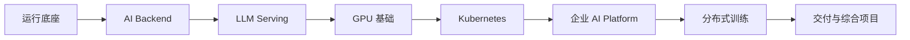

# AI Infra 工程入门学习路线

> 从“服务为什么启动不了”出发，最后能解释一套企业 AI Platform 为什么能稳定运行、怎样失败、怎样恢复。

这不是按产品名排出的资料清单。它让同一条请求不断向下走：先找到 Linux 中的进程和端口，再看它怎样离开机器、进入容器、连接数据库和队列；接着把模型变成会排队、会流式输出的 Serving；最后才把 GPU、Kubernetes、Gateway、Agent、RAG、观测和发布放回一条可以验证的链路。

读者假定已经会写基本程序、会使用终端，但不需要预先拥有 NVIDIA GPU 或 Kubernetes 集群。涉及 GPU、CUDA、多卡、NCCL 和 Kubernetes 的内容只说明机制、配置语义和判断方法，不把推演写成实测性能。Python、FastAPI、SQL 与通用配置则给出可理解的输入、执行过程、结果和异常边界。

## 怎样沿这条路线阅读

每篇文章都从一个可观察的现象进入，例如端口没有监听、SSE 不出 Token、第二个请求 OOM、Pod Running 却没有流量、取消后的 Agent 仍在执行工具。阅读时先保留这个现象，再问五件事：状态现在由谁持有，系统内部发生了什么，证据在哪里，什么结论容易误判，恢复后怎样确认结果。

不要把章节当作必须背下来的名词。遇到真实问题时，可以直接跳到对应主题，但最好顺着前置文章回看：容器问题通常需要 Linux 与网络证据，模型问题会回到请求形状与显存，平台问题会回到版本、权限和状态所有权。

每篇文章都会放一张针对当前机制生成的概念图、一个确定性的 Mermaid 或状态表，以及能在本机理解或验证的命令/配置。图片只负责建立直觉，不承载 DNS 记录、HTTP 头、YAML、SQL、CUDA 代码等精确文字；需要核对事实时，仍以正文、代码和证据表为准。图标用于提示“场景、证据、风险和边界”，不是为了给标题增加装饰。

## 八阶段总览

这不是按名词堆叠的目录。前一阶段提供后一阶段需要的输入：Linux 与容器解释服务怎样运行，AI Backend 提供状态和任务设施，Serving 把模型变成服务，GPU 与 Kubernetes提供计算和调度，平台层再把这些能力封装成可治理产品。

## 第一阶段：认识 AI Infra 与运行底座

| 章 | 主题 | 学习结果 |
| --- | --- | --- |
| 1 | AI Infra 全景、岗位职责与学习路径 | 用应用、数据、模型、计算、平台和可靠性六层划清职责 |
| 2 | Linux 服务运行与证据化排障 | 从进程、端口、权限、内存和磁盘定位启动与运行故障 |
| 3 | DNS、TCP、TLS、HTTP 与代理请求链 | 沿网络层次定位请求断点并分配超时预算 |
| 4 | OCI 镜像、容器隔离、cgroup 与进程生命周期 | 解释镜像、容器、进程、资源限制和信号的关系 |
| 5 | Docker Compose 组织本地 AI 服务栈 | 连接 API、数据库、Redis、Worker 与对象存储 |
| 6 | Nginx、TLS、模型 API 与 SSE 流式入口 | 处理反向代理、缓冲、长连接和安全热加载 |

阶段产物是一张可排障的运行拓扑。读者应能指出请求在哪个进程、端口和容器里运行，以及失败时先看哪一层证据。

## 第二阶段：AI Backend 基础设施

| 章 | 主题 | 学习结果 |
| --- | --- | --- |
| 7 | Python typing、asyncio、线程与多进程 | 为网络、分词和解析任务选择正确并发模型 |
| 8 | FastAPI 构建 OpenAI 兼容 LLM 服务 | 实现校验、路由、普通响应、SSE、Token 用量和错误契约 |
| 9 | Redis 的缓存、Session、限流与任务角色 | 为短期状态选择数据结构、TTL 和失效边界 |
| 10 | PostgreSQL、JSONB、pgvector、索引与连接池 | 管理用户、Prompt、Agent 状态和 Embedding 数据 |
| 11 | 消息队列与 Worker 任务平面 | 隔离在线请求和文档解析、Embedding、评测等后台任务 |
| 12 | 模型与文档对象存储 | 设计分段上传、校验、版本、预签名 URL 和清理流程 |

阶段产物是一套 AI Backend 数据流：请求内只完成需要即时反馈的工作，长任务通过可恢复队列执行，业务状态保存在持久存储，对象与数据库能够对账。

## 第三阶段：LLM Serving

| 章 | 主题 | 学习结果 |
| --- | --- | --- |
| 13 | 从模型文件到稳定推理 API | 拆开准入、调度、引擎、流式输出、用量和观测 |
| 14 | Hugging Face 与首次开源模型部署 | 核对许可证、Revision、Config、Tokenizer 和权重 |
| 15 | Tokenize、Prefill、Decode 与流式推理 | 解释 TTFT、TPOT、采样和停止条件来自哪里 |
| 16 | Continuous Batching、PagedAttention 与 KV Cache | 理解动态调度、显存 Block、前缀复用和公平性 |
| 17 | vLLM 服务、兼容接口与排障 | 读懂启动参数、模型加载、Readiness、请求和错误 |
| 18 | 模型制品、精度、量化与推理优化 | 比较 FP32、FP16、BF16、INT8、INT4 的容量和质量边界 |

阶段产物是一份模型服务设计：模型版本可追溯，接口兼容范围明确，延迟和吞吐指标有统一口径，容量结论不会脱离模型、请求分布和硬件。

## 第四阶段：GPU 基础

| 章 | 主题 | 学习结果 |
| --- | --- | --- |
| 19 | 并行计算、矩阵乘与 GPU 吞吐 | 区分 CPU 延迟优化与 GPU 吞吐设计 |
| 20 | CUDA Thread、Block、Grid、Warp 与 SM | 推演 Kernel 从 Host 启动到设备执行的层级 |
| 21 | Driver、CUDA Runtime、HBM/VRAM 与显存诊断 | 建立权重、激活、工作区和 KV Cache 显存账本 |

阶段产物是一张计算与显存判断表。它用于回答“为什么适合 GPU”“模型为什么放不下”“何时需要多卡”，而不是背诵硬件型号。

## 第五阶段：Kubernetes AI Infra

| 章 | 主题 | 学习结果 |
| --- | --- | --- |
| 22 | Kubernetes 控制面与 AI 工作负载 | 理解期望状态、Pod、Deployment、Service 与 Ingress |
| 23 | GPU Operator、模型卷与探针 | 解释 GPU 从节点进入 Pod 以及模型实例何时真正就绪 |
| 24 | GPU 调度、共享、MIG 与自动扩缩容 | 选择设备、拓扑、隔离方式和反映推理压力的扩容信号 |

阶段产物是一套静态可审查的 AI Workload 设计。Kubernetes 负责声明、调谐和放置，但模型能否放入显存、批处理是否合理、回答质量是否合格仍由平台负责。

## 第六阶段：企业级 AI Platform

| 章 | 主题 | 学习结果 |
| --- | --- | --- |
| 25 | LLM Gateway | 统一 API Key、模型路由、限流、Token、成本和错误语义 |
| 26 | 多模型管理平台 | 建立模型注册、版本、能力、部署、健康和切换控制面 |
| 27 | Agent Runtime | 管理 LangGraph、MCP、工具、状态、并发、取消和恢复 |
| 28 | RAG Infra | 连接解析、切片、Embedding、向量索引、检索、重排和发布 |
| 29 | AI 可观测性与 SLO | 关联 Trace、Metric、Log、模型、GPU、质量和成本 |
| 30 | 容量、压测与成本 | 用请求分布、队列和 Little's Law 建立容量模型 |
| 31 | 多租户、Secret、数据、模型与审计 | 将权限和不可信边界贯穿网关、Agent、RAG 与 Serving |

阶段产物是一张控制面与数据面分离的平台架构。业务使用稳定模型标识，供应商和部署实例可以替换；身份、预算、版本和权限由确定性系统控制。

## 第七阶段：分布式训练基础设施

| 章 | 主题 | 学习结果 |
| --- | --- | --- |
| 32 | Data、Tensor、Pipeline Parallel、DDP 与 FSDP | 按瓶颈选择并行策略并规划检查点 |
| 33 | DeepSpeed ZeRO 与 Offload | 推演参数、梯度和 Optimizer State 的分片所有权 |
| 34 | NCCL、Collective、AllReduce 与多机通信 | 从 Rank、拓扑、网络和同步点定位通信故障 |

阶段产物是一张训练拓扑与资源表。路线只建立基础设施判断能力，不用没有目标硬件的理论数字冒充真实训练结果。

## 第八阶段：交付与综合项目

| 章 | 主题 | 学习结果 |
| --- | --- | --- |
| 35 | CI/CD、SBOM、签名与不可变制品 | 让代码、模型和配置版本可追溯并跨环境提升 |
| 36 | 候选验证、迁移、切流、回滚、备份与恢复 | 区分应用回滚、数据回退和灾难恢复 |
| 37 | Enterprise AI Platform 综合设计 | 串联 Gateway、Agent、RAG、vLLM、GPU、存储、观测与发布 |

最终设计包必须覆盖正常请求、过载、取消、模型故障、知识发布、版本切换和恢复路径。每个模块都要写清输入、状态、输出、所有者、观测证据和停止条件。

## 完成标准

完成路线不以“读完 37 篇”为标准。读者应能独立完成以下判断：

- 从用户请求追踪到网关、Agent、检索、模型服务和 GPU；
- 解释数据库、Redis、队列和对象存储分别保存什么状态；
- 为模型版本、显存、并发、队列和成本建立统一口径；
- 设计多租户权限、Secret、审计和不可信内容边界；
- 给出可验证、可回滚、可恢复的 AI Platform 发布方案。

路线对应的岗位方向包括 AI Infra Engineer、LLM Platform Engineer、AI Platform Engineer 和 Agent Infrastructure Engineer。岗位名称会变化，稳定的能力仍是：让模型与 Agent 以可交付、可观测、可扩展、可治理和可恢复的方式运行。
