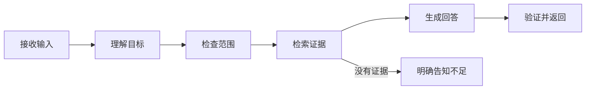

# 01｜从零认识 Agent：一个问题怎样变成答案

如果用户问“如何申请系统访问权限？”，普通聊天模型可以根据它记住的内容直接生成一段话。但真实系统还要回答几个问题：用户有没有权限看这份资料？资料是否是最新版本？如果需要查两处内容，下一步应该先查哪一处？答案中的引用是否真的支持结论？

本篇先不写数据库、队列和 LangGraph。我们只完成第一课：建立 Agent 的正确心智模型，知道它和普通聊天、固定工作流、RAG 有什么区别，了解常见框架的定位，并跟踪一次输入怎样走到输出。

## 阅读前需要知道什么

你只需要知道三件事：程序可以调用函数；模型可以接收文字并生成文字；外部系统（数据库、搜索服务、文件系统）不会因为模型“知道”它们的名字就自动开放访问。后面的“工具”就是程序为模型提供的一组受控函数。

## Agent 到底是什么

可以先把四个概念放在一起：

| 方案 | 下一步由谁决定 | 是否需要外部资料 | 适合的任务 |
| --- | --- | --- | --- |
| 单次模型调用 | 程序只调用一次模型 | 资料需要放进输入 | 改写、分类、摘要 |
| 固定工作流 | 程序提前写好每一步 | 可以调用服务 | 导入、审批、定时同步 |
| RAG | 程序先检索，再调用模型 | 需要知识库 | 带来源的固定问答 |
| Agent | 模型提出下一步，程序负责约束和执行 | 通常需要多个工具 | 路径会随结果变化的任务 |

Agent 不是“更聪明的聊天框”。它的关键是一个循环：模型提出行动，程序检查这个行动并调用工具，工具结果回到上下文，模型再决定下一步。只要步骤固定，普通工作流往往更容易测试，也更便宜。

## 为什么要学 Agent

工作中经常遇到开放目标：用户只说“帮我找出这两份规范的差异”，却没有告诉系统先找哪份、要比较哪些章节。系统需要把目标拆成小步骤，根据中间结果改变计划，这就是 Agent 有价值的地方。

但 Agent 也引入了不确定性：模型可能选错工具、重复调用或在证据不足时继续猜。登录、扣费、删除、权限裁决等有明确规则的动作，仍然应由确定性代码负责。学习 Agent 的重点不是让模型接管一切，而是学会把“模型适合判断的部分”和“程序必须确定的部分”分开。

## 常用框架如何选择

框架解决的问题不同，选择前先画出自己需要的执行路径：

| 框架或平台 | 主要抽象 | 初学者适合怎样使用 |
| --- | --- | --- |
| OpenAI Agents SDK | Agent 循环、工具、交接和护栏 | 先跑通单 Agent 与工具调用 |
| LangGraph | 显式状态图、条件边、并行和恢复 | 需要观察状态变化和恢复时使用 |
| AutoGen | 多 Agent 对话协作 | 研究多角色协作，不作为所有任务默认方案 |
| CrewAI | 角色、任务和团队表达 | 快速验证角色分工，但仍需自己补权限与测试 |
| Semantic Kernel | 插件和企业应用编排 | 已有 .NET 或微软生态时评估 |
| Dify | 可视化模型、知识库和流程 | 低代码验证，复杂控制仍要回到代码 |

本系列的实践对象需要权限、检索、并行和恢复，因此后面会使用状态图表达 Agent 内部流程；身份、数据库事务和任务队列仍由普通后端代码控制。

## 一次请求的完整流程

示例问题仍是“如何申请系统访问权限？”。从输入到输出可以先压缩成六个节点：



1. **接收输入**：保存问题、用户身份和追踪 ID。
2. **理解目标**：识别用户是要查知识、闲聊，还是提出不安全的动作。
3. **检查范围**：确定本次可以检索的知识范围。
4. **检索证据**：从允许的搜索通道取得候选资料。
5. **生成回答**：模型根据问题和证据组织文字。
6. **验证并返回**：程序检查引用是否存在、是否越权、是否包含不应输出的内容。

注意模型并不拥有全部控制权。它可以提出“搜索某个主题”的建议，但权限范围、工具白名单、调用次数和终止条件必须由程序决定。

## 用最小伪代码看循环

下面的代码只是为了让流程可视化，不是某个私有项目的源码：

```python
async def answer(question, actor):
    turn = await save_turn(question, actor)
    intent = await understand(question)
    if intent.blocked:
        return await finish(turn, "请求被安全策略阻止")

    scope = await visible_scope(actor)
    evidence = await retrieve(intent.query, scope)
    if not evidence:
        return await finish(turn, "当前范围没有足够资料")

    draft = await generate(question, evidence)
    checked = await validate(draft, evidence, scope)
    return await finish(turn, checked)
```

从上到下读：`save_turn` 先记录一次任务，避免请求断开后完全没有状态；`understand` 负责语义理解；`visible_scope` 把用户范围变成确定性数据；`retrieve` 只在这个范围内搜索；`generate` 负责表达；`validate` 在答案离开系统前检查引用和范围。真实系统还要处理排队、重试、取消和流式事件，这些能力不会在第一课里提前混入。

## 正常输入、边界输入和不该使用 Agent 的情况

正常输入是一个需要查资料的问题，系统能找到证据并返回带引用的回答。若用户要求访问没有权限的资料，系统应该明确拒绝或返回范围内无结果，不能为了“回答完整”退回全库搜索。若问题只是把一段文字改成列表，单次模型调用就足够。

可以用下面的判断快速决定是否需要 Agent：

```text
步骤是否固定？       是 -> 普通函数/工作流
需要根据结果改变路径？ 是 -> 评估 Agent
是否要调用外部工具？  否 -> 先从普通模型调用开始
权限和终态能否确定？  否 -> 先补程序边界，再谈 Agent
```

## 本篇带走什么

- Agent = 模型 + 受控工具 + 根据结果继续行动的循环。
- RAG 解决“先查资料再回答”，Agent 解决“下一步路径会变化”。两者可以组合，但不是同一个概念。
- 模型负责理解和表达；权限、状态、预算和终态由程序负责。
- 一个可维护的 Agent 必须能说明输入、工具、证据、输出和停止条件。

下一篇会把一次执行拆成会话、回合、事件、证据和 Claim。先把这些对象命名清楚，后续的解析、检索、恢复和评测才不会变成一堆互相重叠的名词。

## 参考资料

- [OpenAI：Agents SDK](https://developers.openai.com/api/docs/guides/agents)
- [OpenAI：Using tools](https://developers.openai.com/api/docs/guides/tools)
- [LangGraph：Thinking in LangGraph](https://docs.langchain.com/oss/python/langgraph/thinking-in-langgraph)
- [Dify Documentation](https://docs.dify.ai/)
