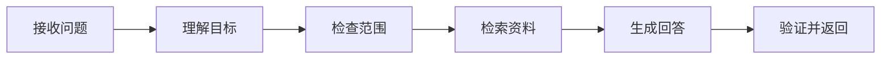
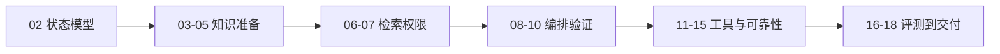

# 01｜从零认识 Agent：一个问题怎样变成答案

打开聊天框，输入“如何申请系统访问权限？”，几秒后得到一段带来源的回答。表面上只是一次问答，后台可能已经完成身份检查、问题理解、资料检索、答案生成和引用核对。

这一篇先不实现数据库、队列或 LangGraph。我们只做一件事：把 Agent 是什么、为什么需要它，以及一次输入到输出经历了什么讲清楚。后面 17 篇再逐步实现每个环节。

## 先分清四个容易混淆的概念

**大语言模型（LLM）**可以根据输入生成文本。它擅长理解和表达，但不知道你的实时数据，也不能天然保证回答正确。

**工作流**是一组预先写好的固定步骤。例如“上传文件 → 转换 PDF → 发送邮件”。每次执行的路径基本相同。

**RAG** 是“检索增强生成”的简称。程序先查找资料，再把找到的内容交给模型回答。RAG 解决知识来源问题，但不一定包含复杂决策和多轮工具调用。

**Agent** 是由模型参与决策、可以使用工具并根据结果继续行动的程序。它通常会经历“观察 → 决定下一步 → 执行 → 再观察”的过程。

| 方案 | 谁决定下一步 | 能否读取外部数据 | 适合场景 |
| --- | --- | --- | --- |
| 单次 LLM | 模型一次生成 | 依赖输入内容 | 改写、摘要、分类 |
| 固定工作流 | 程序提前写死 | 可以 | 步骤稳定的自动化 |
| RAG | 程序先检索 | 可以读取知识库 | 有来源的知识问答 |
| Agent | 模型提议，程序约束 | 可以调用受控工具 | 路径需要根据结果变化的任务 |

## 为什么要学习 Agent

普通聊天只能返回文字。真实应用还会遇到三个问题：信息不在模型里、完成任务需要多个步骤、执行结果会改变下一步。例如排查一次发布失败，需要先读取状态；若服务未启动就查日志，若服务已启动则检查网关。

Agent 的价值就是处理这种“下一步取决于刚才结果”的任务。不过它也会带来成本、延迟和不确定性。能用一次数据库查询解决的问题，不值得为了“看起来智能”改成 Agent。

适合 Agent 的任务通常同时满足以下条件：

- 用户只说明目标，具体步骤会变化；
- 需要搜索、数据库或外部服务等工具；
- 工具结果会影响后续动作；
- 每一步都能设置权限、预算和停止条件。

批量改字段、固定审批流、精确计费等确定性任务，应继续由普通程序负责。

## 常用框架怎样选择

框架不是学习 Agent 的起点。先理解运行过程，再看框架帮我们省掉哪部分代码。

| 方案 | 主要定位 | 适合从哪里开始 |
| --- | --- | --- |
| OpenAI Agents SDK | Agent 循环、工具、交接、护栏和 Trace | 使用 OpenAI API 的代码优先应用 |
| LangGraph | 显式状态图、条件边、并行与恢复 | 流程复杂、需要看清状态变化的后端 |
| AutoGen | 多 Agent 对话和团队协作 | 研究多角色协作模式 |
| CrewAI | 角色、任务和团队编排 | 希望快速表达角色分工 |
| Semantic Kernel | 企业应用中的插件、流程和多语言 SDK | .NET 及既有企业系统集成 |
| Dify | 可视化编排、模型和知识库管理 | 低代码验证和运营配置 |

本系列的实践对象需要并行检索、条件分支、取消和恢复，因此使用 LangGraph 表达 Agent 内部流程。身份、权限、数据库事务和任务队列仍由普通后端代码负责，不交给图框架自动决定。

## 一次问题从输入到输出经历什么

示例问题是：

```text
如何申请系统访问权限？
```

一次最小的知识 Agent 可以拆成六步：



1. **接收问题**：保存用户输入，并给这次任务分配可追踪的 ID。
2. **理解目标**：判断用户是在问知识、寒暄，还是输入了不安全指令。
3. **检查范围**：只允许访问当前用户有权查看的资料。
4. **检索资料**：从关键词、向量或结构化数据通道寻找候选证据。
5. **生成回答**：模型根据问题和证据组织文字，并绑定引用。
6. **验证并返回**：程序检查引用、权限和敏感信息，再输出终态。

这六步中，模型只负责适合语义判断和语言生成的部分。权限交集、状态变化、预算上限和引用存在性都由确定性程序处理。

## 用一段伪代码看懂主循环

下面是根据真实运行行为压缩后的伪代码。它不是私有项目源码，只保留理解流程所需的结构：

```python
async def answer(question, actor):
    turn = await save_turn(question, actor)
    understanding = await understand(question)

    if understanding.blocked:
        return await finish(turn, "请求被安全策略阻止")

    scope = await resolve_visible_scope(actor)
    evidence = await retrieve(understanding.query, scope)
    draft = await generate(question, evidence)
    result = await validate(draft, evidence, scope)
    return await finish(turn, result)
```

输入是问题和当前用户，输出是一个已经保存的终态结果。`save_turn` 让任务可以被查询和恢复；`scope` 把权限传到检索；`validate` 负责在回答离开系统前做最后检查。后续文章会把每个函数逐步展开。

## 正常情况与失败情况

正常问题会得到带引用的完成事件：

```text
created → running → references_ready → completed
```

如果用户指定了无权访问的资料，系统不会退回全库搜索，而是结束为访问拒绝。若队列派发失败，已经创建的回合会记录失败终态，客户端不会永远看到“处理中”。若资料不足，结果应明确表示没有足够证据，而不是让模型凭印象补齐。

这些失败路径解释了为什么 Agent 工程不等于写一个 Prompt：真正困难的是范围、状态、恢复和验证。

## 这套教程接下来怎样学



下一篇先解释会话、回合、事件、证据和 Claim。读懂这些对象后，文档导入、检索、恢复和评测才有共同语言。

## 参考资料

- [OpenAI：Agents SDK](https://developers.openai.com/api/docs/guides/agents)
- [LangGraph：Graph API](https://docs.langchain.com/oss/python/langgraph/graph-api)
- [Microsoft AutoGen](https://microsoft.github.io/autogen/stable/)
- [Dify 文档](https://docs.dify.ai/)
