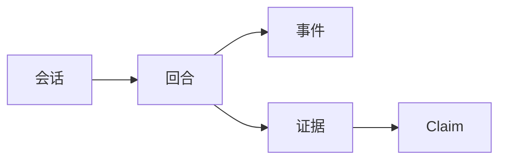
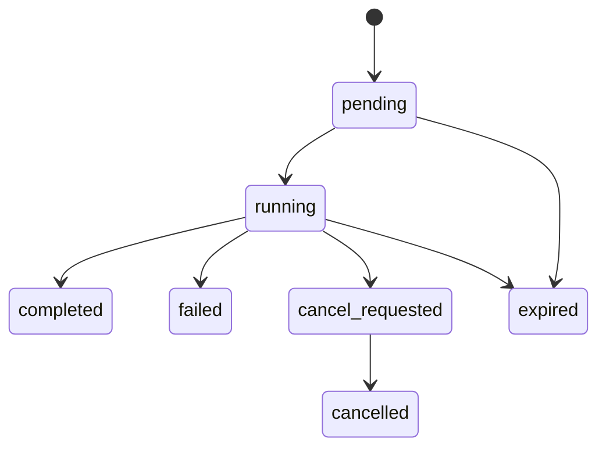

# 02｜把一次回答拆成可恢复的状态

用户问完问题后刷新页面，系统应该继续显示这一轮正在执行，还是重新创建任务？回答已经生成一半时 Worker 退出，哪些内容需要恢复？要解决这些问题，先要把“聊天记录”和“一次执行”分开。

本篇认识会话、回合、事件、证据和 Claim 五个对象。它们不是为了把数据库设计得复杂，而是分别回答：这是谁的对话、这次任务进行到哪、客户端看到了什么、答案依据什么、哪条结论可以核验。

## 先看五个对象的关系



**会话**把多轮问题连接起来；**回合**表示一次独立执行；**事件**按顺序告诉客户端发生了什么；**证据**保存本轮实际检索到的内容；**Claim** 是答案中可以单独判断真假的结论。

## 第一步：会话和回合为什么要分开

假设用户先问“访问权限如何申请”，接着问“审批人是谁”。两句话属于同一会话，第二句需要理解上一轮焦点；但它们是两个回合，各自有开始、运行、完成或失败状态。

如果把任务状态放在会话上，第二轮失败会让整个对话看起来都失败。分开后，会话负责多轮关系，回合只负责一次问题。

```text
会话 conversation-1
  回合 turn-1：访问权限如何申请？     completed
  回合 turn-2：审批人是谁？           running
```

这里的输入是两条连续问题，结果是一个会话下的两个回合。`turn-1` 完成的事实不会因 `turn-2` 仍在运行而改变。

## 第二步：回合保存哪些执行事实

回合至少需要问题、所有者、状态、创建时的知识版本、访问范围和截止时间。版本与范围在创建时保存，是为了让一次执行前后使用同一套事实。

业务状态可以简化为：



`cancel_requested` 表示已经收到请求，Worker 尚未走到可安全停止的位置。客户端此时显示“取消中”比提前显示“已取消”更准确。

## 第三步：业务状态、图状态和事件不是一回事

这三个状态经常被初学者混在一起：

| 状态 | 保存什么 | 给谁使用 |
| --- | --- | --- |
| 回合业务状态 | pending、running、completed 等 | 用户、API、恢复任务 |
| LangGraph 图状态 | 节点间的计划、证据和中间结果 | Agent 运行时 |
| 事件序列 | 文本增量、引用、终态 | 浏览器流式展示与重放 |

生成半段答案时，图状态已有中间文本，事件中可能出现多条 `answer.delta`，但回合仍是 `running`。只有最终答案和终态事件保存成功后，业务状态才进入 `completed`。

## 第四步：为什么要保存证据快照

只保存文档 ID 不够。文档以后会更新，评测和排障需要知道“当时模型究竟看到了什么”。因此证据保存来源版本、片段定位、必要内容和检索信息。

公开引用可以只展示标题和链接，内部验证仍需要稳定的证据 ID。这样答案不会在文档更新后突然指向另一段内容。

## 第五步：Claim 怎样连接答案和证据

假设回答包含两句话：“申请需要直属负责人审批。审批完成后权限立即生效。”这其实是两个 Claim，第二句可能没有证据。

```text
Claim 1：申请需要直属负责人审批
  -> Evidence A、Evidence B

Claim 2：审批完成后权限立即生效
  -> 没有证据，标记 unsupported
```

验证阶段可以删除或修复第二句，不必让模型重新编写整篇回答。第 10 篇会完整实现这条关系。

## 第六步：事件为什么需要递增序号

时间戳不适合作为唯一顺序：两个事件可能同一毫秒产生，不同进程的时钟也可能偏差。每个回合维护递增序号，客户端用“回合 ID + 序号”去重和断线续传。

一条正常序列可能是：

```text
1 turn.created
2 answer.delta
3 references.ready
4 turn.completed
```

数据库还要保证只有一个终态。完成和取消同时竞争时，只允许一个成为最终事实。

## 怎样验证模型没有写错

这部分测试不需要调用大模型，可以直接检查状态约束：

| 测试 | 初始状态 | 操作 | 预期 |
| --- | --- | --- | --- |
| 正常完成 | running | complete | completed |
| 已完成再取消 | completed | cancel | 拒绝转换 |
| 重复终态 | completed | append cancelled | 保留原终态 |
| 事件重放 | 已有 1–4 | after=2 | 只返回 3、4 |
| 证据核验 | Claim 无 evidence | validate | unsupported |

这些规则属于确定性代码，不交给模型判断。

## 当前实现的边界

本篇只公开对象关系，不公开私有表名和字段。权限范围如何进入检索在第 07 篇，Checkpoint 如何保存图状态在第 14 篇，SSE 如何重放事件在第 15 篇。

下一篇开始准备知识输入：把 PDF、Office 和文本解析成统一、可检查的结构。

## 跟着一条请求观察状态变化

沿用第一篇的提问“如何申请系统访问权限？”。用户发送问题时，系统先创建回合，回合状态是 `pending`；Worker 取得执行权后进入 `running`；检索得到两条可见证据，分别写入证据快照；生成阶段产生两个 Claim；终态事件写入后，回合才变成 `completed`。

| 时刻 | 业务状态 | 图状态新增内容 | 事件流 |
| --- | --- | --- | --- |
| 创建回合 | `pending` | 尚未启动 | `turn.created` |
| Worker 接管 | `running` | 问题、范围、预算 | `turn.started` |
| 检索完成 | `running` | 证据快照 | `evidence.ready` |
| 生成与验证 | `running` | Claim、验证结果 | 可发送文本增量 |
| 提交终态 | `completed` | 不再变化 | `turn.completed` |

这里最容易混淆的是：客户端收到一段文本，不代表业务回合已经完成；图节点结束，也不代表终态事件已经提交。业务状态供查询和恢复，图状态服务当前编排，事件状态服务客户端重放，它们可以关联，却不能用同一个布尔值代替。

### 用三个不变量检查模型

1. 一个回合只能属于一个会话，但会话可以包含多个回合。
2. 终态只能出现一次，迟到的 Worker 不得把 `cancelled` 改回 `completed`。
3. Claim 引用的证据必须来自本回合钉住的可见证据集合。

测试时分别模拟正常完成、执行中取消和旧 Worker 迟到提交，检查状态转换是否拒绝非法跳转。下一篇会让其中的“证据”从真实文档解析产物开始产生。

## 参考资料

- [LangGraph：Persistence](https://docs.langchain.com/oss/python/langgraph/persistence)
- [PostgreSQL：Constraints](https://www.postgresql.org/docs/current/ddl-constraints.html)
- [WHATWG：Server-sent events](https://html.spec.whatwg.org/multipage/server-sent-events.html)
