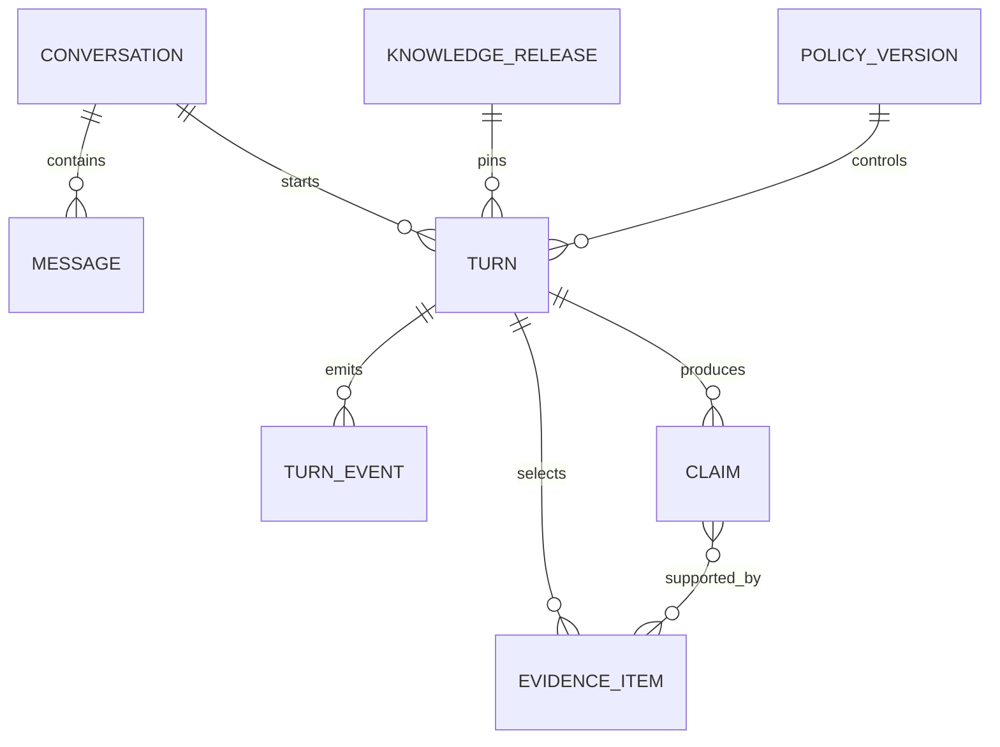
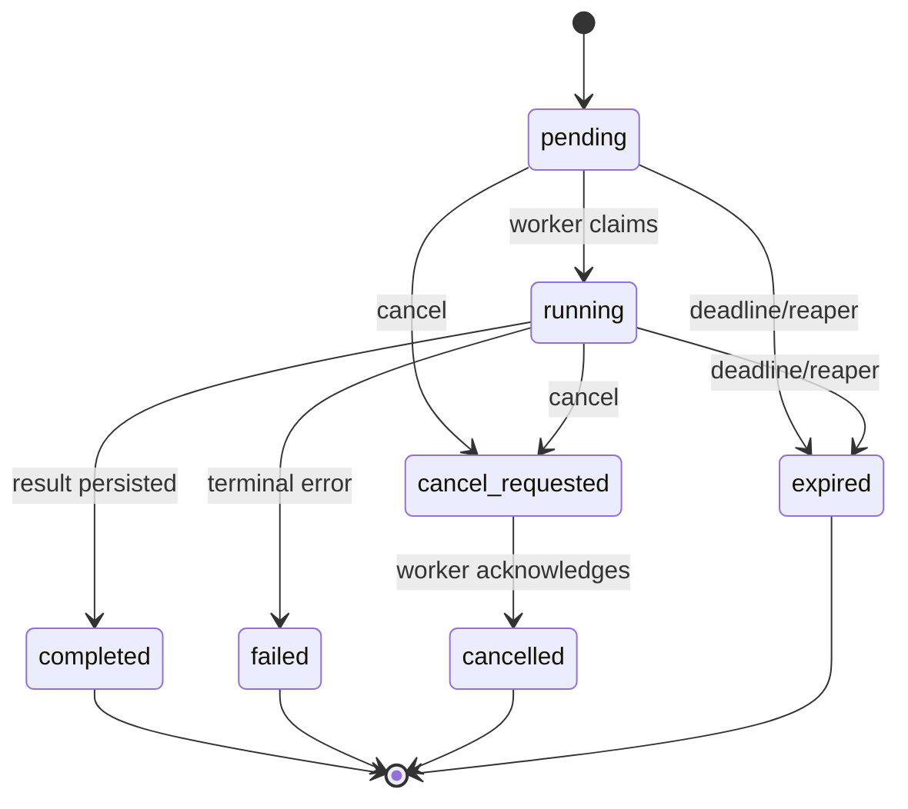

# 02｜领域模型与状态机

Agent 的数据库不能只存 `question` 和 `answer`。当用户问“为什么这次答案变了”，系统需要恢复当时的知识版本、策略版本、权限快照、检索证据、声明支持状态和执行事件；当 Worker 中途退出，还要区分可以继续的回合、已完成回合和只发出了取消请求但尚未停止的回合。

## 聚合边界

把 `Conversation` 与 `Turn` 分开。Conversation 是用户可见的长期对话容器，消息记录应保持不可变；Turn 是一次 Agent 执行聚合，拥有自己的状态机、版本快照、证据与事件。一个 assistant message 可以先占位，再由 Turn 完成，但不能把工作流所有中间状态塞进消息 JSON。



证据与 Claim 使用关系表而非把所有引用只存成答案里的角标。这样可直接查询“多少 Claim 没有支持证据”“某知识版本下哪些回答引用了旧文档”，也能在评测中计算 citation accuracy。

## Turn 状态机



`cancel_requested` 不能直接等价于 `cancelled`。前者表示控制面已经记录意图，执行面可能仍在模型请求或工具调用中；只有 Worker 在安全点检查并停止后才能进入 cancelled。相同道理，HTTP 请求超时不等于后台 Turn 已失败，客户端断线也不应取消公共执行。

```python
TurnStatus = Literal[
    "pending", "running", "cancel_requested",
    "completed", "failed", "cancelled", "expired",
]

TERMINAL = {"completed", "failed", "cancelled", "expired"}

ALLOWED = {
    "pending": {"running", "cancel_requested", "expired"},
    "running": {"completed", "failed", "cancel_requested", "expired"},
    "cancel_requested": {"cancelled", "failed", "expired"},
}
```

状态转换必须在数据库条件更新中再次约束，不能只依赖 Python 判断。两个 Worker 同时拿到任务时，`UPDATE ... WHERE status='pending' RETURNING id` 只能让一个执行者成功认领。

## 三种状态不要混在一起

系统至少有三套相关但不同的状态：

| 状态 | 作用 | 保留周期 |
| --- | --- | --- |
| 业务 Turn | 用户可见终态、幂等、版本和结果 | 长期审计 |
| LangGraph checkpoint | 某个图节点后的可恢复计算快照 | 活跃与恢复窗口 |
| Durable event log | SSE 重放、阶段审计和首 token 统计 | 按产品审计策略 |

Checkpoint 不能取代业务表：框架内部格式不是稳定的产品 API。事件日志也不能取代当前状态：从全量事件每次折叠状态会增加查询和迁移成本。正确做法是明确一致性协议，终态事务同时更新 Turn、写结果工件并追加唯一终态事件。

## 证据是不可变快照

引用不能只保存 `document_id`，因为文档稍后可能被覆盖。EvidenceItem 至少保存源版本、chunk、标题、用于回答的内容摘要、可见范围和得分。

```python
class EvidenceItem(BaseModel):
    id: str
    source_version_id: str
    document_id: str
    chunk_id: str
    title: str
    content: str
    score: float
    trust_level: str
    visibility_subjects: tuple[str, ...]
```

是否保存完整 chunk 取决于数据合规和审计需求。至少要能通过不可变版本重新取得当时证据；如果源可能被法规要求彻底删除，则需要支持引用失效标记，而不是继续展示已删除内容。

## Claim 是事实验证单元

回答段落不是合适的事实粒度。一段话可能包含三个事实，只有两个有证据。把模型计划出的原子 Claim 持久化：

```python
class Claim(BaseModel):
    id: str
    text: str
    support_status: Literal[
        "pending", "supported", "partial", "unsupported", "conflict"
    ]
    confidence: float = Field(ge=0, le=1)
    evidence_ids: tuple[str, ...] = ()
```

`confidence` 不能代替支持状态。模型可以高置信地说错；确定性验证先检查绑定证据是否存在、是否在权限范围、Claim 的关键实体/数值是否可在证据中定位，再把复杂语义交给 judge。

## 策略和知识都需要版本

PolicyVersion 包含模型选择、提示模板标识、检索阈值、分支预算、校验开关和质量门禁。生产策略是 champion，候选策略是 challenger；稳定哈希可让一部分请求固定进入候选，而不是每次随机导致同一用户体验漂移。

```python
def stable_bucket(space_id: str, user_id: str, key: str) -> int:
    raw = f"{space_id}:{user_id}:{key}".encode()
    return int.from_bytes(hashlib.sha256(raw).digest()[:4], "big") % 100
```

KnowledgeRelease 指向一组已经完整构建的索引版本。Turn 创建后始终携带 release id，任何补充检索不得重新查询“当前 active release”。

## 建表关键约束

```sql
CREATE UNIQUE INDEX uq_turn_idempotency
ON agent_turns(space_id, user_id, idempotency_key)
WHERE idempotency_key <> '';

CREATE UNIQUE INDEX uq_turn_terminal_event
ON agent_turn_events(turn_id)
WHERE event_type IN ('turn.completed', 'turn.failed', 'turn.cancelled', 'turn.expired');

ALTER TABLE claim_evidence
ADD CONSTRAINT uq_claim_evidence UNIQUE (claim_id, evidence_id);
```

幂等不能只先 `SELECT` 再 `INSERT`，两个并发事务都会看到空。唯一索引才是最终仲裁者；代码使用 `INSERT ... ON CONFLICT DO NOTHING`，冲突后读取既有 Turn。

事件序号也必须由数据库原子分配。可以在 Turn 行维护 `next_event_sequence`，执行 `UPDATE ... RETURNING` 后写事件。不要在 Worker 内存中 `counter += 1`，多进程下会重复。

## 事务边界

创建回合的一次事务通常包含：验证 active release 与 policy、写 user message、创建 assistant 占位、插入 Turn、提交。提交后才派发任务。如果队列派发失败，Turn 仍是可见 pending，补偿扫描器可以再次投递；如果先派发后提交，Worker 可能查不到 Turn。

严格的 transactional outbox 能进一步消除“数据库提交成功但队列消息丢失”的窗口：同事务写 outbox，独立 relay 投递并标记。小系统也至少需要定时扫描过久 pending 的回合。

## 测试

```python
async def test_only_one_worker_claims_turn(repo, turn_id):
    results = await asyncio.gather(
        repo.claim(turn_id),
        repo.claim(turn_id),
    )
    assert sorted(results) == [False, True]

async def test_terminal_event_is_unique(repo, turn_id):
    await repo.finish(turn_id, "completed")
    await repo.finish(turn_id, "completed")
    events = await repo.events(turn_id)
    assert sum(e.type == "turn.completed" for e in events) == 1
```

还要覆盖：相同幂等键并发创建、过期扫描不修改终态、取消请求与完成竞态、release retired 但既有 Turn 仍可恢复、删除源文档后的引用策略。数据库集成测试比 mock 更重要，因为唯一索引、行锁和事务隔离正是这里的实现主体。

## 参考资料

- [PostgreSQL：Constraints](https://www.postgresql.org/docs/current/ddl-constraints.html)：唯一约束、外键和数据库不变量。
- [PostgreSQL：Explicit Locking](https://www.postgresql.org/docs/current/explicit-locking.html)：行锁与 advisory lock 的语义。
- [LangGraph persistence](https://docs.langchain.com/oss/python/langgraph/persistence)：thread、checkpoint 与恢复模型。
- [Martin Fowler：Transactional Outbox](https://microservices.io/patterns/data/transactional-outbox.html)：数据库状态与消息发布的一致性模式。

