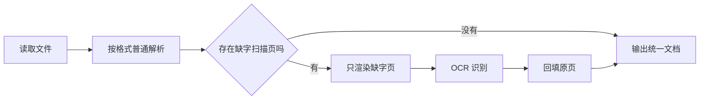

# 03｜解析文档，并只对缺失页面做 OCR

一个 PDF 的第一页能复制文字，第二页是扫描图片。如果把整份文件都交给 OCR，不仅成本更高，还可能把第一页已经准确的文字识别错；如果完全不用 OCR，第二页又会永远缺失。

本篇完成一条分层解析流程：先使用普通解析器，识别哪些 PDF 页缺少文本，只对这些页做 OCR，再把结果放回原页。OCR 关闭或返回空内容时，导入失败，不发布残缺知识。

## 先认识解析与 OCR

**解析**是从文件结构中读取文字、标题、表格和页码。**OCR** 是光学字符识别，用于从图片中识别文字。扫描 PDF 往往只有图片层，因此普通文本解析拿不到正文。



## 第一步：把不同文件变成同一种结果

文本、Markdown、HTML、PDF、DOCX、XLSX 和 PPTX 的内部结构不同，后续切片器不应分别理解所有格式。解析层统一输出正文、格式、元数据、告警和解析器版本。

```text
ParsedDocument
  content：后续切片使用的正文
  format：pdf、docx、html 等
  metadata：页数、工作表、表格等结构
  warnings：不阻断导入的异常
  parser_version：这次使用的解析规则版本
```

输入是原始字节、文件名和 MIME 类型，输出始终是同一结构。旧版二进制 Office 文件当前明确返回不支持，不假装解析成功。

## 第二步：普通解析器先尽量保留结构

HTML 移除脚本、样式和模板内容，再保留标题、段落、列表、代码与表格；DOCX 读取标题样式、列表和表格；电子表格保留工作表名与单元格关系；PPTX 按幻灯片顺序读取文本和表格。

这些结构会影响后续检索。“超时时间是多少”需要表头和单元格关系，“这条说明属于哪一章”需要标题路径。解析阶段如果只抽出一长串纯文本，切片阶段已经无法完整恢复。

## 第三步：PDF 先逐页提取文字

示例 PDF 有两页。普通解析后得到：

```text
## Page 1
申请人提交访问原因和使用期限。

## Page 2

ocr_required_pages: [2]
```

第一页保留原始文本，第二页有图片却没有文本，因此进入待 OCR 列表。页面标题是定位符，后面识别出的文字会插在 `Page 2` 下方，而不是统一追加到文件末尾。

## 第四步：只 OCR 缺失页面

运行时依次检查 OCR 是否启用、缺失页数是否超过上限、页面是否成功渲染、识别结果是否为空。通过后才回填正文。

```python
async def fill_missing_pages(pdf, parsed):
    for page_number in parsed.ocr_required_pages:
        image = render_page(pdf, page_number)
        text = (await ocr(image)).strip()
        if not text:
            raise OCRRequired(page_number)
        parsed.insert_after_page(page_number, text)
    return parsed
```

这是根据真实行为重写的最小示例。输入是普通解析结果和原始 PDF，关键逻辑只遍历缺字页；输出仍是统一文档。任何一页识别为空都会失败关闭，避免残缺版本进入索引。

## 正常结果和一次故意失败

正常结果中，OCR 客户端只收到第 2 页，第一页文字不变；最终元数据把已应用页记录为 `[2]`，待处理列表清空。

故意关闭 OCR 后，导入明确返回“第 2 页需要 OCR”，而不是成功但忽略第二页。当前测试还覆盖视觉服务返回空内容的情况，两条路径都会停止发布。

## 怎样验证解析质量

| 样本 | 应保留什么 | 失败信号 |
| --- | --- | --- |
| HTML | 标题、列表、表格 | 脚本和样式进入正文 |
| 普通 PDF | 页码与文本 | 页序错乱 |
| 扫描 PDF | 只 OCR 缺失页 | 整份重复 OCR 或空页发布 |
| DOCX | 标题样式与表格 | 全部压成一段 |
| XLSX | 工作表、表头、单元格 | 行列关系丢失 |

测试使用内存样本和假的 OCR 客户端，不发送真实业务文档。

## 当前实现的边界

DOCX 与 PPTX 内嵌图片当前只产生告警，不自动 OCR；OCR 只改善可检索文字，不承诺恢复原始版式；单文件与电子表格有资源上限，避免异常文件占满 Worker 内存。

下一篇会把统一文档切成保留标题、表格和相邻关系的稳定片段。

## 参考资料

- [PyMuPDF：Text recipes](https://pymupdf.readthedocs.io/en/latest/recipes-text.html)
- [python-docx](https://python-docx.readthedocs.io/en/latest/)
- [openpyxl：Optimised Modes](https://openpyxl.readthedocs.io/en/stable/optimized.html)
