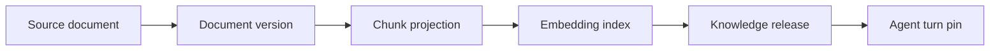

# 05｜向量化、索引版本与原子发布

文档解析和切片完成后，不能直接把新 embedding 写进线上表。在线请求可能在构建过程中读到一半旧、一半新的数据，删除旧文档也可能先于新版本完成，最终出现不可解释的召回波动。知识库需要类似应用发布的版本协议：构建、校验、激活、回滚，任何回答只引用一个 release。

## 三层对象



Document version 表示输入快照，Chunk projection 表示结构化切片，Embedding index 表示某个 embedding 模型与维度，Knowledge release 把所有对象组合成可查询集合。任何一层改变都要生成新版本或明确兼容策略，不能只更新一列 `active=true`。

## embedding 不是事实

向量只用于近似召回，不能作为答案事实或权限依据。embedding 模型、维度、归一化方式和分词变化都会改变距离；因此索引元数据至少记录：

```python
class EmbeddingManifest(BaseModel):
    model_id: str
    dimension: int
    distance: Literal["cosine", "inner_product", "l2"]
    normalized: bool
    source_hash: str
    created_at: datetime
```

同一张向量表混入不同维度或模型，会让查询失败或得出不可比较分数。重建时不要把模型名写成“latest”，而是保存不可变模型标识。

## 建构阶段不读在线 release

导入任务创建 `building` release，写入独立 chunk 和 vector 表。只有通过保真、重复、嵌入数量、抽样召回和安全扫描后，才在短事务中将它标记为 `active`，并把旧 active 标为 `retired`。

```sql
BEGIN;
  SELECT id FROM knowledge_releases
  WHERE space_id = :space_id AND status = 'active'
  FOR UPDATE;
  UPDATE knowledge_releases
  SET status = 'retired', retired_at = now()
  WHERE space_id = :space_id AND status = 'active';
  UPDATE knowledge_releases
  SET status = 'active', activated_at = now()
  WHERE id = :candidate_id AND status = 'building';
COMMIT;
```

生产系统可能需要保留多个 active/retired 版本以支持在途 Turn。原子激活并不意味着立刻删除旧版本；清理要等待引用计数、评测和恢复窗口结束。

## pgvector 的索引选择

pgvector 提供 exact search 和近似索引（如 HNSW、IVFFlat）。exact 更适合小数据集、质量基线和离线评测；近似索引降低延迟但需要以 Recall@K 验证参数。不要直接把官方 README 的默认参数当成业务最佳值。

```sql
CREATE INDEX CONCURRENTLY IF NOT EXISTS idx_chunk_embedding_v3
ON chunk_embeddings_v3
USING hnsw (embedding vector_cosine_ops)
WITH (m = 16, ef_construction = 64);
```

索引命名中明确模型/版本，构建期间使用新表或新索引名；`CREATE INDEX CONCURRENTLY` 仍需要监控、可能失败且不能放在事务块中。在线查询要把 `release_id` 作为关系过滤条件，不能只依赖表名约定。

## 原子激活的校验清单

```python
class ReleaseGate(BaseModel):
    source_count: int
    chunk_count: int
    vector_count: int
    preservation_rate: float
    duplicate_count: int
    sampled_recall_at_20: float
    forbidden_source_count: int

def publishable(gate: ReleaseGate) -> bool:
    return (
        gate.source_count > 0
        and gate.chunk_count == gate.vector_count
        and gate.preservation_rate >= 0.98
        and gate.duplicate_count == 0
        and gate.sampled_recall_at_20 >= 0.9
        and gate.forbidden_source_count == 0
    )
```

这里的数值只是模拟门禁。真实项目需要记录样本集版本，并按领域/文档类型拆分指标，避免总体平均数掩盖某类文档全部失败。

## 回滚不是把 active 改回去那么简单

如果新 release 已服务过请求，回滚后仍可能有事件和引用指向新版本。回滚协议要保证：旧 release 的索引仍可读；Turn 继续使用自己钉住的 release；新建 Turn 才使用回滚后的 active；事件和评测记录同时保存 release id。

```python
async def resolve_release(turn_id: str | None, space_id: str) -> str:
    if turn_id:
        pinned = await repo.turn_release(turn_id)
        if pinned:
            return pinned
    return await repo.active_release(space_id)
```

不要在查询时根据“当前版本不存在”自动跳到另一个版本，这会让引用与答案不一致。正确动作是将 Turn 标记为恢复失败或重新开始一个明确的新 Turn。

## 缓存键必须包含身份和 release

精确查询缓存可以降低重复查询成本，但缓存内容本身不代表可见性。键至少包含 query、release、scope、用户主体和检索配方；命中后仍用数据库确认当前调用者可见的 chunk。

```python
def cache_key(req: SearchRequest, subject_ids: list[str]) -> str:
    payload = {
        "release": req.release_id,
        "query": req.query,
        "scope": sorted(req.scope_ids),
        "subjects": sorted(subject_ids),
        "recipe": "hybrid-v2",
    }
    digest = hashlib.sha256(json.dumps(payload, sort_keys=True).encode()).hexdigest()
    return f"rag:evidence:{digest}"
```

只把“公共 release、公共范围、无身份差异”的结果当作真正公共缓存。Redis 锁可以避免同一 query 的并发击穿，但锁丢失时必须允许安全重算，不能返回半写 JSON。

## 版本迁移与删除

文档删除、权限收紧和 embedding 模型升级都要产生新 release，而不是直接从 active 表删除行。新版本通过门禁后，旧版本在途引用仍可读取；到保留期结束再物理清理。若法规要求立即删除，需将旧证据标记为 revoked，并让回答和重放接口不再展示正文。

## 测试

```python
async def test_turn_keeps_old_release_after_activation(repo):
    turn = await create_turn(repo, release="r1")
    await activate_release(repo, "r2")
    assert await repo.release_for_turn(turn.id) == "r1"

async def test_incomplete_candidate_cannot_be_active(repo):
    with pytest.raises(ReleaseGateError):
        await activate_release(repo, "building-without-vectors")
```

离线评测要比较 exact 与 ANN 的 Recall@K，比较不同 `ef_search`/`lists` 的延迟和召回，还要测试新旧 release 同时服务、回滚后引用可读、缓存不跨身份泄漏。

索引构建还应记录失败阶段和可清理资源。embedding 只完成一半时不能留下可被 active 查询的孤儿向量；清理任务按 `build_id` 删除候选表和临时对象，不按“最近创建时间”猜测，避免误删其他构建。

## 参考资料

- [pgvector README](https://github.com/pgvector/pgvector)：距离函数、HNSW、IVFFlat 和查询示例。
- [PostgreSQL：CREATE INDEX](https://www.postgresql.org/docs/current/sql-createindex.html)：并发索引构建与失败语义。
- [PostgreSQL：MVCC](https://www.postgresql.org/docs/current/mvcc.html)：事务快照和并发读取基础。
- [OpenAI embeddings guide](https://platform.openai.com/docs/guides/embeddings)：embedding 适用场景与相似度检索边界。
