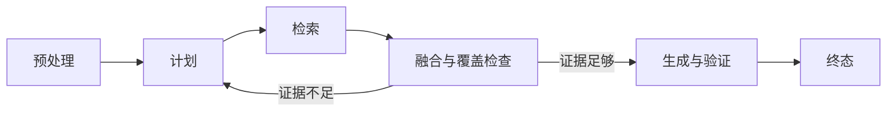

# 08｜把串行流程改造成 LangGraph 状态图

前七篇已经准备好知识、检索和权限。用普通函数把“理解问题、检索、生成、验证”串起来并没有错；当流程出现多路并行、条件补充、取消和恢复时，一条长函数就很难说明当前在哪里。

本篇先理解状态图，再用 LangGraph 表达同一条执行链。框架负责组织节点与状态，权限、事务和业务终态仍由普通后端代码负责。

## 状态图是什么

状态图由三部分组成：**状态**保存节点之间传递的数据，**节点**完成一个小步骤，**边**决定下一步去哪里。条件边会根据结果选择路径。



图里只展示六个阶段，真实实现可以在阶段内部继续拆节点。先有这张学习地图，读者才不会被十几个内部名称淹没。

## 第一步：先判断是否真的需要图

只有一个模型调用或固定三步流程时，普通函数更容易阅读。状态图适合这些情况：路径根据结果变化、需要动态并行、不同分支要合并状态、某些模式要恢复、每个阶段要独立观测。

本实践同时存在多路检索、证据覆盖复查、有限补充研究和验证修复，所以图能明确表达停止条件。

## 第二步：状态只保存跨节点信息

状态包含问题、访问快照、计划、检索分支结果、证据、Claim、答案和验证问题。数据库连接、模型客户端与 Logger 不属于业务状态，它们由运行时依赖注入。

状态越大，序列化、Checkpoint 和调试成本越高。节点内部临时变量留在函数里，只有下游确实需要的信息才写回状态。

## 第三步：节点返回增量，Reducer 负责合并

多个并行分支可能同时返回证据列表。若每个分支直接覆盖 `evidence`，最后只剩一个结果。Reducer 是合并规则，例如追加、按 ID 去重或取更大的研究轮次。

Reducer 要满足可预测性：分支完成顺序改变时，最终集合仍然一致。依赖“最后写入获胜”的字段不适合并行累积。

## 第四步：用 Send 动态创建分支

LangGraph 的 `Send` 可以根据本轮计划创建数量不固定的任务。下面是根据真实图行为重写的最小示例：

```python
class State(TypedDict):
    question: str
    branches: list[dict]
    evidence: Annotated[list[dict], operator.add]

def fanout(state: State):
    return [Send("research", {**state, "branch": item})
            for item in state["branches"]]

graph = StateGraph(State)
graph.add_node("plan", plan)
graph.add_node("research", research)
graph.add_node("fuse", fuse)
graph.add_edge(START, "plan")
graph.add_conditional_edges("plan", fanout)
graph.add_edge("research", "fuse")
graph.add_edge("fuse", END)
```

输入是一条问题和计划器生成的分支，输出是多个 `research` 结果合并后进入 `fuse`。公开代码只演示动态分支与合并，完整实现还包含预处理、覆盖审查、Claim、验证、一次修复和终态节点。

## 第五步：条件边表达停止条件

证据覆盖足够就进入 Claim 与生成；不足且研究轮次未达上限才补充；达到上限仍不足时，返回证据不足。验证通过进入终态，验证失败最多修复一次。

这些上限不能藏在 Prompt 中。程序状态记录轮次和预算，条件边用确定性规则决定是否继续。

## 正常结果和失败结果

正常问题生成两个检索分支，两个分支完成顺序不同，Reducer 合并出同一组候选，覆盖检查通过后生成答案。

失败用例故意让一个分支两次返回相同证据，预期融合后只保留一份；另一个用例让证据持续不足，图在限定轮次后结束，不无限回到计划节点。

## 当前实现的边界

图不负责鉴权和数据库事务，也不会自动让业务“可靠”。Checkpoint 只在需要的运行模式启用，第 14 篇再讲恢复。第 09 篇先深入动态分支怎样并行研究和融合。

## 参考资料

- [LangGraph：Graph API](https://docs.langchain.com/oss/python/langgraph/graph-api)
- [LangGraph：Use the graph API](https://docs.langchain.com/oss/python/langgraph/use-graph-api)
- [Python：TypedDict](https://docs.python.org/3/library/typing.html#typing.TypedDict)
