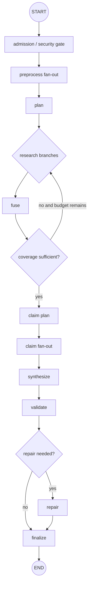

# 08｜LangGraph 状态、节点与 Reducer

LangGraph 的价值不在“把函数串起来”，而在把长运行 Agent 表达成可检查的状态图：节点读取输入状态、返回局部更新，边决定下一步，checkpointer 保存线程快照。若把所有东西放进一个不断修改的 dict，图看似能跑，遇到并行、重试和恢复就无法回答“这个值来自哪个节点、合并顺序是否稳定、节点是否重复执行”。

## State 是数据契约，不是聊天历史

状态只放后续节点需要且可序列化的数据。原始大文档、连接对象和模型客户端不应塞进 checkpoint；它们应通过 ID 在节点中重新获取。

```python
from typing import Annotated, TypedDict
import operator

class AgentState(TypedDict, total=False):
    turn_id: str
    question: str
    release_id: str
    access_snapshot: dict[str, object]
    plan: dict[str, object]
    branch: dict[str, object]
    candidates: Annotated[list[dict[str, object]], operator.add]
    evidence: list[dict[str, object]]
    claims: Annotated[list[dict[str, object]], operator.add]
    answer: str
    issues: list[dict[str, object]]
    research_round: int
```

`Annotated[list, operator.add]` 表示并行节点的更新应该追加，而不是后写覆盖；但 append 也不保证业务去重和顺序。状态字段要在文档中写明 owner、写入节点、合并器和终态含义。

## 节点只返回局部更新

```python
async def preprocess(state: AgentState) -> dict[str, object]:
    normalized = normalize_question(state["question"])
    return {"question": normalized}

async def retrieve_branch(state: AgentState) -> dict[str, object]:
    branch = state["branch"]
    results = await retriever.search(
        query=str(branch["query"]),
        release_id=state["release_id"],
        access=state["access_snapshot"],
    )
    return {"candidates": [serialize(item, str(branch["id"])) for item in results]}
```

节点不要返回完整 state 再让框架覆盖。完整返回会携带旧值，遇到并行合并时产生隐式覆盖；局部更新让每个字段的来源可追踪。

## 图的结构对应质量门



图结构不应只反映“模型步骤”，还要表达安全和质量门：没有证据不能进入 answer contract；覆盖率不足只能在 research budget 内回路；校验失败只能进入受限 repair；终态统一由 finalize 写入。

## fan-out/fan-in 的确定性

多个分支并行返回，合并器必须保证结果可重复。不要依赖 asyncio 完成顺序把列表 append 起来；用 branch id 和 rank 排序，再按 chunk id 去重。

```python
def merge_candidates(values: list[dict[str, object]]) -> list[dict[str, object]]:
    by_id: dict[str, dict[str, object]] = {}
    for value in values:
        chunk_id = str(value["chunk_id"])
        old = by_id.get(chunk_id)
        if old is None or float(value.get("score", 0)) > float(old.get("score", 0)):
            by_id[chunk_id] = value
    return sorted(
        by_id.values(),
        key=lambda item: (-float(item.get("score", 0)), str(item["chunk_id"])),
    )
```

如果某字段需要保留每个分支的完整结果，就使用 `BranchResult` 列表；如果只需要最终证据，则在 fuse 节点显式生成不可变 `evidence`，下游不再读取原始 candidates。

## 条件边是受约束的路由

条件函数只读取结构化状态，返回预注册的节点名；它不执行副作用、不调用模型、不访问网络。这样路由可在单元测试中穷举。

```python
def route_after_coverage(state: AgentState) -> str:
    plan = state["plan"]
    if state.get("coverage", 0) >= float(plan["minimum_coverage"]):
        return "claim_plan"
    if state.get("research_round", 0) < int(plan["max_research_rounds"]):
        return "research"
    return "claim_plan"
```

“无证据但进入 claim_plan”不是 bug，只要 claim planner 能生成“无法支持”的 contract；关键是不要让条件边默认进入 answer。

## Reducer 与数据生命周期

每个可追加字段必须有上限和去重规则。`candidates` 可能被多轮研究不断扩大；每轮结束要裁剪到 evidence budget，并保存被裁剪数量。`model_calls` 用加法 reducer 记录真实调用数，不能在 retry 时覆盖。

```python
def bounded_append(existing: list[dict], updates: list[dict], limit: int) -> list[dict]:
    merged = merge_candidates([*existing, *updates])
    return merged[:limit]
```

图的 reducer 负责合并语义，质量预算负责限制规模，数据库负责最终持久化；不要指望 reducer 自己防止恶意节点返回百万条数据。

## checkpoint 的线程配置

LangGraph checkpoint 依赖稳定的 `thread_id`。同一个 Turn 恢复必须使用同一个 thread，策略和 release 作为业务状态写进图输入或 Turn 快照，而不是隐含在全局变量。

```python
config = {
    "configurable": {
        "thread_id": turn_id,
    }
}
compiled = graph.compile(checkpointer=checkpointer)
await compiled.ainvoke(initial_state, config=config)
```

生产连接池要按事件循环生命周期管理，应用关闭时显式关闭。测试中为每个 case 使用唯一 thread，结束后清理 checkpoint，否则旧状态会污染下一次测试。

## 节点幂等与副作用

检索、重排和模型调用通常可重试，但发送外部消息、写入长期记忆或执行工具属于副作用。节点应该把副作用放在明确的 service 层，带 idempotency key，并在状态中记录结果 ID。不要在 graph node 中直接“调用成功后再写一行日志”，否则 Worker 崩溃窗口会导致重复。

```python
async def persist_memory_once(turn_id: str, memory: MemoryInput) -> str:
    key = f"memory:{turn_id}:{memory.fingerprint()}"
    existing = await memory_repo.by_idempotency(key)
    if existing:
        return existing.id
    return await memory_repo.insert(memory, idempotency_key=key)
```

## 取消和 deadline 贯穿节点

每个可能等待的节点在调用外部依赖前后检查 `cancel_requested` 与绝对 deadline。只在图外围检查一次不够：一个 120 秒的 rerank 调用可能已经超时。

```python
async def ensure_budget(state: AgentState) -> None:
    if await runtime_repo.cancel_requested(state["turn_id"]):
        raise CancelledError
    if monotonic() >= state["deadline_at"]:
        raise DeadlineExceeded
```

超时异常要由统一 runner 转换为 `expired` 终态和终态事件。节点自行吞异常会让数据库保持 running，reaper 只能猜测是否安全恢复。

## 测试图而不是只测最终答案

```python
def test_routes_stop_research_at_budget():
    state = {"coverage": 0.2, "plan": {"minimum_coverage": 0.8, "max_research_rounds": 1}, "research_round": 1}
    assert route_after_coverage(state) == "claim_plan"

async def test_parallel_merge_is_order_independent():
    left, right = await gather(run_branch("a"), run_branch("b"))
    assert merge_candidates(left + right) == merge_candidates(right + left)
```

集成测试使用 fake model 和 deterministic retriever，检查节点事件、状态快照、失败分支和 checkpoint 恢复。真正的 Postgres checkpoint 还要测试“在节点后中断再恢复不会重跑已完成节点”。

## 状态迁移与兼容

状态 schema 会随产品演进。checkpoint 中保存 `state_version`，恢复时执行纯函数迁移；未知字段忽略，必需字段缺失则拒绝恢复并进入可观测的 `resume_incompatible` 终态。不要直接用 Python pickle 在不同代码版本之间传递未审计对象。

```python
def migrate_state(raw: dict[str, object]) -> AgentState:
    version = int(raw.get("state_version", 1))
    if version == 1:
        raw = {**raw, "issues": raw.get("validation_issues", [])}
        version = 2
    if version != 2:
        raise IncompatibleState(version)
    return AgentState(**raw)
```

每次图结构改变都要考虑旧 checkpoint：节点被重命名、分支被删除、reducer 语义改变和 evidence 字段变化。最安全的策略不是无限兼容，而是保留明确的迁移窗口和重新执行边界。

## 图级成本和取消

图 runner 应把 deadline、预算和 cancellation token 放在 state/envelope 中，节点不可通过局部返回重置。并行 fan-out 要在 reducer 之前限制候选总数；否则每支只遵守 top K，合并后可能突破 prompt 预算。stage event 保存开始/结束、attempt、error code 和消耗量，方便观察“哪个节点把预算用完”。

## 可视化检查

在 CI 中导出 graph 的节点和边，检查所有非终态路径最终能到 `finalize` 或明确失败；检查每个 conditional route 的返回值都注册；检查没有节点同时负责写 evidence、调用工具和提交终态。图越复杂，自动静态检查越有价值。

## 实施细节与失败路径

状态图的可维护性来自显式 reducer 和终态契约。每个节点声明读写字段、幂等要求、超时和可重试错误；并行分支只能写各自命名空间，由 reducer 依据版本和顺序合并。图检查点不能代替业务事件，副作用节点必须先持久化意图再执行，并在恢复时检查执行记录。

实现时把关键不变量写成可执行约束：输入状态必须包含版本、权限和截止时间；节点输出必须能被序列化；外部副作用必须有幂等键和结果记录；终态必须同时写入业务状态与可重放事件。对每一条约束准备一个正常样例、一个边界样例和一个故障样例，并在 CI 中运行。

| 关注点 | 正常路径 | 故障路径 | 验收证据 |
| --- | --- | --- | --- |
| 数据版本 | 使用固定 release | 发布中途失败 | 回合可复现 |
| 权限范围 | 查询带范围快照 | 范围被撤销 | 越界证据为零 |
| 外部依赖 | 在 deadline 内完成 | 超时或限流 | 分类错误与重试记录 |
| 终态 | 答案、引用、事件一致 | Worker 崩溃 | 重放后状态一致 |

```text
请求 -> 持久化事实 -> 执行节点 -> 验证产物 -> 写入终态 -> 事件重放
```

## 参考资料

- [LangGraph Graph API](https://docs.langchain.com/oss/python/langgraph/graph-api)：StateGraph、节点、边、Send 与 reducers。
- [LangGraph persistence](https://docs.langchain.com/oss/python/langgraph/persistence)：checkpoint、thread 和恢复。
- [LangGraph GitHub repository](https://github.com/langchain-ai/langgraph)：公开实现与示例代码。
- [Python asyncio Task cancellation](https://docs.python.org/3/library/asyncio-task.html#task-cancellation)：取消传播与协作式停止。
