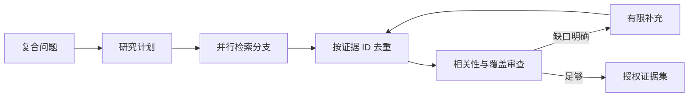

# 09｜并行检索后，怎样合并成一组证据

用户问“比较两种发布方式的步骤、风险和回滚条件”。这不是一个检索目标：步骤可能在操作手册，风险在故障记录，回滚条件又在发布规范。只搜一次，容易只覆盖其中一部分。

本篇把复合问题拆成有限分支，并行检索后再融合。并行的目标是缩短独立任务的等待时间，不是无上限启动更多模型调用。

## 先看完整研究流程

## 第一步：计划只拆独立目标

计划器输出目标、查询、通道和停止条件。示例可拆为步骤、风险、回滚三个分支，但“发布方式 A”和“发布方式 B”不一定还要各拆三份，避免组合爆炸。

程序会限制分支数、每支候选数和总证据预算。模型提出的计划属于候选，必须通过结构校验与范围检查。

## 第二步：独立分支并行运行

每个分支使用第 06 篇的混合检索，并携带同一知识版本和访问快照。快分支先返回不会改变最终合并规则，慢分支超过截止时间会被取消或标记降级。

分支内部也可以让全文与向量并行，但并行层数越多，对数据库、模型和连接池压力越大。并发上限由服务资源和评测决定。

## 第三步：融合先处理身份，再处理分数

同一片段可能在多个分支和通道出现。系统先用稳定证据 ID 去重，合并命中通道与目标，再计算融合顺序。

单一分数不适合直接跨通道比较：全文分、向量距离和模型重排尺度不同。可以使用排名融合，再结合精确命中、词法覆盖和来源多样性。

## 第四步：覆盖率对应问题目标

证据很多不等于覆盖完整。覆盖检查回到计划目标：步骤、风险和回滚是否分别有可用证据，比较对象是否都出现，是否存在相互冲突的来源。

若缺少“回滚条件”，补充查询只针对这个缺口，不重新搜索全部问题。当前实践最多进行有限轮补充，达到上限仍不足就明确告诉用户。

## 第五步：证据预算怎样分配

证据集要同时考虑相关性、目标覆盖、来源多样性和 Token 成本。一个长文档不能占满全部预算，重复相邻片段也会被压缩。

最终进入生成阶段的是“授权证据集”：它属于当前版本和用户范围，已去重，能够追踪到目标。模型不能自行从完整候选池捞回被过滤内容。

## 故意让一个分支超时

| 分支 | 结果 | 系统行为 |
| --- | --- | --- |
| 步骤 | 正常返回 | 进入融合 |
| 风险 | 正常返回 | 进入融合 |
| 回滚 | 超过 Deadline | 取消慢任务并标记缺口 |

如果剩余证据不能回答回滚条件，系统返回部分答案并说明缺失，不用模型补齐。若策略允许且预算尚有余量，可以再做一次针对性检索。

测试还会随机改变分支完成顺序，确认最终去重集合与覆盖结果保持一致。

## 当前实现的边界

并行不会消除供应商限流和数据库容量约束。研究计划是否合理仍需 Eval；最多补充几轮是策略配置，不是通用最佳值。

下一篇把最终证据拆到答案 Claim，逐条验证支持关系。

## 用一个双目标问题观察并行

问题“比较访客账号与正式账号的申请步骤和有效期”包含两个相对独立的研究目标。预处理阶段可以并行完成意图理解、上下文准备和范围解析；计划确认后，再为两个目标动态创建检索分支。分支共享同一访问快照和 Deadline，但各自拥有查询与证据预算。

| 分支 | 要回答的问题 | 完成条件 |
| --- | --- | --- |
| A | 两类账号的申请步骤 | 找到能支持步骤差异的证据 |
| B | 两类账号的有效期 | 找到明确期限，或确认可见资料缺失 |

结果按完成顺序进入收集器，融合结果却不能依赖完成顺序。先按证据身份去重，再记录每个目标的覆盖状态。若 A 已完整、B 缺少正式账号期限，补充研究只围绕 B，不重复检索 A。当前实践把补充研究限制为最多两轮，到达预算后保留缺口说明。

让 B 分支主动超时，检查 A 的有效证据是否仍能用于部分回答、B 是否留下超时原因、慢任务是否收到取消。若任务要求“必须完整比较”，则返回证据不足；若允许部分结果，可以展示 A 并明确 B 的缺口。哪种策略适用应由用例契约决定，不由模型临时猜测。

## 参考资料

- [LangGraph：Send API](https://docs.langchain.com/oss/python/langgraph/graph-api#send)
- [Python：asyncio Task Groups](https://docs.python.org/3/library/asyncio-task.html#task-groups)
- [Reciprocal Rank Fusion](https://plg.uwaterloo.ca/~gvcormac/cormacksigir09-rrf.pdf)
