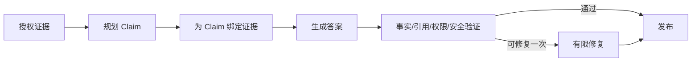

# 10｜让答案中的每个事实都绑定证据

检索器找到正确文档，答案仍可能多写一句没有依据的话。“相关文档很多”只说明候选存在，不能证明生成文本里的每条事实都被支持。

本篇先把准备回答的事实拆成 Claim，再把 Claim 绑定到授权证据。生成后执行确定性与模型验证，最多进行一次有限修复。

## Claim 是什么

Claim 是可以单独判断是否被证据支持的陈述。例如“审批由直属负责人完成”和“审批后立即生效”是两条 Claim，需要分别核验。



## 第一步：从问题和证据规划 Claim

计划器只提出本轮有机会回答的事实，不要求每条证据都变成结论。每个任务保存序号、拟回答内容和候选证据 ID。

模型负责理解语义，程序负责检查证据 ID 是否属于授权集合、Claim 数量是否超出预算、结果结构是否完整。

## 第二步：先处理确定性答案

寒暄、安全阻断、无权限和证据不足等分支不需要走复杂 Claim 生成。它们由确定性规则形成固定类型结果，减少模型自由度。

对于精确字段查询，也可以直接从结构化证据形成 Claim，不必让模型重新推断一个已经明确的值。

## 第三步：生成时只提供已授权证据

每条 Claim 只看到与自己绑定的证据，合成器再根据 Claim 顺序组织自然语言。流式输出可以先显示文字增量，但引用和终态仍要等验证通过后发布。

回答中的引用不是任意数字。它们指向服务端保存的稳定证据 ID，再由服务端转换成用户可见标题和链接。

## 第四步：验证分成哪些部分

| 验证 | 主要问题 | 更适合谁判断 |
| --- | --- | --- |
| 引用完整性 | 引用 ID 是否存在并属于本轮 | 程序 |
| ACL | 证据是否仍对用户可见 | 程序 |
| 隐私与敏感信息 | 是否包含禁止输出 | 程序规则 + 必要审查 |
| 提示注入 | 证据是否诱导改变系统指令 | 规则 + 模型辅助 |
| 事实支持 | Claim 是否由内容支持 | 确定性匹配 + 模型辅助 |

权限和引用身份不能交给另一个模型“打分”。语义支持可以使用模型 Judge，但要保留证据和版本，便于回放。

## 第五步：修复为什么只做一次

验证问题可修复时，只把失败 Claim、问题类型和原证据交给修复器。例如删除无证据的“立即生效”，而不是重新规划和检索整道题。

修复后再次执行完整验证。仍失败就返回安全结果，不进入“修复失败再修复”的无限循环。轮次上限由程序控制。

## 验证一个遗漏事实

```text
证据 A：申请需要直属负责人审批。
证据 B：审批通过后，系统会进入权限配置队列。

候选答案：申请由直属负责人审批，审批后权限立即生效。
```

第一条 Claim 得到支持；第二条与“进入配置队列”冲突，标记为 unsupported 或 conflict。有限修复可改为“审批通过后进入权限配置流程”，并引用证据 B。

## 当前实现的边界

Claim 验证降低无证据陈述，不能证明世界事实绝对正确；如果知识源本身错误，系统仍可能给出有引用的错误答案。来源治理、版本和 Eval 必须同时存在。

下一篇通过 MCP 把同一只读知识能力提供给外部客户端。

## 把一段答案拆成可检查 Claim

候选回答“访客账号由负责人申请，有效期为七天；正式账号需要额外审批”包含三个可独立判断的事实。不要只给整段答案挂一个引用，而要为每个 Claim 记录文本、证据身份和证据中的支持片段。

| Claim | 绑定证据 | 确定性检查 |
| --- | --- | --- |
| 访客账号由负责人申请 | E1 | E1 在本轮可见证据中 |
| 有效期为七天 | E2 | 引用范围包含“七天” |
| 正式账号需要额外审批 | 暂无 | 不允许作为已确认事实发布 |

流式生成时可以发送文本增量，但引用和最终完成状态要等验证结束。验证先检查引用存在、ACL、敏感信息和格式，再判断事实是否被证据支持。第三条缺证据时，一次有限修复可以删除或改成“当前资料未找到明确说明”，不能让模型重新自由生成整篇答案。

测试要覆盖一条正确 Claim、一条引用错位、一条证据外推和一条越权证据。检查失败类型是否具体，修复后是否只改变失败部分，以及第二次仍失败时是否安全结束。验证的目的不是让回答一定通过，而是阻止没有依据的确定语气进入最终结果。

## 参考资料

- [OpenAI：Agent evals](https://developers.openai.com/api/docs/guides/agent-evals)
- [OWASP：LLM Prompt Injection Prevention](https://cheatsheetseries.owasp.org/cheatsheets/LLM_Prompt_Injection_Prevention_Cheat_Sheet.html)
- [NIST AI Risk Management Framework](https://www.nist.gov/itl/ai-risk-management-framework)
