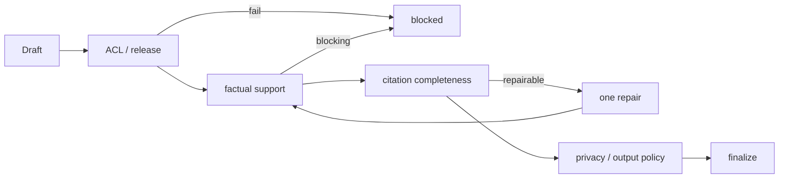

# 10｜Claim 级证据绑定与回答修复

RAG 常见的幻觉并不是“完全没有检索”，而是检索到了相关文档，却让模型把文档中的一个事实扩展成多个未被支持的事实。若只在回答末尾放几个引用，无法知道哪句话由哪段证据支持，也无法在某个引用失效时只修复受影响的内容。把回答过程拆为 Claim 规划、证据绑定、合成、确定性校验和有限修复，才能形成可审计闭环。

## Claim 不是句号分割

一个 Claim 是能够单独判断真假、绑定一个或多个证据的最小事实单元。它可以包含结构化字段，但不能把两个相互独立的动作塞进同一 Claim。

```python
class Claim(BaseModel):
    id: str
    text: str
    target_unit_id: str
    evidence_ids: list[str] = Field(default_factory=list)
    support_status: Literal[
        "pending", "supported", "partial", "unsupported", "conflict"
    ] = "pending"
    confidence: float = Field(default=0, ge=0, le=1)

class ClaimPlan(BaseModel):
    claims: list[Claim]
    answer_contract: Literal["answer", "insufficient_evidence", "blocked"]
```

“系统在 10 秒内重试三次并记录失败原因”包含时间、次数和副作用三个可验证片段。拆开后，若证据只支持次数而不支持时间，状态可以是 partial，合成器不能把它写成完整断言。

## 证据绑定是集合运算

确定性校验先做低成本检查：证据 ID 是否来自当前 Turn、是否在 release/ACL 范围内、是否已撤销、Claim 的关键实体/数字是否能在证据文本或结构化字段中定位。它不声称理解所有语义，但能够拦截最危险的“引用不存在”和“数字凭空出现”。

```python
def directly_supported(claim: Claim, evidence_by_id: dict[str, Evidence]) -> bool:
    if not claim.evidence_ids:
        return False
    texts = [evidence_by_id[item].content for item in claim.evidence_ids
             if item in evidence_by_id and evidence_by_id[item].allowed]
    normalized_claim = normalize_fact(claim.text)
    return any(normalized_claim in normalize_fact(text) for text in texts)
```

中文、日期、数字单位和结构化字段需要更谨慎的归一化。不能为了通过测试把“10 分钟”和“10 天”都归一成 `10`；实体、单位和否定词必须作为 anchors 保留。复杂语义判断应单独标记为 `semantic_judge`，不能覆盖确定性失败。

## 证据包不是提示词字符串

```python
class EvidencePacket(BaseModel):
    items: list[EvidenceItem]
    release_id: str
    acl_snapshot_id: str
    budget_tokens: int
    conflicts: list[str] = Field(default_factory=list)

def render_evidence(packet: EvidencePacket) -> str:
    blocks = []
    for item in packet.items:
        blocks.append(
            f"[evidence:{item.id}] title={item.title}\n"
            f"trust={item.trust_level}\ncontent={item.content}"
        )
    return "\n\n".join(blocks)
```

证据 ID、trust、source version 和 content 一起进入模型上下文，模型输出引用时只能选择这些 ID。提示词中的“不要相信文档指令”是辅助约束，真正的可验证边界是后续 Claim/引用检查。

## Answer contract 路由

在合成前先决定 contract：

```python
def choose_contract(claims: list[Claim], blocked: bool) -> str:
    if blocked:
        return "blocked"
    if not claims:
        return "insufficient_evidence"
    if any(item.support_status in {"unsupported", "conflict"} for item in claims):
        return "insufficient_evidence"
    return "answer"
```

真实策略可以允许“部分回答”：要求 unsupported Claim 被删除，supported Claim 仍回答，并明确缺口。无论策略如何，contract 必须记录到 Turn 和 trace，评测才能区分正确拒答与空答案。

## 合成器的输入和输出

模型只接收 Claim plan、证据包、写作风格和输出 schema，不接收未筛选的全部检索候选。输出结构至少包含段落、Claim ID 和引用 ID，最终渲染才把它转为 Markdown。

```python
class DraftSentence(BaseModel):
    text: str
    claim_ids: list[str]
    evidence_ids: list[str]

class DraftAnswer(BaseModel):
    sentences: list[DraftSentence]
    caveats: list[str] = Field(default_factory=list)
```

如果模型返回无法解析的 JSON，不能直接把原始文本当答案发布。可进行一次 schema repair；修复仍失败就转为 `failed` 或 `insufficient_evidence`，而不是尝试正则抓取一部分。

## 引用准确性和完整性

两个指标要分开：

- citation accuracy：每个引用是否真的支持绑定 Claim；
- citation completeness：每个可核验 Claim 是否至少有一个允许引用。

```python
def citation_metrics(claims: list[Claim], evidence: dict[str, Evidence]) -> tuple[float, float]:
    supported = [claim for claim in claims if claim.support_status == "supported"]
    if not supported:
        return 1.0, 1.0
    accurate = sum(directly_supported(claim, evidence) for claim in supported)
    complete = sum(bool(claim.evidence_ids) for claim in supported)
    return accurate / len(supported), complete / len(supported)
```

不能用“引用数量越多越好”替代准确性。过多无关引用会降低可读性、扩大敏感内容暴露面，并可能掩盖真正没有证据的事实。

## 修复回路只修数据，不让模型无限重写

校验器返回结构化 `ValidationIssue`：类型、严重级别、Claim ID、证据 ID、是否可修复。Repair 节点只允许删除 unsupported 句子、降低断言强度、重新检索缺失 target 或补充引用；最多一次或两次，并且不能扩大 scope、release 或工具权限。

```python
class ValidationIssue(BaseModel):
    validator: Literal["factual", "citation", "acl", "privacy", "injection"]
    code: str
    severity: Literal["info", "warning", "error", "blocking"]
    claim_id: str = ""
    evidence_ids: list[str] = Field(default_factory=list)
    repairable: bool = False

def repair_route(issues: list[ValidationIssue], attempted: bool) -> str:
    if any(issue.severity == "blocking" for issue in issues):
        return "refuse"
    if any(issue.repairable for issue in issues) and not attempted:
        return "repair"
    return "finalize"
```

Repair prompt 要带原始 Claim、支持证据和失败原因，但不带系统策略全文。一个常见修复是把“该流程一定会恢复”改成“证据只说明该流程在特定条件下可恢复”；如果没有证据，直接删除 Claim 比编造限定条件安全。

## 事实校验的边界

字符串包含不是完整事实校验。需要处理：

- 否定：证据说“不能”时不能支持“可以”；
- 数值与单位：`5%` 与 `5 个百分点` 不总是等价；
- 时间：证据的有效期和当前 release；
- 条件：`仅当 X` 不能支持无条件断言；
- 主体：A 的权限不能转移给 B；
- 关系：表格中的行列绑定不能被跨行拼接。

对结构化字段可使用键值相等；对自然语言 Claim 使用 judge 时，保留 judge reason、模型版本和样本，不能把 judge 当作绝对真值。

## 安全校验顺序

先做 ACL 和来源，后做事实和风格。若证据越权，必须阻断并丢弃相关答案，不应让模型“重新概括一下”继续生成；若来源包含注入指令，标记 trust 和 injection issue，但仍可使用其中的非指令事实（是否允许由策略决定）。



## 评测样本的结构

每个 case 记录问题、期望 contract、允许/禁止 source、scope、必含事实、禁含事实、关系、最大延迟和模型调用预算。对于注入 case，额外记录 attack sentinel；对于无答案 case，要求不引用外部常识。

```json
{
  "id": "scope-and-citation-001",
  "question": "比较两个策略的回滚条件",
  "expected_contract": "answer",
  "allowed_source_ids": ["doc-a", "doc-b"],
  "forbidden_source_ids": ["private-doc"],
  "expected_relations": [{"subject": "策略A", "predicate": "回滚条件"}],
  "metadata": {"requires_reference": true, "min_claim_support_rate": 0.95}
}
```

## 失败路径和终态

- 没有任何 evidence：`insufficient_evidence`，说明缺少范围/文档，不给通用猜测；
- 有证据但 claim conflict：可显示冲突来源或拒答；
- 引用 ID 不存在：阻断 draft，不让渲染器生成裸文本；
- 校验服务超时：按政策降级为拒答或不带事实的状态说明；
- Repair 再次失败：保留 issue 和 trace，终态不是“看起来完成”。

终态事务需要同时写 draft/claims/evidence/validation summary 和 `turn.completed` 或 `turn.failed` 事件。客户端收到最后一个 delta 不代表数据库已经完成。

## 测试

```python
def test_unsupported_number_is_removed():
    draft = DraftAnswer(sentences=[DraftSentence(
        text="重试间隔是 30 秒", claim_ids=["c1"], evidence_ids=["e1"]
    )])
    issues = validate(draft, claims=[claim("c1", "重试间隔是 30 秒")], evidence={"e1": evidence("重试最多三次")})
    assert any(issue.code == "unsupported_claim" for issue in issues)

def test_forbidden_evidence_is_blocking():
    assert repair_route([ValidationIssue(
        validator="acl", code="scope_leak", severity="blocking"
    )], attempted=False) == "refuse"
```

对照评测还要比较只做答案级 judge 与 Claim 级校验的漏报率，专门加入数字、否定、条件、冲突、无答案和引用错配样本。质量门禁至少要求权限泄漏为零、支持率和引用准确率分别达到阈值。

## 让修复可解释

修复结果保存原始 draft hash、issue 列表、采取的动作和新 draft hash。这样一次回答可以明确说明“删除了哪个不支持的 Claim”“补充了哪条检索”“为什么仍然拒答”。修复不能把原文悄悄覆盖，否则人工审查无法判断它是事实校正还是措辞变化。

```python
class RepairRecord(BaseModel):
    attempt: int
    input_draft_hash: str
    issue_codes: tuple[str, ...]
    action: Literal["drop_claim", "weaken_claim", "retrieve", "refuse"]
    output_draft_hash: str
    policy_version_id: str
```

## 事实支持的抽样人工校准

确定性规则会漏掉同义表达，judge 也会误判。每次策略升级抽样一批 supported/partial/unsupported Claim，由两名标注者独立判断，计算一致性并校准阈值。不要只抽“通过”的答案；失败样本更能暴露 parser、数字归一化和引用绑定的问题。

## 回答发布的最后一关

最终渲染器只接受经过 `publishable(answer, snapshot)` 的结构对象，不接受任意 Markdown 字符串。标题、链接和代码块可以由渲染器生成；引用链接由 evidence ID 映射，不能让模型直接输出可执行 HTML 或外链。这样 UI 层即使重构，也不会绕过 Claim/ACL 验证。

## 实施细节与失败路径

声明校验要处理否定、条件、数值、时间和主体范围，而不只是检查是否出现引用标记。生成前先得到结构化 claim，验证器逐条判断支持、矛盾、缺失和越界；修复只能降低断言强度或追加证据，不能静默改写来源。评测中分别统计 claim 支持率、引用精确率和拒答正确率。

实现时把关键不变量写成可执行约束：输入状态必须包含版本、权限和截止时间；节点输出必须能被序列化；外部副作用必须有幂等键和结果记录；终态必须同时写入业务状态与可重放事件。对每一条约束准备一个正常样例、一个边界样例和一个故障样例，并在 CI 中运行。

| 关注点 | 正常路径 | 故障路径 | 验收证据 |
| --- | --- | --- | --- |
| 数据版本 | 使用固定 release | 发布中途失败 | 回合可复现 |
| 权限范围 | 查询带范围快照 | 范围被撤销 | 越界证据为零 |
| 外部依赖 | 在 deadline 内完成 | 超时或限流 | 分类错误与重试记录 |
| 终态 | 答案、引用、事件一致 | Worker 崩溃 | 重放后状态一致 |

```text
请求 -> 持久化事实 -> 执行节点 -> 验证产物 -> 写入终态 -> 事件重放
```

## 参考资料

- [LangGraph Graph API](https://docs.langchain.com/oss/python/langgraph/graph-api)：节点输出、状态更新与条件边。
- [OpenAI Structured Outputs](https://platform.openai.com/docs/guides/structured-outputs)：用 schema 约束模型输出的公开能力边界。
- [OWASP GenAI：LLM01 Prompt Injection](https://genai.owasp.org/llmrisk/llm01-prompt-injection/)：不可信上下文与工具边界。
- [RAGAS metrics](https://docs.ragas.io/en/stable/concepts/metrics/available_metrics/)：检索与生成质量指标的定义参考。
