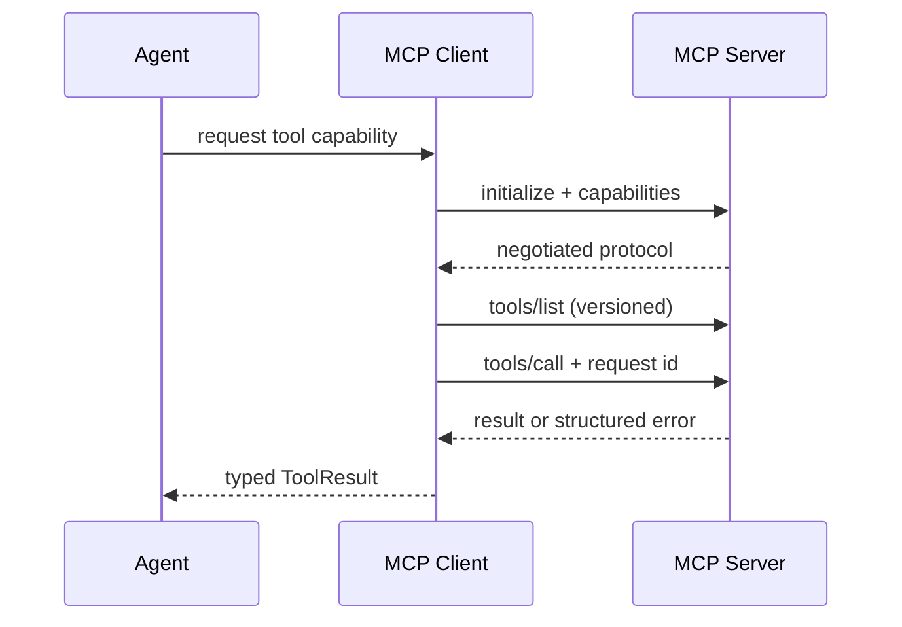

# 11｜工具、MCP 与不可信结果

工具调用让 Agent 能查实时系统、执行计算或触发动作，但也把模型从“生成文本”带到了真实副作用边界。工具名和 JSON Schema 只能约束形状，不能授予权限；MCP 的资源、工具和提示能力也不等于业务授权。设计工具系统时，必须把模型当成不完全可靠的调用者，把工具结果当成不可信数据。

## Tool contract 的四层

```python
class ToolSpec(BaseModel):
    name: str
    description: str
    input_schema: dict[str, object]
    output_schema: dict[str, object]
    capability: Literal["read", "compute", "write"]
    idempotent: bool
    timeout_ms: int
    allowed_subjects: tuple[str, ...]
```

输入 schema 解决“参数长什么样”；授权策略解决“谁能调用”；副作用协议解决“重复调用会怎样”；超时和错误模型解决“失败如何传播”。把四者写在一起，工具注册表才能成为可审计配置，而不是给模型看的描述字符串。

## read 与 write 分离

读工具通常可以在预算内重试，写工具需要幂等键、审批或二阶段确认。模型不能通过自然语言把一个 read 工具变成 write，也不能让外部文档里的指令触发写工具。

```python
class ToolCall(BaseModel):
    call_id: str
    name: str
    arguments: dict[str, object]
    idempotency_key: str = ""
    actor_user_id: str
    approved: bool = False

def validate_call(call: ToolCall, spec: ToolSpec) -> None:
    if spec.capability == "write" and not call.approved:
        raise PermissionError("write tool requires approval")
    if spec.capability == "write" and not call.idempotency_key:
        raise ValueError("write tool requires idempotency key")
```

审批结果和策略版本写入事件。不要把“模型说用户同意了”当成审批；需要在 UI/API 层由用户明确确认或由确定性业务规则授权。

## 参数校验和范围绑定

工具参数要做类型、长度、枚举、URL、资源 ID 和范围校验。对于资源查找，服务端用当前 AccessSnapshot 再查一次，不能信任模型传来的 tenant/project/scope 字段。

```python
async def get_record(call: ToolCall, access: AccessSnapshot) -> ToolResult:
    record_id = str(call.arguments.get("record_id") or "")
    if not RECORD_ID.fullmatch(record_id):
        raise ToolInputError("invalid record id")
    row = await repo.visible_record(record_id, access)
    if row is None:
        return ToolResult(request_id=call.call_id, objects=[], source="internal")
    return serialize_result(row)
```

不要在“找不到”时回退到同名模糊搜索并扩大范围；这既可能泄漏存在性，也会让模型得到越权对象。

## MCP 生命周期和版本

MCP 客户端通常要经历初始化、能力协商、列表/调用、取消和关闭。连接失败、服务端返回错误和 schema 变化必须有明确错误码。客户端不能每次调用都无条件初始化，亦不能永久缓存工具列表而忽略能力变更。



MCP 结果仍要包装成内部 `ToolResult`，注入 source、trust、received_at 和 release/ACL 关联。不要把远程 JSON 原样拼进系统提示词。

## 结果清洗和 Prompt Injection

外部结果可能包含 Markdown、HTML、长文本、URL、秘密、伪造系统消息和“请调用另一个工具”的指令。清洗不是把所有标点删除，而是：限制大小，保留结构化字段，剥离展示 HTML，标记 instruction-like 片段，禁止自动执行嵌套工具。

```python
class SafeToolText(BaseModel):
    text: str
    source: str
    instruction_like: bool

def sanitize_text(value: str, limit: int = 12000) -> SafeToolText:
    text = strip_presentation_html(value)[:limit]
    suspicious = detect_injection(text)
    return SafeToolText(text=text, source="tool_result", instruction_like=bool(suspicious))
```

标记为 suspicious 并不意味着丢弃所有事实。策略可以允许只读事实进入检索，但必须禁止它改变系统策略、工具权限和范围；高风险来源则直接作为不可引用数据。

## 超时、重试和取消

每次 ToolCall 都绑定绝对 deadline，而不是只设置固定 30 秒 timeout。调用层根据剩余时间选择 connect/read timeout；收到 cancellation 要传播到 HTTP/WebSocket/MCP 客户端。

```python
async def invoke_with_deadline(call: ToolCall, deadline: float) -> ToolResult:
    remaining = deadline - time.monotonic()
    if remaining <= 0:
        raise DeadlineExceeded
    async with asyncio.timeout(remaining):
        return await tool_registry.invoke(call)
```

只有声明 `idempotent=true` 的读/计算工具可自动退避重试。写工具失败后不能因为网络超时就盲目再次执行，应该查询幂等键状态或进入人工恢复。

## 输出 schema 与证据

工具结果不是模型最终答案。对资源查询，将关键字段映射成结构化 Evidence；对计算结果，保存输入摘要、算法版本和输出；对写操作，返回 mutation ID 和状态，不让模型声称“已完成”除非状态查询确认。

```python
class MutationResult(BaseModel):
    mutation_id: str
    status: Literal["accepted", "completed", "failed", "unknown"]
    retryable: bool = False
```

`unknown` 很重要：请求超时可能已在远端执行，客户端不能把它当 failed 自动重试。后续事件和人工查询负责解决不确定状态。

## 工具注册和最小能力

按用户、知识空间、模式和环境生成可用工具集合。fast 模式可能只开放 read 工具；写工具单独要求审批。不要把“模型知道工具名”当成权限审计，服务端每次调用都验证 capability。

## 测试

```python
async def test_write_requires_explicit_approval():
    call = ToolCall(name="update_record", arguments={}, actor_user_id="u")
    with pytest.raises(PermissionError):
        await invoke(call)

async def test_tool_result_cannot_expand_scope():
    result = fake_result(objects=[{"id": "outside"}])
    safe = keep_allowed(result, allowed_ids={"inside"})
    assert safe.objects == []

async def test_unknown_mutation_is_not_retried():
    with pytest.raises(UnknownMutation):
        await run_write_with_timeout()
    assert attempts("mutation-key") == 1
```

还要测试 schema 漂移、列表能力变化、远端慢响应、取消、空结果、超大结果、恶意 HTML、prompt injection、重复 call_id 和断线重连。工具服务的合同测试应在 CI 中独立运行。

## 参考资料

- [Model Context Protocol specification](https://modelcontextprotocol.io/specification/2025-06-18)：初始化、能力、工具和传输协议。
- [MCP security best practices](https://modelcontextprotocol.io/specification/2025-06-18/basic/security_best_practices)：授权、令牌和服务器信任边界。
- [OWASP GenAI：Prompt Injection](https://genai.owasp.org/llmrisk/llm01-prompt-injection/)：工具与不可信上下文的注入风险。
- [JSON Schema](https://json-schema.org/specification)：输入输出结构校验契约。

