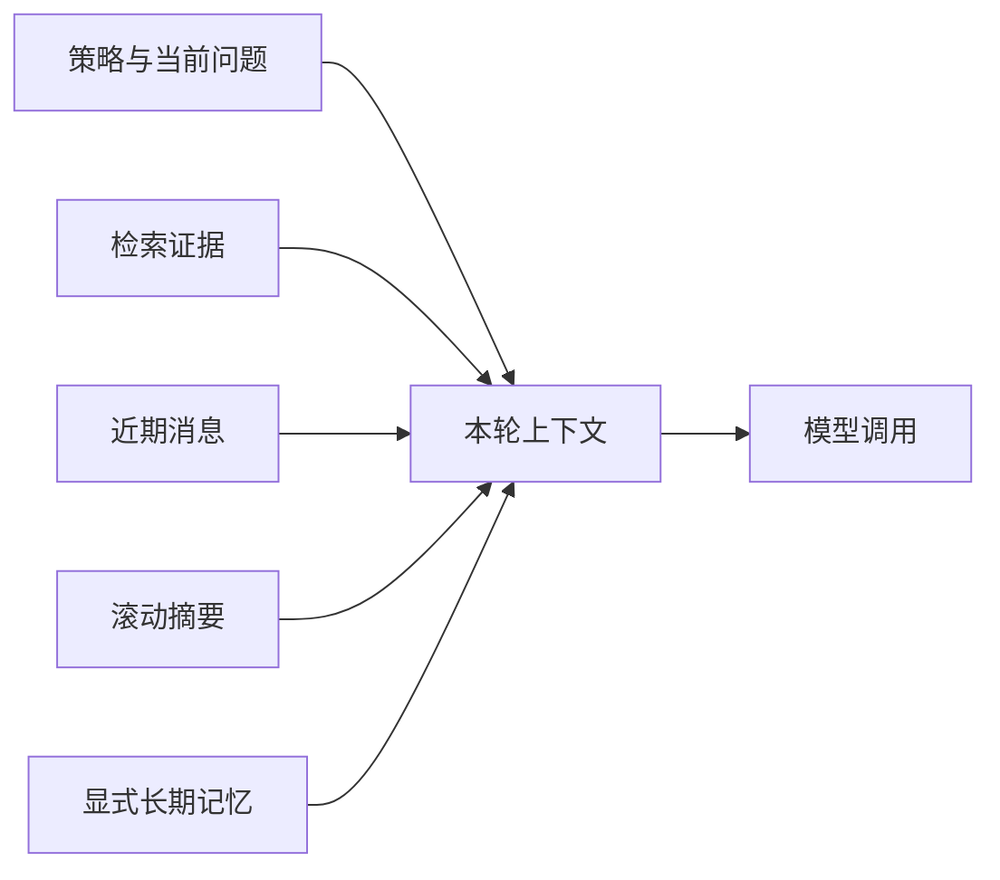

# 12｜在 Token 预算内组织对话和记忆

短对话可以把所有历史交给模型。几十轮后，原样拼接会超过上下文窗口，还会挤掉本轮真正需要的检索证据。简单删除最早消息又可能让“它的负责人是谁”失去指代对象。

本篇先分清上下文和记忆，再按 Token 预算保留策略、证据、近期消息、滚动摘要和少量显式长期记忆。

## 上下文和记忆有什么不同

**上下文**是本次模型调用实际收到的信息。**短期历史**来自当前会话。**长期记忆**是跨会话保存、以后可能再次使用的用户事实或偏好。

消息存进数据库不代表每轮都要发送给模型；摘要进入上下文也不代表原始记录被改写。

## 第一步：先为输入分配 Token 预算

上下文窗口要减去输出预留和安全余量，剩余部分再分给策略、证据、近期历史、摘要与记忆。知识问答模式会优先保证证据，不让聊天历史挤掉来源。

Token 计数器优先使用本地可验证编码；编码不可用时采用确定性保守估算，并记录降级。估算不应触发网络下载，避免运行时因分词资源失效而阻塞。

## 第二步：短对话保留原文，长对话保留近期内容

总量低于摘要触发阈值时，历史原样进入上下文。超过阈值后，从最新消息向前选择，保留能够装入预算的完整轮次；最边界的一条消息必要时做确定性截断。

近期消息优先，因为它们更可能包含当前指代和纠正。系统同时保留原始不可变对话记录，方便用户查看和排障。

## 第三步：滚动摘要负责更早历史

摘要把旧摘要和新近被移出的消息合并，保留问题、结论、实体、数字、条件、纠正和未完成事项，并区分“用户说过”和“已由证据验证”。

摘要是有损压缩，不能被当成企业知识事实。涉及事实回答时仍要重新检索当前授权知识。

## 第四步：摘要失败时确定性裁剪

摘要模型超时或输出无效时，系统不让整个对话失败。它使用相同 Token 计数规则保留最新历史、截断旧摘要，并在运行信息中标记压缩降级。

这种降级可预测，但可能丢失早期细节。后续回答若依赖缺失上下文，应向用户澄清，而不是猜测。

## 第五步：长期记忆只能显式、可控

“以后回答我时优先给 TypeScript 示例”可以作为用户明确偏好；一次对话中出现的敏感数据、第三方个人信息和模型推断，不应自动写入长期记忆。

用户需要能查看、删除和关闭长期记忆。MCP 等外部调用默认不写个人记忆，避免一次工具调用悄悄改变后续会话。

## 运行一个长对话

| 输入阶段 | 处理方式 | 原因 |
| --- | --- | --- |
| 当前问题 | 完整保留 | 本轮目标 |
| 授权证据 | 优先保留 | 回答事实依据 |
| 最近 4 轮 | 按预算保留 | 处理指代与纠正 |
| 更早消息 | 滚动摘要 | 控制体积 |
| 用户偏好 | 少量显式记忆 | 改善表达方式 |
| 敏感字符串 | 不进入记忆 | 降低隐私风险 |

正常路径的编译结果不会超过输入预算。失败测试让摘要模型报错，预期仍生成确定性上下文，并且不修改原始消息。

## 当前实现的边界

摘要不能保证保留所有细节，长期记忆也不适合保存业务知识。不同模型的 Token 计算存在差异，预算需要按实际模型配置，而不是使用一个全局字符数。

下一篇处理网络重试和队列重复投递，让同一个回合只被一个 Worker 推进。

## 参考资料

- [OpenAI：Conversation state](https://developers.openai.com/api/docs/guides/conversation-state)
- [LangGraph：Memory](https://docs.langchain.com/oss/python/langgraph/add-memory)
- [Python：hashlib](https://docs.python.org/3/library/hashlib.html)
