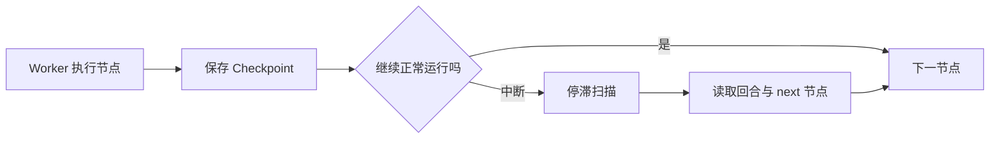

# 14｜Worker 中断后怎样恢复回合

Agent 已经完成检索，正准备生成答案时 Worker 退出。重新从头执行会再次调用工具，也可能得到不同证据；盲目从某个节点继续，又可能重复已经产生外部效果的步骤。

本篇区分业务事实和图 Checkpoint，再加入持久 Deadline、协作取消和停滞扫描。恢复只在启用 Checkpoint 的运行模式中发生，不把所有短请求都变成持久工作流。

## Checkpoint 保存什么

Checkpoint 是图在某个安全位置保存的状态快照，包括已完成节点、下一节点和需要的中间结果。回合数据库仍然保存对用户有意义的业务状态，两者不能互相替代。

## 第一步：Deadline 在创建时确定

Deadline 是整个回合的绝对截止时间，不是每次重试重新获得一整段时长。它在回合创建时持久化，恢复后继续计算剩余时间。

若恢复时已经过期，系统直接进入 expired 终态，不继续调用模型或工具。节点开始前和长操作之间都会检查剩余预算。

## 第二步：取消采用协作检查

用户取消后，API 先把状态写为 `cancel_requested`。Worker 在节点边界、工具调用前后和流式批次间检查该标记，随后保存 `cancelled` 终态。

协作取消不会粗暴终止数据库事务，也不把客户端断线等同于用户取消。外部调用无法中断时，Worker 等调用返回后在下一个检查点停止。

## 第三步：只为需要的模式启用 Checkpoint

短 Session 可以直接执行，减少持久化开销；长研究、需要人工暂停或跨 Worker 恢复的模式才配置数据库 Checkpointer。

是否启用在运行开始前确定。恢复时使用相同线程身份读取 next 节点，并重置仅属于上一次流连接的临时对象。

## 第四步：停滞扫描决定恢复还是终止

定时任务查找长时间无心跳、租约已过期但仍非终态的回合。它会检查 Deadline、取消状态、Checkpoint 和重试次数，再决定重新派发、取消、过期或失败。

扫描器使用领取机制避免多个调度器同时恢复同一批任务。重新派发仍要经过第 13 篇的所有权竞争。

## 验证恢复不会重复节点

| 中断位置 | Checkpoint | 恢复预期 |
| --- | --- | --- |
| 计划完成后 | next=research | 从检索继续 |
| 检索融合后 | next=claim_plan | 不重复检索 |
| 用户已取消 | 任意 | 不恢复，进入 cancelled |
| Deadline 已过 | 任意 | 进入 expired |
| 无 Checkpoint 模式 | 无 | 按策略失败或重新开始 |

测试使用记录节点调用次数的假节点，确认已完成节点不会在恢复后重复执行。

## 当前实现的边界

Checkpoint 只保存图状态，不自动让外部工具幂等。任何可能产生外部效果的工具都需要自己的幂等设计。本实践工具保持只读，因此恢复风险主要是重复成本和结果漂移。

下一篇把回合事件通过 SSE 发送给浏览器，并在断线后从上一序号继续。

## 参考资料

- [LangGraph：Persistence](https://docs.langchain.com/oss/python/langgraph/persistence)
- [Python：asyncio cancellation](https://docs.python.org/3/library/asyncio-task.html#task-cancellation)
- [PostgreSQL：SKIP LOCKED](https://www.postgresql.org/docs/current/sql-select.html)
