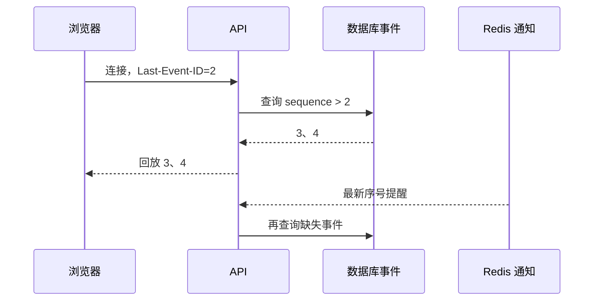

# 15｜SSE 断线后从上一条事件继续

浏览器已经收到两段答案，网络短暂中断。重连后如果服务端从头发送，文字会重复；如果只等待新消息，第 3 条事件可能永久丢失。

本篇使用数据库事件序列作为真相源，Redis 只通知“有更新”。客户端通过 `Last-Event-ID` 告诉服务端最后确认的序号，重连后从下一条继续。

## SSE 是什么

Server-Sent Events 是服务器向浏览器持续发送文本事件的标准机制。它是单向连接，适合任务进度、答案增量和终态通知；浏览器到服务端的提问仍使用普通 HTTP。



## 第一步：事件先写数据库

每个回合分配单调递增序号，并用“回合 + 序号”保证唯一。答案增量、引用就绪和终态都先持久化，再通知在线订阅者。

Redis 不保存完整答案，也不承担唯一事实。通知丢失时，API 的定期数据库复查仍能发现新序号；Redis 不可用时可以退化为轮询。

## 第二步：连接前先鉴权和检查所有权

客户端提交 turn ID 不代表有权订阅。API 根据认证上下文确认回合所有者和访问范围，再读取事件。错误用户即使猜到 ID 也不能观察运行进度和引用。

## 第三步：先回放，再等待提醒

建立连接后先查询 `sequence > Last-Event-ID` 的历史事件，按序发送；追上最新序号后再等待 Redis 通知。每次收到通知仍回数据库查询，不信任通知里携带完整业务内容。

终态事件发送后连接关闭。若重连时终态已经存在，服务端回放剩余事件后立即结束，不建立无意义长连接。

## 第四步：客户端怎样去重

浏览器保存最后处理成功的事件 ID。重复网络包或重连回放出现同序号时，客户端可以忽略；只在处理成功后推进本地序号，避免 UI 失败却跳过事件。

事件内容要有稳定类型，例如 `answer.delta`、`references.ready`、`turn.completed` 和 `turn.failed`，不要让客户端从任意文本猜状态。

## 做一次断线实验

```text
数据库已有：1 created，2 delta，3 delta，4 completed
客户端已确认：2
重连请求：Last-Event-ID: 2
服务端输出：3 delta，4 completed，然后关闭
```

另一个测试关闭 Redis，API 仍通过短间隔数据库复查返回新事件。数据库异常时连接应报告失败或重试，不能把缺失事件当成“暂时没有更新”。

## 当前实现的边界

事件只在配置的保留期内可重放，超过窗口的客户端需要读取最终回合快照。SSE 适合服务器单向推送，不替代双向实时协作协议。

下一篇使用相同 Runtime 和事件快照建立可重复 Agent Eval。

## 亲手做一次断线重放

让一个回合依次产生序号 21、22、23、24 四条事件。浏览器收到 21 和 22 后断线，重新连接时发送 `Last-Event-ID: 22`。服务端先校验用户仍拥有这个回合，再从数据库查询 `seq > 22`，依次回放 23、24，之后才等待新事件通知。

| 组件 | 在这套实践中的职责 |
| --- | --- |
| 数据库事件表 | 保存有序事实，是重放真相源 |
| Redis 通知 | 告诉连接“最新序号变了”，不保存完整真相 |
| SSE 连接 | 按序发送并保持心跳 |
| 客户端游标 | 只在事件成功应用后推进 |
| 轮询接口 | SSE 不可用时按相同序号读取 |

客户端可能重复收到 23，因此应用事件前按“回合 ID + 序号”去重。网络断开不改变后台业务状态；终态写入数据库后，重连仍能读到唯一终态并停止。Redis 短暂不可用时，服务端可以轮询数据库最新序号，代价是延迟增加，语义不应变化。

验证时记录首次事件时间、断线序号、重连回放数量和终态。再撤销回合访问权后重连，预期是拒绝连接而不是继续回放缓存。这样才同时覆盖可靠性和权限边界。

## 参考资料

- [WHATWG：Server-sent events](https://html.spec.whatwg.org/multipage/server-sent-events.html)
- [MDN：Using server-sent events](https://developer.mozilla.org/docs/Web/API/Server-sent_events/Using_server-sent_events)
- [Redis：Pub/Sub](https://redis.io/docs/latest/develop/interact/pubsub/)
