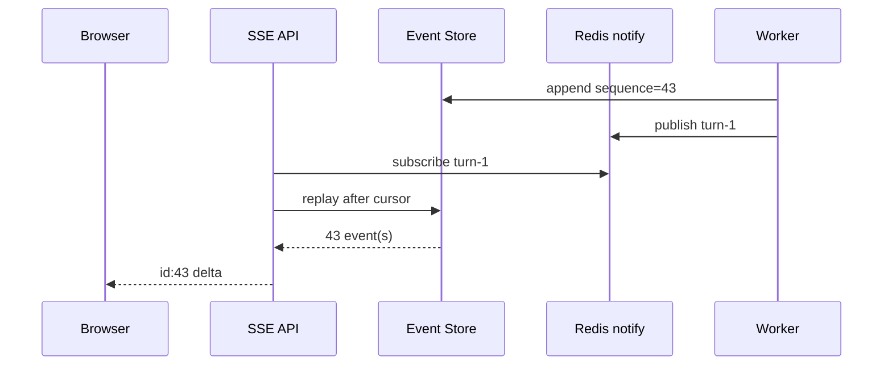

# 15｜SSE 流式事件、断线重放与背压

Agent 前端希望实时看到阶段、引用和 token，但“模型 token 到了就直接写 HTTP response”无法支持刷新、多个标签页、反向代理缓冲和断线恢复。SSE 应该是持久化事件的一个读取协议：数据库事件序列是事实，Redis pub/sub 只负责提醒有新事件，客户端用 `Last-Event-ID` 从序列继续读取。

## 事件格式

```text
id: 42
event: answer.delta
data: {"content":"已完成第一步","turn_id":"turn-1"}

```

事件 ID 必须是同一 Turn 内单调序列，不使用时间戳或随机 UUID 作为游标。事件类型要有限且版本化：`turn.created`、`stage.completed`、`evidence.added`、`answer.delta`、`turn.completed`、`turn.failed`、`heartbeat`。客户端未知事件应安全忽略并保留游标。

```python
def encode_event(sequence: int, event_type: str, payload: object) -> bytes:
    body = json.dumps(payload, ensure_ascii=False, default=str)
    return f"id: {sequence}\nevent: {event_type}\ndata: {body}\n\n".encode()
```

## 订阅前先做授权

事件 endpoint 要按 turn id 查询 owner 和知识空间权限，不能只要 URL 能猜到就流式返回。授权通过后读取 `Last-Event-ID`，非法值返回 400；不要把错误详情写进 SSE 流，避免泄露其他 Turn 是否存在。

## 数据库回放与 Redis 提醒



Redis 消息丢失不影响正确性，因为 API 定期或收到提醒后查询数据库。Redis 不可用时回退为轮询；数据库事件表才是重放真相源。每次读取都按 `sequence > cursor ORDER BY sequence`，而不是依赖 Redis 消息内容。

## 流循环的终止条件

```python
async def stream_turn(turn_id: str, cursor: int) -> AsyncIterator[bytes]:
    last_activity = time.monotonic()
    while True:
        events = await repo.events_after(turn_id, cursor)
        for event in events:
            cursor = event.sequence
            last_activity = time.monotonic()
            yield encode_event(cursor, event.type, event.payload)
        status = await repo.status(turn_id)
        if status in TERMINAL and not events:
            break
        if time.monotonic() - last_activity >= HEARTBEAT_SECONDS:
            last_activity = time.monotonic()
            yield b": heartbeat\n\n"
        await wait_for_notification_or_timeout(turn_id)
```

“收到 terminal 就立即 break”可能丢掉同事务前后写入的事件；先回放到游标，确认 terminal 后没有更高序列，再关闭。心跳是注释行，不应被 UI 当成业务事件。

## 客户端重连

浏览器原生 EventSource 会自动带 `Last-Event-ID`，自定义 fetch 流则要自己保存游标。客户端 reducer 按 sequence 去重，遇到跳号时触发 snapshot/replay，而不是继续拼接。

```ts
type AgentEvent = { id: number; type: string; payload: unknown }

function applyEvent(state: ClientState, event: AgentEvent): ClientState {
  if (event.id <= state.lastSequence) return state
  if (event.id !== state.lastSequence + 1 && state.lastSequence !== 0) {
    return { ...state, needsResync: true }
  }
  return reduceAgentEvent({ ...state, lastSequence: event.id }, event)
}
```

客户端不能把 `answer.delta` 作为唯一答案来源。最终 `turn.completed` 应包含 answer artifact/version 或触发一次 GET snapshot；流式中断时 UI 明确标记 incomplete。

## 代理和缓存配置

SSE 响应需要 `Content-Type: text/event-stream`、`Cache-Control: no-cache, no-transform`、`X-Accel-Buffering: no` 等适配网关的头。Nginx、CDN 和服务框架可能缓冲小块，必须用真实链路验证首事件延迟和长连接超时。压缩也可能把多个事件攒在一起，按代理策略评估。

## 背压与慢客户端

Worker 不应无限等待一个断开的浏览器。事件先持久化，SSE 读取速度慢时可以丢弃通知但不能丢数据库事件；单连接发送缓冲要有上限，超过后关闭连接并让客户端重连回放。token delta 过细会增加数据库写放大，可以按时间/字符窗口合并，但每个 sequence 的语义必须固定。

```python
async def coalesce_deltas(deltas: list[str], max_chars: int = 120):
    buffer = ""
    for delta in deltas:
        if len(buffer) + len(delta) > max_chars and buffer:
            yield buffer
            buffer = ""
        buffer += delta
    if buffer:
        yield buffer
```

持久化合并应在事件定义中说明：如果把多个模型 token 合并成一条 delta，重放得到的是相同文本但不一定相同 token 边界。

## 安全与隐私

SSE 事件可能包含引用标题、错误消息和工具状态。按事件类型做字段白名单，不把内部 URL、提示策略或完整检索正文推给不该看的客户端。CORS、cookie、CSRF 和连接数限制同普通 API 一样重要。Turn ID 使用不可猜测值，但不可猜测不能替代授权。

## 测试

```python
async def test_replay_after_cursor():
    await append("turn-1", 1, "turn.created", {})
    await append("turn-1", 2, "answer.delta", {"content": "A"})
    events = [event async for event in stream_turn("turn-1", cursor=1)]
    assert [event.id for event in events] == [2]

async def test_terminal_event_is_replayed_before_close():
    await append("turn-1", 4, "turn.completed", {})
    events = [event async for event in stream_turn("turn-1", cursor=3)]
    assert events[-1].type == "turn.completed"
```

浏览器验收覆盖刷新、断网、代理缓冲、两个客户端同时订阅、Redis 不可用、慢客户端、事件跳号和权限变化。抓包确认响应没有被压缩/缓存，Network 面板确认首事件与心跳实际到达。

## 参考资料

- [WHATWG Server-sent events](https://html.spec.whatwg.org/multipage/server-sent-events.html)：EventSource、事件格式和重连语义。
- [FastAPI StreamingResponse](https://fastapi.tiangolo.com/advanced/custom-response/#streamingresponse)：异步生成器与流式响应。
- [MDN Server-sent events](https://developer.mozilla.org/en-US/docs/Web/API/Server-sent_events)：浏览器端 EventSource 和 Last-Event-ID 行为。
- [Nginx proxy buffering](https://nginx.org/en/docs/http/ngx_http_proxy_module.html#proxy_buffering)：反向代理缓冲对流式响应的影响。

