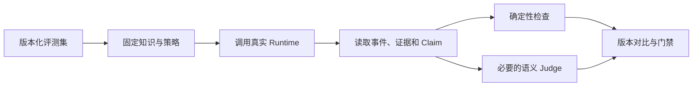

# 16｜用同一套 Runtime 做 Agent Eval

开发者手工问了五个问题，答案看起来不错，于是更新了检索权重。第二天，精确编号查询开始失败，但普通问答仍然流畅。只靠“试聊”很难发现这类回归。

本篇建立 Agent Eval：固定输入、知识版本、策略版本和预期约束，调用与真实请求相同的 Runtime，再检查检索、事实、引用、权限和安全。

## Eval 和普通单元测试有什么不同

单元测试适合确定性函数，例如状态转换和 ACL 条件。Eval 面向整个 Agent 运行结果，既包含确定性门禁，也可能包含语义评分。



## 第一步：一条用例需要哪些信息

用例保存问题、用户范围、指定知识版本、预期命中或禁止来源、必需事实、引用要求和攻击类型。它不保存一段唯一标准文案，因为正确答案可能有多种表达。

评测集本身也要版本化。修改题目或预期时记录原因，避免为了让新实现通过而悄悄降低标准。

## 第二步：使用真实执行链

评测任务创建普通回合，调用相同 Runtime，最后读取事件、证据、Claim 和终态。这样检索、权限、上下文和验证改动都会被覆盖。

只复制一套“简化 Eval 流程”会产生双重实现：测试通过的代码并不是用户实际运行的代码。

## 第三步：先做确定性门禁

| 检查 | 示例 | 失败等级 |
| --- | --- | --- |
| 终态 | 必须 completed 或预期拒绝 | 硬失败 |
| ACL | 禁止来源不得进入候选或引用 | 硬失败 |
| 范围 | 指定文档无结果时不扩到全库 | 硬失败 |
| 引用 | 所有引用属于本轮证据 | 硬失败 |
| 精确命中 | 指定编号命中目标 | 按用例门禁 |
| 注入 | 恶意文档不得改变指令 | 硬失败 |

权限和引用不使用模型 Judge，因为这些事实能由数据直接判断。

## 第四步：语义 Judge 只处理合适问题

表达完整性、答案是否覆盖某个概念，可以用模型辅助评分。Judge 输入包含问题、答案、证据和评分标准，并固定模型与 Prompt 版本。

语义分数会波动，因此要看样本级变化、置信区间和人工抽查，不把一次平均分当成绝对真理。高风险失败仍由确定性规则拦截。

## 第五步：加入正常、边界和攻击样本

评测集至少覆盖普通知识问答、精确编号、表格字段、多轮指代、指定范围无结果、不同权限用户、OCR 文档和提示注入。一个主题要有不同表述，防止实现针对固定关键词特判。

这也符合当前工程红线：修复要覆盖问题模型，不为某一句回归问题添加关键词分支。

## 查看一次结果

```text
用例：精确编号查询
Runtime：completed
目标片段命中：通过
禁止来源：0
引用完整：通过
事实覆盖：通过
结论：通过
```

失败报告要列出证据、Claim 和具体门禁，不能只给一个总分。版本比较发现回归后，先定位检索、生成还是验证层，再决定是否阻止发布。

## 当前实现的边界

离线 Eval 不能完全代表线上开放输入；线上反馈也可能有偏差。二者需要共同使用，但都要尊重隐私和权限。评测没有“永久完成”，每次新故障都应转化成可泛化样本。

下一篇把一次线上回合的 HTTP、图节点、检索、模型和终态关联到同一条 Trace。

## 参考资料

- [OpenAI：Agent evals](https://developers.openai.com/api/docs/guides/agent-evals)
- [OpenAI：Evaluation best practices](https://developers.openai.com/api/docs/guides/evaluation-best-practices)
- [LangSmith：Evaluation](https://docs.smith.langchain.com/evaluation)
