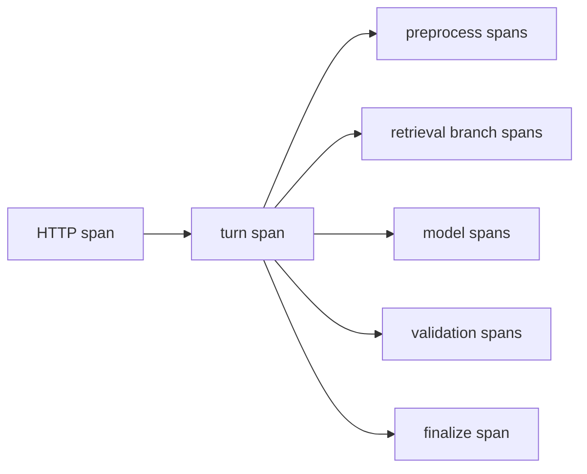

# 17｜Trace、指标、成本与策略治理

Agent 失败时，单看 HTTP 500 或最终答案没有用。需要知道：请求进入了哪个 policy，预处理耗时多少，哪条检索分支空了，模型调用几次，哪些 Claim 未支持，首 token 何时产生，是否发生了 fallback，最终用了哪一版知识。可观测性不是“多打印日志”，而是让一次 Turn 的因果链可重放且不泄露敏感内容。

## Trace 结构



统一 trace id 和 turn id 贯穿 API、Worker、数据库事件和模型适配器。每个 span 记录 stage、release、policy、mode、attempt、latency、status 和计数，不把完整 prompt、密钥或私有正文作为普通 attribute。

```python
with tracer.start_as_current_span("agent.research") as span:
    span.set_attributes({
        "agent.turn_id": turn_id,
        "agent.release_id": release_id,
        "agent.branch_id": branch_id,
        "agent.candidate_count": len(candidates),
        "agent.cache_hit": cache_hit,
    })
```

## Metrics 关注分布和比例

至少有：Turn 终态计数、总/首事件延迟 histogram、模型调用和 token、检索候选数、evidence 数、Claim 支持率、citation accuracy、ACL block、injection detection、cache hit、checkpoint resume 和队列深度。计数器使用低基数 label（mode、status、channel），不要把 user_id、query 或 turn_id 作为 Prometheus label。

```python
AGENT_TURNS = Counter("agent_turns_total", "terminal turns", ["status", "mode"])
FIRST_EVENT = Histogram("agent_first_event_seconds", "first event latency", ["mode"])
CLAIM_SUPPORT = Gauge("agent_claim_support_rate", "supported claims", ["policy"])
```

质量指标应从 durable snapshots 周期性聚合，不能只依赖某个进程内存；进程重启和多副本必须得到一致数据。

## Logs 与隐私

结构化日志记录事件类型、错误码、耗时和对象 ID。问题文本和 evidence 内容做采样、脱敏或哈希；访问日志保留必要字段和保留期。日志中的异常字符串也可能包含用户上传的 prompt injection，不要把它当成可信模板再执行。

## 成本预算

成本不只来自模型 token，还包括 embedding、rerank、OCR、数据库、队列和存储。每个 Turn 维护预算：最大研究轮数、分支数、模型调用数、输入/输出 token、外部工具调用数和 deadline。事件记录实际使用量，超过预算就停止新增工作并走降级。

```python
class CostBudget(BaseModel):
    model_calls: int = 8
    input_tokens: int = 30_000
    output_tokens: int = 4_000
    tool_calls: int = 4

def consume(budget: CostBudget, usage: Usage) -> CostBudget:
    next_budget = budget.model_copy(update={
        "model_calls": budget.model_calls - usage.model_calls,
        "input_tokens": budget.input_tokens - usage.input_tokens,
        "output_tokens": budget.output_tokens - usage.output_tokens,
        "tool_calls": budget.tool_calls - usage.tool_calls,
    })
    if min(next_budget.model_calls, next_budget.input_tokens,
           next_budget.output_tokens, next_budget.tool_calls) < 0:
        raise BudgetExceeded
    return next_budget
```

## 策略版本治理

提示词、模型路由、检索权重、阈值、记忆开关和安全规则组成 policy version。修改任一项都生成新版本，不能直接编辑 active JSON。版本有 draft/challenger/champion/retired 状态和 changelog；每个 Turn 固定记录 policy id。

champion/challenger 分流用稳定 hash，让同一用户在对比窗口保持一致。推广条件由 Eval gate 决定，不能通过“线上感觉更自然”直接切换。质量、安全和成本门槛任何一个失败都应拒绝。

## 告警应该指向动作

“错误数升高”不是可执行告警。把指标映射到 runbook：

| 信号 | 可能原因 | 首个动作 |
| --- | --- | --- |
| 首事件 P95 上升 | 队列、预处理或模型连接 | 按 stage trace 定位 |
| Claim 支持率下降 | 切片/retrieval/policy 变化 | 比较 release/policy |
| forbidden source > 0 | ACL/cache 回归 | 立即阻断候选策略 |
| checkpoint resume 失败 | schema/连接池/版本 | 停止自动恢复，保留回滚 |
| token 成本突增 | prompt 膨胀/循环 | 检查预算和研究轮次 |

告警本身不要附带私密答案内容；使用 trace id 和受控审计入口。

## 采样和关联

所有错误 Turn 全量保留最小诊断信息，成功 Turn 按比例采样完整 trace。采样不能丢掉安全事件、质量失败和 challenger 数据。通过 trace id 关联 SSE、数据库事件、模型供应商 request id 和队列 task id，避免仅靠时间戳拼接。

## 成本与质量的联合报告

按 mode、policy、release、document type 分组报告 token、延迟、Recall、支持率和拒答率。优化不能只追求成本最低：如果把证据预算砍半让引用准确率下降，应该明确 trade-off，而不是把“节省 token”称作成功。

## 测试与隐私验收

```python
def test_metric_labels_have_bounded_cardinality():
    assert metric_labels("agent_turns_total") == {"status", "mode"}

def test_trace_redacts_prompt_and_secret():
    exported = export_trace(turn_with_secret())
    assert "api_key" not in exported
    assert "private document body" not in exported
```

运行一次敏感词扫描，验证 Markdown、事件 payload、日志和构建产物没有本机路径、私网地址、凭证格式和私有项目名。生产审计系统与公开博客同样遵守最小披露原则。

## 边界演练

可观测性数据本身也要分级和脱敏。Trace 记录版本、节点和耗时，指标记录聚合结果，日志记录可检索错误上下文；提示词、凭证和敏感正文不能因为调试方便而全量写入。

每次演练都保存请求 ID、版本、状态变化、错误分类和恢复结果，确认监控信号与用户可见状态一致。

## 脱敏与采样边界

Trace 需要能关联请求、回合、图节点和外部依赖，但不等于保存完整提示词和文档正文。生产环境优先记录哈希、长度、版本、耗时、状态和错误分类；需要调试正文时使用短期、审批和脱敏采样。指标维度必须有限，不能把用户输入、URL 参数或高基数文档 ID 直接作为 label。治理策略也应版本化，模型路由、预算、重试和采样变更都能回到对应版本。

## 参考资料

- [OpenTelemetry Concepts](https://opentelemetry.io/docs/concepts/observability-primer/)：Trace、Metric、Log 的关联。
- [OpenTelemetry semantic conventions](https://opentelemetry.io/docs/specs/semconv/)：服务与数据库观测字段规范。
- [Prometheus metric types](https://prometheus.io/docs/concepts/metric_types/)：Counter、Gauge、Histogram 的选择。
- [OpenAI pricing](https://openai.com/api/pricing/)：模型 token 成本治理需要使用当前官方价格核对。

治理检查还要验证降级路径：模型不可用时是否切换到允许的替代模型，预算耗尽时是否安全拒答，采样率变化时是否仍能定位一次失败。策略发布采用版本号、审批和小流量观察，旧版本保留到评测和回放窗口结束。
