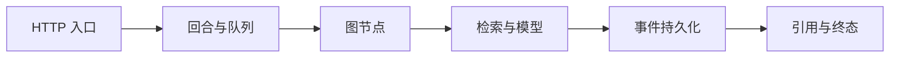

# 17｜从一次请求追到最终引用

用户说“回答很慢”。慢在排队、检索、模型首 Token、验证，还是浏览器断线重放？只有一个总耗时，开发者只能猜。

本篇从 turn ID 开始，把 HTTP、队列、图节点、检索、模型、事件和终态连接到一条 Trace。可观测数据用于定位，不记录完整 Prompt、密钥和私密正文。

## 先分清日志、指标和 Trace

**日志**记录离散事件，**指标**聚合数量与耗时，**Trace**连接一次请求跨组件的执行路径。三者通过 request ID、turn ID、task ID 和 trace ID 关联。

## 第一步：入口建立关联身份

API 接收请求后生成或接收 request ID，创建回合后获得 turn ID，派发队列后记录 task ID。不要用用户问题文本作为关联键。

日志字段包括阶段、状态、耗时、版本和错误分类。用户 ID 只在有必要且经过控制的环境保存，公开报表使用聚合或脱敏标识。

## 第二步：每个图节点记录开始与结束

节点 Span 记录节点名、研究轮次、输入/输出数量、耗时和结果状态，不记录完整内部状态。这样可以看出计划器慢、检索分支超时，还是验证发生修复。

并行分支作为子 Span，共享父 Trace。Reducer 合并后记录候选去重前后数量，便于发现重复爆炸。

## 第三步：检索和模型各记录什么

检索记录通道、候选数、知识版本、是否降级、重排是否执行和最终证据数量。访问范围只记录不可逆指纹或计数，不记录私密资源列表。

模型调用记录模型标识、请求类型、输入/输出 Token、排队与首 Token 时间、总耗时和错误类别。Prompt 与证据正文默认不进入普通日志。

## 第四步：单独观察首事件和终态

用户体验不仅由总耗时决定。入口到第一条可见事件、第一段答案到引用就绪、引用到终态之间的间隔都值得单独观测。

终态 Trace 保存完成、失败、取消或过期，以及引用数量与验证结果。它不复制答案正文。

## 一次慢请求怎样定位

| 观测 | 结果 | 推断 |
| --- | --- | --- |
| 准入等待 | 很短 | 不是系统排队 |
| 全文检索 | 正常 | 稀疏通道正常 |
| 向量分支 | 超时并降级 | 主要延迟来源之一 |
| 模型首 Token | 正常 | 生成启动正常 |
| 引用验证 | 正常 | 终态收尾正常 |

这组结果允许团队只调查向量服务和超时策略，而不是重写整套 Agent。

## 告警要指向动作

“Agent 错误率高”太宽泛。更可执行的告警是：某模型供应商超时率超过基线、终态缺失数量增长、事件持久化失败、ACL 硬门禁失败或停滞回合积压。

告警包含影响范围、当前版本、Runbook 和恢复标准。低样本的单次波动进入观察，不触发频繁切换。

## 验证脱敏边界

测试会发送包含疑似密钥、个人信息和提示注入文本的请求，再检查日志与 Trace 导出中没有原文。另一个测试确认错误栈不会把认证头与工具返回全文打印出来。

## 当前实现的边界

可观测性不能自动解释因果，采样也可能漏掉低频问题。高风险安全事件需要专门审计记录，与普通性能日志分开治理。

下一篇完成发布：在候选环境验证新版本，保留备份和上一版本，再逐步切换与回滚。

## 从 HTTP 请求追到最终引用

发起一条隔离测试请求，在入口生成 request ID，并把业务回合 ID、异步 task ID 和 trace ID 关联起来。随后沿图节点检查理解、检索、模型、验证与终态 Span。并行检索各自是子 Span，父节点记录融合后的证据数量。

| 阶段 | 建议记录 | 默认不记录 |
| --- | --- | --- |
| HTTP | 路由模板、状态、耗时、request ID | 认证头、完整请求正文 |
| 图节点 | 节点名、状态、版本、耗时 | 完整私密状态 |
| 检索 | 通道、候选数、降级、证据 ID | 未授权候选正文 |
| 模型 | 用途、Token、首 Token、总耗时 | 原始系统提示与密钥 |
| 终态 | 类型、引用数、验证结果 | 用户敏感文本 |

再让向量通道超时，预期 Trace 显示该分支错误、全文通道完成、融合采用降级路径，最终答案明确证据边界。指标层面可以观察通道超时率和终态分布，日志则保留用于定位的结构化错误码。

告警需要能引向动作，例如“停滞回合持续增长”链接到租约和 Worker Runbook；单条模型慢请求不一定值得叫醒值班。遥测导出失败不能阻塞主要回答链，但应有独立健康指标。完成演练后，确认通过任意一个关联 ID 都能找到同一条执行链，并且日志中没有用户正文、凭证和内部地址。

## 参考资料

- [OpenTelemetry：Traces](https://opentelemetry.io/docs/concepts/signals/traces/)
- [OpenTelemetry：Metrics](https://opentelemetry.io/docs/concepts/signals/metrics/)
- [OWASP：Logging Cheat Sheet](https://cheatsheetseries.owasp.org/cheatsheets/Logging_Cheat_Sheet.html)
