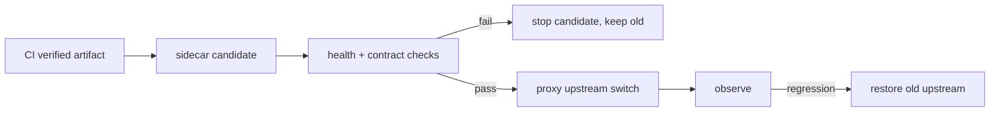

# 18｜容器化交付、迁移、旁路验证与回滚

Agent 发布不是把镜像换成新 tag。它同时改变 API、Worker、图状态、checkpoint schema、事件协议、索引 release、模型 policy 和数据库迁移。任何一个版本不兼容，都可能让正在运行的 Turn 无法恢复。安全交付的核心是候选环境、兼容迁移、旁路验证、受控切流和可执行回滚。

## 版本清单

一次 release 生成不可变 manifest：

```yaml
release: agent-2026-08-04.1
api_image_digest: sha256:...
worker_image_digest: sha256:...
frontend_asset_hash: ...
schema_migration: 042_add_turn_events
graph_schema: state-v3
policy_version: policy-17
knowledge_release: knowledge-2026-08-04
```

不要用 `latest` 表示生产版本，也不要让 API 和 Worker 自动拉取不同分支的代码。manifest 进入构建产物和部署记录，能回答“这次 Turn 使用了哪套代码/策略/知识”。

## 迁移必须向前后兼容

长运行 Turn 可能由旧 Worker 创建、新 Worker 恢复。数据库迁移遵循 expand/contract：先添加可选字段和兼容读取，部署代码同时写旧/新格式，回填并观察，确认旧版本不再运行后才删除旧字段。

```sql
-- expand：先增加可空列，不破坏旧 Worker
ALTER TABLE agent_turns ADD COLUMN policy_version_id text;

-- contract：观察窗口后，才收紧约束/删除遗留列
ALTER TABLE agent_turns ALTER COLUMN policy_version_id SET NOT NULL;
```

迁移脚本必须可审计、可重复执行或明确只执行一次；生产机不负责编译镜像。数据库备份要在迁移前创建并验证恢复可读性。

## 候选与旁路

新版本先以独立容器/端口启动，连接同一依赖网络但不接公网流量。旁路 Worker 必须避免重复后台任务，使用独立节点名和日志目录；候选的健康检查从容器内和代理侧分别执行。



候选验证至少包含：API status、首页、鉴权、创建 Turn 幂等、最小检索、SSE 重放、取消、checkpoint 恢复、评测 smoke 和数据库迁移状态。对于计费/真实副作用系统，使用临时用户和最小请求，禁止用真实用户做高成本验证。

## 健康检查不是 HTTP 200

`/health` 只能说明进程响应。Agent 候选还要检查：

- 数据库连接和 migration version；
- Redis 读写/脚本能力；
- 模型适配器配置存在但不泄露密钥；
- 图能 compile，checkpoint pool 能打开；
- release 可查询且 ACL 过滤正确；
- event sequence 能递增、SSE 能回放。

重型 embedding、OCR 或模型调用不要放进 liveness probe；它们应在旁路合同测试中运行并限制成本。

## 切流前保留回滚点

切流前记录旧 upstream、容器名、镜像 digest、数据库版本和备份路径。只修改代理 upstream，优先热加载；不要整体 `compose down` 或重启数据库/Redis。新容器保持可运行到观察期结束。

```bash
nginx -t
nginx -s reload
curl --fail https://example.com/api/status
curl --fail https://example.com/
```

命令只是示例，真实环境要替换为受控 secrets 和生产入口。切流后立即回归 API、首页、未授权访问、临时用户最小请求和 dashboard/metrics；不能只看代理返回 200。

## 回滚条件和动作

回滚触发条件要提前写成可判定阈值：健康检查失败、权限泄漏、事件序列异常、checkpoint 恢复失败率上升、P95 超预算、核心 API 5xx 超阈值。回滚优先改 upstream 指向旧容器，不删除新容器、不停依赖、不删除数据库数据。

```text
1. freeze new candidate traffic
2. restore upstream to old digest
3. nginx -t && reload
4. verify API status, homepage, authentication and stream
5. keep candidate logs and trace ids
6. decide whether database rollback is necessary
```

数据库 schema 若采用 expand/contract，通常无需回滚；若迁移不可逆，必须有经过演练的恢复方案。不要把“重新部署旧镜像”当作完整数据库回滚。

## 备份与恢复演练

备份完成不等于可恢复。按 RPO/RTO 演练：恢复数据库到隔离环境，验证 Turn、事件、claims、checkpoint、release 和索引关系；随机抽取已完成 Turn 重放；检查敏感数据权限。演练结果记录恢复耗时、缺失对象和改进项。

## 版本兼容的事件协议

客户端可能还在连接旧 SSE。事件 payload 增加可选字段，删除字段前等待客户端兼容；事件类型版本化或提供 schema version。Worker/API 混部时，旧 Worker 遇到新状态字段应安全忽略，不能把未知值当 failed。

```python
class EventEnvelope(BaseModel):
    schema_version: int = 2
    sequence: int
    event_type: str
    payload: dict[str, object]
```

## 供应链和权限

CI 使用锁定依赖和最小权限，构建 SBOM/签名（若组织支持），部署只拉取已验证 digest。SSH、镜像仓库和数据库凭证用 Secret/环境管理，不把它们写进 Compose、日志或博客。生产部署脚本只执行允许的更新路径，禁止在生产机编译。

## 验收脚本

```python
async def smoke(candidate: Candidate) -> None:
    assert await candidate.get("/api/status").status == 200
    turn = await candidate.create_turn(idempotency_key=random_key())
    duplicate = await candidate.create_turn(idempotency_key=turn.key)
    assert duplicate.id == turn.id
    events = await candidate.replay(turn.id, after=0)
    assert events[-1].type in {"turn.completed", "turn.failed"}
    assert await candidate.scope_leak_case() is False
```

浏览器侧还要验证搜索、侧栏、代码复制、深色模式和长文章布局；服务侧验证日志、metrics、trace、备份和回滚。所有截图放 `/tmp`，验收后删除，不进入仓库。

## 参考资料

- [Docker Compose production](https://docs.docker.com/compose/production/)：多服务生产配置与不可变镜像思路。
- [Kubernetes probes](https://kubernetes.io/docs/tasks/configure-pod-container/configure-liveness-readiness-startup-probes/)：liveness/readiness/startup 探针边界。
- [PostgreSQL backup and restore](https://www.postgresql.org/docs/current/backup.html)：备份、恢复与演练基础。
- [GitHub Actions security hardening](https://docs.github.com/en/actions/security-for-github-actions/security-guides/security-hardening-for-github-actions)：CI 最小权限和凭证治理。
- [OpenTelemetry deployment considerations](https://opentelemetry.io/docs/collector/deployment/)：观测采集器的部署与可靠性。

## 发布回滚演练记录

每次候选发布都应保存一份 runbook 结果：候选 digest、迁移前后版本、健康检查时间、最小请求的 Turn/事件序列、SSE 重连结果、备份校验、旧 upstream 和观察期指标。演练一次“切流后 checkpoint 恢复失败”，确认回滚只切代理、不删除新容器、不影响数据库和 Redis；演练一次“权限 Eval 出现失败”，确认候选无法晋级。

## 发布后的观察窗口

观察窗口内按 mode、policy 和 release 比较首事件、总延迟、终态分布、Claim 支持率、引用错误、队列深度、token 和错误码。新版本没有足够流量时，不能用“暂时没报警”证明稳定；应运行固定 synthetic case。窗口结束后只清理明确属于旧修复的临时制品，保留当前版本和至少一个已验证回滚版本。

## 交付完成的定义

发布完成不是代理 reload 成功，而是：新版本旁路健康、数据库可恢复、关键 Eval 通过、候选切流后公网回归通过、旧版本仍可回滚、临时数据已清理、指标进入观察期且文档记录完整。任何一项缺失都应保持旧 upstream，继续排查而不是把半成功写成成功。
