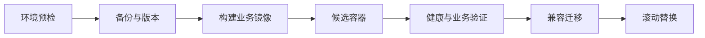

# 18｜从候选容器到失败回滚

代码构建成功，不代表新版本能读取数据库、连接队列、启动 Agent Worker 或完成一次知识问答。直接替换正式容器，失败时才发现迁移不兼容，会把验证压力转移给真实用户。

本篇沿一条已实现的更新脚本讲发布：预检、备份、生成不可变版本、启动候选、验证、迁移、滚动替换和回滚。具体服务器与项目名称不会公开。

## 先看发布阶段

任一步失败都停止继续，并保留当前正式服务。候选通过不等于已经切流，它只是证明新产物在旁路环境具备基本运行条件。

## 第一步：预检当前环境

脚本先确认代码更新可接受、关键配置存在、磁盘与依赖服务可用，正式容器和回滚信息能够识别。来源不明的容器、镜像和数据不会被自动清理。

代码更新只接受预期分支和可解释的快进关系，避免把服务器工作区中的未知差异覆盖掉。

## 第二步：创建可识别版本和备份

每次发布生成不可变版本标识，镜像、候选容器和日志都使用该标识关联。数据库变更前创建回滚备份并校验备份产物存在、大小与校验信息合理。

有备份文件不等于恢复可用。恢复流程仍需要定期演练，并记录恢复所需依赖和时间。

## 第三步：候选容器不接正式流量

新 API、后台管理和不同队列 Worker 以候选名称启动，不替换当前容器。候选使用隔离的任务队列或禁用会与正式实例冲突的调度行为。

健康检查至少覆盖 API 状态、静态页面、数据库连接和各类 Worker 响应。随后运行低风险业务冒烟，例如创建匿名测试回合、完成混合检索并得到唯一终态。

## 第四步：迁移要向前兼容

滚动发布期间可能同时存在新旧进程，因此迁移先增加新结构并保持旧代码可运行。删除字段、收紧约束和大规模数据回填拆到后续版本。

迁移执行失败时不继续替换容器。是否需要恢复数据库，要根据迁移是否提交和兼容性判断，不能机械地把备份直接覆盖在线数据。

## 第五步：逐个替换并持续验证

候选通过后，应用平面按角色逐个替换，每次都等待健康检查。切换过程中监控错误、终态缺失、队列积压和核心业务冒烟。

旧版本容器和镜像保留为明确回滚点，稳定后只保留当前版本与一个经过验证的上一版本，避免长期堆积不可识别产物。

## 故意让候选失败

| 注入故障 | 预期行为 |
| --- | --- |
| API 健康检查失败 | 不迁移、不切换，删除本次候选 |
| 某 Worker 无响应 | 停止发布，正式 Worker 保持运行 |
| 业务冒烟无终态 | 候选判定失败，不接流量 |
| 迁移失败 | 停止替换，分析事务状态 |
| 切换后回归失败 | 恢复上一版本并再次验证 |

回滚完成后仍要检查 API、首页、队列和一次最小知识问答，不能只看到容器状态为 running 就结束。

## 当前实现的边界

这是一条单环境容器发布流程，不声称实现跨地域容灾或零数据损失。数据库备份、对象存储和外部依赖各有独立恢复策略。

至此，系列从 Agent 概念走到知识准备、检索、编排、权限、恢复、评测和交付。回看任一篇时，都可以沿 turn ID、知识版本和证据 ID 找到它在整条链中的位置。

## 参考资料

- [Docker：Healthcheck](https://docs.docker.com/reference/dockerfile/#healthcheck)
- [PostgreSQL：Backup and Restore](https://www.postgresql.org/docs/current/backup.html)
- [Celery：Monitoring and Management](https://docs.celeryq.dev/en/stable/userguide/monitoring.html)
