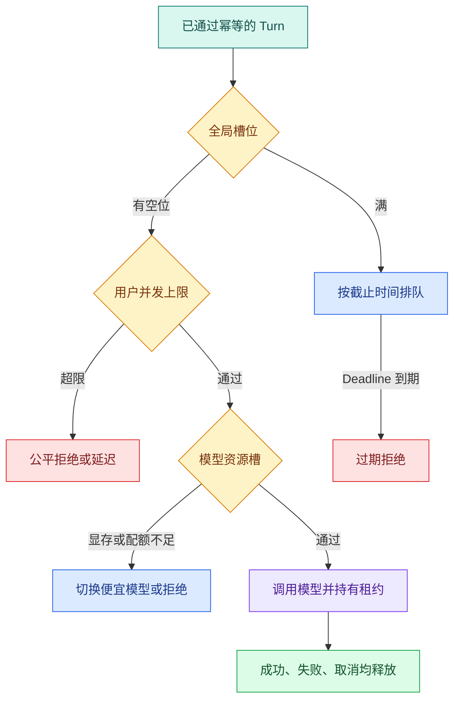

# 准入控制与模型资源槽：为什么请求要在执行前排队

模型服务的瓶颈通常不是 Web API，而是并发推理槽、供应商配额、GPU 显存或每分钟 token。没有**准入控制**时，流量一高，所有请求一起进入模型服务，排队时间变长，超时请求又触发重试，最终形成重试风暴。

准入（Admission）是在执行前决定“现在能不能接这个 Turn”。它同时考虑全局并发、用户公平、模型容量、供应商配额和剩余 Deadline。准入不是限流器的另一个名字：限流控制到达速率，准入还要管理已占用资源、等待队列和释放。

## 从四个维度画出资源边界



全局槽保护整个平台，用户槽防止单个租户占满资源，模型槽表达不同模型的真实容量，供应商槽则对应外部 RPM/TPM 配额。任何一层拒绝都要返回原因；“模型繁忙”与“用户超限”不是同一个运维问题。

## 排队不等于一定接受

一个进入等待队列的 Turn 仍然消耗内存、队列空间和用户耐心。准入时先计算 `deadline - now`，如果剩余时间小于预计等待时间，直接拒绝比**排队**更诚实。队列需要记录入队时间、优先级、模型、用户和截止时间，Worker 取出时再次检查 Deadline。

优先级也不能无限扩大：把所有请求标成高优先级会让公平策略失效。常见做法是按用户配额分层，再在同一层内使用最早截止时间优先（EDF）或公平轮转。模型路由可以把摘要、低风险问答降级到更便宜模型，但不能悄悄降低需要严格能力的任务。

## 速率限制、并发槽和资源预算分别限制什么

这三个机制经常同时出现，但状态不同：

| 机制 | 关注的量 | 典型算法 | 失败时观察 |
| --- | --- | --- | --- |
| **速率限制** | 时间窗口内到达次数或 Token | Token Bucket / Sliding Window | RPM/TPM 剩余额度、Retry-After |
| **并发槽** | 当前正在执行的数量 | Semaphore / Lease Counter | active、waiting、槽持有时间 |
| 加权**资源预算** | 每个请求消耗不同容量 | Weighted Semaphore / Reservation | 预留权重、实际消耗、归还差额 |

一个短分类请求和一个长上下文推理都占“一个并发”，资源成本却不同。可按模型、预计输入 Token、最大输出 Token 或 GPU 显存档位给请求分配权重。估算值来自受控规则，不能让客户端声称自己只需要一个小槽。

速率限制通过但并发已满时仍需排队；并发有空位但供应商 TPM 不足时仍不能调用。准入聚合器按固定顺序检查，并返回精确原因码，避免客户端对永久权限拒绝进行重试。

## 预留、结算和释放是一个状态机

模型调用前按最大允许输入/输出预留 Token 或成本预算，调用结束后用实际 usage 结算并归还差额。预留失败不调用模型；usage 缺失时按保守上限结算并记录供应商契约异常。

槽位状态可以是 `available -> reserved -> running -> released`。取消发生在 reserved 时直接释放；运行中取消先传播到供应商，随后无论对方是否及时停止，本地都要记录实际终态。分布式槽使用租约与 fencing token，防止旧 Worker 在租约被接管后重复释放或提交结果。

**资源释放**必须幂等。正常结束、异常、取消和 Worker 崩溃恢复最终都落到一次逻辑释放；重复释放不能把计数加到容量以上。

## 一个可释放的资源槽

下面的示例用 `asyncio.Semaphore` 模拟模型槽，并用 `asyncio.timeout` 限制等待和执行总时间。代码可直接运行，不需要安装模型 SDK。


下面把“一个可释放的资源槽”落成最小实现。代码关注“资源槽在进入执行前原子预留，异常、超时或正常完成都通过 finally 释放同一份占用”；输入从函数参数或上文定义的状态对象进入，关键分支负责校验或修改状态，返回值再交给后续调用。

```python
# 资源槽在进入执行前原子预留，异常、超时或正常完成都通过 finally 释放同一份占用。
from __future__ import annotations

import asyncio
from dataclasses import dataclass


@dataclass(frozen=True)
class AdmissionResult:
    request_id: str
    status: str
    reason: str


class ModelPool:
    def __init__(self, capacity: int) -> None:
        self._slots = asyncio.Semaphore(capacity)

    # 入口函数按固定顺序编排各步骤，具体校验和副作用仍由各自函数负责。
    async def run(self, request_id: str, work_seconds: float, deadline: float) -> AdmissionResult:
        try:
            async with asyncio.timeout(deadline):
                await self._slots.acquire()
                # 从这里进入可能失败的外部边界，下面只转换已经明确分类的异常。
                try:
                    await asyncio.sleep(work_seconds)
                    return AdmissionResult(request_id, "succeeded", "model_completed")
                finally:
                    self._slots.release()
        # 超时表示依赖没有在预算内返回；保留超时语义，不能伪装成空结果。
        except TimeoutError:
            return AdmissionResult(request_id, "rejected", "deadline_exceeded")


# 入口函数按固定顺序编排各步骤，具体校验和副作用仍由各自函数负责。
async def main() -> None:
    pool = ModelPool(capacity=1)
    results = await asyncio.gather(
        pool.run("a", work_seconds=0.05, deadline=0.2),
        pool.run("b", work_seconds=0.05, deadline=0.02),
    )
    for result in results:
        print(result)


if __name__ == "__main__":
    asyncio.run(main())
```

`ModelPool` 只拥有模型槽，不负责决定用户权限；上游准入层应先完成身份、预算和模型选择。`run` 用 `asyncio.timeout` 包住等待和执行，因此请求在排队时超时也会结束。获得槽后用 `try/finally` 释放，模型成功、异常或协程取消都会执行 `release`。第二个请求在第一个请求占槽时等待，若 0.02 秒内拿不到槽就得到 `deadline_exceeded`，不会继续占用队列。

这个信号量只适合单进程示例。多 Worker 需要 Redis、数据库或模型网关提供跨进程计数，并为槽位设置租约，防止进程崩溃后永久占用。租约超时回收时要结合模型调用的真实取消能力，不能仅释放计数而让后台请求继续消耗供应商额度。

## 用 pytest 验证超时与异常都会释放

将示例下面直接执行这段实现。为了能直接检查槽是否恢复，给 `ModelPool` 增加一个只用于测试的 `available` 属性，返回 `self._slots._value`；生产代码不应依赖 `asyncio.Semaphore` 的私有字段。下面的异步测试需要 `uv add --dev pytest pytest-asyncio`。

```python
# 两条失败路径都断言可用槽恢复，防止模型调用结束后留下永久并发泄漏。
import asyncio

import pytest

from model_pool import ModelPool


# 这个用例把时间推进到截止边界，确认超时保持独立错误语义并释放资源。
@pytest.mark.asyncio
async def test_waiting_request_expires_without_leaking_a_slot() -> None:
    pool = ModelPool(capacity=1)
    first = asyncio.create_task(pool.run("a", work_seconds=0.05, deadline=0.2))
    await asyncio.sleep(0)
    second = await pool.run("b", work_seconds=0.01, deadline=0.01)
    first_result = await first
    assert first_result.status == "succeeded"
    assert second.reason == "deadline_exceeded"
    assert pool._slots._value == 1  # 仅在测试里观察内部计数


# 这个用例主动取消运行，确认取消信号不会被重试或普通异常处理吞掉。
@pytest.mark.asyncio
async def test_cancelled_owner_releases_the_slot() -> None:
    pool = ModelPool(capacity=1)
    task = asyncio.create_task(pool.run("a", work_seconds=1.0, deadline=2.0))
    await asyncio.sleep(0)
    task.cancel()
    with pytest.raises(asyncio.CancelledError):
        await task
    result = await pool.run("b", work_seconds=0.0, deadline=0.1)
    assert result.status == "succeeded"
```

执行 `python -m pytest -q`。第一条测试让第二个请求在等待阶段过期，随后确认容量回到 1；第二条取消槽持有者，再用请求 `b` 证明槽可重新获取。若实现吞掉 `CancelledError` 或漏掉 `finally`，第二条会挂起或超时。跨进程集成测试应直接检查租约记录与 fencing token，不读取 Semaphore 私有状态。

## 多 Worker 的分布式准入边界

Redis 计数器只有在获取、租约和释放原子化时才可靠。可以用 Lua 或数据库条件更新实现 `used + weight <= capacity`，成功后写 `reservation_id`、owner、fencing token 和过期时间。心跳只能延长当前 token；过期回收后，旧 owner 的续租与释放都被拒绝。

队列调度器取任务时重新检查 Deadline、用户配额和模型健康。供应商返回 429 时更新共享冷却状态，避免每个 Worker 同时重试。Redis 不可用时是否快速拒绝、使用本地保守容量或切备用网关，应由风险和容量策略预先决定，不能默认放开无限并发。

## 释放、观测和降级

每次准入都应产生事件：`admission.accepted`、`admission.queued`、`admission.rejected`、`slot.acquired`、`slot.released`。指标至少包括当前槽位、队列年龄、用户拒绝数、模型等待时间、Deadline 过期数和降级次数。只看 HTTP 500 看不到“请求一直排队后超时”的问题。

降级必须是显式策略：例如首选模型槽满时转到同一安全等级的摘要模型，并在结果中记录 `fallback_model`；如果任务要求结构化输出或私有知识，找不到满足能力声明的模型就拒绝。绝不能为了让成功率好看而绕过租户上限或权限过滤。

## 实践检查表

1. 为全局、用户、模型和供应商分别写出容量来源。
2. 计算等待预算和执行预算，取二者共同的 Deadline。
3. 设计 accepted、queued、running、cancelled、succeeded、failed、expired 状态。
4. 为槽位获取和释放写正常、异常、取消三条测试。
5. 记录队列年龄和槽位占用，而不是只记录最终 HTTP 状态。
6. 明确每种模型的能力、成本和可接受降级目标。

## 常见问题

### 速率限制、并发槽和预算分别控制什么？

速率限制约束时间窗口内的请求或 Token 数，防止突发或配额耗尽；并发槽限制同时运行的工作，保护连接、内存和模型容量；预算限制单个 Turn 的时间、Token、工具调用和成本。三者互补：请求频率不高也可能因长任务占满并发，低并发的大批量请求也可能超过 TPM。准入顺序和事件要分开记录，排障才能判断是被限流、排队还是任务自身耗尽。

### 请求进入队列是否意味着最终一定会执行？

不是。排队只表示当前没有槽但请求尚可等待。调度器在真正领取前重新检查绝对 Deadline、用户配额、模型健康、权限和 Turn 终态；等待时间已耗尽或用户取消时直接进入 expired/cancelled，不再占槽。队列位置也不应无限承诺，因为高优先级或公平调度会变化。前端展示可解释状态，监控队列年龄而不只看长度，才能发现“都在排但没有执行”的故障。

### 为什么资源槽需要 Lease 和 fencing token？

单进程 Semaphore 可以靠 `finally` 释放，多 Worker 下进程崩溃可能永远不释放分布式计数。Lease 给预留设置过期与心跳，过期后新 owner 可接管；fencing token 让旧 owner 醒来后无法续租、释放或提交结果。只有当前 token 的条件更新成功才改变状态。单纯使用 TTL 没有 fencing，旧 Worker 仍可能覆盖新结果，形成双执行与容量错账。

### 模型槽满时可以自动切到任何便宜模型吗？

不可以。路由先检查能力声明：上下文长度、结构化输出、工具调用、数据地域、安全等级和任务质量要求都满足，才比较成本与延迟。降级模型、触发原因和功能限制写入 Turn 与 Trace；找不到合格备选时拒绝或排队。为了成功率切到不支持 Schema 或不允许私有数据的模型，会把容量问题变成契约或合规问题，属于错误降级。

### 槽位泄漏怎样发现和恢复？

观察当前占用、reservation 记录、owner 心跳、Lease 过期、Turn 终态和实际运行任务，定期对账“有槽无任务”和“有任务无槽”。过期回收使用条件更新并产生事件，旧 token 的释放请求被拒绝，不能简单把计数器减一。测试覆盖正常、异常、取消和进程崩溃，确认容量最终恢复且不会减成负数。Redis 故障时采用预先定义的保守策略，不能默认放开。

### 全局、用户和模型多层限额按什么顺序检查？

先做低成本且确定的身份、幂等、用户速率和请求有效性检查，再看全局/供应商冷却、模型能力与并发槽，最后入队。任何一层拒绝都返回稳定原因，不继续占用下游资源。实际预留可能需要原子检查多个维度，或使用分层 reservation 并在失败时补偿释放。Trace 记录每层决定与等待时间，避免所有 429 都归成一个“请求过多”。
