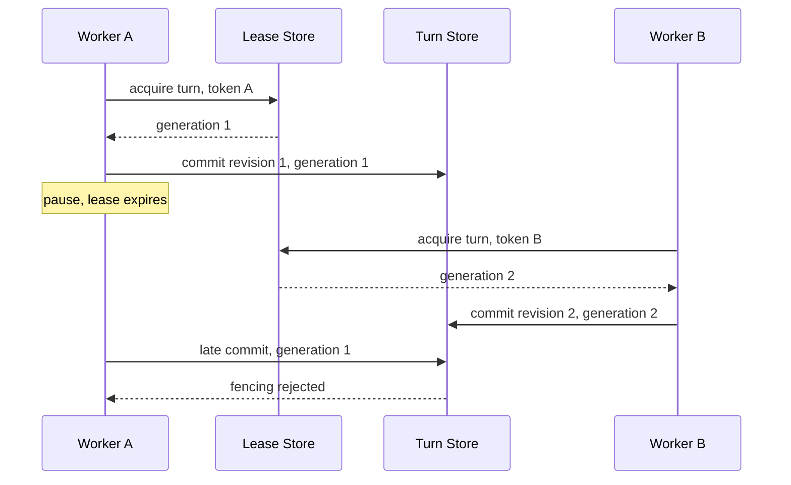

# Agent 准入控制、并发配额与 Lease

Agent 请求到达后，系统若先创建大量模型任务，再发现 GPU、模型配额或数据库连接已经耗尽，拒绝发生得太晚。另一类问题出现在 Worker 失联：恢复器看到 Turn 长时间未更新，于是启动第二个 Worker，原 Worker 随后恢复，两个执行者同时写状态、调用工具和发送答案。

这两类问题需要不同控制机制。**准入控制**决定一项昂贵工作是否可以开始，**容量 Lease**记录它暂时占用多少配额，**执行 Lease**记录当前哪个 Worker 有权推进一个 Turn。它们可以使用同一存储实现，却不能混成一个“锁”。

::: info 两种 Lease 的职责

- **容量 Lease**：Turn 占用全局、租户、用户或资源池中的一个名额。
- **执行 Lease**：某个 Owner Token 在一段时间内拥有该 Turn 的推进权。
- 容量 Lease 可以回答“还能接多少”，执行 Lease 回答“谁能写这个 Turn”。

:::

本文用研究型问答推演。用户连续提交两个深度任务，系统全局还能运行两个，但该用户只允许一个。第一个 Turn 获得容量后进入队列，Worker A 取得执行权；Worker A 失联并过期后，Worker B 才能接管，旧 Worker 的提交会被 Fencing 拒绝。

## 准入控制解决容量承诺

请求限流通常统计一段时间内的调用次数，例如每分钟一百次。Agent 准入关注的是当前占用：一次请求可能执行数分钟，消耗模型并发、数据库连接、内存、浏览器和工具配额。每秒只来一个请求也可能把系统占满。

准入在创建昂贵工作之前检查多层限制：

| 限制层 | 保护对象 | 常见决策 |
| --- | --- | --- |
| 全局并发 | Runtime 总容量 | 防止整个服务过载 |
| 租户并发 | 多租户公平性 | 防止单租户占满全部资源 |
| 用户并发 | 单用户体验与滥用 | 防止重复点击创建大量任务 |
| 模式并发 | 深度研究、普通问答 | 给高成本模式单独配额 |
| 资源池并发 | 模型、浏览器、GPU、工具 | 按真实瓶颈分配 |

决策返回稳定原因，例如 Global Limit、User Limit、Resource Exhausted 或 Deadline Expired。客户端据此展示等待、降低模式或稍后重试，不能解析一段自然语言错误。

准入不由模型决定。用户可以请求 Deep Mode，Runtime 根据身份、策略、Deadline 和当前容量确认。模型不能通过 Tool Call 增加并发上限，也不能把普通 Turn 变成不受限后台任务。

## Rate Limit、Semaphore、Queue 与 Lease 的边界

**Rate Limit** 限制一段时间内到达次数，适合 API 防滥用，不知道任务何时结束。**Semaphore** 限制单进程同时进入临界区，进程退出后状态消失。**Queue** 保存待执行工作并提供调度顺序，不保证同一业务 Turn 只被一个 Worker 执行。**Lease** 带过期时间，持有者失联后允许回收。

生产 Runtime 常把它们组合：入口 Rate Limit 过滤突发，请求通过业务幂等创建一个 Turn，Admission 分配容量，Queue 负责异步交付，Execution Lease 决定 Worker 所有权。每层使用不同身份和失败语义。

队列消息的 Visibility Timeout 也不是执行 Lease。它决定消息何时重新投递，可能因为 Broker 延迟或 Worker 未 Ack 而重复；执行 Lease 绑定 Turn 与 Owner Token，重复消息到达时只有一个 Worker 能取得所有权。把 Celery Task ID 或消息 Ack 当业务锁，恢复任务和手动重试会绕过它。

分布式锁如果没有 TTL，持有者崩溃后永久阻塞；只有 TTL 又没有 Owner Token，旧 Worker 可能删除新 Worker 的锁。Lease 同时要求到期、所有者校验和续约协议。

## 容量 Lease 原子分配多层配额

容量 Lease 保存 Turn ID、作用域、Owner User、Resource Class 和 Expires At。申请时先删除过期记录，再检查各层计数，最后同时写入所有集合。检查与写入必须原子，否则两个 API 实例会同时看到空位并都成功。

使用 Redis 时，可以用有序集合把 Turn ID 作为成员、过期时间作为 Score。全局集合和用户集合在同一 Lua Script 中清理、计数与写入。数据库实现可以使用配额行锁、条件更新和唯一约束。关键不是具体存储，而是“多层限制要么全部获得，要么全部不获得”。

同一 Turn 重复申请是幂等续租，不能占两个名额。作用域内已有全局记录却没有用户记录，说明上次写入不完整；脚本先清理残缺成员再重新裁决，不把一半状态当有效 Lease。

准入记录还要保存申请时确认的身份快照，释放时不能重新读取“当前用户”来猜所属集合。Turn 被管理员转交、用户会话失效或重试请求缺少原身份时，运行时仍按 Admission ID 中的租户、用户和资源类别释放。否则全局集合已经删除，原用户集合却留下幽灵名额，或者同名 Turn 被另一个作用域误删。身份快照不需要交给模型，也不随对话内容变化。

容量 Lease 的 TTL 要覆盖续租间隔和短暂调度延迟，不能覆盖整个业务 Deadline 后永不更新。Worker 或 Runtime 定期续租；终态、取消和明确失败主动释放。进程崩溃时 TTL 提供最终回收。

过期回收发生在申请和后台清理两个位置。只依赖后台定时任务，清理延迟会让明明空闲的系统持续拒绝；只在申请时清理，长期无新请求的监控计数会包含过期成员。两个路径都使用相同过期规则。

## 准入应发生在昂贵副作用之前

最早的认证、Schema 校验和幂等查询可以在准入前执行，因为成本低且能复用已有 Turn。首次创建昂贵 Turn 时，先尝试 Admission，再持久化业务对象、消息与首个 Event，或在事务失败时释放名额。

顺序需要处理两个缝隙。先创建 Turn 后申请容量，拒绝时数据库会堆积无法执行的 Pending 任务；先申请后创建 Turn，数据库提交失败会暂时泄漏容量。常见做法是 Admission ID 绑定预生成 Turn ID，后续创建失败执行幂等 Release，TTL 兜底。

若产品支持排队，拒绝不等于丢弃。Queue Admission 与 Execution Admission 分开：入口按最大排队深度、用户队列和 Deadline 决定能否排队；Worker 准备执行时才占运行容量。不能让每个排队任务都提前持有执行名额。

排队任务的 Deadline 继续流逝。轮到执行时已经过期，直接 Expired 并清理消息，不申请容量。预计等待时间只是提示，不承诺准确顺序；优先级、租户公平和资源类别会改变调度。

## 多种资源不能只折算成一个并发数

单一并发上限适合起步，却会掩盖任务之间的资源差异。普通问答可能只占一个模型请求，研究任务同时占模型、检索、浏览器和较长的数据库连接；文档解析主要消耗 OCR 与对象存储带宽。若它们都从同一个计数器扣一格，轻任务会被重任务挤住，重任务也可能在取得全局名额后卡在某个已耗尽的资源池。

一种做法是给任务声明 Resource Class，由确定性策略展开成资源需求。`chat` 需要一个模型名额，`research` 需要模型、检索和浏览器，`ingestion` 需要解析与 Embedding。这个声明由入口根据已验证的 Mode 生成，模型不能临时给自己增加浏览器或高成本模型配额。

多资源申请会遇到部分占用。Turn 先拿到模型名额，再等待浏览器；另一个 Turn 先拿浏览器，再等待模型，两边都不释放就形成死锁。生产实现通常选择以下一种协议：

- 在同一个原子操作里判断并分配所有资源，任一资源不足就一个都不占。
- 按固定顺序申请，失败后释放已经取得的资源，并在带抖动的等待后重试。
- 先写短期 Reservation，所有资源齐备后再转换为活动 Lease，未转换的预留很快过期。

第一种协议的一致性最容易解释，但所有资源必须位于同一协调存储。第二种可以跨存储，代价是回滚和重试流量。Reservation 能减少反复争抢，却多了一种需要监控和清理的状态。选择哪一种取决于资源是否同库、任务成本和允许的等待时间，不能只比较实现代码多少。

资源释放也按资源向量执行。某个工具阶段结束后是否提前归还浏览器名额，要看后续计划是否还会使用它。过早释放会反复获取，始终占用又降低利用率。阶段边界明确的工作流适合按阶段释放；模型可能随时再次调用工具的 Agent，更适合保留短 Lease，并在长时间无该类动作时主动降配。

::: warning 容量 Lease 不是费用授权

拿到并发名额只说明当前系统有能力执行，不代表用户有预算、模型有权限或工具允许该动作。额度、ACL、策略与人工审批仍在各自的确定性门禁中判断。

:::

## 排队和拒绝共同形成背压

容量满时总是入队，看起来比拒绝友好，实际会把过载藏进等待时间。只要到达速度持续高于处理速度，队列就会一直增长，任务轮到时 Deadline 已经耗尽，数据库和 Broker 还要保存大量注定不会执行的消息。

入口需要同时限制运行中数量和等待数量。排队决策至少检查用户等待数、租户等待数、资源类别、剩余 Deadline 与队列年龄。一个只剩十秒、历史运行通常需要数分钟的任务，不该进入深度队列。这里不必预测精确完成时间，但要拒绝明显无法在期限内开始的请求。

拒绝响应应给出稳定错误码、可否重试和最小提示。`user_limit` 可能是同一用户重复提交，客户端可以展示已有 Turn；`global_limit` 表示服务整体繁忙，可以返回带上限的 Retry After；`resource_exhausted` 应指明资源类别但不泄露内部拓扑。客户端退避要有随机抖动，否则同一批请求会在固定时间再次冲击入口。

有队列时，调度策略决定公平性。严格优先级会让低优任务长期等不到，纯 FIFO 又会让一个长任务挡住大量短任务。可采用租户轮转、每类资源独立队列和等待时间加权，但策略必须保留一个不变量：已经获得执行 Lease 的 Turn 不因队列重新排序而换 Owner。重排发生在执行前，运行中的抢占另有暂停、Checkpoint 和恢复协议。

背压还要传到上游。API 已经拒绝深度模式时，前端不能自动改成多次普通请求来绕过限制；批处理调用方也不能无上限重试。服务可以明确提供降低模式、减少文件数或稍后执行的选项，最终选择仍由用户或业务规则做出。

## 执行 Lease 保证单 Turn 单写者

Worker 收到任务后，先以随机、不可预测的 Owner Token 申请 `execution:{turn_id}`。设置采用 `NX + TTL` 或数据库条件插入。已有有效 Lease 时，重复任务退出或延迟，不并行执行。

Owner Token 不是 Worker 名称。一个 Worker 进程可以处理多个 Turn，同一 Turn 的新 Attempt 也需要新 Token。Token 只在受控日志与存储中出现，模型、用户和工具参数看不到。

续租和释放都比较 Token。Worker A 的 Lease 过期，Worker B 取得新 Lease 后，A 迟到执行 Release 不会删除 B 的锁。简单的 `DEL key` 没有所有者判断，会制造一个短暂但危险的无锁窗口。

Execution Lease 还应产生单调 Fencing Generation。每次新所有者接管，Generation 增加。Worker 提交 Checkpoint、终态和副作用账本时带 Generation，持久层拒绝旧 Generation。只靠 Redis Lock 阻止不了暂停进程：A 在 Lease 过期前读到数据，停顿很久，B 接管并写入，A 恢复后仍可能执行已经开始的 SQL。



Fencing 与乐观 Revision 互补。Generation 判断提交者是否仍有资格，Revision 判断它基于的状态是否仍是当前版本。两个条件同时满足才能写入。

Generation 必须进入权威写路径，放在 Worker 内存里没有作用。以 Checkpoint 为例，更新条件可以同时比较 `turn_id`、`expected_revision` 和 `lease_generation`。受影响行数为零时，Worker 重新读取状态，区分 Revision 冲突、所有权过期和 Turn 已终态，不能把它们统一重试。

外部副作用不能只靠数据库 Fencing。发送邮件、创建工单或调用第三方写接口时，请求可能已经离开本服务，随后本地提交才被拒绝。工具调用需要稳定 Action ID，并把这个 ID 交给支持幂等键的下游；下游不支持时，先写 Outbox，再由单独执行器按 Action ID 发送和记录结果。Lease 解决谁可以发起动作，幂等记录解决重复动作是否会再次生效。

只读工具也不意味着可以忽略所有权。旧 Worker 的检索不会直接改业务数据，却会继续消耗模型和网络资源，还可能把过时结果带回上下文。续租失败后停止派发新工具；已经在途且无法取消的读取可以等待结束，但其结果不得再提交到 Turn。

## 续租同时维护容量与执行权

活动 Worker 在 Lease 周期的一部分到达时续租，给网络抖动留余量。容量 Lease 与执行 Lease 最好在同一维护循环更新，但它们失败后的含义不同。

容量续租丢失时，Runtime 可以重新申请配额。若全局或用户容量已被别人占用，当前 Turn 不能悄悄超额继续，应进入 Graceful Stop 或短暂宽限，并记录 Admission Lost。执行 Lease 续租失败更严重，Worker 立即停止产生新动作，因为它可能已经失去单写者资格。

维护循环与业务执行并发运行。Lease Task 异常时取消 Execution Task，等待其清理，再形成类型化失败。业务 Task 先完成时停止续租循环并主动释放。两个 Task 的异常不能互相吞掉。

续租间隔不能等于 TTL。调度暂停、GC、事件循环阻塞和网络重试会错过窗口。常用策略是在 TTL 的三分之一或一半续租，并对抖动做随机化，避免所有 Worker 同时访问存储。

续租成功只证明 Lease Store 接受请求，不证明业务有 Progress。Watchdog 和 Stall Detector 仍分别观察阶段空闲与忙碌无进展。不要让 Lease Heartbeat 更新业务 `last_progress_at`。

### TTL 由检测速度和误过期风险共同决定

TTL 太短，进程短暂停顿或一次网络重试就会失去所有权；TTL 太长，崩溃后的容量和 Turn 要等很久才能接管。可以先测事件循环延迟、存储往返时间与正常续租抖动，再为连续数次续租机会留出空间。没有这些观测数据时，直接照搬固定秒数只是在猜。

假设续租间隔为 `R`，单次续租允许的超时为 `T`，还要容忍 `N` 次连续失败，那么 TTL 至少覆盖 `N × (R + T)` 与可接受的调度暂停。这个关系用于检查配置是否自洽，不是通用推荐值。高风险写任务通常宁可更快停止，长时间只读任务可以接受更宽的 Lease。

续租计划加入小范围随机抖动，避免部署重启后所有 Worker 同时请求 Redis。抖动不能把最晚续租推过安全窗口。Worker 还要使用单调时钟安排本地定时，写入共享过期时间时再使用协调存储接受的时间口径，防止机器时钟偏差直接改变 Lease 长度。

配置变更也有兼容问题。若新版本把 TTL 从长改短，旧 Worker 仍按旧间隔续租，切换后可能大批过期。滚动升级前先让续租间隔兼容新 TTL，完成排空或观察一个最长 Lease 周期，再收紧服务端配置。

## 失联接管先确认旧所有者失效

Recovery Scanner 找到长时间未更新的 Running Turn 后，先查询 Execution Lease。Lease 仍有效时标记 Active，不重复投递；Lease 已过期才发送稳定 Task ID 的恢复消息。

新 Worker 取得 Generation 后读取 Turn、Checkpoint、Deadline、取消状态和版本。通过恢复门禁才继续。旧 Worker 即使仍在外部工具中运行，回写时也会被 Fencing 拒绝；副作用工具还要用 Action ID 幂等，Lease 不能撤销已经发出的网络请求。

网络分区需要保守处理。Scanner 访问 Lease Store 失败时不能假设 Lease 不存在；新 Worker 也不能在无法取得原子所有权时执行。继续等待会降低可用性，盲目双跑会破坏一致性。高风险执行默认失败关闭。

接管事件记录旧 Lease 的过期时间、新 Owner、Generation、Checkpoint Revision 和剩余 Deadline。排障能看出是正常恢复、存储抖动还是 Worker 长暂停。

## Redis 不可用时先定义一致性选择

准入与执行 Lease 都依赖共享存储。Redis 不可用时，有三种策略：拒绝新昂贵任务、降级到更小的本地容量，或转移到数据库协调。不能在异常处理里临时选择。

拒绝新任务最安全，已有 Worker 可以在本地宽限内完成安全点，但执行 Lease 无法续约后不能继续高风险副作用。数据库回退只有在提前实现同等原子性、Owner Token 和 Fencing 时才成立；简单查一张表不等价。

本地 Semaphore 降级适用于只读、低风险且单实例流量被隔离的模式。多实例各自拥有本地上限会放大全局容量，也无法阻止同 Turn 双写，不能标成完整服务。

Redis 恢复后，不能直接相信旧 Key。过期成员先清理，活动 Turn 重新对账，Execution Owner 以权威 Generation 和 Lease 为准。故障期产生的降级任务保留 Mode 和原因，指标单独统计。

取消信号可以使用 Redis 提供快速路径，数据库保存权威状态。它与执行 Lease 不同：快速取消 Key 丢失时 Worker 回退数据库，Execution Lease 丢失时 Worker 已经失去单写者证明，不能只靠数据库里的 Running 推断仍可继续。

## 用最小实现观察配额和所有权

下面的示例用内存字典模拟容量 Lease、执行 Lease 和 Fencing Generation。它没有分布式原子性，只用于验证状态语义；生产实现需要 Redis Script 或数据库事务。

<<< ../../examples/ai-agent/admission_lease.py

`acquire_capacity()` 先回收过期项，再检查 Deadline、重复 Turn、全局限制和用户限制。同一 Turn 重复申请只续期，不增加计数。`acquire_execution()` 为新 Owner 分配递增 Generation。

`renew_capacity()` 校验 User，`renew_execution()` 校验 Owner Token。两个释放方法同样分开，错误 Worker 不能删除新的执行 Lease，也不会间接改变容量状态。`can_commit()` 比较 Owner 和 Generation，旧 Worker 在接管后无法提交。

内存示例的容量和执行回收在一个方法里，真实系统可以使用不同 TTL。示例也没有 Queue、数据库 Revision 和外部副作用，需要在集成测试中补齐。

## 沿一次准入、失联和接管推演

系统全局限制为 2，同一用户限制为 1。User A 提交 Turn 1，Admission 清理过期成员后发现两层都有空位，写入容量 Lease，API 创建 Turn 并投递队列。

User A 立刻提交 Turn 2。幂等查询确认它是新意图，但用户集合已有 Turn 1，返回 User Limit。User B 的 Turn 3 仍可获得另一个全局名额，说明用户限制不会阻塞其他用户。

Worker A 领取 Turn 1，以 Owner A 取得 Execution Generation 1，开始续租两种 Lease。运行一段时间后 Worker A 失去调度，TTL 到期。Scanner 发现 Turn 长时间未更新且 Execution Lease 已过期，投递恢复任务。

Worker B 取得 Owner B 与 Generation 2，读取 Checkpoint 继续。Worker A 随后恢复，它保存的 Token 和 Generation 仍是旧值。Renew 返回 False，Checkpoint 条件更新也被 Fencing 拒绝。A 停止工具并清理本地资源，但不能释放 B 的 Lease。

Worker B 完成验证，提交 Completed 与终态 Event，然后用 Owner B 释放 Execution Lease，用 User A 和 Turn 1 释放容量 Lease。重复 Release 是 No-op。Turn 2 再次申请时获得用户名额。

| 时刻 | Capacity | Execution | 可提交者 | 结果 |
| --- | --- | --- | --- | --- |
| T1 | Turn 1 / User A | 无 | 无 | 等待 Worker |
| T2 | Turn 1 / User A | Owner A / Gen 1 | A | 正常运行 |
| T3 | 过期待回收 | Lease 过期 | 无 | 扫描候选 |
| T4 | Turn 1 / User A | Owner B / Gen 2 | B | 恢复运行 |
| T5 | 已释放 | 已释放 | 无 | Completed |

## 失败传播保留发生层

**Global Limit** 与 **User Limit** 是预期拒绝，不写 Failed Turn，也不自动无限重试。支持排队时形成 Queued 状态和 Deadline，不支持时客户端稍后重试新意图。

**Turn 创建失败**发生在容量申请之后，API 立即释放 Admission ID。释放失败由 TTL 回收，并写 Leakage 指标；不能因为 Release 异常掩盖原数据库错误。

**队列投递失败**时，Turn 已持久化但没有 Worker。Outbox 或 Dispatcher Retry 使用 Turn ID 幂等投递，容量策略决定保留还是释放。直接创建第二个 Turn 会丢失原版本快照。

**Execution Lease Busy**表示另一个 Worker 已拥有 Turn。重复消息 Ack 或延迟，不标业务失败。持续 Busy 超过 Deadline 由 Watchdog 诊断，不在消费者里抢锁。

**Lease Lost** 时当前 Worker 停止新动作，保存能安全提交的诊断，主执行进入可恢复失败或让新 Owner 接管。旧 Owner 不能自行重新申请并继续原内存状态，必须走完整恢复门禁。

**Release Owner Mismatch**不删除锁，记录安全告警。它可能来自迟到 Worker、Token 传错或并发 Bug，不能通过无条件 Delete“修好”。

**Deadline Expired**在容量申请前拒绝，在 Worker 领取后标 Expired。过期 Turn 不继续占配额，终态与释放顺序可重复执行。

## 测试覆盖原子性与故障缝隙

新增单元测试验证全局和用户拒绝原因不同、同 Turn 重复申请不重复计数、过期容量先回收、容量与执行权分别释放、错误 Owner 不能续租或释放、接管后旧 Generation 不能提交，以及过期 Turn 不分配容量。

运行命令如下：

```bash
PYTHONDONTWRITEBYTECODE=1 PYTHONPATH=examples/ai-agent \
  python3 -m unittest examples/ai-agent/tests/test_admission_lease.py
```

共享存储集成测试要并发发起超过限制的申请，断言成功数不超过上限，全局与用户集合一致。顺序调用无法证明检查与写入原子。

Execution 测试让两个 Worker 同时 `SET NX`，只有一个成功；过期后第二个取得新 Generation；第一个的 Renew、Release 和 Turn Commit 都失败。测试要在数据库提交层验证 Fencing，不只验证锁 Key。

故障注入覆盖 Redis 在 Acquire、Renew 和 Release 三个位置不可用。每个位置使用预先定义的策略，资源最终通过 TTL 或对账回收。恢复后检查没有幽灵名额和双 Owner。

生命周期测试从 Admission 成功后分别在 Turn Insert、Event Commit、Queue Dispatch、Worker Start 和 Terminal Commit 处崩溃，确认每个缝隙都有唯一恢复路径。最终全局、用户和执行集合都没有残留。

## 容量规划、公平性与运维

全局并发不是 CPU 核数的简单倍数。模型连接、数据库、向量检索、浏览器、内存和供应商配额可能分别成为瓶颈。按 Resource Class 建立容量池，深度研究与普通问答不必争同一上限。

用户上限保护公平，但固定值会让企业批处理受限。Policy 可以按租户套餐、任务模式和时间段配置，仍要保留全局上限。优先级调度使用 Aging 防止低优先级长期饥饿，不能让高优任务无限插队。

指标包括准入请求、Allowed、各类 Rejected、活动容量、用户分布、Lease Renew 失败、Owner Mismatch、Execution Busy、接管、Fencing Reject 和过期回收。Turn ID 与 User ID 不进入高基数标签。

容量告警对应可执行动作。Global Limit 持续满载可以扩容、降低高成本模式或启用排队；User Limit 大量触发可能是前端重复提交或合理批处理需求；Renew 失败集中出现指向共享存储或事件循环阻塞。

运行手册从 Turn ID 查看 Capacity Lease、Execution Owner、Generation、Deadline、Checkpoint 和 Queue Message。只在确认无活动 Owner、Turn 非运行或已过期时手动回收；直接删除所有 Lease 会同时释放正常任务。

版本升级要兼容 Key Schema、TTL 与 Generation。旧 Worker 不认识新 Token 格式时采用版本隔离和排空，不能让新旧版本共同写同一 Lease。配置变更通过 Canary，观察拒绝率、队列延迟和接管异常。

准入系统不可用时，服务的降级声明必须准确。拒绝新深度任务、保留状态查询和取消接口，比假装正常接受后让任务永久排队更可控。

设计评审时依次问：容量在昂贵工作前还是后分配，多层配额是否原子，同 Turn 重试会不会重复占位，谁能续租和释放，Lease 失效后旧 Worker 怎样被 Fencing，存储不可用时选择一致性还是可用性。每个答案都有字段、所有者和并发测试，准入与 Lease 才形成完整控制链。
