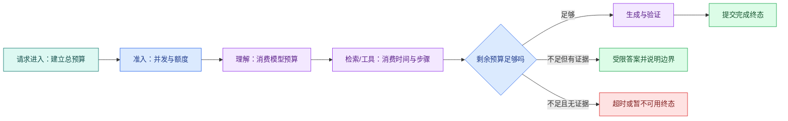

# Agent 成本与可靠性：Deadline、路由、重试和降级

一个 Agent 设置了 30 秒 HTTP 超时，内部却有两次模型调用、三个工具，每个工具又能重试两次。如果每一步都重新获得 30 秒，用户等待时间可能远超入口配置。

可靠运行要在请求开始时确定总预算，再让每个节点消费剩余时间、Token、工具次数和并发槽。成本治理也从这里开始：不是月底看账单才限额，而是在调用发生前决定这次任务允许花多少资源。

## Timeout 与 Deadline 不是同一个东西

**Timeout** 常表示某一步最多运行多久，例如一次数据库查询最多 2 秒。**Deadline** 是整轮任务不得超过的绝对时间点。

请求开始时计算：

```text
deadline = started_at + total_budget
remaining = deadline - now
node_timeout = min(node_default_timeout, remaining - finalize_reserve)
```

`finalize_reserve` 为保存终态、关闭连接和发送最后事件预留时间。每次重试重新计算 remaining，不能重新领取完整预算。



正常路径在预算内完成生成和验证。预算不足时不一定都报技术错误：已有可靠证据时可以返回明确受限的答案；没有证据时进入超时或暂不可用终态，不能用模型常识补齐。

## 请求开始前先做准入

准入控制回答“现在是否允许开始这项工作”。它可以同时检查：

- 全局和租户并发上限；
- 用户级速率限制；
- 模型供应商配额；
- 高成本模型可用额度；
- 队列年龄和 Worker 容量；
- 请求最大上下文与文件大小；
- 当前服务是否处于降级状态。

限流控制单位时间请求数量，并发槽控制同时执行数量，预算控制一次任务最多消耗。三者不是同一个开关。队列已经严重积压时继续接收所有任务，会让每个请求都在 Deadline 前过期。

## 模型路由需要能力声明

“简单问题用小模型，复杂问题用大模型”太模糊。路由表应记录可验证能力：

| 能力 | 路由要检查什么 |
| --- | --- |
| 上下文 | 最大输入与输出、目标语言 |
| 结构化输出 | 支持方式、Schema 限制、失败语义 |
| Tool Calling | 并行调用、参数 Schema、流式事件 |
| 多模态 | 支持的文件与媒体类型 |
| 延迟与配额 | 区域、限速、并发、当前健康 |
| 数据边界 | 数据处理区域、保留和合规要求 |

业务层提交的是能力需求，例如“需要工具调用、至少某上下文、只允许某数据区域”。网关根据声明选择供应商和模型，返回统一结果与稳定错误。不要让业务代码散落供应商专属字段。

路由失败时要知道是“没有符合能力的模型”，还是“符合模型暂时不可用”。前者需要改变需求或配置，后者才可能在预算内切换供应商。

## 哪些失败值得重试

重试适合短暂且调用可安全重复的失败：连接重置、明确限流、暂时不可用。以下情况通常不应原样重试：

- 参数或 Schema 错误；
- 权限拒绝；
- 内容安全拒绝；
- 没有检索证据；
- 请求本身超过上下文；
- 未知提交状态的写操作；
- 整轮 Deadline 已不足。

只读模型调用也要有限重试，因为每次都会增加费用和延迟。退避等待同样消费 Deadline；供应商返回建议等待 60 秒，而本轮只剩 5 秒时，应停止而不是照等。

## 幂等边界决定能否安全恢复

模型生成没有外部副作用，重复调用主要影响费用与结果波动。写工具可能已经创建工单、发送消息或扣费，网络超时只表示调用方没收到结果，不表示操作没发生。

写操作需要业务幂等键、提交状态查询和清晰的“未开始 / 已提交 / 结果未知”语义。取消也不会让已经提交的外部动作自动回滚。知识 Agent 默认只读，可以显著降低这一类恢复复杂度。

## 取消要沿整条链传播

取消可能来自用户主动操作、客户端断开、上游服务停止或 Deadline 到达。应用应：

1. 把 Turn 标记为取消请求；
2. 在节点边界检查标记；
3. 通过 AbortSignal、Context 或 SDK 取消能力传给模型、HTTP 与数据库；
4. 丢弃取消后到达的迟到结果；
5. 保存 cancelled 终态与已发生副作用摘要。

仅用 `Promise.race` 停止等待，不会自动停止底层请求。Trace 如果显示调用方已经结束而下游仍长期运行，说明取消传播不完整。

## 降级不是偷偷换一个更差答案

可解释降级需要提前设计输出边界：

| 故障 | 可选降级 | 用户应该知道什么 |
| --- | --- | --- |
| 重排不可用 | 使用融合后候选 | 相关性可能下降 |
| 高能力模型不可用 | 选择满足最低能力的备选 | 结构或质量限制 |
| 一个检索通道失败 | 使用其余通道 | 哪类资料可能缺失 |
| 流式连接中断 | 事件重放或轮询终态 | 已完成进度不会丢 |
| 预算不足 | 基于已有证据受限回答 | 未继续研究的部分 |
| 无可靠证据 | 拒答 | 不使用模型常识填充 |

小模型如果不支持所需 Tool Calling 或上下文，就不是合法降级目标。降级后的结果也要经过权限、引用和输出验证。

## 成本要拆到一次 Turn

一次知识 Agent 成本可能包括：

- 理解和生成的输入、输出 Token；
- Embedding 与重排调用；
- MCP/外部 API；
- 队列、数据库和对象存储；
- 自托管推理的 GPU 时间与闲置容量；
- Trace、日志和评测存储。

托管模型可以按供应商价格换算，价格随时间和区域变化，应记录计价版本。自托管不能只用“显卡价格除请求数”，还要考虑利用率、显存冗余、功耗、节点、网络、运维和失败容量。

工程决策更适合先记录稳定用量：每 Turn 的模型调用数、输入/输出 Token、工具次数、检索候选、总时长和资源时间，再用当前价格计算费用。

## 预算怎样分给不同阶段

预算不是平均分配。理解节点通常短，检索与工具受外部依赖影响，生成需要输出空间，验证和提交需要预留。可以按任务类型维护策略：

```text
总 Deadline：
终态提交预留：
理解最多调用 / Token / 时间：
检索通道与候选上限：
工具总步数、单工具超时与重试：
生成输入上下文和输出 Token：
验证与有限修复次数：
并行分支上限：
可使用的模型能力等级：
```

运行时每个节点读取剩余预算并提交真实用量。策略变更进入 Eval，避免成本下降却破坏关键问题的证据完整性。

## 用故障表决定动作

| 错误类型 | 是否重试 | 是否切换 | 终态或降级 |
| --- | --- | --- | --- |
| 参数错误 | 否，最多修正一次 | 否 | 澄清或调用失败 |
| 权限拒绝 | 否 | 否 | denied |
| 供应商限流 | Deadline 内有限 | 可选健康备选 | 暂不可用 |
| 模型超时 | 剩余预算足够时有限 | 备选满足能力才切 | 受限回答或超时 |
| 检索空结果 | 改写查询一次，不原样重试 | 不扩大范围 | insufficient |
| 工具返回契约错误 | 通常否 | 可切稳定实现 | contract_violation |
| 用户取消 | 否 | 否 | cancelled |

把这张表编码进 Runtime 和测试，不要让模型根据错误字符串自由决定是否无限尝试。

## 带到工作的预算与可靠性卡

```text
任务类型与最低模型能力：
总 Deadline 与终态预留：
全局 / 租户 / 用户准入条件：
模型、工具、Token、并行分支上限：
稳定错误枚举：
每类错误的重试次数、退避和切换条件：
写工具的幂等键与未知结果处理：
取消信号怎样传到模型、HTTP、数据库和 Worker：
降级后的功能与质量边界：
无证据时的终态：
每 Turn 记录哪些稳定用量：
候选策略怎样进入 Eval 与 Trace：
```

最后一篇完整案例会把安全、Eval、Trace 和预算重新放回同一条知识 Agent 执行链，但每项能力都引用这里已经讲清的职责，不再用一个段落代替实现。
