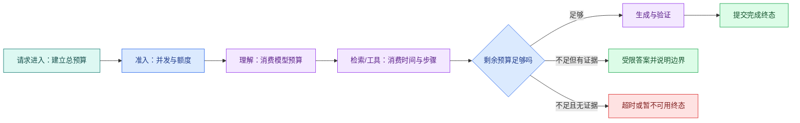

# Agent 成本与可靠性：Deadline、路由、重试和降级

一个 Agent 设置了 30 秒 HTTP 超时，内部却有两次模型调用、三个工具，每个工具又能**重试**两次。如果每一步都重新获得 30 秒，用户等待时间可能远超入口配置。

可靠运行要在请求开始时确定总预算，再让每个节点消费剩余时间、Token、工具次数和并发槽。成本治理也从这里开始：不是月底看账单才限额，而是在调用发生前决定这次任务允许花多少资源。

## Timeout 与 Deadline 不是同一个东西

**Timeout** 常表示某一步最多运行多久，例如一次数据库查询最多 2 秒。**Deadline** 是整轮任务不得超过的绝对时间点。

请求开始时计算：

```text
deadline = started_at + total_budget
remaining = deadline - now
node_timeout = min(node_default_timeout, remaining - finalize_reserve)
```

`finalize_reserve` 为保存终态、关闭连接和发送最后事件预留时间。每次重试重新计算 remaining，不能重新领取完整预算。



正常路径在预算内完成生成和验证。预算不足时不一定都报技术错误：已有可靠证据时可以返回明确受限的答案；没有证据时进入超时或暂不可用终态，不能用模型常识补齐。

## 请求开始前先做准入

准入控制回答“现在是否允许开始这项工作”。它可以同时检查：

- 全局和租户并发上限；
- 用户级速率限制；
- 模型供应商配额；
- 高成本模型可用额度；
- 队列年龄和 Worker 容量；
- 请求最大上下文与文件大小；
- 当前服务是否处于**降级**状态。

限流控制单位时间请求数量，并发槽控制同时执行数量，预算控制一次任务最多消耗。三者不是同一个开关。队列已经严重积压时继续接收所有任务，会让每个请求都在 **Deadline** 前过期。

## 模型路由需要能力声明

“简单问题用小模型，复杂问题用大模型”太模糊。路由表应记录可验证能力：

| 能力 | 路由要检查什么 |
| --- | --- |
| 上下文 | 最大输入与输出、目标语言 |
| 结构化输出 | 支持方式、Schema 限制、失败语义 |
| Tool Calling | 并行调用、参数 Schema、流式事件 |
| 多模态 | 支持的文件与媒体类型 |
| 延迟与配额 | 区域、限速、并发、当前健康 |
| 数据边界 | 数据处理区域、保留和合规要求 |

业务层提交的是能力需求，例如“需要工具调用、至少某上下文、只允许某数据区域”。网关根据声明选择供应商和模型，返回统一结果与稳定错误。不要让业务代码散落供应商专属字段。

路由失败时要知道是“没有符合能力的模型”，还是“符合模型暂时不可用”。前者需要改变需求或配置，后者才可能在预算内切换供应商。

## 哪些失败值得重试

重试适合短暂且调用可安全重复的失败：连接重置、明确限流、暂时不可用。以下情况通常不应原样重试：

- 参数或 Schema 错误；
- 权限拒绝；
- 内容安全拒绝；
- 没有检索证据；
- 请求本身超过上下文；
- 未知提交状态的写操作；
- 整轮 Deadline 已不足。

只读模型调用也要有限重试，因为每次都会增加费用和延迟。退避等待同样消费 Deadline；供应商返回建议等待 60 秒，而本轮只剩 5 秒时，应停止而不是照等。

## 幂等边界决定能否安全恢复

模型生成没有外部副作用，重复调用主要影响费用与结果波动。写工具可能已经创建工单、发送消息或扣费，网络超时只表示调用方没收到结果，不表示操作没发生。

写操作需要业务幂等键、提交状态查询和清晰的“未开始 / 已提交 / 结果未知”语义。取消也不会让已经提交的外部动作自动回滚。知识 Agent 默认只读，可以显著降低这一类恢复复杂度。

## 取消要沿整条链传播

取消可能来自用户主动操作、客户端断开、上游服务停止或 Deadline 到达。应用应：

1. 把 Turn 标记为取消请求；
2. 在节点边界检查标记；
3. 通过 AbortSignal、Context 或 SDK 取消能力传给模型、HTTP 与数据库；
4. 丢弃取消后到达的迟到结果；
5. 保存 cancelled 终态与已发生副作用摘要。

仅用 `Promise.race` 停止等待，不会自动停止底层请求。Trace 如果显示调用方已经结束而下游仍长期运行，说明取消传播不完整。

## 降级不是偷偷换一个更差答案

可解释降级需要提前设计输出边界：

| 故障 | 可选降级 | 用户应该知道什么 |
| --- | --- | --- |
| 重排不可用 | 使用融合后候选 | 相关性可能下降 |
| 高能力模型不可用 | 选择满足最低能力的备选 | 结构或质量限制 |
| 一个检索通道失败 | 使用其余通道 | 哪类资料可能缺失 |
| 流式连接中断 | 事件重放或轮询终态 | 已完成进度不会丢 |
| 预算不足 | 基于已有证据受限回答 | 未继续研究的部分 |
| 无可靠证据 | 拒答 | 不使用模型常识填充 |

小模型如果不支持所需 Tool Calling 或上下文，就不是合法降级目标。降级后的结果也要经过权限、引用和输出验证。

## 成本要拆到一次 Turn

一次知识 Agent 成本可能包括：

- 理解和生成的输入、输出 Token；
- Embedding 与重排调用；
- MCP/外部 API；
- 队列、数据库和对象存储；
- 自托管推理的 GPU 时间与闲置容量；
- Trace、日志和评测存储。

托管模型可以按供应商价格换算，价格随时间和区域变化，应记录计价版本。自托管不能只用“显卡价格除请求数”，还要考虑利用率、显存冗余、功耗、节点、网络、运维和失败容量。

工程决策更适合先记录稳定用量：每 Turn 的模型调用数、输入/输出 Token、工具次数、检索候选、总时长和资源时间，再用当前价格计算费用。

## 预算怎样分给不同阶段

预算不是平均分配。理解节点通常短，检索与工具受外部依赖影响，生成需要输出空间，验证和提交需要预留。可以按任务类型维护策略：

```text
总 Deadline：
终态提交预留：
理解最多调用 / Token / 时间：
检索通道与候选上限：
工具总步数、单工具超时与重试：
生成输入上下文和输出 Token：
验证与有限修复次数：
并行分支上限：
可使用的模型能力等级：
```

运行时每个节点读取剩余预算并提交真实用量。策略变更进入 Eval，避免成本下降却破坏关键问题的证据完整性。

## 把时间、Token 与模型调用放进同一预算

下面的示例不调用真实模型。输入是绝对 Deadline、终态预留、剩余 Token 和模型调用数；节点申请预算时给出当前单调时钟、期望时长和 Token，输出是本节点 Allocation 与扣减后的 Budget。目标是证明重试不会重新获得整轮额度。

```python
# Budget 从整轮绝对上限扣减时间、Token 与调用次数，重试和重规划共享同一份剩余额度。
from __future__ import annotations

from dataclasses import dataclass, replace


@dataclass(frozen=True)
class Budget:
    deadline_ms: int
    finalize_reserve_ms: int
    remaining_tokens: int
    remaining_model_calls: int


@dataclass(frozen=True)
class Allocation:
    timeout_ms: int
    max_tokens: int


def allocate_model_call(
    budget: Budget,
    *,
    now_ms: int,
    requested_timeout_ms: int,
    requested_tokens: int,
) -> tuple[Allocation, Budget]:
    usable_time = budget.deadline_ms - now_ms - budget.finalize_reserve_ms
    if usable_time <= 0:
        # 这一错误会由上层映射为超时或拒绝终态，不会继续执行后续副作用。
        raise TimeoutError("no time remains before finalization")
    if budget.remaining_model_calls <= 0:
        raise RuntimeError("model call budget exhausted")
    # 外部调用前检查整轮剩余时间；超时后停止继续消耗模型、工具和数据库资源。
    if requested_tokens <= 0 or requested_tokens > budget.remaining_tokens:
        raise RuntimeError("token budget exhausted")

    allocation = Allocation(
        timeout_ms=min(requested_timeout_ms, usable_time),
        max_tokens=requested_tokens,
    )
    remaining = replace(
        budget,
        remaining_tokens=budget.remaining_tokens - requested_tokens,
        remaining_model_calls=budget.remaining_model_calls - 1,
    )
    return allocation, remaining
```

`Budget.deadline_ms` 是本轮固定绝对时间，`finalize_reserve_ms` 永远留给验证、终态和事件提交。`allocate_model_call` 先计算可用时间，再检查调用数和 Token；Allocation 的 timeout 取节点默认与整轮剩余时间的较小值。函数返回新的不可变 Budget，因此第二次调用只能使用第一次扣减后的状态。

示例使用毫秒整数方便测试，真实 Runtime 用 `time.monotonic()` 产生单调时间，不用会被系统校时影响的墙上时间。预留 Token 是上限，不是实际计费；调用完成后应从供应商 usage 记录实际消耗并保留预留/实际差异，但不能因为实际较少就让已经决定的无限循环继续。

## 模型路由先满足能力，再比较偏好

**模型路由**的输入不是“这个问题看起来难”，而是一组最低能力和当前健康状态。下面的选择器只在满足结构化输出、Tool Calling、上下文和数据区域的候选中，按优先级与单位输入成本排序。示例成本只是本地测试字段，不代表任何供应商价格。

```python
# 路由器先过滤不满足结构化输出、上下文和数据政策的模型，再按成本与延迟偏好排序。
from dataclasses import dataclass


@dataclass(frozen=True)
class ModelRequirement:
    min_context_tokens: int
    structured_output: bool
    tool_calling: bool
    data_region: str


@dataclass(frozen=True)
class ModelCandidate:
    model_id: str
    context_tokens: int
    structured_output: bool
    tool_calling: bool
    data_regions: frozenset[str]
    healthy: bool
    priority: int
    input_cost_units: int


# 先过滤不满足硬约束的模型，再在兼容集合中按优先级和成本选择。
def choose_model(
    requirement: ModelRequirement,
    candidates: tuple[ModelCandidate, ...],
) -> ModelCandidate:
    # 先过滤健康状态、上下文、结构化输出、工具调用和数据区域五项硬约束。
    compatible = [
        model
        for model in candidates
        if model.healthy
        and model.context_tokens >= requirement.min_context_tokens
        and (not requirement.structured_output or model.structured_output)
        and (not requirement.tool_calling or model.tool_calling)
        and requirement.data_region in model.data_regions
    ]
    if not compatible:
        raise RuntimeError("no compatible healthy model")
    # 只在兼容集合中取最优候选；没有兼容项时前面的分支已经明确失败。
    return min(compatible, key=lambda model: (model.priority, model.input_cost_units))
```

`ModelRequirement` 由业务节点和安全策略产生；`ModelCandidate` 来自版本化能力注册表与健康探测。执行 `choose_model` 时，过滤阶段先处理硬条件，排序阶段才比较偏好和成本，返回值是唯一满足要求的模型声明。一个便宜但不支持工具或不在允许数据区域的模型不会成为降级候选；没有候选时函数输出稳定异常，而不是返回任意默认模型。切换供应商前还要由适配器验证 Schema、错误和流式语义一致。

## 用 pytest 验证预算不会被重试重置

下面的测试直接复用前文两段实现。测试输入连续申请两次模型调用并构造一个不兼容的便宜模型；输出检查剩余调用数、缩短后的 **Timeout** 和能力过滤。

```python
# 测试连续消费并触发重试，断言剩余预算单调减少，耗尽后进入稳定终态。
import pytest

from reliability_budget import (
    Budget,
    ModelCandidate,
    ModelRequirement,
    allocate_model_call,
    choose_model,
)


def test_second_call_uses_the_remaining_budget() -> None:
    budget = Budget(10_000, 500, 1_000, 2)
    _, after_first = allocate_model_call(
        budget, now_ms=1_000, requested_timeout_ms=4_000, requested_tokens=400
    )
    second, after_second = allocate_model_call(
        after_first, now_ms=8_000, requested_timeout_ms=4_000, requested_tokens=300
    )
    assert second.timeout_ms == 1_500
    assert after_second.remaining_tokens == 300
    assert after_second.remaining_model_calls == 0


def test_incompatible_cheap_model_is_not_a_fallback() -> None:
    requirement = ModelRequirement(8_000, True, True, "allowed-region")
    # 候选分数必须来自文档或实测证据；零分表示不满足或尚未证明。
    candidates = (
        ModelCandidate("cheap", 16_000, True, False, frozenset({"allowed-region"}), True, 0, 1),
        ModelCandidate("capable", 16_000, True, True, frozenset({"allowed-region"}), True, 1, 3),
    )
    assert choose_model(requirement, candidates).model_id == "capable"


# 这个用例推进重试分支，确认次数预算耗尽后停止而不是无限再次调用。
def test_no_time_remains_for_retry() -> None:
    with pytest.raises(TimeoutError, match="no time"):
        allocate_model_call(
            Budget(10_000, 500, 1_000, 1),
            now_ms=9_600,
            requested_timeout_ms=1_000,
            requested_tokens=100,
        )
```

执行 `python -m pytest -q`，预期三条通过。第一条证明第二次调用只获得 1.5 秒并继续扣减同一预算；第二条证明能力是硬门槛；第三条证明终态预留不能被重试占用。集成测试还要注入供应商 429、usage 缺失、取消和路由健康变化。

## 用故障表决定动作

| 错误类型 | 是否重试 | 是否切换 | 终态或降级 |
| --- | --- | --- | --- |
| 参数错误 | 否，最多修正一次 | 否 | 澄清或调用失败 |
| 权限拒绝 | 否 | 否 | denied |
| 供应商限流 | Deadline 内有限 | 可选健康备选 | 暂不可用 |
| 模型超时 | 剩余预算足够时有限 | 备选满足能力才切 | 受限回答或超时 |
| 检索空结果 | 改写查询一次，不原样重试 | 不扩大范围 | insufficient |
| 工具返回契约错误 | 通常否 | 可切稳定实现 | contract_violation |
| 用户取消 | 否 | 否 | cancelled |

把这张表编码进 Runtime 和测试，不要让模型根据错误字符串自由决定是否无限尝试。

## 带到工作的预算与可靠性卡

```text
任务类型与最低模型能力：
总 Deadline 与终态预留：
全局 / 租户 / 用户准入条件：
模型、工具、Token、并行分支上限：
稳定错误枚举：
每类错误的重试次数、退避和切换条件：
写工具的幂等键与未知结果处理：
取消信号怎样传到模型、HTTP、数据库和 Worker：
降级后的功能与质量边界：
无证据时的终态：
每 Turn 记录哪些稳定用量：
候选策略怎样进入 Eval 与 Trace：
```

安全、Eval、Trace 和预算最终要放回同一条知识 Agent 执行链；每项能力保留自己的状态、错误和验证职责，不能被一个“失败后重试”的总开关取代。

## 常见问题

### 为什么每个节点都有 Timeout 还需要总 Deadline？

节点 Timeout 只限制一次等待，串行步骤、排队和重试相加后仍可能远超用户可接受时间。总 Deadline 从 Turn 创建时确定，所有节点计算 remaining，并为验证与终态提交预留时间。重试、模型切换和恢复共享同一绝对上限，不能重新开始计时。这样客户端、Worker 与外部调用对“什么时候必须停止”有共同答案，也能防止供应商故障形成无限尾延迟。

### 模型路由为什么不能只按价格选择？

先满足硬能力：上下文长度、结构化输出、工具调用、数据地域、安全等级和任务质量要求，再比较价格、延迟与健康。便宜模型若无法稳定输出 Schema，会增加修复和重试，实际成本更高；不允许处理私有数据的供应商则根本不能进入候选。路由结果保存能力声明版本、选择原因和 fallback，Eval 分任务类型比较。没有合格模型时应拒绝或排队，而不是偷偷降级。

### 哪些模型调用错误值得重试？

明确限流、网络瞬断和暂时服务错误，在操作可重放、剩余 Deadline 与调用次数足够时可有限退避重试。参数/Schema 配置错误应修正一次，权限与内容政策拒绝不重试，用户取消立即停止。未知超时要考虑供应商是否可能已完成以及计费语义。重试沿用同一预算与关联 ID，不能让 Planner 换个节点就重置。错误枚举比字符串匹配更可靠。

### 降级到小模型时，用户需要知道吗？

至少系统要记录并保证功能边界可解释。若备选仍满足任务能力，可以在结果元数据或 UI 表示“使用备用模型”，尤其当质量或延迟预期变化时；若只能做摘要而不能工具调用，不能伪装成完整 Agent。降级策略预先定义允许的任务、最大质量损失和拒答条件，并通过 Eval。为了成功率绕过引用验证、权限或结构化输出不属于降级，而是安全失败。

### Token 成本应该怎样归到一次 Turn？

记录每次模型调用的输入、输出、缓存命中、模型和用途，并聚合到 turnId；同时记录 Embedding、Rerank、工具和重试。上下文压缩前后、查询扩展和修复都会增加消耗，需要按阶段拆分。价格随供应商变化，保存原始用量与价格版本，不只保存金额。无用户或查询文本的有限标签进入 Metric，明细留在受控用量记录，才能比较策略而不泄露内容。

### 预算耗尽时是返回部分答案还是超时？

取决于当前已经获得并验证的 Claim。若有独立、完整支持的部分，可以返回明确标注缺口的 partial；若必要条件未覆盖、权限检查未完成或答案无法独立成立，应进入 expired/insufficient。Runtime 要在生成前和验证前保留终态预算，不能到最后一毫秒才决定。策略由任务类型预先定义并进入 Eval，不让模型为了“有回答”自行删除问题条件。

### 供应商切换如何避免同一个请求被重复计费和重复执行？

读模型调用通常可安全重新请求，但仍要共享调用预算并记录未知结果；包含工具或写副作用时，模型候选与实际执行分离，工具使用幂等键和状态查询。切换只在错误被判定为可恢复且备选满足能力时发生，旧响应迟到后不能覆盖已提交终态。Trace 记录 provider attempt、request ID 和选择原因，成本聚合也包含失败调用，不能只统计最终成功的一次。
