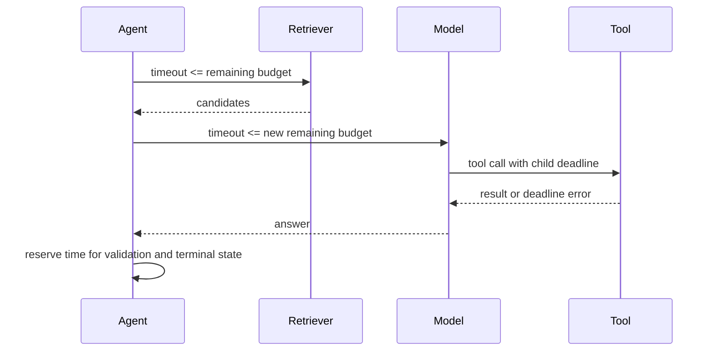

# Agent 成本、超时与降级治理

Agent 的成本不是一次模型请求价格。查询改写、多个检索通道、重排、工具、生成、验证、重试和恢复都会消耗时间与资源；并行可以降低延迟，却提高瞬时配额和取消前浪费。治理目标不是单纯“尽量便宜”，而是在安全和质量门槛不变的前提下，让每次执行有上限、可归因、可预测并能降级。

## 预算是运行时状态

预算至少包含总截止时间、模型调用、输入/输出 Token、工具调用、并行分支、外部费用和研究轮数：

```ts
type ExecutionBudget = {
  deadlineAt: number
  maxModelCalls: number
  remainingInputTokens: number
  remainingOutputTokens: number
  maxToolCalls: number
  maxParallelBranches: number
  maxExternalCostMicros: number
  maxRepairRounds: number
}

function remainingMs(budget: ExecutionBudget, now = Date.now()): number {
  return Math.max(0, budget.deadlineAt - now)
}
```

预算由入口基于功能、租户策略和风险生成，模型不能提高。每个节点执行前预留所需额度，完成后按实际 usage 结算；并行分支从同一总池领取，不能复制一份完整余额。

## 截止时间必须向下传播

单层 `timeout: 60s` 不足以控制整个 Agent。入口有总 deadline，节点根据剩余时间分配更短超时，并传给模型 SDK、HTTP、数据库和工具。代理、队列可见性和客户端超时也要协调。

```python
def allocate_timeout(deadline_at: datetime, desired: timedelta, reserve: timedelta) -> float:
    remaining = deadline_at - utcnow() - reserve
    if remaining <= timedelta(0):
        raise DeadlineExceeded()
    return min(desired, remaining).total_seconds()
```

`reserve` 留给持久化终态和返回响应。若所有时间都给最后一个模型调用，超时后连失败状态都写不下。客户端断开不自动取消任务；显式取消才传播取消令牌。



超时错误分层记录：排队超时、连接超时、首字节超时、总读取超时、模型生成超时、业务截止时间。否则所有错误都叫 timeout，无法知道该扩容还是缩短上下文。

## 成本账本按节点归因

只记录总 Token 无法回答哪里浪费。每次模型/工具调用写 usage 事件：

```ts
type UsageEvent = {
  turnId: string
  runId: string
  node: string
  provider: string
  modelOrTool: string
  inputTokens: number
  outputTokens: number
  cacheReadTokens: number
  externalCostMicros: number
  status: 'succeeded' | 'failed' | 'cancelled'
  contributedToFinalResult: boolean
}
```

失败和取消也产生费用，不能只计算成功请求。`contributedToFinalResult` 帮助发现并行分支长期无贡献、重试结果被丢弃和验证轮次无收益。价格表版本化，账单与供应商实际 usage 对账；估算用于实时预算，最终账本使用返回值或离线 reconciliation。

| 维度 | 用途 |
| --- | --- |
| 租户/功能 | 配额与成本分摊 |
| 图节点/模型 | 定位高成本步骤 |
| 成功/失败/取消 | 发现浪费 |
| 缓存命中 | 验证缓存收益 |
| 配置版本 | 比较优化前后 |

日志只保存主体摘要与计数，不记录完整 Prompt。

## 模型路由按任务风险，不按价格排序

使用最便宜模型处理所有任务会降低结构成功率并引发更多重试；使用最强模型处理所有任务则成本不可控。先分类任务复杂度、风险和验证能力，再选择已通过 Eval 的策略：

```ts
type ModelRoute = {
  strategyId: string
  primary: string
  fallback: string | null
  maxAttempts: number
  inputLimit: number
  outputLimit: number
}

function selectRoute(task: TaskProfile): ModelRoute {
  if (task.kind === 'rewrite' && task.risk === 'low') return routes.fastStructured
  if (task.kind === 'evidence_answer') return routes.evidenceReasoning
  if (task.risk === 'high') return routes.highReliabilityWithApproval
  return routes.default
}
```

Fallback 模型必须在相同 Schema、工具和安全 Eval 上验证。主模型输出一半后失败，不能无条件把全部上下文和工具重新交给备用模型；根据调用是否有副作用、剩余预算和可复用状态决定。

## 上下文成本先从选择解决

压缩之前先减少无关内容：候选工具按权限/任务过滤，检索按证据预算选择，历史按焦点读取，大工具结果在数据侧聚合。更长窗口会线性增加输入费用，也可能稀释关键信息。

Prompt 模板、稳定工具说明和重复前缀可以使用供应商支持的缓存，但缓存键包含模板、工具和策略版本。不要为了命中缓存把用户敏感内容做成公共键。监控 cache write/read Token 和有效命中，确认净收益。

## 并行、投机执行与取消

并行检索降低尾延迟，但所有分支同时消耗资源。只有通道互补且有明确 fan-in 时并行。证据覆盖达到门槛后取消慢分支，并记录取消前成本。

投机调用多个模型取最快/最好结果成本更高，只适用于高价值、严格延迟且通过预算批准的场景。普通请求不应默认 race 两个模型。

| 策略 | 延迟 | 成本 | 适用 |
| --- | --- | --- | --- |
| 串行 | 高 | 低 | 后一步依赖前一步 |
| 固定并行 | 低 | 高 | 通道稳定互补 |
| 动态 fan-out | 中低 | 可控 | 查询计划选择通道 |
| 投机模型 | 最低 | 很高 | 少量高价值请求 |

浏览器/客户端取消后，运行时停止新节点并取消可取消的读取；已提交写操作查询状态。即使供应商不退还已生成 Token，及时停止下游验证和工具仍能减少损失。

## 重试预算避免乘法放大

SDK、工具适配层、节点和图如果各自重试三次，最坏会执行 27 次。为每种错误指定唯一重试所有者：网络连接由客户端库少量重试，节点处理 429/503，业务修复循环处理结构或证据问题。总预算在最外层扣减。

```ts
type RetryDecision = {
  retry: boolean
  delayMs: number
  owner: 'sdk' | 'node' | 'graph' | 'none'
  reason: string
}
```

参数非法、权限拒绝、无证据和取消不重试；429 遵守 `Retry-After` 并检查 deadline；503 使用指数退避与抖动；写操作状态未知先查询幂等记录。熔断器在依赖持续失败时快速拒绝，避免排队耗尽截止时间。

## 降级矩阵预先定义

降级不是出错时临时删功能，必须经过 Eval：

| 失败 | 降级 | 仍需保持 |
| --- | --- | --- |
| 向量通道不可用 | Exact/FTS/结构检索 | ACL、Release、结果说明 |
| Reranker 不可用 | 版本化 RRF | 权限与证据预算 |
| 主生成模型限流 | 已验证备用模型 | Schema、引用、预算 |
| 生成完全不可用 | 返回证据列表 | 可见范围与来源 |
| Trace 后端不可用 | 有界缓冲/采样丢弃 | 业务终态与安全审计 |
| 实时通道断开 | 事件重放/状态查询 | 任务不重复 |

权限、安全验证和高风险批准不可降级绕过。知识 Release 不存在时不能偷换到全局/最新 Release。降级响应明确标记能力变化，便于产品展示和观测。

## Admission Control 与工作负载隔离

入口按租户、用户、功能和成本级别限制进行中任务。在线对话、批量摄取、离线 Eval 使用独立队列和并发池，防止批量任务占满模型/数据库连接。

```ts
type AdmissionDecision = {
  accepted: boolean
  queue: 'interactive' | 'batch' | 'evaluation'
  reason?: 'tenant_limit' | 'global_capacity' | 'budget_exhausted'
  retryAfterMs?: number
}
```

排队等待也消耗用户 deadline。预计无法在 SLA 内开始时尽早拒绝或提示排队，不要接受后在队列末端超时。公平调度可用加权配额，避免单个租户长期占用全部并发。

## 配额和账单边界

实时预估用于阻止超预算，最终扣费/配额使用确定性事务。模型不能决定费用或余额。预留与结算要幂等：Turn 开始预留最大额度，运行中记录 usage，终态结算实际消耗并释放剩余；失败与取消按策略计入实际资源。

高成本工具使用独立 quota，避免一次网页抓取/图片生成藏在普通工具次数中。价格变化通过版本化 rate card 生效，历史账本保留当时版本。

## 验证：预算与故障测试

```ts
it('shares one tool budget across parallel branches', async () => {
  const budget = new AtomicBudget({ maxToolCalls: 3 })
  const results = await Promise.allSettled(
    Array.from({ length: 5 }, () => runBranch({ budget }))
  )
  expect(results.filter((item) => item.status === 'fulfilled')).toHaveLength(3)
  expect(await budget.consumedToolCalls()).toBe(3)
})
```

| 场景 | 必须断言 |
| --- | --- |
| 五路并行共享三次预算 | 最多三次真实调用 |
| SDK 与节点均配置重试 | 实际次数不乘法放大 |
| deadline 即将耗尽 | 保留终态写入时间 |
| 客户端取消 | 不启动新调用，记录取消前成本 |
| 主模型 429 | 仅在预算内退避/切已验证模型 |
| Reranker 失败 | RRF 降级且引用仍正确 |
| 缓存版本变化 | 不误命中旧 Prompt/工具结果 |
| 租户并发打满 | 其他租户仍有公平容量 |

性能测试用模拟场景标注数据，不公开真实业务指标。分别测短问答、长上下文、多工具、零证据和故障路径，报告 P50/P95、成功率、单位成功成本和浪费率（未贡献结果的调用成本）。

## 告警与优化顺序

告警：单位成功成本突增、失败/取消成本占比、工具循环、输出 Token 触顶、缓存命中骤降、队列等待超过 deadline、租户预算耗尽和价格表对账差异。

优化顺序从无价值工作开始：修复重复重试、取消慢分支、减少无贡献工具、数据侧过滤结果、缩小候选工具、提高缓存正确命中；之后再考虑换便宜模型。以 Eval 保证质量和安全不退化，不能只看账单下降。

## 常见误区

- 只记录成功请求总 Token，不记录失败、取消、重试和节点归因。
- 并行分支各持完整预算，成本倍增。
- 所有层都开启重试，产生乘法调用。
- 为省钱直接换小模型，没有结构、工具和安全 Eval。
- 代理超时后后台仍无限运行。
- 观测或重排失败时绕过权限/引用检查。
- 把模型 usage 当最终业务扣费，缺少幂等结算和对账。

## 参考资料

- [OpenAI API Pricing](https://openai.com/api/pricing/)：模型输入、缓存输入和输出的公开价格；账本必须保存生效时间与实际模型版本。
- [OpenAI Rate Limits](https://platform.openai.com/docs/guides/rate-limits)：请求/Token 限制和退避处理边界。
- [OpenTelemetry Metrics](https://opentelemetry.io/docs/specs/otel/metrics/)：节点级成本、延迟、并发与错误的指标模型。
- [Google SRE: Handling Overload](https://sre.google/sre-book/handling-overload/)：Admission Control、负载丢弃和容量保护原则。
- [LangGraph Persistence](https://docs.langchain.com/oss/python/langgraph/persistence)：预算随状态保存、恢复和分支执行时的实现参考。
