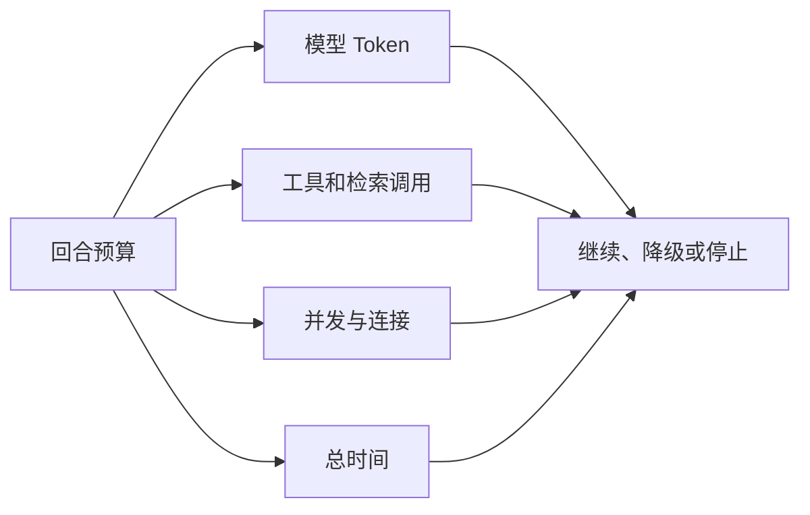

# Agent 成本、超时与降级治理

一个问题被拆成五个分支，每个分支又重试三次，最后还做两轮验证。答案可能更完整，也可能只是让延迟和调用费用失去上限。

成本治理不是在月底看账单，而是在每次运行前定义预算，运行中扣减，达到边界时停止或降级。

## 一次运行会消耗什么

除了模型费用，还要考虑向量、重排、OCR、数据库连接、队列和用户等待时间。

## 第一步：创建回合时确定预算

预算可以包含绝对 Deadline、最大步骤、研究轮次、工具调用数、输入输出 Token 和并发分支。不同模式使用不同配置：普通问答较短，深入研究可以更高但仍有上限。

恢复和重试继续使用原 Deadline，不重新获得整段时间。

## 第二步：模型路由按任务选择

分类、改写和格式校验可能使用较轻模型，复杂规划和事实判断使用更强模型。路由依据任务与 Eval，不只按单次价格最低。

更便宜但频繁失败重试的模型，整体成本可能更高。记录完成率、延迟和每个成功结果成本。

## 第三步：降级需要预先定义

向量服务失败时保留全文检索；重排失败时使用融合排名；摘要失败时确定性裁剪；证据不足时返回不足。这些是预先设计的可解释降级。

安全和权限不参与降级。ACL 服务失败时关闭访问，而不是为了可用性改成查全库。

## 第四步：区分用户取消和系统超时

用户取消表示不再需要结果，Deadline 到期表示系统预算耗尽，依赖超时表示某次调用失败。终态与指标分别记录，才能判断体验、容量还是供应商问题。

## 正常结果和失败结果

正常深入研究在两轮后证据仍不足，返回已找到的有引用部分并说明缺口。所有并行分支在 Deadline 到达时协作取消。

失败系统让模型自行决定“再试一次”，每次重试又重置超时，最终任务长时间占用 Worker。

## 怎样验证成本策略

为正常、无结果、单通道超时、模型限流和用户取消建立测试。检查步骤数、Token、最终状态和降级标记；再通过 Eval 确认降级没有越权或制造无证据答案。

## 参考资料

- [OpenAI：Latency optimization](https://developers.openai.com/api/docs/guides/latency-optimization)
- [OpenAI：Cost optimization](https://developers.openai.com/api/docs/guides/cost-optimization)
- [Python：asyncio timeouts](https://docs.python.org/3/library/asyncio-task.html#timeouts)
