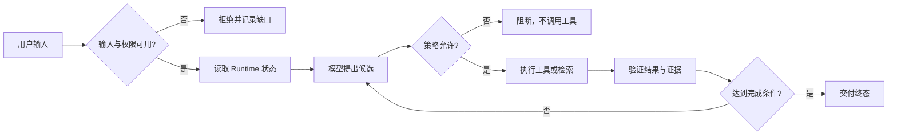
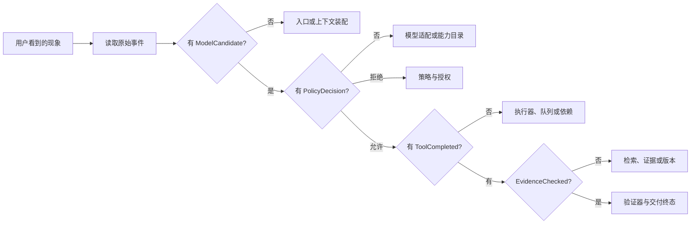

# Agent 工程常见问题

Agent 开发中最难回答的问题，通常不是“模型会不会写代码”，而是“这一步到底由谁决定、事实从哪里来、失败后能不能恢复”。如果把所有现象都归因给模型，排障会停在一句无法验证的解释；如果把所有分支都写死，又会把本来需要判断的任务变成一张越来越长的条件表。

这份 FAQ 作为课程的索引页，回答定义、选择、实现和运维中反复出现的边界问题。每个答案都指向一个可观察对象：输入、状态、动作、证据、策略决定或终态。读者可以先用它定位问题，再进入对应的主文章，而不是把 FAQ 当成另一套 Agent 实现。

::: info 先记住一条排障原则

看到“回答不对”时，先问四件事：输入是否完整，当前状态由谁保存，模型提出了什么动作，程序是否真的执行并验证了它。四个问题的证据齐全后，才有资格讨论模型、检索或框架。

:::



## Agent 和聊天模型有什么区别

聊天模型接收消息并生成下一段文本。它可以解释概念、改写句子或给出代码候选，但单次调用没有自动的任务状态，也没有权限查询当前用户的业务数据。**Agent** 是一个受运行时约束的控制循环：运行时保存目标、上下文、预算和观察；模型在允许的动作集合中提出候选；程序校验参数、权限和副作用，再决定执行、拒绝或结束。

一个简单反例是“查询当前账号能否访问报表”。模型可以猜测常见原因，却不能从参数中推断实时权限。工作流可以固定为“认证、查权限、查制度、生成说明”，当分支有限且每一步可枚举时，这通常比 Agent 更可靠。只有当下一步依赖中间观察，且候选路径难以预先列完，才值得引入循环。

这里的区别可以用控制权描述：模型负责候选生成，工作流负责预先写好的顺序，Agent Runtime 负责保存状态和裁决动作。RAG 只是把外部证据放入生成过程，不能单独决定是否使用 Agent。相关的四路比较见 [LLM、工作流、RAG 与 Agent 如何分工](/docs/ai-agent/llm-workflow-rag-agent)。

## 什么时候固定工作流已经够用

先列输入字段、步骤、分支、外部依赖、输出和失败终态。如果这些内容能由类型和规则表达，固定工作流已经足够。比如文档入库可以按准入、对象存储、解析、切块、向量化、候选索引和发布执行。文件类型决定解析器，扫描失败进入拒绝，索引版本通过原子激活切换，程序可以为每个状态写出明确的回归测试。

固定工作流的优势在于可审计和可重放。每个节点有输入和输出，重试范围可以限制在失败节点，迁移或回滚也有明确位置。它的局限是分支数会随开放任务快速增长。研究一份资料时，用户问题可能涉及多个主题，检索结果又会改变下一次查询。把所有组合预先写成条件分支，维护成本会超过引入一个受限 Planner。

引入 Agent 之前，先做一个最小实验：把真实请求画成状态图，标记哪些箭头只能由字段决定，哪些箭头需要根据观察选择。如果模型提出的选择不会改变外部动作，保留普通函数；如果选择会影响工具和检索范围，才增加候选动作、策略校验和停止条件。

## 工具调用为什么不等于工具执行

模型输出一个带名称和参数的 Tool Call，只代表它提出了动作。运行时还要检查工具是否在当前能力目录、参数是否符合 Schema、身份和 Scope 是否由可信上下文注入、动作是否需要审批，以及当前 Deadline 是否允许继续。任何一项不通过，都应返回结构化拒绝，不应先调用再解释。

工具结果也不是答案。`status=200` 只能证明传输层收到响应，业务仍要判断结果是否属于当前租户、是否来自活动版本、是否满足领域不变量。对于写操作，执行器还要返回幂等回执或未知状态，不能因为连接断开就假设没有发生。

并行工具调用需要额外的合并规则。两个检索分支可以并行，但它们的 Evidence 必须按稳定 ID 去重，迟到的旧版本不能覆盖已经提交的新状态。若一个分支失败，系统要明确选择继续、降级还是整体停止，不让模型用一段总结把缺失分支伪装成完成。

## RAG 没有证据时应该怎样回答

RAG 先按查询、权限和知识版本取得候选片段，再把 Evidence 交给模型。向量相似度只能帮助找候选，不能证明事实；相似片段也不代表拥有当前用户可见权限。回答前至少要检查来源身份、Chunk、Release、ACL 结果和引用范围。

空结果有三种含义：指定范围内确实没有材料，检索服务失败，或者查询理解错误。它们的处理不同。第一种可以安全拒答并说明范围，第二种可能重试或降级，第三种可以在预算内改写查询。不要把三种状态都写成“没有找到相关信息”，否则后续无法判断应该补知识还是修服务。

如果答案包含多个 Claim，每条 Claim 都要能回到至少一个可见 Evidence。Evidence 不足时，输出结构校验通过也不能标记成功。引用格式、证据预算和验证流程见 [Claim、Evidence 与引用](/docs/ai-agent/claims-evidence-citations) 和 [验证、修复与安全拒答](/docs/ai-agent/validation-repair-refusal)。

## 上下文、记忆和 Token 超限怎样区分

上下文是当前调用装配给模型的消息、工具结果和证据，记忆是应用在多轮之间保存、筛选和重新取回的数据。模型参数不是实时知识库，上一轮消息也不会自动变成长期开关。每次调用都要重新计算输入预算，包含系统指令、历史消息、工具 Schema、检索证据和输出预留。

发生超限时，先区分哪一部分占用窗口。可以去重重复的 Tool Result，压缩已经完成的健康检查，或者把可重读的大对象移到外部存储。当前正在编辑的文件、权限、活动 Plan 和未完成动作不能因为“比较旧”就被删除。压缩后要保留对象 ID、版本、失效条件和恢复入口。

间接提示注入是上下文安全问题。网页、文件和工具结果属于不可信数据，即使其中包含“忽略规则”的句子，也不能提升为系统指令。写入长期记忆前要通过来源、权限和风险门禁，最终回答还要检查是否泄露了受限片段。更多边界见 [上下文污染与间接提示注入](/docs/ai-agent/context-pollution-injection)。

## Agent 为什么会卡住或重复调用

卡循环不是“模型太笨”一个原因。常见证据包括：相同动作签名重复出现，状态修订没有变化，工具返回相同结果，预算持续下降却没有业务进展，或者等待中的依赖没有新的事件。判断时要同时读取动作、观察、状态修订和最后事件序号，不能只看工具名字。

运行时应设绝对 Deadline、最大动作数、重复签名阈值和无进展阈值。触发后停止新增工作，保存最后一次观察，释放 Lease，并返回可解释终态。有限重试只处理可重试依赖错误，权限拒绝、参数错误和已确认的领域失败不应重新交给模型。

一条可重放的记录至少包含 `run_id`、`attempt_id`、状态版本、动作指纹、工具回执、错误类型和终止原因。这样可以区分“没有调用”“调用失败”“结果为空”和“结果未知”。如果外部副作用的回执未知，恢复流程先查询回执，再决定补偿，不能直接重做写动作。

### 运行中的状态应该放在哪里

把状态放在 Prompt 里最容易开始，也最容易丢失。上下文裁剪、客户端断开或 Worker 重启都会让这段文字消失。至少要把任务状态、预算、权限快照、活动工具、最近 Checkpoint 和最后事件序号放在结构化存储中；Prompt 只是根据这些字段生成的一次视图。

状态所有者要能回答“谁可以写这个字段”。入口创建 `run_id`，策略层写入批准或拒绝，执行器写入调用回执，验证器写入业务结果。模型只能产生候选事件，不能直接改 `status=completed`、`tenant_id` 或 `release_id`。并发更新使用版本条件，迟到事件发现版本不匹配时进入冲突或审计记录。

短期内存仓库适合测试状态机，数据库或专用 Runtime 才能承担跨进程恢复。选择存储时比较写入原子性、查询方式、保留期限和故障恢复，不要因为某个框架默认使用 Redis 就把所有事实都放进缓存。

## 怎样定位失败责任层

::: tip 先按事件顺序定位

不要从最终答案倒推原因。先确认请求进入了哪一层，再沿着原始事件判断“没有发生”“发生但失败”还是“结果未知”。只有保留事件顺序、状态版本和关联 ID，责任层才不会被一段摘要带偏。

:::



这张图只是一条取证顺序，不是把所有故障压缩成固定分类。一个请求可能在入口通过后又因策略拒绝，也可能工具已经产生副作用但回执丢失。遇到这种情况，保留每一次状态变化，而不是只记录最后的 `agent_failed`。

先把故障按发生位置分层，再决定修复人：

| 现象 | 更可能的层 | 先查什么 |
| --- | --- | --- |
| 输入被截断或字段缺失 | 入口与上下文装配 | 请求大小、序列化、Token 预算、Schema |
| 模型提出未知工具 | 模型适配与能力目录 | 工具名称、能力版本、候选事件 |
| 工具未被调用却返回权限错误 | 策略与授权 | Scope、动作指纹、审批版本 |
| 已记录拒绝但出现外部写入 | 执行隔离 | 调用入口、旧批准、幂等回执、沙箱 |
| 检索返回空结果 | 查询与检索 | 查询改写、过滤条件、Release、索引健康 |
| Worker 消失 | 队列与 Runtime | ACK、Lease、心跳、Checkpoint、重投次数 |
| 结果有结构但事实不可信 | 证据与业务验证 | Claim、Evidence、ACL、领域不变量 |

失败记录应包含发生阶段和责任组件，不要把完整 Prompt 或凭证复制进日志。稳定 ID、版本、摘要和错误类足够支撑大多数回放；需要读取正文时通过受控存储和单独权限访问。

### 失败证据怎样避免被二次加工掩盖

日志和答案不是同一份材料。答案可以把多个事件压缩成一句话，日志则要保留原始顺序和状态版本。排障时先读取 `TurnStarted`、`ModelCandidate`、`PolicyDecision`、`ToolCompleted`、`EvidenceChecked` 和终态事件，再查看模型生成的解释。若只有“工具失败”四个字，无法知道是参数在入口被拒绝，还是已经调用后返回了 5xx。

错误类型也要保持稳定。`invalid_argument` 表示输入不能执行，`permission_denied` 表示身份和范围不允许，`upstream_timeout` 表示依赖没有在预算内返回，`unknown_outcome` 表示可能产生了副作用但回执缺失。把它们统一成 `agent_failed` 会让重试器错误重做不应重做的动作。

每个恢复动作都要留下关联 ID。重试沿原 `run_id` 增加新的 `attempt_id`，补偿动作关联原回执，人工接管写入操作者和批准版本。这样既能回放，也能在删除敏感正文后保留足够的控制证据。

## 什么时候需要 MCP、Skill 或多 Agent

MCP 解决的是能力发现和协议互操作。一个工具服务可以声明资源、提示或工具，客户端初始化后读取目录，再按 Schema 调用。它不负责替代业务授权，也不保证工具本身安全。Skill 更接近可渐进披露的知识和操作约束，适合把重复的说明、检查步骤和输出格式组织成可加载材料。

多 Agent 只有在职责、上下文或权限确实需要隔离时才有价值。并行检索可以减少等待，但会增加合并、去重和失败传播；Handoff 要明确谁拥有任务和最终交付；SubAgent 要有输入输出合同，不能把完整父上下文无边界复制。若一条普通工作流就能完成任务，多 Agent 只会扩大状态和调试范围。

选择模式时看四个因素：分支是否可枚举，外部动作是否可逆，证据是否能验证，失败成本是否可接受。高风险写操作优先使用确定性流程和人工审批，开放式研究才考虑 Planner、Reflection 或多路径搜索。

### 并行不等于多 Agent

同一个 Agent 可以并行调用多个只读工具。并行的收益来自等待时间重叠，代价是合并结果和处理部分失败；它不要求多个身份、多个上下文或多个策略。只有当任务需要隔离上下文、不同权限或独立交付责任时，才拆成 SubAgent。

拆分后要定义父子合同：父 Agent 传入目标、范围、截止时间和可用工具，子 Agent 返回结构化结果、证据、缺口和终态。子 Agent 不能把父上下文所有秘密全部复制过去，也不能把自己的权限提升到父级。Handoff 发生时，原拥有者保留任务状态，新的拥有者通过稳定 ID 取得工作区和未完成项。

多 Agent 的失败传播要提前写清。一个检索子任务超时，父任务可以降低覆盖率并拒答，也可以换一条来源；不能让汇总 Agent 根据“预计会成功”填充缺口。选择多 Agent 前先用单 Agent 加并行工具做基线，只有基线无法满足隔离或吞吐目标时再增加角色。

## Agent Eval 怎样避免“答案看起来不错”

评测要把控制正确性和答案质量分开。控制层断言输入拒绝、工具调用次数、权限不扩大、状态单调、重复提交幂等、取消后不再创建新工作；质量层判断答案是否覆盖目标、Claim 是否有 Evidence、引用是否指向当前版本，以及在证据不足时是否安全拒答。

测试样本要包含正常、空结果、权限拒绝、超时、取消、重复投递、工具未知和回执未知。Fake Adapter 只能证明本地状态机和协议转换，不能证明真实模型选择、网络延迟或供应商配额。在线评测要记录服务版本、时间窗口、配置、模型和凭证条件，不能把一次手工请求写成生产指标。

反馈也不能直接当作训练标签。用户说“答案漏了条件”只说明需要调查，真正的根因可能是检索过滤、证据预算、生成或验证器。保留原始 Turn 的输入摘要、Evidence、Claim、策略版本和验证结果，才能把反馈转成回归 Case。候选策略先离线回放，再通过 Shadow 或 Canary 观察真实依赖，最后才决定发布。

### 评测数据怎样保持可复现

每个 Case 固定输入摘要、用户范围、知识 Release、Policy 版本、模型适配器、工具 Fixture 和期望终态。涉及时间的规则使用冻结时钟，涉及随机采样的模型使用固定事件或记录种子。评测报告同时保存控制断言和答案断言，不能只留一个总分。

版本变化时不要把所有历史结果混在一条趋势线上。模型、Prompt、检索器、分块规则、权限策略和知识 Release 任一改变，都可能影响结果。报告按变更键分组，并标出哪些 Case 只是执行失败，哪些 Case 是质量下降。语义 Judge 不可用时，安全和协议门禁可以继续，但缺少语义证据的结果要明确标记。

线上反馈还要考虑样本偏差。高风险请求可能被更保守地拒绝，简单问题更容易完成，平均成功率不能代表长任务质量。按任务类型、证据覆盖、租户范围和终态拆分指标，才能知道优化到底改变了哪条路径。

## 数据、隐私与删除怎样处理

Agent 的一次执行会产生比最终答案更多的数据：输入摘要、消息、工具参数、检索片段、截图、事件、Checkpoint、反馈和评测结果。先按用途分类，再决定保留时长。调试所需的错误类型和稳定 ID 可以长期保留，完整 Prompt、上传文件和用户输入通常需要更短期限、更窄权限和明确删除接口。

删除不是把一条消息从列表里隐藏。用户撤回文件或权限后，新的检索必须看不到它，缓存和摘要也要失效，已经生成的 Claim 需要标记来源不可用。审计记录可以保留对象 ID、删除时间和执行者，但不能继续展示原文。异步清理应有自己的任务状态，失败时告警并重试，不能因为页面已经显示“删除”就假设所有派生数据消失。

多租户系统还要检查事件、指标和导出任务的范围。`tenant_id` 从认证上下文注入，模型不能通过工具参数改写；缓存键、对象存储路径、向量过滤和图谱查询都要使用同一范围。跨租户聚合指标只保存经过策略允许的统计，不能把租户 ID 作为高基数标签无界写入监控系统。

## 术语、标题和主文章怎样保持一致

课程中的 **Message**、**Context**、**Memory**、**Evidence**、**Claim**、**Turn** 和 **Event** 各自承担不同责任。Message 是一次调用的消息单元，Context 是装配给模型的可见视图，Memory 是跨 Turn 保存并重新取回的数据，Evidence 是可追溯来源，Claim 是答案中的可验证断言，Turn 是一次用户目标的运行边界，Event 是状态变化的记录。把它们都叫“上下文”会让权限、保留和测试边界一起混乱。

标题也应该反映知识依赖。先讲定义和作用，再讲数据或控制流，随后放最小实现、失败和验证，最后比较边界。一个 H2 如果同时承担工具注册、上下文压缩和权限治理，读者无法知道下一段需要什么前置知识，也无法从目录复述学习过程。将跨主题内容拆到对应主文章，用站内链接连接，而不是在每篇 FAQ 里重复一整段定义。

术语变化要有迁移策略。字段从 `status` 改成 `turn_status` 时，事件版本、旧记录读取和查询脚本同时更新；正文示例也要说明当前字段，不要让代码、表格和测试各自使用一套名称。内容门禁可以检查 H1、H2、链接和示例存在，但真正的术语一致性仍要靠逐篇回读和跨文章检索确认。

## 成本和模型路由怎样约束

成本不是只看一次模型调用的价格。一次 Agent 任务还可能消耗检索、Rerank、工具、队列、浏览器和存储资源。Runtime 应在入口建立总预算，子调用继承剩余额度，重试、压缩和 Judge 都从同一预算扣除。达到上限后返回明确的 `budget_exhausted`，不能让模型把停止改写成成功。

模型路由可以按任务风险、上下文长度、结构化输出要求和延迟预算选择适配器。路由决定属于程序控制，模型不能自行切换到没有批准的供应商或更高权限的模型。每次调用记录模型、版本、输入输出 Token、等待时间和终止原因，报告按版本比较，避免把不同模型的质量和成本混成一个平均值。

降级也要有合同。证据不足时可以缩小回答范围、只返回确定性状态或要求用户补充材料；不能为了降低成本省略 ACL、验证或安全拒答。低风险摘要可以使用便宜模型，高风险写操作仍需确定性策略和人工审批。成本优化改变的是候选生成和调度，不改变权限、证据和终态规则。

FAQ 的答案也有适用范围。示例中的字段、事件名和命令用于说明控制逻辑，接入具体框架时必须对照版本文档和实际协议。没有运行证据的数字、吞吐、准确率和生产结论不能写进答案；遇到版本差异，保留差异本身，比用一句“通常如此”掩盖不确定性更可靠。

当多个主文章都提到同一个词，FAQ 只保留一句定位和链接。正文需要解释机制时回到拥有该状态的文章，实践需要运行命令时回到对应示例。这样目录、链接和上一篇/下一篇保持一条知识线，读者不会在不同页面看到互相冲突的字段或完成条件。

## 一次完整排障怎样记录

假设用户问“为什么报表导出被拒绝”。入口先保存认证身份、请求范围和当前知识版本，发现用户没有导出权限后，策略层直接返回拒绝，不调用模型和导出工具。若用户拥有权限但制度材料缺失，检索层返回 `evidence_unavailable`，系统可以给出申请入口，但不能编造制度条款。

若模型提出 `export_records`，运行时检查工具目录和 Scope。动作被拒绝时，事件记录候选参数、拒绝原因和调用次数为零。若工具已经执行，回执包含导出任务 ID；即使客户端断开，后台仍按任务状态继续，重连时通过事件游标读取终态。若回执未知，任务停在待确认状态，恢复流程先查外部系统。

排障报告按时间顺序列出：入口输入、状态快照、候选动作、策略决定、工具回执、Evidence、Claim、终态和资源清理。报告不依赖最终回答是否流畅。读者只看事件和表格，也应该能复述哪个组件拥有下一步以及为什么停止。

如果报告需要人工批准，批准对象必须绑定动作指纹、参数摘要、目标资源、有效期和策略版本。模型重新生成参数后，动作指纹变化就需要重新审批，不能复用“看起来差不多”的旧批准。审批超时应返回等待或拒绝，不应在后台静默执行。

长任务还要区分取消和失败。用户取消只表示不再希望继续，系统仍需等待或终止正在运行的工具，释放 Lease 和临时对象；依赖超时则可能允许有限重试。两个终态都不能被迟到的成功结果覆盖，恢复时先读取最后 Checkpoint 和事件游标。

涉及文件、浏览器或 Shell 的 Harness 还要保存工作区版本、命令摘要、退出码和差异摘要。截图或 DOM 观察只能作为证据引用，不应直接当作“操作成功”。确定性验证通过后，才把修改标记为可交付；测试失败时保留差异并要求人工决定回滚或继续。

## FAQ 的最小自测

可以用不需要密钥的 Fake Adapter 做本地回放。测试至少检查四条断言：输入缺失时调用次数为零；权限拒绝不会产生副作用；重复提交同一 `run_id` 返回同一终态；取消后迟到事件不能把终态改回运行中。

```bash
PYTHONPATH=examples/ai-agent \
  python3 -m unittest discover \
  -s examples/ai-agent/tests -p 'test_*.py'
```

命令验证的是共享示例中的控制逻辑和状态迁移。它不代表真实模型、在线检索、队列、浏览器或生产权限已经通过。接入真实依赖后，另行运行协议、集成、安全和容量测试，并保存服务版本、输入摘要、退出码和失败证据。

FAQ 的边界也很明确：它帮助读者找到主文章和下一项检查，不替代业务规则、权限系统、检索索引或运行时。答案必须与当前版本和证据范围一起阅读；没有证据时，暂时无法确认就是正确终态。
