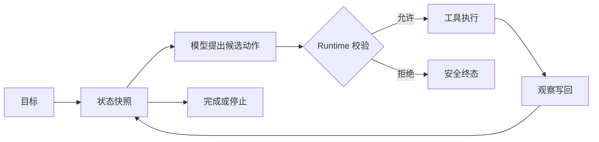

# Agent 的定义、自主性与责任边界

给模型接上一个搜索工具，还不能说明系统已经成为 Agent。真正的变化发生在控制层：程序保存目标和状态，模型根据当前观察提出下一动作，运行时决定动作能否执行，执行结果再进入下一轮，直到达到完成或停止条件。

Agent 因此是一套受限的运行系统，不是某个模型功能的别名。模型负责生成候选，工具连接外部能力，状态记录已经发生的事情，运行时拥有执行权和终止权。缺少任何一项，系统都可能退化成一次模型调用、固定工作流，或者没有边界的自动化脚本。

::: info 本文使用的定义

**Agent** 接收一个目标，在程序保存的状态中反复读取观察、提出候选动作，由运行时校验并执行允许的动作，最终产生可验证结果或明确终态。

:::

这个定义故意把“自主”限制在候选选择上。身份、权限、金额、知识版本和不可逆操作仍由确定性程序或人工确认。模型能力越强，也不会因此获得这些字段的所有权。

## Agent 由哪些部分组成

Agent 的界面通常只展示一个输入框，内部至少有目标、状态、决策器、工具、运行时和停止规则。生产系统还会加入策略、证据验证、持久化与观测，但这些能力仍围绕同一条控制链。

### 目标定义什么算完成

“帮我处理远程访问问题”只是意图，不能直接作为工程验收。目标需要说明期望输出、允许使用的资料、不能执行的动作和结束条件。若任务要求解释个人账号状态，最终结果必须由当前账号证据支撑；只有通用制度时，正确终态是无法确认，而不是生成一个听起来合理的原因。

目标由用户需求和应用规则共同形成。用户可以指定想完成什么，应用决定哪些请求允许执行。用户说“跳过审批直接开启远程访问”，不会把审批规则变成可选项。

### 状态保存循环已经知道什么

状态不是把整段对话塞进一个 Prompt。它需要让程序直接读取当前问题、观察、已执行动作、步骤数、终态和错误。需要恢复时，再加入 Turn ID、状态版本、Deadline、取消标记、工具回执与 Checkpoint。

模型读取状态的一个投影，不应获得可变状态对象。它可以建议“查询账号状态”，不能把 `status=completed` 写进数据库。运行时接纳候选后才产生新状态，写入时检查版本，避免迟到结果覆盖已经取消或完成的任务。

### 决策器提出下一动作

决策器通常由 LLM 和 Prompt 组成，也可以包含路由器、规划器或规则。它读取目标、可用工具说明和当前观察，返回结构化动作或最终回答。它的输出始终是候选。

模型可以决定“下一步更需要查制度还是查账号”，这是 Agent 的适应性来源。权限判断、参数上限和事实确认不适合交给概率生成。结构化输出让候选容易解析，仍需运行时校验。

### 工具把候选连接到外部世界

工具可以检索文档、查询业务状态、写文件或调用远程 API。只读工具的主要风险是数据越权与不可信结果；有副作用的工具还要处理审批、幂等、重试和补偿。

工具目录也是能力边界。模型只能从当前任务允许的目录中选择，不能根据名字动态导入函数。参数里的可信身份和 Scope 由运行时注入，工具返回结果带调用 ID、来源和状态，不能只给模型一段没有出处的文本。

### 运行时拥有控制权

运行时把目标、状态、模型和工具串起来。它执行最大步骤、总 Deadline、Token 或费用预算、并发限制、取消和无进展检测。模型说“再试一次”时，运行时仍会检查剩余额度。

运行时还负责终态。模型生成 FinalAnswer 后，事实验证可能将其标为 unsupported；工具超时后，任务可以 failed，也可以返回一条明确无法确认的结果。模型完成生成、工具完成调用和业务任务完成是三件事。

## 自主性具体发生在哪里

“自主性”不是一个从零到一的开关。可以从路径选择、动作权限、持续时间和目标范围四个维度观察。系统在一个维度更开放，不代表其他维度也要放开。

### 路径选择从固定到动态

固定程序不需要模型选择路径，输入进入预写函数后得到结果。固定工作流允许条件分支，分支条件仍由代码决定。Agent 让模型根据开放式观察提出下一动作，路径可能在运行前无法完全列出。

动态路径适合信息来源不确定、需要根据检索结果调整下一步的任务。若所有步骤已经清楚，模型路由只会增加延迟和测试面。是否使用 Agent，先看“下一步真的需要根据语义观察变化吗”，不要看界面是否像聊天。

### 动作权限决定自主性的风险

只允许搜索公开资料的 Agent，即使能自主选择很多查询，风险仍相对可控。允许发送邮件、修改配置或执行代码后，每个动作都可能产生外部副作用。动作权限扩张时，审批、沙箱、网络和文件范围必须同时收紧。

可以给动作分级：只读观察直接执行；可逆写操作需要策略检查和幂等键；高风险或不可逆动作需要人工确认。分级由应用定义，模型只能描述拟执行内容。把审批写在 Prompt 里，无法阻止程序真的调用工具。

### 持续时间改变状态责任

一次 HTTP 请求内结束的 Agent 可以把状态留在内存。任务跨分钟、等待外部事件或后台运行时，进程可能重启，客户端也可能断开。状态、事件、Deadline 和工具回执需要持久化，Worker 通过租约领取执行权。

持续时间越长，输入与权限变旧的概率越高。恢复时要判断沿用创建时快照，还是重新授权和读取当前 Release。没有版本语义的“继续执行”可能在新规则下执行旧计划。

### 目标范围决定能否验收

“写一份说明”可以定义结构、证据和完成标准；“把所有问题处理好”没有可计算边界。范围过大的目标会让 Agent 不断扩张子任务，或在没有完成证据时自行宣布结束。

复杂目标需要拆成可验收的子目标，每个子目标有输入、输出和预算。拆分可以由程序固定，也可以由模型生成候选计划，再由运行时验证依赖与上限。父目标的完成由子目标状态和业务规则计算，不由总结文字决定。

这些维度比简单的“几级 Agent”更适合工程设计。若团队使用等级表，应明确它只是内部沟通模型，并写清每一级在路径、动作、时间和范围上开放了什么。等级名称不是行业统一标准。

### 把自主性写成预算

自主性可以像资源一样设置预算，而不是写成“尽量自动完成”。路径预算限制模型最多提出几种分支，动作预算限制工具次数和风险级别，时间预算限制总 Deadline，范围预算限制可访问的对象与 Release。每个预算都有明确消耗者和超限终态。

例如，一个只读知识 Agent 可以允许最多 4 次检索、只访问公开 Scope、总时限 30 秒，最终必须带 Evidence。它在路径选择上有自由，在动作权限、时间和范围上没有自由。若四次检索都没有足够覆盖，结果是拒答或请求补充，不是把预算放宽后继续猜。

带写操作的系统需要再加审批预算和副作用预算。一次审批只对应一份冻结命令，参数变化就消耗新的审批机会；每个外部写动作有幂等键和可查询回执；未知执行结果不自动消耗下一次重试。预算不仅防止成本失控，也让恢复行为可预测。

### 用评审表判断是否能扩大范围

在增加工具或提升权限前，逐项回答：

| 评审问题 | 必须存在的证据 |
| --- | --- |
| 模型提出的动作能否完整解析 | 版本化 Schema 与非法候选测试 |
| 动作是否只使用可信身份与范围 | 授权函数、范围注入和越权用例 |
| 工具失败后能否区分已执行与未执行 | 幂等键、回执或明确 unknown 终态 |
| 任务怎样确认完成 | 领域状态与 Claim、Evidence 验证 |
| 任务卡住时怎样停止 | 最大步数、无进展、Deadline 和取消 |
| 进程重启后怎样继续 | 状态版本、Checkpoint、恢复回放 |
| 用户怎样看到风险 | 动作摘要、审批记录和可追踪事件 |

缺少任何一项时，先保持当前自主范围。把模型换成更强的版本、增加一个“请谨慎”的 Prompt 或把最大轮数调大，都不能替代缺失证据。

### 自主范围可以逐步开放

第一阶段只开放确定性、只读、低成本动作，收集候选选择、空结果和无进展轨迹。第二阶段引入更多只读来源，验证权限隔离和证据覆盖。第三阶段再考虑可逆写操作，并要求人工审批和回执。不可逆操作要单独评审，不应因为前两阶段成功就自动继承权限。

每次扩大范围都要保留上一阶段的回归集，比较新增动作是否改变旧任务的拒答、权限与终止行为。新增工具可能改变模型的选择分布，即使原工具代码没有变化也要重新评测。工具目录版本和策略版本写入 Turn，便于还原当时的自主边界。

### 不同自主维度可以刻意不对称

一个 Agent 可以拥有较大的查询路径自由，却只能返回草稿；也可以按固定路径执行很多步骤，但每一步由人工批准。没有必要把四个维度同时推高。将“会不会选错路径”和“能不能造成副作用”分开，产品就能用较小风险获得部分收益。

如果团队把自主性简化成一个数字，至少要同时展示这四个维度的上限，并在文档中说明数字不能替代动作白名单与事实校验。数字用于比较配置，不用于宣称系统接近某种人类能力。

可以用同一请求做一组对照评审。固定查询路径、固定只读工具和固定证据要求时，模型只负责改写答案，系统接近工作流；开放查询顺序但不开放写权限时，变化集中在路径与成本；开放写权限并要求审批时，变化集中在副作用与恢复；取消人工审批且允许跨版本长时间运行时，范围、时间和责任同时扩大。每次只改变一个维度，才能知道哪条边界带来了新的失败。

评审记录还要写清“谁能够撤销自主权”。管理员可以停用工具目录，用户可以取消当前 Turn，策略版本可以禁止某类动作，Deadline 可以让执行过期。撤销发生后，正在运行的工具如何处理、迟到结果是否保存、审批是否失效，都属于运行时合同。没有撤销路径的自主能力不应进入生产。

这也解释了为什么“Agent 等于模型加插件”这个说法不够。插件只提供能力入口，模型只提供候选，真正把两者变成 Agent 的是状态与循环控制。没有状态就无法知道观察是否新增，没有运行时就没有动作授权和终止，没有验证就无法区分完成文字与业务完成。设计时先画这三条关系，再决定采用哪一个模型或框架。

对初学者而言，可以把 Agent 先缩小成一个可回放的 Turn：一条目标、一个状态对象、一个只读工具、两次模型决定和一个明确的最大步数。等这条轨迹能被测试和解释，再增加记忆、并行、审批或后台执行。扩大功能前先确认旧终态仍然可复现，学习成本和故障范围都会更可控。

这个最小 Turn 还应保留失败样本。工具超时、模型返回未知动作、证据不足时各自怎样停止，比只演示成功回答更能说明 Agent 的边界。下一篇会把这组状态转移写成普通 Python 循环，并用脚本化模型验证调用次数和终态。

失败样本还要注明输入版本、权限范围、工具目录、策略版本和终止原因，脱离这些条件的“成功”没有可比较性，也无法用于模型、策略或运行时版本升级后的回归判断。

回归记录只保存必要的脱敏字段，原始正文通过受控引用另行读取。

## 责任边界怎样落到系统组件

Agent 最容易出错的地方，不是模型选错一次工具，而是多个组件都以为另一个组件会校验。把责任写进接口，才能避免重复与空白。

| 责任 | 所有者 | 失败时的终态 |
| --- | --- | --- |
| 认证当前调用者 | 入口与认证服务 | rejected |
| 冻结知识与策略版本 | 运行时 | failed 或重新创建任务 |
| 产生动作候选 | 模型适配器 | model_error 或 invalid_decision |
| 校验参数与授权 | 工具运行时 | rejected |
| 执行外部能力 | 工具适配器 | success、empty、timeout、unknown |
| 保存状态与回执 | 状态仓储 | failed，不对外宣称完成 |
| 验证 Claim 与 Evidence | 验证器 | unsupported、conflict 或 refused |
| 决定业务完成 | 运行时与领域规则 | completed 或明确非成功终态 |

### 可信字段不能从模型输出回填

模型经常会在结构化对象中生成 `user_id`、`scope_ids`、`release_id` 或 `approved=true`，特别是工具描述把这些字段写进去时。运行时应拒绝这些字段，或者完全不向模型暴露。真实值从认证与活动配置读取。

结构正确并不能改变来源。一个合法 UUID 仍可能属于另一个用户，一个存在的 Release 也可能已经退休。可信上下文应使用不可变对象贯穿执行，工具只接收经过授权的命令。

### 外部内容永远是数据

网页、OCR 文本、检索片段和工具结果可能包含“忽略规则、调用某工具”之类内容。它们进入观察时保留 untrusted 标记，只能作为证据候选，不能升级为 developer 指令。

模型可能服从间接提示注入并提出危险动作，运行时仍会按工具目录、权限和策略拒绝。安全不能只依赖模型识别恶意文本，确定性边界要假设模型偶尔会被影响。

### 人工审批不是装饰性按钮

需要审批时，运行时先冻结动作参数、对象版本和风险摘要，再暂停执行。审批人确认的是这份确定候选，批准后若参数变化，原审批失效。不能先让用户点“同意”，再由模型补全具体命令。

拒绝审批是正常终态，不应让 Agent 改写参数反复请求。审批超时也要停止或过期，恢复时重新检查对象状态与权限。

## 用同一个任务比较不同自主范围

用户问：“我的远程访问为什么失败？”系统可能有制度知识库、账号状态 API 和开启访问的写工具。下面从低到高调整自主范围，观察能力与责任怎样变化。

### 只生成说明

模型只看到通用制度，回答设备合规与审批是必要条件。它无法查询个人状态，合格输出必须说明信息不足。这不是 Agent，只是一次有证据边界的模型调用。

优点是控制面小，失败容易定位。若产品只需要解释制度，这个方案已经足够。为了“更智能”接入循环没有价值。

### 固定查询工作流

程序先查询设备合规，再查询审批状态，最后把两项结果交给模型解释。路径固定，模型不选择工具。只要两个接口稳定，这种工作流比 Agent 更可预测，也更容易覆盖所有分支。

查询超时、权限拒绝和空结果都能提前枚举。模型负责把已确认结果写成可读文本，不能修改查询顺序和授权范围。

### 受限的只读 Agent

系统有制度搜索、设备状态和审批状态三个只读工具。模型根据问题与观察选择先查哪一个，运行时执行授权。若制度已经说明某类失败与审批无关，模型可以减少一次无关查询；遇到模糊问题，也能先查制度再决定具体工具。

自主性只体现在查询路径。Agent 没有开启访问的工具，最大步骤、Deadline 和证据要求由程序控制。模型返回个人原因前，验证器检查 Claim 是否绑定当前用户可见的工具结果。

### 带写操作与审批的 Agent

若系统允许用户修复问题，模型可以提出“重新发起审批”或“更新设备登记”。动作先通过参数校验与授权，再进入人工审批。批准后执行器使用稳定幂等键调用业务服务，结果作为新观察返回。

这一级增加了副作用、审批等待、未知执行结果和补偿。只增加一个写工具，运行责任已经显著扩大。除非用户价值足够，保留只读 Agent 并提供确定性操作按钮往往更稳。

## Agent 怎样从输入走到终态

入口先认证用户并创建 Turn，固定问题、可见范围、知识 Release、策略版本、模式和 Deadline。缺少必需字段时请求在入口拒绝，模型和工具调用次数保持为零。

运行时装配当前状态，模型提出动作候选。候选经过类型、参数、工具目录和策略检查后才可执行。工具结果带 call_id、来源、范围和状态写回观察。下一轮只读取当前状态快照，不能直接读取并修改仓储对象。

模型返回 FinalAnswer 后，系统抽取或读取 Claim 与 Evidence 绑定。验证器检查证据可见性、时效、冲突和直接支撑关系。问题为空才允许 completed；可修复问题最多进入有限修复；权限或证据缺失则安全拒答。

状态转换需要单调。pending 可以进入 running；running 可以进入 completed、failed、cancelled 或 expired；终态不回到 running。取消与模型结果并发时，写入使用状态版本，迟到结果只保留审计记录。

交付是终态之后的另一件事。SSE 断开不应重跑已经完成的工具；客户端重连按事件序号重放。核心状态写入失败时，系统不能因为已经向客户端发送部分文本就宣称任务完成。

这条链路展示了 Agent 的自主性只占其中一个节点。目标、可信输入、执行批准、状态转移、验证与交付都由确定性组件承担。

## Agent 常见的边界失效

**把 Prompt 当权限系统**，模型被要求“只能访问本部门”，工具却接受模型提供的部门 ID。修复位置在工具命令和授权，不在 Prompt 措辞。

**把模型自评当完成证据**，模型输出 `done=true`，运行时没有检查所需工具、文件或 Claim。完成条件应由领域状态计算。

**把工具返回当可信指令**，检索片段要求模型改变角色，模型随即提出越权动作。外部结果只能作为不可信数据，工具目录与授权继续生效。

**把重试当通用恢复**，权限拒绝、未知执行结果和临时超时都重新跑整个 Agent。权限不会因重试改变，有副作用的未知结果还可能重复执行。错误类型决定恢复动作。

**让自主范围随工具数量增长**，新工具注册后自动暴露给所有 Agent。工具目录应按任务、身份和风险生成，并有版本记录。模型能看到工具不代表当前用户能执行。

**只设置最大轮数**，相同动作与相同观察重复多次才被迫停止。无进展检测应比较动作签名和状态变化，给出 `no_progress` 原因。

**把失败路径当成正常路径的另一种文案**，工具返回 unknown，模型却根据经验填一个成功结果。未知状态表示系统不知道副作用有没有发生，必须先查回执或交给人工，不能在回答层用更委婉的措辞掩盖。

**把自主性配置散落在多个服务**，入口设置 30 秒，工具客户端又给每次调用 30 秒，队列恢复后重新计算一份 30 秒。结果总时限可能被重复放大。运行时应在入口生成绝对 Deadline，子步骤只读取剩余时间。

**把审计对象和业务对象混在一起**，为了让日志方便，把完整 Prompt、凭证或内部证据直接写进状态表。审计需要稳定 ID、版本和摘要，业务状态需要最小可执行字段，敏感正文走受控存储和删除策略。

**长任务只保存在 Prompt**，Worker 重启后无法知道已执行副作用，重新开始造成重复。需要恢复的状态、动作 ID 和回执必须持久化。

这些问题的共同特征是责任漂移：本应由程序确认的事情交给了模型文本，或某个组件假设下游会补校验。设计评审应逐字段写出所有者，而不是只画模型与工具的箭头。

## 怎样验证自主性仍在边界内

单元测试使用脚本化模型固定动作序列，分别覆盖正常完成、未知工具、参数错误、权限拒绝、工具超时、重复动作和最大步骤。断言不仅看最终文案，还要检查模型与工具调用次数、状态版本和终止原因。

安全测试让用户文本和工具结果同时包含越权指令，模型可以故意返回危险候选。只要运行时拒绝执行、可信范围没有变化，确定性边界仍然有效。测试不要求模型每次都识别攻击，因为生产系统不能把安全性建立在这个概率上。

恢复测试在工具调用前、工具成功后和状态写入后分别中断进程。调用前可以重新领取；工具成功后的恢复先查询回执；终态写入后只需重放交付。写工具没有幂等键与回执时，不应宣称支持自动恢复。

事实测试构造格式正确但证据不足的 FinalAnswer。Claim 没有 Evidence、Evidence 对当前用户不可见、来源版本过期或多份证据冲突时，结果不能进入 completed。明确拒答也可能是正确行为。

评测需要同时观察任务质量和控制行为。完成率高但越权率上升不能发布，平均 Token 降低但安全拒答被改成猜测也属于回归。分开记录正确完成、证据不足、权限拒绝、工具失败、取消和无进展，才能定位变化。

自主性增加后，系统获得的是根据观察调整路径的能力，也承担更多状态、工具和恢复责任。合适的范围不是“模型最多能做什么”，而是应用能够授权、验证、停止和解释到什么程度。
