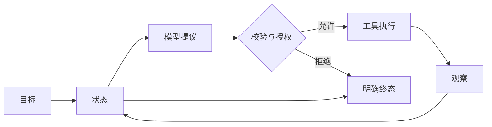

# Agent 的定义、自主性与责任边界

一个模型调用可以写答案，一个工作流可以按预设步骤调用模型和 API。Agent 多出来的能力，是根据新观察选择下一步。这个选择会在运行期间反复发生，程序事先未必知道完整路径。

可以把 Agent 定义为一套受限行动系统：它接收目标，读取当前状态，提出动作候选，经过运行时校验后执行工具，再把结果写成新观察，直到完成或停止。模型负责候选，程序掌握执行权。



给 Chatbot 接一个搜索按钮还不够。若搜索由固定代码在每次回答前执行，系统仍是模型辅助工作流；若模型可以根据第一次搜索结果决定改写查询、换来源或停止，才出现了行动循环。

## 五个对象组成最小运行系统

### 目标必须能够验收

“处理远程访问问题”表达了方向，没有说明什么算完成。可执行目标还要包含允许的资料范围、期望产物、禁止动作和结束条件。只掌握通用制度时，系统可以解释申请条件，无法确认某位用户失败的原因。

目标过宽会产生两种结果：Agent 不断扩张子任务，或者在没有完成证据时自行宣布结束。复杂任务需要拆成可检查的子目标，父任务根据子状态计算完成，不能依赖一段自信的总结。

### 状态记录已经发生的事实

最小状态至少保存目标、观察、已执行动作、剩余预算和终态。跨请求或后台任务还需要 Turn ID、状态版本、Deadline、取消标记、工具回执与检查点。

模型每轮读取状态快照，不能直接修改持久化对象。它可以提议 `search_policy`，无权把任务状态写成 `completed`。运行时接纳动作后生成新状态，写入时检查版本，防止迟到结果覆盖取消或完成。

### 动作是候选，不是命令

模型输出可以是最终回答，也可以是带参数的工具候选。候选先经过 Schema、工具白名单、参数规则、权限、预算和审批检查。任何一层失败都应形成稳定错误，不能悄悄改成另一个动作。

可信身份不出现在模型可填写的字段中。`user_id`、租户范围、活动知识版本和审批结果由运行时注入，哪怕模型给出的值格式正确也不采用。

### 观察描述外部世界的返回

工具成功、空结果、权限拒绝、超时和执行状态未知，都属于观察。它们会影响下一步，因此必须分别建模。把异常转成一段“查询失败”的自然语言，会丢掉可重试性和副作用状态。

网页、文件、OCR 文本和工具结果都可能包含提示注入。它们只能以不可信数据进入观察，不会因为被模型读到就升级成应用规则。

### 终止条件由运行时执行

模型可以提议结束，程序仍要检查完成证据。系统还需要最大步数、总 Deadline、Token 或费用预算、取消信号和无进展检测。达到限制时产生 `expired`、`cancelled` 或 `stalled`，不要生成一段看起来像成功的回答掩盖终止原因。

## 自主性需要拆成四个维度

“高自主”太含糊，工程设计更适合看四个可以分别收紧的维度。

| 维度 | 可以开放什么 | 主要风险 |
| --- | --- | --- |
| 路径 | 根据观察选择查询和步骤 | 绕路、重复、成本失控 |
| 动作 | 读取、写入或执行外部能力 | 越权与不可逆副作用 |
| 时间 | 跨请求、后台或定时运行 | 状态过期、孤儿任务、重复执行 |
| 范围 | 访问更多对象与拆分更多子目标 | 数据越界、目标持续膨胀 |

这四项可以刻意不对称。研究 Agent 可以自由调整搜索路径，却只允许读取公开资料；部署助手可以按固定工作流执行多步操作，但每次切流都需要人工批准。无需把所有维度一起放开。

### 路径自由适合开放式信息任务

所有步骤和分支都能提前枚举时，固定工作流更容易测试。路径自由适合下一步确实依赖语义观察的任务，例如排障时根据日志决定查配置还是查依赖，研究时根据证据缺口改写查询。

开放路径后要记录动作序列和进度。仅限制最大轮数会挡住无限循环，却识别不了五轮都在执行同一个无效查询。重复动作、状态无变化和同类错误连续出现，都可以成为无进展信号。

### 写权限会改变整个恢复模型

只读工具失败可以安全地有限重试。写操作可能在客户端超时前已经成功，运行时此时处于“结果未知”。重试前需要幂等键或查询回执，否则可能产生第二次扣款、第二封邮件或第二个任务。

高风险动作还要冻结审批对象。审批人确认的是具体命令、参数、目标版本和风险摘要。批准后若参数变化，原审批立即失效；拒绝和审批过期都是正常终态。

### 时间越长，快照越容易过期

一次请求内结束的循环可以使用内存状态。任务跨分钟、等待外部事件或进程重启后恢复时，状态必须持久化，并明确哪些值沿用创建时快照，哪些需要重新授权。

恢复旧计划时，用户权限、工具目录和数据版本可能已经变化。安全的恢复会重新经过授权和幂等检查，同时保留原始计划与创建版本供审计。

## 把自主范围写成预算

“尽量完成”无法转成运行时规则。一个只读知识 Agent 可以明确配置：最多四次检索，只访问当前用户范围，总时限 30 秒，回答中的事实必须绑定证据。四次检索后仍缺少关键材料，结果是拒答或请求补充。

带副作用的任务还要加入动作风险级别、审批次数和并发上限。每项预算都应有消耗者、剩余值和超限终态。重试同样消耗时间与调用额度，不能在预算外偷偷发生。

```text
AutonomyBudget
  max_steps: 6
  max_tool_calls: 4
  allowed_risk: read_only
  deadline_seconds: 30
  evidence_required: true
```

配置不是安全证明。运行时要在每次动作前读取剩余预算，工具完成后原子更新消耗，多个并行分支共享同一个总量。

## 责任要写进组件接口

Agent 系统常见的空白责任是“大家都以为别人会校验”。下面这张表把关键决定放到明确所有者：

| 决定 | 所有者 |
| --- | --- |
| 当前调用者是谁 | 认证入口 |
| 哪些对象可见 | 授权服务与查询层 |
| 本轮固定哪个策略和知识版本 | 运行时 |
| 下一动作候选是什么 | 模型适配器 |
| 候选能否执行 | 工具运行时与策略层 |
| 外部动作是否成功 | 工具适配器与回执 |
| 事实是否有证据 | 验证器 |
| 任务能否进入完成状态 | 领域规则与运行时 |

模型没有任何一行的最终所有权。它参与候选生成和解释，确定性组件决定身份、授权、状态与完成。

## 同一个问题可以落在四种系统里

用户问“我的远程访问为什么失败”，不同能力边界会得到不同实现。

**单次模型调用**只拿到通用制度，可以说明常见条件并指出缺少个人状态。

**固定工作流**按代码顺序查询设备合规与审批状态，再让模型整理结果。两个接口和分支稳定时，这个方案足够清楚。

**只读 Agent**获得制度搜索、设备状态和审批状态三个工具，根据观察选择查询顺序。运行时限制范围、次数和证据要求。

**可操作 Agent**还能提出重新发起审批。写动作经过授权和人工确认，执行时带幂等键，未知结果先查回执。

能力每升一级，新增的部分都可以指认：路径选择、写权限、等待时间或目标范围。若无法说清增加了什么用户价值，就没有理由承担更多运行责任。

## 三类反例最能暴露边界

第一类是格式正确的越权动作。模型给出另一个部门的 ID，程序必须拒绝或覆盖为当前授权范围。

第二类是工具返回不可信指令。检索片段要求忽略规则并调用写工具，运行时仍只允许当前目录中的只读动作。

第三类是并发终止。用户取消任务的同时模型返回答案，状态版本检查要保证 `cancelled` 不会退回 `completed`，迟到内容只进入审计记录。

Agent 的能力来自循环中的选择，可靠性来自循环之外的约束。两部分分开设计，模型升级、工具扩充和长任务恢复才不会悄悄扩大权限。
