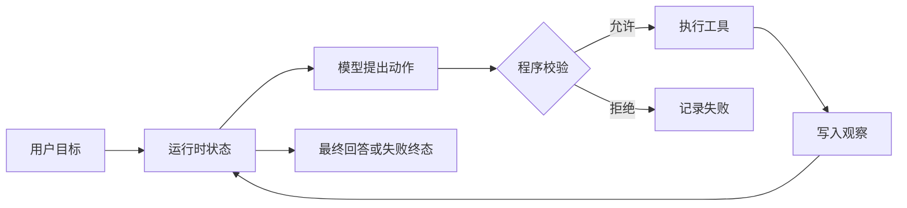

# 什么是 Agent：自主性从哪里来，边界在哪里

普通模型调用收到输入后生成一次结果。Agent 多了一层运行时：它保存任务状态，向模型提供可用动作，接收动作候选，执行被允许的部分，再把观察结果放回下一轮。

## Agent 是带状态的受限行动系统

一个最小 Agent 包含目标、状态、动作集合、观察和停止条件。模型负责在当前上下文中提出下一动作，运行时负责校验、执行、记录和终止。

模型没有直接拿到数据库连接或 Shell。它得到的是工具描述，返回的是候选调用。**执行能力属于运行时，不属于模型。**

## 自主性来自运行时允许的选择

固定工作流的下一步由代码写死，Agent 可以根据中间观察从多个动作中选择。这个选择空间就是自主性的来源。

自主性不是越大越好。只读问答可以允许选择检索通道和查询词；修改账号权限则需要固定校验和人工审批；付款、删除生产数据等动作可以完全不暴露给 Agent。动作越有副作用，候选空间越应收窄。

## 一次执行要保存哪些状态

状态至少要保存原始问题、已执行步骤、工具观察、剩余预算和当前终态。生产系统还会固定知识版本、策略版本、用户范围与 Deadline，避免一次长任务在中途换规则。

状态不等于把所有文本反复塞给模型。运行时可以保留完整事件，模型上下文只装配当前决策需要的部分。完整状态用于恢复和审计，压缩上下文用于推理。

## Agent 与 ReAct 的关系

ReAct 是一种循环模式：基于当前信息做判断，执行动作，再观察结果。Agent 不必把内部推理过程完整输出，也不必把每一步写成长段文字。工程实现更关心结构化动作、工具结果、验证问题和终止原因。

Router、Planner、Reflection 和多 Agent 都是在最小循环上改变决策方式。它们不是 Agent 的必备组件。一个只调用一次搜索工具再回答的有限循环，已经足以说明核心机制。

## 停止条件必须由程序执行

常见终态包括完成、证据不足、权限拒绝、工具失败、达到步数上限、超过 Deadline 和用户取消。模型可以建议结束，运行时仍要检查答案是否存在、引用是否可见，以及任务是否已经被取消。

只有“直到模型认为完成”为停止条件，会留下无限循环和假完成。步数、时间、费用和副作用次数需要确定性上限。

## 哪些任务不适合 Agent

步骤固定且规则稳定的审批适合工作流。单次分类或摘要适合直接调用模型。要求强一致、低延迟、结果必须完全可证明的核心交易，通常应该由普通程序处理，模型最多提供辅助信息。

Agent 适合中间结果会改变后续动作、允许在有限范围内探索、每一步都能观察和撤销的任务。决定采用 Agent 前，先列出动作白名单、状态字段和失败终态；列不出来，系统还没有可控制的边界。
