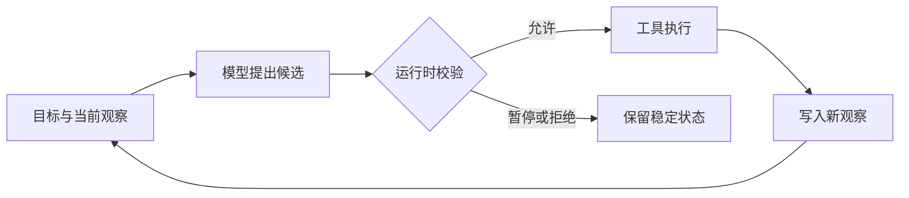

# 什么是 AI Agent：自主性从哪里来，责任边界怎么划分

[上一篇](/docs/ai-agent/structured-output-model-boundaries)把模型输出限定为候选：字段符合 Schema，仍然不代表它有权执行。现在把候选放进一项多步任务，问题会更具体：模型可以根据新信息改变下一步时，系统在什么意义上成了 Agent，这份选择权又到哪里为止？

沿用远程访问场景，用户提出一个目标：

> 查明我的远程访问申请为什么被拒绝；如果当前条件已经满足，再帮我重新提交。

这句话同时包含查询、判断和可能产生副作用的动作。系统可以把每条分支提前写进代码，也可以让模型看过查询结果后再提出下一步。两种实现都可能调用 LLM 和工具，后一种把运行期间的一部分路径选择交给了模型。

## 同一个任务，下一步由谁决定

先看三种实现，差别集中在“下一步从哪里来”。

| 实现 | 下一步来源 | 新观察的作用 |
| --- | --- | --- |
| 单次模型调用 | 没有下一步 | 只能使用调用前已有材料 |
| 固定工作流 | 代码中的既定分支 | 由代码匹配预设分支 |
| Agent | 模型根据观察提出候选 | 可能改变动作、顺序或结束时机 |

固定工作流并非只能直线执行。代码可以规定“设备不合规则查询设备状态，缺少材料则请求补充”，观察会让程序进入不同分支，但分支条件和可走路径都已提前写定。

Agent 不需要代码把每一种拒绝原因和下一步的对应关系全部列完。它收到“设备不合规”后，可以在运行时开放的动作集合中提出读取设备状态；收到“缺少证明材料”时，则可以请求用户补充。模型是否参与这次选择，才是两种系统的最小差异。

这个差异与框架名称无关。Agents SDK 可以只跑一次模型调用，普通 Python 也能写出行动循环。工具数量同样不能证明自主性，十个按固定顺序执行的工具仍然是一条固定工作流。

## 反馈后的选择构成 Agent 的最小差异

本文采用一个系统级定义：AI Agent 是由应用运行时承载的反馈决策系统。模型根据目标、当前状态和新观察反复提出下一动作或结束候选；运行时校验候选、执行工具、记录结果，并决定任务能否继续或停止。

这一定义里，模型负责的是候选生成。Agent 指完整系统，至少还包含状态、动作执行和终止控制。一次最小反馈可以画成下面这样：



图中的回边很重要。工具回执成为下一轮输入，模型才有机会因为环境变化而调整路径。若回执只交给一段固定的 `if-else`，模型没有参与后续选择，系统仍然可以按工作流理解。

ReAct 论文研究的也是这种交错：动作连接外部知识库或环境，观察再用于更新后续计划。本文只讨论外部可见的动作、观察和停止候选，模型内部推理留到后面的专门章节。

## 自主性是一块选择空间，不是一条等级刻度

自主性描述系统在运行期间委托给模型的选择空间。选择空间由应用配置，模型自身不会获得工具权限。要说清一项任务开放了多少自主选择，至少要回答下面几件事：

| 维度 | 要回答的问题 | 本文任务的边界 |
| --- | --- | --- |
| 可见观察 | 模型能依据哪些新信息选择 | 工具回执，不含认证密钥 |
| 动作集合 | 模型能提出哪些动作 | 查询、澄清、重新提交候选 |
| 数据范围 | 动作能触达哪些对象 | 只用当前认证范围 |
| 持续范围 | 可以循环多久、何时停止 | 当前运行内，受预算与终止条件限制 |
| 升级节点 | 哪些动作必须交给别人决定 | 重新提交前暂停审批 |

把五项合在一起，才能说明自主范围。研究 Agent 可能自由改写查询、选择来源，却只能读取公开资料；发布助手的步骤很固定，但在人工批准后可以执行写操作。前者的路径空间更大，后者的副作用能力更强，二者无法排成一条简单的高低序列。

自主范围也不会因为模型升级而自动扩大。换成能力更强的模型，可以改善候选质量；允许哪些工具、哪些范围和哪些停止条件，仍然由运行时配置决定。

## 模型提出动作，运行时决定能否继续

用户目标进行到“重新提交”时，提议与执行的区别变得可见。模型可以返回这样的候选：

```python
proposal = ActionProposal(
    "resubmit_request",
    (("reason", "当前条件已满足"),),
)
```

`arguments` 使用不可变元组，是为了让候选能够绑定到一份具体批准。示例会先拒绝重复字段；真实系统还要按工具 Schema 规范化参数，避免字段顺序不同却语义相同的对象被误判成两个动作。

这段对象只说明模型认为下一步可以重新提交。本文的边界示例检查动作目录、可信身份、数据范围和批准。预算、取消与最大步数属于外层循环，下一篇再把它们加入状态。

示例中的 `evaluate_proposal` 把这些检查放在模型之外。模型一旦尝试填写 `actor`、`scope` 或 `approved`，候选会被拒绝；写动作没有对应批准时，结果是 `pause`，不会调用工具。

```python
def evaluate_proposal(proposal, context):
    keys = [key for key, _ in proposal.arguments]
    if len(keys) != len(set(keys)):
        return RuntimeDecision("reject", "duplicate_argument")
    if TRUSTED_ARGUMENTS.intersection(keys):
        return RuntimeDecision("reject", "trusted_context_is_model_controlled")

    if proposal.name == "finish":
        missing = context.required_evidence - context.observed_evidence
        if missing:
            return RuntimeDecision("reject", "completion_evidence_missing")
        return RuntimeDecision("complete", "completion_verified")

    if proposal.name not in context.allowed_actions:
        return RuntimeDecision("reject", "action_not_allowed")
    if not context.actor or not context.scope:
        return RuntimeDecision("reject", "trusted_context_is_missing")

    if proposal.name in context.write_actions:
        expected = ApprovalGrant(proposal, context.actor, context.scope)
        if expected not in context.approvals:
            return RuntimeDecision("pause", "approval_required")

    command = ExecutionCommand(
        name=proposal.name,
        arguments=proposal.arguments + (
            ("actor", context.actor),
            ("scope", context.scope),
        ),
    )
    return RuntimeDecision("execute", "action_allowed", command)
```

这段函数不会执行工具。它只把合格候选变成 `ExecutionCommand`，并从运行时上下文注入 `actor` 与 `scope`。工具适配器只接收命令，不再接触模型原始对象。

批准对象同时绑定候选、当前身份和范围。用户批准了“按当前理由重新提交”，模型后来改了参数，或运行时切换了数据范围，旧批准都不能继续使用。OpenAI Agents SDK 的审批机制也采用中断和恢复语义：需要审批的工具不会先执行，运行会返回 interruption 与可恢复 state，应用批准或拒绝后再继续同一次运行。

审批通过仍然没有产生“重新提交成功”的事实。只有工具执行并返回可核验回执，系统才能记录这个动作发生了什么。

## 责任边界怎样分配决定和证据

责任边界给每个决定指定最终所有者，并说明失败时应检查哪份记录。组件名称本身说明不了边界，Prompt 里的行为要求也没有独立执行力。

| 责任 | 最终所有者 | 对应记录能证明什么 |
| --- | --- | --- |
| 候选生成 | 模型 | 当前状态下建议了哪个动作 |
| 准入与执行 | 运行时、策略和审批者 | 候选为何执行、暂停或拒绝 |
| 外部事实 | 工具或领域系统 | 一次查询或写操作实际发生了什么 |
| 完成判定 | 完成验证器 | 目标所需条件和证据是否齐全 |

模型可以提出 `read_device_status`，但不能声明自己代表哪个用户。运行时从本地认证上下文注入身份和范围，再调用工具。OpenAI 的 Agent 定义文档也明确区分模型可见的对话历史与代码可见的 local context，认证用户、数据库客户端和日志器适合留在后者。

工具拥有它负责的外部事实。申请接口可以证明当前申请状态，设备接口可以证明当前设备状态；搜索到一份通用制度，无法代替这两项记录。工具超时或结果未知时，模型也不能用一段自然语言补出成功回执。

完成验证器处理的是整个目标。即使重新提交工具返回成功，回答仍要带上拒绝原因和当前条件的证据；反过来，原因已经查清但写动作尚未批准，任务可以停在“等待确认”，不能伪装成完成。

## 同一项任务怎样在观察后改变路径

把四项责任放回开头的任务，可以得到一条可回放轨迹。下面的制度、状态和回执均为教学输入，不对应真实用户或真实审批系统。

| 当前观察 | 模型候选 | 运行时结果 |
| --- | --- | --- |
| 只有用户目标 | 读取申请状态 | 注入当前范围后执行 |
| 回执显示设备不合规 | 读取当前设备状态 | 作为只读动作执行 |
| 回执显示设备现已合规 | 重新提交申请 | 暂停，等待批准 |
| 相同候选得到批准 | 重新提交申请 | 执行并等待工具回执 |
| 回执显示已提交 | 结束任务 | 验证证据齐全后完成 |

第一次回执若显示“缺少材料”，第二步就会变成请求用户补充，读取设备状态不再有意义。路径差异来自观察，这是自主性的实际表现。

每一步仍有明确边界。模型选择查什么，运行时限定它以谁的身份查；工具返回申请事实，完成验证器核对整个目标；人工批准具体写动作，工具回执证明写动作是否发生。自主选择和责任归属在同一条轨迹上同时存在。

## 边界是否成立，要看四条不变量

边界写进架构图还不够，测试要让越界路径稳定失败。本文的可运行示例锁住四条不变量：

1. 工具目录之外的动作返回 `reject`，不会按相似名称猜测工具。
2. 模型提供 `actor`、`scope` 或 `approved` 时，整份候选拒绝；可信字段只由运行时注入。
3. 写动作没有批准时返回 `pause`；参数、身份或范围发生变化后，旧批准不再匹配。
4. 模型提出 `finish` 时，缺少申请状态或设备状态证据就返回 `reject`。

其中第三条可以直接用两个候选验证。先批准原对象，再改变理由，新的候选仍然暂停：

```python
approval = ApprovalGrant(
    proposal,
    "authenticated_user",
    ("current_user_records",),
)
approved = evaluate_proposal(
    proposal,
    runtime_context(approvals=frozenset({approval})),
)

changed = evaluate_proposal(
    ActionProposal(
        "resubmit_request",
        (("reason", "另一项说明"),),
    ),
    runtime_context(approvals=frozenset({approval})),
)

self.assertEqual(approved.status, "execute")
self.assertEqual(changed.status, "pause")
```

这组测试只验证确定性的动作准入逻辑。`RuntimeContext` 由本地代码构造，其中 `observed_evidence` 代表已经由其他组件验证过的证据名称，模型不能填写这个集合。示例没有验证证据内容、在线模型、审批服务或真实写操作，生产完成条件还要绑定工具回执和证据来源。

::: details 展开动作边界完整实现
<<< ../../examples/ai-agent/agent_boundaries.py
:::

::: details 展开本篇不变量测试
<<< ../../examples/ai-agent/tests/test_agent_boundaries.py
:::

运行本篇测试：

```bash
PYTHONPATH=examples/ai-agent \
  uv run python -m unittest \
  examples/ai-agent/tests/test_agent_boundaries.py -v
```

当前 8 项专用测试全部通过，AI Agent Python 全量测试也通过。本篇实现只使用 Python 标准库；全量命令仍会为相邻的结构化输出示例安装固定版本的 Pydantic。

## Agent 能选择下一步，完成仍要有外部证据

现在可以回答标题里的三个问题。AI Agent 是让模型参与反馈后路径选择的应用系统；自主性来自运行时开放的观察、动作、范围、持续时间和升级节点；责任边界则把提议、执行与事实证明交给各自能够校验和记录它们的组件。

回到远程访问任务，模型可以因为“设备现已合规”而提出重新提交，这体现了自主性。它无权自行补身份、跳过批准或宣布提交成功。运行时的准入记录、人工批准和工具回执共同决定任务走到哪一步。

下一篇会把这里尚未展开的循环写成 Python：状态保存哪些字段，观察怎样进入下一轮，最大步数、异常和完成验证怎样让循环可靠停止。

接着阅读：[用 Python 写 Agent 循环：模型候选如何推动状态转移](/docs/ai-agent/python-agent-loop-from-scratch)

参考资料：

- [OpenAI Agent definitions](https://developers.openai.com/api/docs/guides/agents/define-agents)
- [OpenAI Guardrails and human review](https://developers.openai.com/api/docs/guides/agents/guardrails-approvals)
- [ReAct: Synergizing Reasoning and Acting in Language Models](https://arxiv.org/abs/2210.03629)
