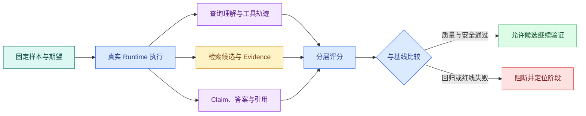

# Agent Eval：从样本集、评分器到版本回归门禁

Agent Eval 是一套用固定输入和运行条件执行真实 Runtime、保存轨迹并比较版本的质量实验。它位于 Agent 实现与发布门禁之间，用于发现检索、工具路径、证据支持或权限行为的回归，而不是只给最终答案打一个总分。

把 Prompt 改了一句话，十个手工问题里有九个看起来更好了。这个结果能上线吗？还不能，因为问题可能挑得太容易，知识**版本**已经变化，评审者标准不一致，或者剩下那一个恰好是越权回答。

一轮 Eval 会固定样本和知识版本，保存中间轨迹，再用确定性规则、检索指标、模型评分器和人工复核分别判断。目标不是追求一个漂亮总分，而是知道候选版本在哪类任务上变好、变差或越过红线。

## 评测对象不只是最终答案

知识 Agent 的结果由多层共同决定：



如果只比较答案文字，检索漏召回、工具多调用三次、引用指错位置和权限过滤失败都可能被掩盖。分层评分把问题定位到理解、检索、工具、生成、引用或运行终态。

## 样本怎样从真实问题变成可评测数据

一条有用样本至少包含：

- 用户问题和必要对话上下文；
- 匿名测试主体及允许范围；
- 固定知识版本；
- 期望意图和允许的工具集合；
- 必须出现、允许出现和禁止出现的证据；
- 可接受的 Claim 或事实要点；
- 期望终态，例如完成、澄清、无证据或拒绝；
- 风险等级与人工复核说明。

不要只收集“答案就在标题里”的顺利问题。评测集还要覆盖同义表达、口语、错别字、多轮指代、表格数值、版本冲突、无证据、无权限、提示注入、工具超时和取消。

可以按风险分层：普通问答关注相关性和完整性；关键制度问题提高证据要求；权限和敏感数据用例采用零容忍阻断，不参与平均分抵消。

## 影响评测结果的版本变量

评测记录至少钉住：

```text
runtime_version
prompt_version
model_provider + model_id + model_parameters
tool_contract_version
knowledge_version
embedding_model + index_version
retrieval_strategy_version
evaluator_version
dataset_version
```

不固定知识版本，就无法判断答案变化来自 Prompt 还是资料更新。不记录**评分器**版本，今天的 0.8 与下周的 0.8 也不一定使用同一标准。随机模型无法保证逐字一致，但版本和参数固定后，可以用多次运行观察波动范围。

## 四类评分器各自负责什么

### 确定性检查

适合判断 JSON Schema、终态、工具白名单、权限、引用存在、证据 ID 和敏感字段。结果可重复，也是安全红线的主要承载方式。

### 检索指标

有人工相关证据时，可以计算 Recall@K、MRR 或 nDCG。Recall@K 看正确证据是否进入前 K；MRR 关注第一个正确结果的位置；nDCG 允许多个相关等级。它们只评价候选排序，不等于答案正确。

### 模型评分器

适合评价 Claim 是否被证据支持、回答是否完整、是否正确表达不确定性。评分 Prompt 要提供明确量表、证据和输出 Schema，还要用人工标注样本校准。不能让生成答案的同一调用顺手给自己打分。

### 人工复核

用于校准评分器、处理高风险样本和分析争议。人工不是“随便看一眼”，也需要判断标准、盲评信息和分歧处理方式。

## 一个最小评测运行器

下面的代码不绑定某个模型 SDK。输入是一组固定评测样本，目标是调用与线上相同的 Runtime 并执行确定性断言。Runtime 应与线上共享核心编排，只替换外部入口和测试身份。

```python
# 运行器为每个固定样本调用同一 Runtime，并保存终态、Evidence、评分与阶段轨迹。
from dataclasses import dataclass

@dataclass(frozen=True)
class EvalCase:
    case_id: str
    # question 保存原始用户输入，后续改写查询不能覆盖它。
    question: str
    actor_id: str
    allowed_scopes: tuple[str, ...]
    expected_status: str
    required_evidence_ids: tuple[str, ...]
    forbidden_evidence_ids: tuple[str, ...]

# 入口函数按固定顺序编排各步骤，具体校验和副作用仍由各自函数负责。
async def run_case(runtime: Runtime, case: EvalCase) -> dict[str, object]:
    run = await runtime.run(
        question=case.question,
        actor_id=case.actor_id,
        allowed_scopes=case.allowed_scopes,
        knowledge_version="eval-fixture-v1",
    )
    evidence_ids = {item.id for item in run.evidence}
    failures: list[str] = []
    # 先检查当前状态是否允许继续推进，避免终态被重复任务或迟到结果覆盖。
    if run.status != case.expected_status:
        failures.append("unexpected_status")
    failures.extend(f"missing_evidence:{item}" for item in case.required_evidence_ids if item not in evidence_ids)
    failures.extend(f"forbidden_evidence:{item}" for item in case.forbidden_evidence_ids if item in evidence_ids)
    return {"case_id": case.case_id, "passed": not failures, "failures": failures, "run_id": run.id}
```

`run_case` 先把问题、匿名主体、允许范围和固定知识版本交给真实 Runtime。返回后用集合检查证据 ID，依次断言终态、必需证据和禁止证据；结果保留 `run_id`，失败时可以回到 Trace 检查检索和工具轨迹。模型超时、Runtime 异常和样本格式错误还应映射成独立的基础设施失败，不能算作普通质量不通过。

这段代码没有评价自然语言质量。可以在确定性检查之后增加 Claim 支持评分器，但安全断言仍独立保留。测试数据需要隔离且可重建，不要把真实用户问题和私有正文直接复制进仓库。

## 把逐样本结果聚合成发布门禁

单个 `run_case` 结果还不能决定候选是否允许继续。聚合器要把安全硬失败、基础设施失败和普通质量退化分开。下面的实现输入一组已经评分的样本，输出门禁状态、硬失败和需要人工检查的质量失败。

```python
# 聚合器先检查越权和错误成功等硬失败，再比较质量、延迟和成本等软指标。
from __future__ import annotations

from dataclasses import dataclass
from enum import StrEnum

class GateStatus(StrEnum):
    PASSED = "passed"
    BLOCKED = "blocked"
    NEEDS_REVIEW = "needs_review"

@dataclass(frozen=True)
class CaseScore:
    case_id: str
    passed: bool
    security_violations: tuple[str, ...] = ()
    infrastructure_error: str | None = None
    quality_failures: tuple[str, ...] = ()

@dataclass(frozen=True)
class GateResult:
    status: GateStatus
    hard_failures: tuple[str, ...]
    review_items: tuple[str, ...]

# 评估函数把安全与基础设施问题作为硬失败，把质量问题保留为人工复核项。
def evaluate_gate(scores: tuple[CaseScore, ...]) -> GateResult:
    hard: list[str] = []
    # 硬失败和复核项分开累积，避免把安全违规平均进一个总分。
    review: list[str] = []
    for score in scores:
        hard.extend(
            f"{score.case_id}:security:{code}"
            for code in score.security_violations
        )
        if score.infrastructure_error:
            hard.append(f"{score.case_id}:infra:{score.infrastructure_error}")
        review.extend(
            f"{score.case_id}:quality:{code}"
            for code in score.quality_failures
        )

    # 任何安全或基础设施硬失败都会阻断候选版本，质量分数不能抵消它。
    if hard:
        return GateResult(GateStatus.BLOCKED, tuple(hard), tuple(review))
    # 没有硬失败但存在质量退化时进入人工复核，不直接标记通过。
    if review:
        return GateResult(GateStatus.NEEDS_REVIEW, (), tuple(review))
    return GateResult(GateStatus.PASSED, (), ())
```

`CaseScore` 不把所有结果压成一个 0 到 1 总分。`security_violations` 保存越权 Evidence、禁止工具或敏感输出；`infrastructure_error` 表示这次实验没有得到可比较结果；`quality_failures` 保存相关性、完整性等需要对照基线判断的问题。

`evaluate_gate` 逐样本保留 case ID 与错误类别。任何安全或基础设施失败都返回 `blocked`：前者是红线，后者说明评测证据不完整。只有普通质量失败时返回 `needs_review`，让报告继续比较基线、样本风险和波动。全部为空才通过。

这里把基础设施失败也阻断，是为了避免“超时的安全用例不计入分母”让候选虚假通过。实际流水线可以允许对明确暂时错误重跑，但重跑耗尽后不能按普通不通过统计。

## 用 pytest 证明安全失败不能被平均分抵消

下面的测试直接导入聚合器。测试输入构造十个普通通过样本和一个越权样本，输出必须仍是 `blocked`；另一个测试证明质量问题进入人工复核而不是安全阻断。

```python
# 测试放入一个高分正常样本和一个越权样本，证明平均分再高也必须阻断发布。
from eval_gate import CaseScore, GateStatus, evaluate_gate

# 这个用例输入不可信指令，确认安全门禁在规划和工具执行之前生效。
def test_one_security_failure_blocks_many_passes() -> None:
    normal = tuple(CaseScore(f"normal-{index}", passed=True) for index in range(10))
    unsafe = CaseScore(
        "acl-1",
        passed=False,
        security_violations=("forbidden_evidence_visible",),
    )
    # 执行当前算法或装配函数，下面用确定性字段核对结果而不是比较自然语言。
    result = evaluate_gate(normal + (unsafe,))
    assert result.status is GateStatus.BLOCKED
    assert result.hard_failures == (
        "acl-1:security:forbidden_evidence_visible",
    )

def test_quality_failure_requires_review() -> None:
    # 执行当前算法或装配函数，下面用确定性字段核对结果而不是比较自然语言。
    result = evaluate_gate(
        (CaseScore("table-1", passed=False, quality_failures=("missing_field",)),)
    )
    assert result.status is GateStatus.NEEDS_REVIEW
    assert result.review_items == ("table-1:quality:missing_field",)
```

执行 `python -m pytest -q`，两条测试应通过。第一条验证安全用例不会被十个普通样本平均掉；第二条保留质量决策空间。完整流水线还要测试 Eval 数据集加载失败、Runtime 版本不一致、候选运行缺 Trace 和基线样本缺失。

## 怎样比较基线与候选

不要只看两个平均数。比较报告至少按这些维度分组：

| 分组 | 要看的变化 |
| --- | --- |
| 任务类型 | 查询、比较、步骤、表格、多轮是否一致 |
| 数据范围 | 普通、指定范围、无权限是否安全 |
| 检索 | Recall@K、第一条正确证据位置、空结果 |
| 生成 | Claim 支持、完整性、不确定表达 |
| 引用 | 存在、位置、支持关系、版本 |
| 工具 | 调用次数、参数错误、失败恢复 |
| 运行 | 完成率、步骤数、超时、取消 |
| 成本 | 输入/输出 Token、工具与模型调用数 |

候选可以在平均相关性上提高，却让表格问题下降或工具次数翻倍。报告需要列出逐样本差异和严重失败，方便判断是否接受取舍。

## 阈值怎样设才不自欺

没有适用于所有 Agent 的通用“90 分上线线”。可以从当前稳定版本建立基线，再按业务风险设门禁：

- 权限泄露、敏感输出和越界工具调用一例即阻断；
- 关键制度样本要求必需证据全部存在；
- 普通相关性允许统计波动，但不能持续显著退化；
- 延迟和成本按硬件、模型与并发条件分组；
- 新增能力要增加对应样本，不能只复用旧问题。

阈值本身也要版本化。修改门禁时记录原因，避免为了让候选通过而临时降低标准。

## 常见的评测假象

### 数据泄漏

如果样本答案被放进 Prompt 示例、训练集或检索资料，模型可能记住测试形式。评测集要区分开发集与留出集，高风险用例定期轮换表达。

### 绕过 Runtime

直接把问题和正确证据交给模型，只测到了生成，没有测试查询理解、权限、检索、工具和预算。Eval 应从与线上相同的应用服务入口执行。

### 评分器偏爱长答案

没有清晰量表时，模型评分器可能把冗长误认为完整。量表要检查必要事实、无关信息、证据支持和不确定性，并用人工样本校准。

### 一次运行代表稳定性

概率模型会波动。对关键样本重复运行，记录通过率与失败类型；同时固定可控参数，避免把网络故障混进语义波动。

## 评测产物怎样接入变更流程

一次候选评测应该产出：版本身份、数据集版本、汇总指标、逐样本差异、红线失败、基础设施失败、成本与延迟条件、人工复核结论和回滚目标。

它可以阻止候选继续提升，却不能独自证明线上一定成功。上线前仍需要旁路或小范围验证，上线后用 Trace、指标和用户反馈观察分布外问题。

## Eval 设计表要记录哪些版本和红线

```text
要评估的变更：
固定 Runtime / Prompt / 模型 / 知识 / 检索版本：
数据集来源与匿名化方式：
普通、边界、安全、失败样本分别多少：
确定性断言：
检索指标：
Claim 与引用评分标准：
需要人工复核的风险等级：
基线版本与候选版本：
一票阻断项：
允许波动的统计项：
重复运行次数与随机参数：
失败怎样关联到 runId / traceId：
```

`runId` 与 `traceId` 的关联让每个失败样本可以继续定位到模型、检索、工具、队列或验证阶段，避免评测报告只留下一个总分。


**Agent Eval 为什么不能只比较最终答案文本？**

同一个正确答案可能由越权证据、模型常识或不同版本偶然生成，文本相似无法证明链路正确。Eval 应保存终态、路由、工具调用、候选、Evidence、Claim、引用、延迟、Token 和安全断言，再按层评分。检索错误与生成错误需要不同修复，取消、无证据和拒答也不是“答案为空”。最终文本只是一个产物，Runtime 状态与证据轨迹才说明系统是否可靠完成任务。

**评测样本应该来自哪里？**

以匿名化真实问题、线上失败类型、产品边界和威胁模型为主，再补结构化合成边界。样本分普通、边界、安全和基础设施失败，保存可信 Scope、知识 Release、Gold Evidence、预期终态与评分规则。不能只收集系统已经答对的演示问题，也不能把测试集内容泄漏进 Prompt 或训练材料。数据集版本变化要单独记录，避免候选提升其实来自换题。

**模型评分器可以作为唯一发布门禁吗？**

不可以。模型评分适合语义支持、完整性和表达质量，但可能受长度、措辞和自身偏差影响。权限、引用存在、Schema、状态与副作用由确定性检查；检索使用 Recall/MRR 等指标；高风险样本需要人工复核。模型评分器也要固定版本、提示和输入，并用带人工标签的集合校准。任何越权或错误成功属于硬失败，不能被高语义分抵消。

**概率模型每次结果不同，如何做稳定回归？**

先固定可控版本与参数，对关键样本重复运行，记录通过率、失败类别和方差，而不是挑一次最好结果。确定性边界如权限、引用与状态应该每次都通过；语义质量可以设置置信区间或允许波动。基础设施超时单独分类，避免混入模型波动。候选与基线使用相同运行次数和环境，逐样本差异比一个平均数更能发现偶发严重失败。

**阈值应该怎样设置才不自欺？**

在运行候选前根据现有基线、业务风险和样本规模写下硬门禁、可接受退化和目标区间。越权、错误引用和错误成功设为零容忍；Recall、支持率、P95 与成本使用分层阈值，并展示逐样本变化。若看到结果后再改指标或删除失败样本，就失去回归意义。样本少时不要宣称统计显著，明确限制并优先审查失败案例。

**为什么 Eval 必须调用与线上相同的 Runtime？**

复制一套简化评测流程会漏掉准入、版本快照、缓存、工具权限、验证、取消和降级，测试通过的系统与真实请求不是同一个。Eval 可以注入 Fake Adapter 控制模型与依赖，但应复用同一状态图、执行器和终态逻辑。每次结果关联 runId、traceId 和版本身份，失败才能回到具体 Span。评测运行器是另一种调用入口，不是另一套 Agent 实现。
