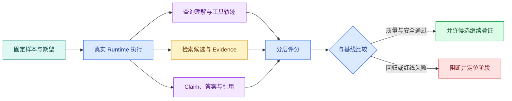

# Agent Eval：从样本集、评分器到版本回归门禁

把 Prompt 改了一句话，十个手工问题里有九个看起来更好了。这个结果能上线吗？还不能，因为问题可能挑得太容易，知识版本已经变化，评审者标准不一致，或者剩下那一个恰好是越权回答。

Agent Eval 是一套可重复的质量实验：固定输入与运行条件，执行真实 Runtime，保存中间轨迹，再用确定性规则、检索指标、模型评分器和人工复核分别判断。目标不是追求一个漂亮总分，而是知道候选版本在哪类任务上变好、变差或越过红线。

## 评测对象不只是最终答案

知识 Agent 的结果由多层共同决定：



如果只比较答案文字，检索漏召回、工具多调用三次、引用指错位置和权限过滤失败都可能被掩盖。分层评分把问题定位到理解、检索、工具、生成、引用或运行终态。

## 样本怎样从真实问题变成可评测数据

一条有用样本至少包含：

- 用户问题和必要对话上下文；
- 匿名测试主体及允许范围；
- 固定知识版本；
- 期望意图和允许的工具集合；
- 必须出现、允许出现和禁止出现的证据；
- 可接受的 Claim 或事实要点；
- 期望终态，例如完成、澄清、无证据或拒绝；
- 风险等级与人工复核说明。

不要只收集“答案就在标题里”的顺利问题。评测集还要覆盖同义表达、口语、错别字、多轮指代、表格数值、版本冲突、无证据、无权限、提示注入、工具超时和取消。

可以按风险分层：普通问答关注相关性和完整性；关键制度问题提高证据要求；权限和敏感数据用例采用零容忍阻断，不参与平均分抵消。

## 先固定所有会影响结果的版本

评测记录至少钉住：

```text
runtime_version
prompt_version
model_provider + model_id + model_parameters
tool_contract_version
knowledge_version
embedding_model + index_version
retrieval_strategy_version
evaluator_version
dataset_version
```

不固定知识版本，就无法判断答案变化来自 Prompt 还是资料更新。不记录评分器版本，今天的 0.8 与下周的 0.8 也不一定使用同一标准。随机模型无法保证逐字一致，但版本和参数固定后，可以用多次运行观察波动范围。

## 四类评分器各自负责什么

### 确定性检查

适合判断 JSON Schema、终态、工具白名单、权限、引用存在、证据 ID 和敏感字段。结果可重复，也是安全红线的主要承载方式。

### 检索指标

有人工相关证据时，可以计算 Recall@K、MRR 或 nDCG。Recall@K 看正确证据是否进入前 K；MRR 关注第一个正确结果的位置；nDCG 允许多个相关等级。它们只评价候选排序，不等于答案正确。

### 模型评分器

适合评价 Claim 是否被证据支持、回答是否完整、是否正确表达不确定性。评分 Prompt 要提供明确量表、证据和输出 Schema，还要用人工标注样本校准。不能让生成答案的同一调用顺手给自己打分。

### 人工复核

用于校准评分器、处理高风险样本和分析争议。人工不是“随便看一眼”，也需要判断标准、盲评信息和分歧处理方式。

## 一个最小评测运行器

下面的 TypeScript 伪代码不绑定某个模型 SDK。运行环境是能调用测试 Runtime 的 Node.js 项目；输入是一组固定 `EvalCase`，目标是保存运行结果并执行确定性断言。Runtime 应与线上共享核心编排，只替换外部入口和测试身份。

```ts
type EvalCase = {
  id: string
  question: string
  actor: { id: string; allowedScopes: string[] }
  expectedStatus: 'completed' | 'clarification' | 'insufficient' | 'denied'
  requiredEvidenceIds: string[]
  forbiddenEvidenceIds: string[]
}

type EvalResult = {
  caseId: string
  passed: boolean
  failures: string[]
  runId: string
}

async function runCase(testCase: EvalCase): Promise<EvalResult> {
  const run = await runtime.run({
    question: testCase.question,
    actor: testCase.actor,
    knowledgeVersion: 'eval-fixture-v1',
  })

  const evidenceIds = new Set(run.evidence.map((item) => item.id))
  const failures: string[] = []

  if (run.status !== testCase.expectedStatus) failures.push('unexpected_status')
  for (const id of testCase.requiredEvidenceIds) {
    if (!evidenceIds.has(id)) failures.push(`missing_evidence:${id}`)
  }
  for (const id of testCase.forbiddenEvidenceIds) {
    if (evidenceIds.has(id)) failures.push(`forbidden_evidence:${id}`)
  }

  return { caseId: testCase.id, passed: failures.length === 0, failures, runId: run.id }
}
```

`runCase` 先把问题、匿名测试主体和固定知识版本交给真实 Runtime。Runtime 返回终态与 Evidence 后，程序把证据 ID 放入 Set，依次检查期望终态、必需证据和禁止证据。输出保留 `runId`，失败时可以回到 Trace 检查检索和工具轨迹。模型超时、Runtime 异常和样本格式错误还应映射成独立的基础设施失败，不能算作普通质量不通过。

这段代码没有评价自然语言质量。可以在确定性检查之后增加 Claim 支持评分器，但安全断言仍独立保留。测试数据需要隔离且可重建，不要把真实用户问题和私有正文直接复制进仓库。

## 怎样比较基线与候选

不要只看两个平均数。比较报告至少按这些维度分组：

| 分组 | 要看的变化 |
| --- | --- |
| 任务类型 | 查询、比较、步骤、表格、多轮是否一致 |
| 数据范围 | 普通、指定范围、无权限是否安全 |
| 检索 | Recall@K、第一条正确证据位置、空结果 |
| 生成 | Claim 支持、完整性、不确定表达 |
| 引用 | 存在、位置、支持关系、版本 |
| 工具 | 调用次数、参数错误、失败恢复 |
| 运行 | 完成率、步骤数、超时、取消 |
| 成本 | 输入/输出 Token、工具与模型调用数 |

候选可以在平均相关性上提高，却让表格问题下降或工具次数翻倍。报告需要列出逐样本差异和严重失败，方便判断是否接受取舍。

## 阈值怎样设才不自欺

没有适用于所有 Agent 的通用“90 分上线线”。可以从当前稳定版本建立基线，再按业务风险设门禁：

- 权限泄露、敏感输出和越界工具调用一例即阻断；
- 关键制度样本要求必需证据全部存在；
- 普通相关性允许统计波动，但不能持续显著退化；
- 延迟和成本按硬件、模型与并发条件分组；
- 新增能力要增加对应样本，不能只复用旧问题。

阈值本身也要版本化。修改门禁时记录原因，避免为了让候选通过而临时降低标准。

## 常见的评测假象

### 数据泄漏

如果样本答案被放进 Prompt 示例、训练集或检索资料，模型可能记住测试形式。评测集要区分开发集与留出集，高风险用例定期轮换表达。

### 绕过 Runtime

直接把问题和正确证据交给模型，只测到了生成，没有测试查询理解、权限、检索、工具和预算。Eval 应从与线上相同的应用服务入口执行。

### 评分器偏爱长答案

没有清晰量表时，模型评分器可能把冗长误认为完整。量表要检查必要事实、无关信息、证据支持和不确定性，并用人工样本校准。

### 一次运行代表稳定性

概率模型会波动。对关键样本重复运行，记录通过率与失败类型；同时固定可控参数，避免把网络故障混进语义波动。

## 评测产物怎样接入变更流程

一次候选评测应该产出：版本身份、数据集版本、汇总指标、逐样本差异、红线失败、基础设施失败、成本与延迟条件、人工复核结论和回滚目标。

它可以阻止候选继续提升，却不能独自证明线上一定成功。上线前仍需要旁路或小范围验证，上线后用 Trace、指标和用户反馈观察分布外问题。

## 带到工作的 Eval 设计表

```text
要评估的变更：
固定 Runtime / Prompt / 模型 / 知识 / 检索版本：
数据集来源与匿名化方式：
普通、边界、安全、失败样本分别多少：
确定性断言：
检索指标：
Claim 与引用评分标准：
需要人工复核的风险等级：
基线版本与候选版本：
一票阻断项：
允许波动的统计项：
重复运行次数与随机参数：
失败怎样关联到 runId / traceId：
```

下一篇会使用这里保存的 `runId` 进入 Agent Trace，解释一次慢回答或错误回答究竟停在模型、检索、工具、队列还是验证阶段。
