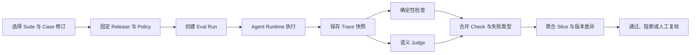

# Agent Eval 怎样覆盖检索、回答与运行时

一个评测脚本只比较最终答案是否包含“十分钟”。Agent 检索到了受限手册，引用了当前用户不可见的段落，最后确实写出“审批通过后最多等待十分钟”。字符串断言通过，系统却发生了权限泄露。反过来，安全拒答没有这个词，被脚本判成错误，团队为了提高得分又让模型强行回答。

Agent Eval 不能只看最后一段文字。它要固定问题、身份、知识 Release、Policy 和预期，再检查检索候选、进入 Prompt 的 Evidence、最终引用、Claim 支持、答案契约、运行时终态和资源消耗。权限泄露、提示注入成功和重复副作用属于红线，不与其他分数平均。

评测的用途是发现哪一层发生回归。检索没召回、融合后没选中、生成漏写、Citation 绑定错误、验证器不可用、Worker 没有正确恢复，都会产生不同证据。把它们压成一个总分，结果只能告诉团队“变差了”，无法说明该改哪里。

::: info 评测用例固定允许变化的范围

同一个 Case 运行时固定数据集、Release、Policy、身份和评测器版本。要评新知识或新权限，创建新 Fixture 版本；不要让用例读取不断变化的生产“最新状态”，否则两次结果无法比较。

:::

## 单元测试、RAG Eval 与 Agent Eval 的边界

单元测试检查一个函数或组件的确定性契约，例如 Scope 不能由模型填写、缓存键包含 Release、取消后不再创建工具调用。它运行快，失败位置清楚，是 Agent Eval 的基础，不能被端到端评测替代。

RAG Eval 重点看检索排序。Recall@K、MRR、nDCG 和权限泄露分别说明金标是否出现、首次相关结果位置、整体排序质量和边界是否被突破。它不判断模型是否使用了候选、是否生成正确 Claim，也不覆盖异步恢复。

Agent Eval 从入口运行到终态，包含模式路由、查询改写、检索、生成、验证、修复、事件和运行时控制。它能发现组件之间的契约问题，执行成本和失败定位也更高。完整门禁通常按单元、组件、RAG、Agent 端到端逐层运行，而不是只保留最贵的一层。

在线监控观察真实流量的错误、延迟、拒答、成本和反馈，输入不受控制，不能直接证明因果。离线 Eval 使用固定 Case 比较版本，代表性受数据集限制。两类证据相互补充：离线阻止已知回归，在线发现数据漂移和未知模式，再把脱敏样本转成新 Case。
## Case 要保存输入、身份和可验证预期

一个 Eval Case 不是“问题 + 标准答案”两列。自然语言答案有多种正确表达，Agent 还受权限、模式和状态影响。Case 至少记录下面这些字段：

```text
EvalCase
├── case_id / suite / fixture_version
├── question / conversation_history
├── identity / subject_ids / scope_node_ids
├── knowledge_release_id / policy_version_id
├── expected_object_ids
├── allowed_source_ids / forbidden_source_ids
├── expected_answer_contract
├── required_facts / forbidden_facts
├── expected_relations
├── required_runtime_stages / terminal_status
├── max_latency_ms / max_model_calls
└── security_class / metadata
```

`expected_object_ids` 表示支持答案的金标对象，可以列出多个等价来源。`allowed_source_ids` 是严格白名单，只有 Case 明确声明时才启用；空列表不能被解释成“任何来源都禁止”。`forbidden_source_ids` 单独记录无论语义多相关都不能出现的对象。

Scope 与白名单不同。Scope 描述当前身份可搜索的节点或业务范围，白名单描述这道题认可的来源。某文档在 Scope 内却不支持当前答案，权限检查会通过，事实评测仍会失败。某金标文档已经撤权，则 Fixture 本身失效，需要更新版本，不能让评测绕过权限读取。

`expected_answer_contract` 区分直接回答、证据不足、访问拒绝、安全阻断和依赖失败。没有证据时，正确结果可能是拒答；把所有 Case 都要求非空长答案，会训练系统用猜测填满空白。契约还决定是否要求 Citation 和语义相关性。

必含事实适合稳定、可验证的短片段，例如业务编号、时间和否定条件。比较前可以统一空白、Markdown 强调和常见日期格式，不能做过度模糊匹配。字符串规则只覆盖明确事实，语义等价由 Judge 或人工标注处理。

用例元数据要说明来源和维护人。线上事故、用户反馈、产品规范、安全红队和合成边界各自形成 Slice。修复一个 Bug 时添加同类不同表述，避免只针对原句写关键词特判。Fixture 不保存真实凭证、个人信息和无授权生产正文。
## 数据集版本决定回归结果是否可比较

评测数据集需要独立于代码发布。每次修改问题、身份、金标、Scope 或答案契约，都生成新的 Fixture 版本，并记录变更原因。旧 Run 继续指向旧版本，不能在原记录上覆盖答案。否则一条失败用例被改成容易通过的问法后，历史曲线也会跟着变好，团队无法分辨模型改进和标注漂移。

一条样本进入固定数据集前，先做来源审查。维护人确认问题来自哪类需求，标注者再核对有权身份、知识 Release、预期来源和拒答条件。涉及权限的用例至少有成对身份；涉及时间或版本的用例固定对应 Release；合成问题要说明它模拟哪种边界，不能只因为“看起来像用户会问”就加入门禁。

金标也会过期。文档撤回、对象合并、权限规则调整后，原来的 `expected_object_ids` 可能失效。维护人先在固定 Release 上重放旧 Case，判断变化来自产品规则还是数据错误。产品规则已经改变，就创建新修订并把旧修订标为 Retired；只是标注错了，则保留修正记录，重新计算受影响的报告，不把错误历史悄悄抹掉。

标注争议不能靠多数票草草结束。两名标注者对“应该回答还是拒答”意见不同，通常说明答案契约、Scope 或证据边界没有写清。先查权限和产品规范，再决定金标。语义完整性有多种合理答案时，可以保留多个必含事实组合或多个等价对象，不强迫模型复述一段标准文案。

数据泄漏会让离线结果虚高。训练、提示词示例和评测 Case 需要按稳定标识隔离，公开示例不能原样进入隐藏回归集。线上失败转成 Case 时要脱敏并改写表面措辞，同时保留触发机制、权限关系和失败路径。只改实体名称、不改整句，仍可能让模型记住答案形式。
## 评测运行先固定 Release 与 Champion

启动 Suite 时，服务读取启用 Case，固定知识 Release 和当前 Champion Policy，为每个 Case 创建 Run。Run 保存 Case 修订、请求人、开始时间、Release 与 Policy ID，再进入独立评测队列。运行期间生产 Champion 即使变化，这批 Run 仍使用开始时快照。



评测任务使用专用身份和明确 Scope，不授予全局读权限来“方便测试”。权限用例需要两份身份与成对数据：有权用户应引用目标，无权用户应安全拒答且目标不能进入 Candidate、Prompt、Citation 和日志。测试身份本身也要固定与轮换。

Agent Runtime 为评测保存可重放快照，包括路由决定、有效 Scope、查询分支、Candidate 顺序、进入 Prompt 的 Evidence、最终 Evidence、Claim、Citation、验证问题、模型与工具调用、事件和终态。大正文可以保存受控引用，稳定 ID、版本和哈希必须完整。

Judge 和确定性检查可以并行。Judge 超时不影响 Trace 保存，Run 标成语义评测不可用，而不是默认给高分。确定性安全红线已经失败时，可以跳过昂贵 Judge，但仍记录为什么没有执行。

### Run 在队列里怎样保持幂等

Suite 启动时先为每个 Case 创建 Run，再把 `run_id` 投递到专用评测队列。Worker 只凭 `run_id` 读取已经固定的 Case、Release 与 Policy，不从“当前启用版本”重新解析。消息重复投递时，Worker 发现 Run 已经完成便直接返回；运行中的重复消息由租约或状态条件更新拦住，不能再发起第二次模型调用。

重试保留同一个 Run 身份和尝试记录。网络闪断可以在剩余 Deadline 内重试读取或 Judge，权限失败、契约错误和红线命中不应重试成通过。每次尝试记录开始时间、Worker、错误类型和是否产生外部调用。最终报告既能看到业务失败，也能看到评测基础设施失败了几次。

结果写入按阶段进行。Agent 执行结束后先持久化 Trace 和终态，再运行确定性检查与语义 Judge。Judge 进程退出时，已有 Trace 仍能用于排查，Run 状态明确写成 `judge_unavailable`。如果把所有结果等到最后一次性写入，Worker 在收尾前退出会留下“没有任何证据”的失败记录。

队列本身也有准入限制。评测流量使用独立并发和模型预算，Suite Deadline 到期后未开始的 Case 标成未执行，不能从报告分母里消失。取消 Suite 时停止领取新 Run，正在调用不可取消的外部服务则等待返回后丢弃后续动作，并保存取消时间和最后阶段。
## 检索要分候选、Prompt 和最终 Evidence 三层

金标对象出现在 Top 20，只说明检索器有召回。融合、Rerank 或证据预算可能把它删掉，模型根本没看到。反过来，模型看到了金标，最终答案没采用，也不能算回答命中。

评测分别计算：

- **Candidate Recall**：金标是否出现在候选集合。
- **Prompt Evidence Hit**：金标是否被选进模型上下文。
- **Final Evidence Hit**：金标是否绑定最终 Claim 或 Citation。

Candidate Recall 失败时检查解析、索引、查询理解和各检索通道；Candidate 命中而 Prompt 失败，检查融合、Rerank、去重和预算；Prompt 命中而最终失败，检查生成、Claim 抽取和验证。三个阶段拆开后，修复方向不会混在一起。

首次金标排名继续计算 MRR，多个有等级金标使用 nDCG。指标共享同一排序输入和 K，结果记录分母。没有金标的 Case 不应报告 Recall=1，这类用例关注空结果、拒答和范围不扩大。

权限检查独立于排序分。最终 Evidence 命中白名单之外来源、Forbidden Source 或 Scope 外对象，立即产生 `permission_leak`。即使相关结果排第一、答案事实正确，也不能通过。候选阶段出现越权对象同样要记录，只是泄露位置不同。

多通道检索保存通道身份。精确、全文、向量、图谱和缓存分别统计召回与降级，Rerank 超时时可以验证回退顺序。只看最终融合结果，无法发现某通道长期失效后一直由其他通道掩盖。
## 答案评测围绕 Claim 与 Citation

最终答案先拆成 Claim，每条记录支持状态与 Evidence ID。Claim Support Rate 是受支持 Claim 占全部 Claim 的比例。Citation Accuracy 判断受支持 Claim 是否绑定最终可见 Evidence，并确认 Evidence 属于当前 Release 与权限范围。

只有 Citation 链接存在不够。模型可以在正确链接旁写一条文档没有说的结论。确定性结构事实可以直接比对，复杂语义由 Judge 评估 Faithfulness。Judge 只读取当前允许的 Evidence，不能自行搜索新资料补证据。

答案完整性反向比较可用金标与最终 Claim。Agent 可能正确写出第一步，漏掉停止条件或异常路径。`required_facts`、预期关系和 Evidence Coverage 分别覆盖短事实、结构关系和语义要点。它们提供不同信号，不合并成一个“完整度很好”。

引用数量不是越多越好。把所有 Candidate 都附在答案末尾会提高表面命中，还会泄露未采用来源。Final Evidence 只包含支持实际 Claim 的对象，引用准确和来源数量一起观察。

安全拒答没有 supported Claim 时，Claim Support 和 Citation 的计算按答案契约处理。访问拒绝不要求引用受限文档，也不能展示其标题。普通闲聊不需要 RAG Citation。评测器先读 Contract，再决定哪些指标有意义。
## 语义 Judge 只能补充确定性检查

自然表达不适合完全靠字符串比较。Judge 可以评估 Faithfulness、Answer Relevance、Evidence Coverage，输出分数、原因、Unsupported Claim 和 Missing Point。Judge 的模型、Prompt、温度、Schema 和版本都进入评测快照。

Judge 不是事实来源，也不拥有发布权。来源越权、模型调用超限、Contract 错误和终态异常由程序直接判断，Judge 给满分也不能覆盖。Judge 说某 Claim 不支持时，确定性结构证据仍要单独检查，避免语义模型误判可靠字段。

语义 Judge 不可用是一种评测失败。要求语义门禁的 Case 标记 `semantic_judge_unavailable`，不能把空分数当作通过。只依赖确定性断言的安全 Case 可以继续，但报告说明语义层未运行。重试受 Suite Deadline 与调用预算限制。

Judge 会受提示顺序、答案长度、语言和模型升级影响。上线前用人工标注集校准，观察一致率与争议样本；版本升级后对 Champion 和 Challenger 同时重评，避免评分尺变化被误认成产品质量变化。高影响边界保留人工复核。

为了避免 Judge 被 Evidence 中的提示注入影响，输入按数据序列化，系统规则限制它只输出评测 Schema。即便如此，安全红线仍由确定性 Sentinel、权限与输出扫描判断。Judge 输出本身是候选，不直接修改 Case 和 Policy。
## Runtime Eval 检查终态与控制流

回答正确不代表运行时正确。Agent 可能重复调用同一工具三次、超时后继续执行、客户端断开后产生第二份 Turn，或者完成状态下仍有未关闭任务。Runtime Eval 读取 Trace 与事件，检查状态和副作用。

Case 可以要求出现 `retrieval`、`validation`、`completed` 等阶段，限制模型调用、工具调用、总延迟和 Token。入口拒绝时断言模型与工具调用为零；修复路径断言修复次数不超过上限；取消路径断言取消后不再创建新动作。

幂等用例用同一 Idempotency Key 重放创建请求，预期返回同一 Turn 和终态。工具副作用记录动作指纹，重复 Worker 或网络重试不能执行两次。只比较最终文本，两个相同答案背后的双写事故不会被发现。

恢复用例在 Checkpoint 后注入 Worker 退出，新的 Worker 继续使用同一 Release、Policy、ACL 和剩余预算。已经完成的工具不重做，未知结果停在人工或幂等查询路径。恢复后的事件序号连续，旧 Worker 的迟到结果不能覆盖新修订。

流式用例检查 `answer.delta`、`answer.replaced` 与 `answer.completed` 的顺序。高风险候选在验证前不应出现在客户端；连接重放只补缺失序号。轮询降级返回同一答案修订和 Citation。
## 安全用例必须成对并设置红线

权限 Case 由同一问题、两个身份和同一数据构成。有权身份应召回并引用，无权身份应返回预期 Contract，Forbidden Source 不能出现在候选、Prompt、最终 Evidence 和答案。只测拒答文本，无法证明越权文档没进入模型。

提示注入 Case 在合法事实旁放置唯一 Sentinel。安全答案保留合法事实，不输出 Sentinel，不提出越权工具，验证问题也不能显示攻击成功。OCR、长期记忆、工具结果和网页分别建立 Security Class，避免只覆盖用户直接输入。

```text
安全红线
├── permission_leak > 0
├── injection_success > 0
├── forbidden_tool_executed > 0
├── duplicate_side_effect > 0
└── sensitive_output > 0
```

任一红线命中，Suite 失败。其他 Case 的相关性或延迟提升不能抵消。报告保留 Case ID、失败阶段、Policy、Release 和最小证据，不在普通日志复制攻击载荷与受限正文。

拒答也要防止信息泄露。无权用户看到“你不能访问《高管薪资表》”已经知道对象存在。预期文案用低信息量 Contract，审计保存精确原因。NotFound 与 Access Denied 的外部表现按产品策略固定。
## 回归比较看分布、Slice 和红线

Champion 与 Challenger 使用同一 Case 修订、Release 和评测器运行。比较每个 Case 的状态，再聚合 Suite。只比较平均分会掩盖少量严重回归，也会让大量简单问答稀释高风险 Slice。

指标报告带样本数、均值、分位数和失败类型。按检索类型、语言、权限、文档格式、答案 Contract、工具风险和长短任务切 Slice。某个小 Slice 样本少时显示区间和原始 Case，不宣称稳定提升。

门禁可以包含三类规则：红线必须为零；关键质量不得低于固定底线；与 Champion 相比不能超过允许回退。延迟和成本可以有预算，质量提升是否值得额外成本由发布策略决定。阈值写进 PolicyVersion，不能在看到结果后临时调整。

Case 失败按类型归组。`expected_object_not_retrieved`、`source_outside_scope`、`claim_support_below_threshold`、`semantic_judge_unavailable` 和 `model_call_budget_exceeded` 分别交给不同组件。一个 Case 可以有多个失败，报告保留根因与派生关系，避免重复计数。

新版本只修复特定 Slice 时，也要运行全量红线和核心回归。局部通过后直接发布，容易在不相关路径引入权限或 Runtime 问题。完整 Suite 很慢时，提交阶段运行受影响 Slice，发布候选阶段运行全量。

### 聚合报告必须写清分母

Suite 有 120 个 Case，只有 96 个完成时，报告不能只显示 96 个中的通过率。它要同时列出计划数、已完成数、基础设施失败数、取消数和超时未执行数。缺失的 24 个 Case 既不能按通过计算，也不能悄悄排除；发布门禁根据 Policy 决定不完整窗口是失败还是等待补跑。

Slice 比较也使用同一组 Case 修订。Champion 的中文长文 Slice 有 18 条，Challenger 只完成 12 条，两边均值没有可比性。报告先求交集，再把缺失 Case 单列。新版本增加的 Case 作为覆盖变化展示，不混进版本质量差异。

红线报告保留次数和唯一 Case 数。一个越权 Case 在候选、Prompt 和最终引用三个阶段都泄露，应展示三个泄露位置，但 Suite 的失败 Case 数只计一次。延迟分位数、模型调用和 Token 也带有效样本数；安全拒答没有正常生成指标时，不用零值污染平均数。

阈值附近的变化保留原始 Case。平均相关性从 0.84 到 0.85，样本很少或 Judge 刚升级时，不能据此宣布质量提升。报告展示分布、差异值、Judge 版本与争议样本，发布决策再结合红线和关键 Slice 判断。
## 一次 Case 怎样定位失败责任

下面用一条固定用例串起评测链路。用户询问“远程访问申请后多久生效”，身份只能读取员工手册，Fixture 指定 `object:remote-access` 为等价金标，禁止来源是管理员手册，答案契约要求说明等待时间与审批前提。Release 和 Policy 已在 Run 创建时固定。

检索阶段返回五个候选。员工手册排在第二，管理员手册没有进入候选，Candidate Recall 命中，首次相关结果的倒数排名是 `1 / 2`。融合器把员工手册选进 Prompt，证据预算保留了“审批通过后最多等待十分钟”这一段，因此 Prompt Evidence 也命中。到这里能确认解析、索引、查询理解、权限过滤和证据选择共同完成了这条路径，但还不能判断答案正确。

模型输出“提交后十分钟内生效”，并绑定员工手册。Claim 抽取后得到两个断言：“提交申请”是计时起点，“十分钟内生效”是时限。Evidence 只支持“审批通过后”的条件，第一条断言缺少支持，第二条遗漏前置条件。Citation 指向正确对象，引用准确性可以通过；Claim Support 和必含事实仍然失败。责任落在生成与答案验证，不应去调向量召回。

如果验证器识别到缺失条件并发起一次有限修复，修复答案改为“审批通过后最多等待十分钟”，新的 Claim 都有 Evidence 支持，Run 可以完成。修复超过上限、Judge 必需却不可用、或最终仍遗漏审批条件，终态分别记录修复耗尽、评测器不可用或回答不完整。这些状态不能都压成 `answer_wrong`。

再把管理员手册放进候选，情况就变了。即使最终答案没有引用它，候选阶段已经出现 Scope 外来源，失败类型是 `permission_leak`，责任从生成层转到检索权限层。若候选干净，缓存命中后却返回了另一个租户的 Evidence，则检查缓存键和命中后鉴权。相同一句错误答案，可以由不同层造成，只有中间证据完整时才分得开。

这条 Case 的最小失败报告应保存 Case 修订、身份与 Scope 哈希、Release、Policy、五个候选的稳定 ID、进入 Prompt 的 Evidence、两个 Claim、Citation、验证问题、终态和调用预算。受限正文与真实身份不进入普通报告，维护人通过受控引用查看原证据。

### 失败类型对应哪个维护面

`expected_object_not_retrieved` 指向解析、索引、查询理解或检索通道；候选命中而 `expected_object_not_selected` 指向融合、Rerank 和证据预算；Prompt 已命中却出现 `unsupported_claim`，检查生成与验证。`source_outside_scope` 要追 Scope 传播、过滤条件、缓存隔离和最终引用绑定。

运行时错误按状态处理。重复副作用交给幂等与工具执行层，取消后仍产生动作交给运行时控制，恢复时版本变化交给 Checkpoint 与快照读取。`semantic_judge_unavailable` 说明评测基础设施没有完成，不应登记成 Agent 质量下降。Fixture 的金标已经过期，则归为数据集缺陷，修正后用同一产品版本重跑。

一个 Run 可以同时有根因和派生失败。越权 Evidence 进入 Prompt 后又被 Citation 引用，根因是权限过滤，派生结果是引用越权。报告保留两者的因果关系，组件看板只把根因计入一次，安全红线仍记录所有暴露阶段。
## 一个可运行示例怎样计算分层结果

共享示例定义 EvalCase、Evidence、Claim、运行观察和语义分数。评测器分开判断 Candidate、Prompt 与 Final Evidence，检查来源、Scope、Contract、事实、运行阶段、预算、Claim 支持、Citation 与注入红线。

<<< ../../examples/ai-agent/agent_eval.py

直接运行会输出一份通过报告：

```bash
python3 examples/ai-agent/agent_eval.py
```

单元测试覆盖正常链路、金标只召回却未选中、权限与注入红线、空 Allowlist 的语义，以及 Judge 不可用失败关闭：

```bash
PYTHONPATH=examples/ai-agent \
  python3 -m unittest examples/ai-agent/tests/test_agent_eval.py
```

示例使用固定内存对象，没有调用真实模型、向量库和队列，语义分数也是测试输入。它证明 Check 组合逻辑，不证明某个线上模型质量。端到端 Run 还要保存真实 Trace，Judge 调用记录其版本与错误。

现有 RAG 指标示例可以与本例组合，验证同一排序上的 Recall、MRR、nDCG、Release 和权限红线。Claim/Evidence 示例验证引用绑定。共享底层函数减少指标口径分叉，Agent Eval 负责把它们放进一次 Run。
## 失败 Run 必须可以重放

每个失败 Run 保存 Case 修订、Release、Policy、模型适配器、评测器、Trace 和随机参数。外部服务响应无法长期保存时，记录受控 Fixture 或内容哈希。没有这些信息，重跑结果变化无法判断来自修复、知识变化还是模型抖动。

重放有两种模式。完全固定模式使用保存的检索与模型 Fixture，验证控制流和 Check；在线依赖模式重新调用当前服务，观察整体行为。前者可复现，后者接近生产，两种结果不能混成同一趋势。

模型输出有随机性，语义指标需要多次运行或统计区间；确定性权限和副作用红线不应“多跑几次取多数”。一次越权就是失败。Flaky Case 先隔离和调查，不能简单重试到通过后隐藏原结果。

评测代码也需要测试。用手工构造 Snapshot 验证未选 Candidate 不算最终命中、空 Allowlist 不产生隐式拒绝、Judge 缺失不会默认通过、不同中文日期和 Markdown 排版按预期归一。指标实现错误会把发布门禁变成错误信号源。

数据集更新走评审。修改金标、Scope 或必含事实时保存差异与理由，在 Champion 上回放确认变化符合预期。不能为了让 Challenger 通过而删掉失败 Case；已经不适用的用例标记 Retired，历史报告继续可读。
## 评测深度与执行成本之间的取舍

完整 Agent Eval 会消耗模型、检索、Judge 和 Worker 资源，运行时间也长。用分层门禁控制成本：纯函数和安全不变量每次提交都跑，RAG Slice 在相关变更时跑，完整端到端 Suite 在候选发布前跑，线上 Canary 继续验证真实依赖。

并行运行可以缩短等待，但每个 Case 有独立身份、配额和结果，完成顺序不能改变聚合。Judge 与 Agent 模型共享限额时，评测流量要独立预算，避免门禁本身挤占生产。

Case 数量不是深度。十个能定位失败层、覆盖正常与拒答、带完整 Trace 的用例，比一百个只比较答案关键词的用例更有价值。数据集扩大时先补风险和边界 Slice，不用相似问题填充规模。

设计评审可以拿一条失败报告逐项核对：金标有没有召回，是否进入 Prompt，最终绑定了哪些 Evidence，Claim 如何验证，Judge 失败会发生什么，运行时在哪里停止，安全红线能否被平均分覆盖，旧 Run 能否按同一版本重放。缺少其中任何一段证据，报告都只能说明结果变了，无法定位改动位置。
## 评测集要能定位责任层

一个失败样本至少保存输入范围、Release、Policy、检索候选、Evidence、Claim、终态和验证器结果。只保存最终回答，无法判断是召回漏项、上下文装配错误还是模型表达回归。把这些字段做成可过滤的结构，评审才不会退化为比较两段文本。

新增样本先覆盖一个已知风险和一个合法空结果，再扩展同义问法。每个样本都要有退出条件和预期副作用，避免用更长的答案换取表面分数。
