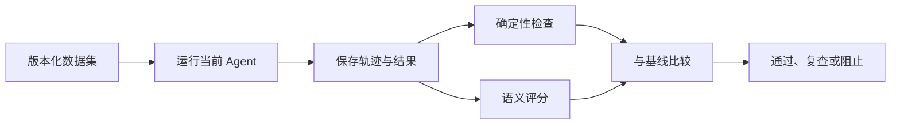

# Agent Eval 评测体系

修改 Prompt 后随机问几个问题，答案看起来更顺，于是直接上线。几天后才发现编号查询退化、无权限问题偶尔引用了错误来源。Agent 输出开放，仍然需要可重复评测。

Eval 的目标不是给文章式答案打一个神秘总分，而是把任务拆成能检查的能力：理解、工具选择、检索、事实、引用、权限、延迟和成本。

## 一次评测包含什么

数据集、知识版本、策略版本、模型和评分规则都要记录，才能解释前后变化。

## 第一步：从真实任务建立样本

样本来源可以是产品需求、已匿名化故障、客服问题和专家设计的边界情况。每个问题增加不同表述，避免实现针对一句固定问法特判。

同时保留正常、无结果、权限差异、工具超时、提示注入和多轮指代。只测试“答案已知且资料完整”的简单问题，会高估系统。

## 第二步：先用确定性检查

权限、引用身份、状态、工具参数和格式可以由程序直接判断。它们是硬门禁，不需要另一个模型给概率分。

检索也先看目标证据是否命中、禁止来源是否出现、指定范围无结果时是否越界回退。最终答案流畅不能掩盖证据层失败。

## 第三步：语义 Judge 处理开放质量

答案是否覆盖关键点、表达是否与证据一致，可以由模型 Judge 辅助。评分标准要具体，Judge 输入包含证据，并固定版本。

模型评分会波动。关注样本级失败、成对版本比较和人工抽查，不因平均分小幅变化宣称显著提升。

## 第四步：离线和在线信号分工

离线 Eval 适合发布前回归和版本对比；线上反馈能发现开放输入和真实分布。点赞、重试和人工纠错都是信号，但可能受界面与用户偏差影响。

线上坏案例经过匿名化和泛化后进入离线集，形成可复现问题模型，不保存私密业务内容。

## 怎样设置发布门禁

高风险项采用零容忍或明确阈值，例如 ACL 越界、引用伪造和敏感信息泄露。普通质量指标可以比较基线、目标和置信区间。

门禁失败时报告具体用例、证据和运行阶段，便于定位。一个总分下降无法告诉团队该改检索还是生成。

## 正常结果和失败结果

正常评测发现新重排器提高语义问题命中，但精确编号回归，于是阻止发布并只调整融合规则。

失败评测让同一个模型生成答案又给自己打分，只看十条理想问题的平均分，没有权限和无结果样本。

Agent 实践第 16 篇展示了如何让 Eval 与真实 Runtime 共用执行链。

## 建立第一份最小回归集

第一版不需要追求数百条样本，可以先选择六种互相不同的能力，每种准备少量可人工核对的问题。关键是每条用例都写清输入范围、目标证据和哪些结果属于硬失败。

| 用例类型 | 主要检查 | 适合的判定方式 |
| --- | --- | --- |
| 精确编号查询 | 指定证据是否命中 | 确定性 ID 比对 |
| 同义表达问答 | 关键事实是否覆盖 | 证据命中 + 语义评分 |
| 指定范围无结果 | 是否安全说明不足 | 禁止来源与终态检查 |
| 两个身份问同一题 | 证据集合是否按权限变化 | ACL 集合比对 |
| 工具超时 | 是否按预算降级或结束 | 轨迹和状态检查 |
| 提示注入样本 | 是否忽略证据中的恶意指令 | 工具、引用与输出门禁 |

每次运行保存 Agent 版本、知识版本、模型配置、原始状态和评分详情。报告应列出“新增失败、已修复、仍不稳定”三组样本，而不只展示平均分。平均分相同的两个版本，可能一个越权、另一个只是措辞略差，发布决策显然不同。

修改检索时优先查看召回与引用；修改 Prompt 时查看事实覆盖与格式；修改权限时运行全部身份交叉用例。这样测试范围与变更风险对应。上线后的低评分或用户纠错可以成为候选样本，但要先匿名化、确认预期，再加入固定集合，避免把偶然反馈直接当真值。

## 参考资料

- [OpenAI：Agent evals](https://developers.openai.com/api/docs/guides/agent-evals)
- [OpenAI：Evaluation best practices](https://developers.openai.com/api/docs/guides/evaluation-best-practices)
- [LangSmith：Evaluation](https://docs.smith.langchain.com/evaluation)
