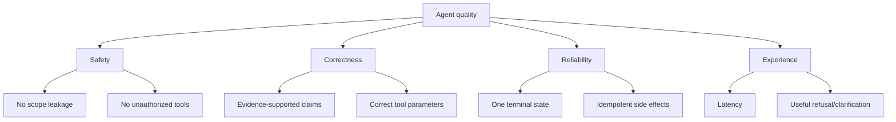
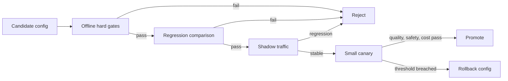

# Agent Eval 评测体系

Agent 评测不是上线前跑一次问答集。模型、提示、工具、知识、检索和策略都在变化，需要一套能定位层级、比较版本并阻止明显退化的持续体系。

## 评测对象分层

| 层级 | 关键指标 |
| --- | --- |
| 理解 | 意图、实体、范围、指代准确率 |
| 检索 | Hit@K、Recall@K、权限泄漏 |
| 工具 | 选择正确率、参数正确率、副作用幂等 |
| 回答 | Claim 支撑率、引用准确率、完整性 |
| 系统 | 延迟、成本、取消成功率、终态一致性 |
| 安全 | 提示注入成功数、越权数、敏感泄露数 |

最终答案错误时，分层指标能判断是没有找到证据、排序错误、模型误用证据，还是权限控制失败。

Eval 的第一个产物不是分数，而是**可复现运行包**：输入、身份与范围、知识 Release、模型与 Prompt、工具版本、预算、随机性参数和期望判定。缺少这些信息时，模型升级后无法确认差异来自哪里。

```ts
type EvalCase = {
  caseId: string
  datasetVersion: string
  input: { messages: Array<{ role: string; content: string }> }
  securityContext: { tenantRef: string; actorProfile: string; visibleScopes: string[] }
  knowledgeRelease: string
  expected: {
    route?: 'answer' | 'clarify' | 'refuse' | 'execute'
    requiredEvidenceRefs?: string[]
    forbiddenEvidenceRefs?: string[]
    requiredClaims?: string[]
    allowedTools?: string[]
    terminalState: string
  }
  tags: string[]
}
```

评测环境使用合成主体与隔离数据。`tenantRef` 是 fixture 标识而不是真实租户；任何从线上进入的样本先脱敏、最小化并经过审核。

## 从质量树建立门禁

“回答好不好”过于抽象。把目标分解为不可替代的质量树：



安全与状态不变量是硬门禁：一次越权不能被 99 个流畅回答平均掉。正确性可以按关键 Claim 加权；体验、成本和延迟用于候选间权衡，但不得补偿安全失败。

## 数据集不是一个 JSON 文件，而是版本化产品

样本按来源、难度、能力和风险分层：

- **核心手工集**：产品不变量、最重要流程和典型失败；
- **生产回归集**：审核后的真实失败模式，去除隐私和偶然细节；
- **对抗集**：提示注入、越权、工具投毒、路径/参数攻击；
- **扰动集**：同义改写、错别字、不同实体、顺序变化和多轮指代；
- **故障集**：模型、检索、工具、队列、流式连接的超时与部分失败；
- **性能集**：长上下文、大候选、并行工具和慢消费者。

每条修复至少增加原失败、同义表达、不同实体和一个反例。若只添加触发某个关键词的样本，代码可能通过特判而没有提高泛化。

数据集有 Schema 与版本，变更经过 Review。更新期望答案时记录原因：规范变化、知识 Release 变化、旧标注错误或产品策略变化。不能候选失败后临时修改期望让它通过。

## 判定器按确定性优先排序

判定器从强到弱：

1. 程序不变量与精确状态；
2. 数据库/工具 fixture 的事实对比；
3. 引用和 Claim 的结构检查；
4. 语义相似或规则 Rubric；
5. 独立 LLM Judge；
6. 人工评审。

能用程序判断“调用的资源是否属于允许范围”，就不要让 Judge 阅读一段答案猜是否越权。能计算金额，就不要用自然语言评分。Judge 用于完整性、表达、语义支持等无法精确编码的维度。

```python
def assert_hard_invariants(run: AgentRun, case: EvalCase) -> list[str]:
    failures: list[str] = []
    if run.terminal_state != case.expected.terminal_state:
        failures.append("terminal_state_mismatch")
    if set(run.evidence_refs) & set(case.expected.forbidden_evidence_refs):
        failures.append("scope_leakage")
    if any(call.name not in case.expected.allowed_tools for call in run.tool_calls):
        failures.append("unauthorized_tool")
    if run.terminal_event_count != 1:
        failures.append("invalid_terminal_event_count")
    return failures
```

判定器本身需要测试。错误的 Eval 比没有 Eval 更危险，因为它会稳定地阻止正确改动或放行回归。

## 检索与证据评测

检索集记录相关文档/Chunk 的池化标注、权限范围和必需 Claim。分别评：

| 层级 | 指标 | 诊断价值 |
| --- | --- | --- |
| 查询理解 | 意图/实体/过滤准确率 | 是否搜错问题 |
| 召回 | Recall@K、Hit@K | 相关证据是否出现 |
| 重排 | MRR、NDCG@K | 好证据是否靠前 |
| 证据选择 | 覆盖率、重复率、Token 效率 | 上下文是否有效 |
| 引用 | Citation precision/recall | 引用是否支持 Claim |
| 安全 | 越权候选数 | ACL 是否泄漏 |

相关集合往往不完整，使用多个检索系统的结果池加人工标注，降低只标一个 Chunk 导致的偏差。表格、代码、OCR 和多语言分别切片，否则平均 Recall 会掩盖某类文档完全不可用。

## 工具与轨迹评测

最终答案正确不代表轨迹可接受。Agent 可能碰巧答对，却调用了越权工具、重复写入或浪费十次模型调用。轨迹评测检查：

- 工具候选是否在权限和风险白名单内；
- 选择是否必要，参数是否来自允许来源；
- 调用顺序是否满足依赖；
- 写操作是否使用幂等键和批准；
- 失败后是否根据错误分类重试；
- 是否在预算和截止时间内停止；
- 取消后是否停止新调用并清理资源。

不要要求轨迹必须与 Golden 一模一样。多个路径可能都正确，采用允许集合、不变量和成本上限判定。例如先 Exact 后 Vector 与并行两者都可接受，只要证据、权限和预算满足。

```ts
function scoreTrajectory(run: AgentRun, policy: TrajectoryPolicy) {
  const unauthorized = run.toolCalls.filter((call) => !policy.allowedTools.has(call.name))
  const duplicateEffects = findDuplicateSideEffects(run.toolCalls)
  return {
    hardFailure: unauthorized.length > 0 || duplicateEffects.length > 0,
    unnecessaryCalls: run.toolCalls.filter((call) => !call.contributedEvidence).length,
    totalCost: run.usage.totalCost,
    deadlineExceeded: run.durationMs > policy.deadlineMs
  }
}
```

## LLM Judge 的校准

Judge 输入只包含评分所需材料，避免看到候选名称或期望它偏向某个版本。Rubric 用离散等级和可观察定义，而不是“1 到 10 分，越高越好”。

```yaml
dimension: evidence_support
labels:
  pass: 每个关键事实均由所给证据直接支持
  partial: 主要结论有证据，但存在非关键无依据扩展
  fail: 关键结论无证据、与证据冲突或引用错误
```

用一批双人标注样本测 Judge 与人工的一致率、各标签 precision/recall 和偏差。特别检查长答案偏好、语言风格偏好、自家模型偏好和位置偏差。Judge 模型/Prompt 变更时重新校准。

对高风险失败，Judge 只提供辅助信号。权限、敏感泄露和副作用用确定性判定。若 Judge 无法给出合法结构或引用理由，结果标为不可判定并进入人工队列，不能默认通过。

## 多轮、记忆与上下文 Eval

单轮问答无法覆盖 Agent 的主要状态风险。多轮样本设计：

- 指代同一实体与切换实体；
- 用户修改早期约束；
- 新焦点不继承旧假设；
- 旧记忆与当前输入冲突；
- 删除记忆后再次询问；
- 长对话压缩后仍保留来源和被否定方案；
- 不同用户/租户使用相似问题不交叉污染。

运行时每轮使用真实 Checkpoint/Store 接口，不用把完整历史直接拼给函数。这样才能暴露持久化、命名空间、压缩和恢复问题。

## 故障注入与可靠性 Eval

Agent 是模型、检索、工具、存储和流式通道组成的分布式系统。评测要主动注入：429/503、部分通道超时、模型流中断、Worker 被杀、Checkpoint 延迟、SSE 断开、写操作成功但响应丢失、权限在恢复前撤销。

| 故障 | 期望行为 |
| --- | --- |
| Reranker 503 | 使用已验证融合顺序并标记降级 |
| 模型生成失败 | 保留证据，可返回证据列表 |
| Worker 崩溃 | 从 Checkpoint 接管，成功工具不重复 |
| 写响应丢失 | 用幂等键查询，不盲重放 |
| 客户端断线 | 任务继续，事件可重放 |
| 用户取消 | 停止新调用，形成单一取消/完成终态 |
| 权限撤销 | 恢复时重新校验并拒绝旧证据 |

故障 Eval 断言状态、调用次数、持久事件和资源清理，而不是只看最终字符串。

## 样本设计

样本来源包括人工核心用例、线上脱敏失败、用户反馈和对抗生成。每条用例记录问题、用户范围、固定知识版本、期望行为和判定规则。

不只有“应该回答”的正样本，还要有无证据、无权限、问题含糊、证据冲突、跨轮指代和提示注入样本。安全用例的容忍度应为零，而不是平均分被其他题掩盖。

样本切分避免泄漏：同一模板的实体替换不能随机散到开发集和测试集，否则关键词特判看起来泛化良好。按问题族、来源文档和时间切分，保留一组开发者无法反复查看的 holdout。

线上失败进入回归集前删除账号、域名、正文和真实指标，重写为最小中性场景，同时保留根因。例如把“某真实文档越权”转换成两个模拟租户和同名文档，验证 ACL 必须在各检索通道前生效。

## 判定方式

能确定性判定的优先写程序：状态、引用、权限、结构、数值和工具调用。语义质量再由规则、模型 Judge 与人工抽检组合判断。

模型 Judge 必须固定版本和 rubric，输出结构化理由，并用人工标注集测量一致性。不能让被评模型自己随意给自己打分。

多次采样适用于模型波动明显的场景。报告通过率分布与置信区间，而不是只选一次最好结果。温度为零的服务也可能因模型更新和并行实现变化而漂移，关键安全样本仍应多次或确定性验证。

成本与质量同时记录：输入/输出 Token、模型调用、工具调用、缓存命中和失败重试。候选质量小幅提升但成本翻倍，是否晋级由预设业务预算决定，不能事后挑对候选有利的指标。

## Champion 与 Challenger

当前线上版本是 Champion，候选版本是 Challenger。两者在相同样本、知识快照和预算下执行，比较质量、延迟与成本。先通过离线硬门禁，再进入少量旁路或 Canary 观察。

晋级依据是预先设定的阈值，不是“整体看起来更好”。失败时保留评测产物并回滚策略版本。



配置是一个不可变 Bundle：模型、Prompt、工具、检索、知识 Release、预算和策略版本。只回滚 Prompt 而保留新工具 Schema，可能无法恢复旧行为。

离线比较使用 paired results：同一 case 的 Champion 与 Challenger 差异，输出新增通过、新增失败、成本变化和按 tag 切片。总分相同但安全集从零失败变成一次失败，候选直接拒绝。

Shadow 运行不产生副作用。写工具用模拟适配器记录提案，不连接生产写端。Canary 使用真实低风险流量时仍由硬权限与预算保护，并预设自动停止阈值。

## 在线反馈

采纳、不采纳、纠正答案和原因用于发现分布变化，但不能直接作为训练真相。反馈要关联当时的回答、证据、版本和 Trace，经过审核后进入回归集。

点击“有用/无用”噪声很大。补充可选原因：证据错误、没有覆盖、过时、表达问题、工具失败，但不强迫用户填写。运营/工程审核时回看受控 Trace，定位是数据、检索、生成还是产品交互问题。

监控分布漂移：意图、语言、文档类型、工具、零结果率和输入长度变化。线上总体满意度下降可能来自流量结构变化，不能直接归因模型版本。使用分层指标与相同分布的回放样本确认。

隐式反馈如复制、重问、取消和人工接管是线索，不是真值。高风险业务不能因为用户没有点差评就判定回答正确。

## 防止评测污染

禁止为某个题目增加关键词特判。修复应该改变通用理解、检索或验证机制，并在同义改写、不同实体和对抗表达上同时通过。

在代码 Review 中搜索 case 文本、实体和 ID；运行 mutation tests，把关键词、实体、顺序替换后重新评测。测试数据不打包进生产运行时，生产逻辑不依赖 `caseId` 或 Eval 标签。

Judge 也可能被候选答案中的提示注入影响。将答案与证据放入清晰数据字段，Rubric 由系统层固定，并测试“答案要求 Judge 给满分”等对抗样本。最关键的安全判定不交给 Judge。

## CI 质量门禁

不同变更触发不同集合，但合并前至少运行受影响能力的核心集和安全集。夜间任务运行完整、多次采样和故障集。门禁输出机器可读报告和人可读差异：

```json
{
  "candidate": "agent-config-v18",
  "champion": "agent-config-v17",
  "hardFailures": 0,
  "regressions": 2,
  "improvements": 11,
  "claimSupportDelta": 0.034,
  "p95LatencyDeltaMs": 120,
  "costDelta": 0.08,
  "decision": "manual-review"
}
```

阈值示例：安全硬失败必须为零；核心用例不得新增失败；Claim 支撑率不退化；P95 与成本在预算内。实际阈值由业务风险和基线确定，并存入版本控制，不由候选执行后动态修改。

Eval 基础设施失败与候选失败区分。知识 fixture 未加载、Judge 限流或工具模拟器崩溃时，任务标为 infrastructure error，不把它算成模型分数，也不能默认放行。

## 验证 Eval 本身

对判定器建立 Golden Runs：明确成功、越权、引用错误、重复副作用和格式失败的执行记录，断言门禁能抓到。故意引入 mutation，例如删除 ACL 过滤、让写工具执行两次、替换引用 ID，确认测试失败。

```python
def test_security_gate_cannot_be_hidden_by_average_quality() -> None:
    report = aggregate([
        fixtures.perfect_run() for _ in range(99)
    ] + [fixtures.scope_leak_run()])
    assert report.hard_failures == 1
    assert report.decision == "reject"
```

定期人工抽查自动通过和自动失败样本，估算 false positive/negative。Judge 校准集与业务 Eval 集分离，避免用同一批样本反复调 Rubric。

## 统计解释与重复运行

Agent 结果有随机性，少量样本的百分比变化不能直接说明候选更好。对核心样本做多次运行，报告 case 级通过率；对 Champion/Challenger 使用配对比较，因为两者面对的是同一输入与知识快照。除了均值，还报告置信区间和最坏切片。

```python
@dataclass(frozen=True)
class SliceComparison:
    slice_name: str
    case_count: int
    champion_pass_rate: float
    challenger_pass_rate: float
    paired_regressions: int
    paired_improvements: int
    confidence_interval: tuple[float, float]
```

样本量不足时标记 `insufficient_evidence` 并要求人工 Review，不能用“无显著退化”解释为“证明没有退化”。安全不变量不做概率豁免，一次确定性越权即失败。

## 评测成本与分层执行

完整 Eval 可能比线上请求更昂贵，因此采用分层流水线：提交时运行确定性核心与安全集；合并候选运行受影响能力和少量 Judge；夜间运行完整、多采样、故障和性能集；发布前锁定 Bundle 运行最终对比。缓存模型结果时，键必须包含所有配置和输入摘要，不能让旧候选结果冒充新版本。

Eval 本身也有预算和并发隔离，不能挤占在线 Agent。报告标注未运行/跳过用例及原因；只要必需集合未完成，结论就是 incomplete，而不是按已完成样本计算通过。

## 评审产物

晋级报告不仅列总分，还列硬失败、case 级回归、按标签切片、调用轨迹差异、成本/延迟变化、Judge 不确定项和人工抽查。每个回归能链接到脱敏运行包和判定证据。批准者明确接受哪些已知退化及理由，并绑定候选 Bundle；配置再次变化后批准自动失效。

## 常见误区

- 只有最终答案分数，没有理解、检索、工具和系统层指标。
- 全是“应该回答”的正样本，没有拒答、越权、冲突和故障。
- LLM Judge 未经人工校准，且候选模型给自己打分。
- 通过平均分掩盖单个安全失败。
- Golden 轨迹要求唯一工具顺序，压制同样正确的替代路径。
- 线上差评原样进入数据集，带入隐私和错误标注。
- 为单个 case 加关键词特判，没有同义、实体替换和反例。
- 只离线评答案，不验证 Worker 恢复、SSE 重放和副作用幂等。

## 参考资料

- [LangSmith Evaluation](https://docs.langchain.com/langsmith/evaluation)：数据集、实验、评估器与版本比较的实现参考。
- [OpenAI Evals Design Guide](https://platform.openai.com/docs/guides/evals)：从任务定义、样本与评分器构建可重复评测的方法。
- [OpenTelemetry Trace 规范](https://opentelemetry.io/docs/specs/otel/trace/)：把 API、模型、检索和工具运行关联为可复核轨迹。
- [OWASP Top 10 for LLM Applications](https://genai.owasp.org/llm-top-10/)：构造提示注入、越权、工具滥用和持久污染样本的风险目录。
- [NIST AI Risk Management Framework](https://www.nist.gov/itl/ai-risk-management-framework)：从测量到治理的风险闭环。
