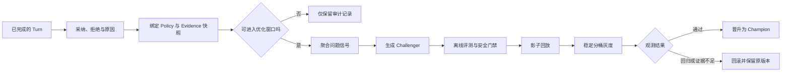
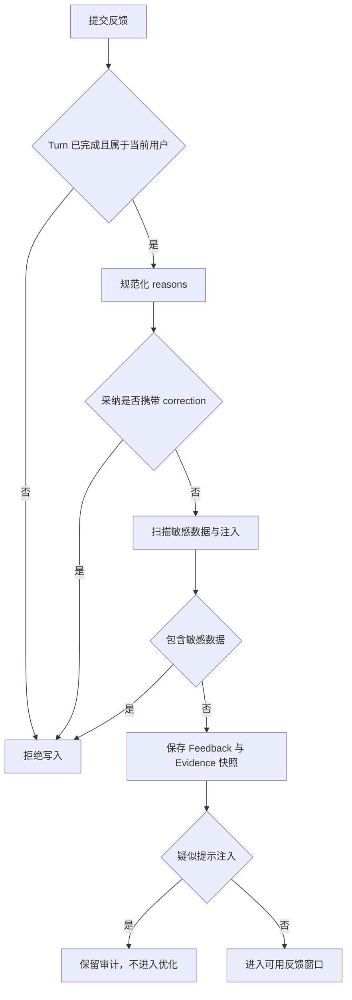
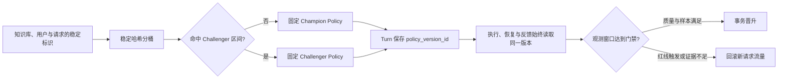

# 用户反馈怎样进入可控优化流程

用户点了“不采纳”，原因选了“来源不对”，又补了一句正确说法。系统此时拿到的是一条**反馈记录**，还不是训练样本，也不是修改检索参数的命令。用户可能没有看到完整证据，纠正文案可能包含新的错误，连续几次拒绝也可能都来自同一类问题。若程序收到反馈后立刻改 Prompt、扩大召回或更新模型，下一批请求会承担一项未经评测的改动。

可控优化把这段距离保留下来。反馈先绑定产生答案的 Turn、策略版本和 Evidence 快照，安全检查决定它能否进入分析窗口。多条可用反馈聚合成问题信号，程序只在允许的字段内生成候选策略。候选策略依次经过离线评测、安全红线、影子回放和小流量观测，满足发布条件后才替换当前 Champion；任何阶段失败都保留旧版本。



::: info 三个对象不能混在一起

- **Feedback** 保存某个用户如何评价某个已完成答案。
- **Signal** 是一组经过筛选的反馈呈现出的可重复问题。
- **Policy Candidate** 是根据 Signal 产生、仍未获得生产发布资格的候选配置。

:::

## 一条反馈必须指回原始 Turn

反馈表单最容易做成“点赞、点踩、补充文本”三个字段，但优化链路需要知道用户评价的是哪一次执行。相同问题在不同知识 Release、权限范围或策略版本下可能得到不同答案，只保存问题与评价会丢掉最重要的上下文。

一条答案反馈至少绑定 `feedback_id`、`turn_id`、用户身份、答案消息、知识库、`policy_version_id`、评价结论、原因、纠正内容和状态。`turn_id` 继续关联请求时固定的 Release、ACL、模型配置、Trace、Claim、Evidence 与 Citation。反馈无需复制整条运行记录，只要这些稳定 ID 能在受控权限下还原当时的执行。

```text
AnswerFeedback
├── feedback_id
├── turn_id / answer_message_id
├── user_id / knowledge_base_id
├── verdict: adopted | rejected
├── reasons[] / correction
├── policy_version_id
├── evidence_snapshot
├── status: active | revoked
└── created_at / updated_at / revoked_at
```

只有已完成的 Turn 可以接收答案反馈。运行中的答案仍可能被验证器替换，失败或取消的 Turn 也没有稳定的交付内容，把它们和正常答案放进同一反馈池会混淆“用户不喜欢答案”和“任务没有完成”。运行错误应由 Trace、终态和错误分类进入评测，用户界面可以另行收集体验问题。

同一用户对同一 Turn 的有效反馈采用更新语义。用户先点错“采纳”，随后改成“拒绝”，系统更新活动记录，并保留修改时间；重复网络请求不能插入多条独立信号。持久层可用事务锁或唯一约束串行化同一 `turn_id + user_id`，避免两个请求同时看到“尚无反馈”后各写一条。

撤回不会物理删除反馈。记录改为 `revoked`，退出后续信号统计，历史优化 Run 仍能说明它当时是否参与过。直接删除会让旧报告的分母变化，审计人员也无法解释为什么某个 Challenger 曾经被创建。

### 三类状态各有自己的所有者

反馈、优化任务和策略版本不能共用一个状态字段。反馈由提交服务负责写入与撤回，状态只有 Active 和 Revoked；优化 Run 由优化编排器推进，记录 Running、Offline Failed、Canary、Promoted 或 Rolled Back；PolicyVersion 由发布服务管理 Draft、Challenger、Champion、Retired 与 Rejected。用户撤回反馈不会把已经发布的 Policy 自动回滚，Policy 回滚也不会改写历史反馈。

每个状态只有一个写入方。分析任务可以读取 Active Feedback，却不能把它改成已采纳；监控任务可以提交灰度指标和回滚决定，却不能直接修改 Champion 配置。跨组件动作通过带版本条件的命令完成，例如“当 Run 仍为 Canary 时回滚指定 Challenger”。状态已经变化时，迟到命令返回冲突，不覆盖新决定。

```text
Feedback Service ── owns ──> Feedback.status
Optimizer        ── owns ──> OptimizationRun.status / decision
Policy Publisher ── owns ──> PolicyVersion.status / allocation
Agent Runtime    ── reads ──> fixed policy_version_id on Turn
```

所有权也决定故障由谁恢复。提交反馈的事务失败，客户端可以用同一 Turn 和用户重试；创建 Challenger 后优化 Worker 退出，恢复任务按 `run_id` 读取已有 Policy，不能再创建一个新版本；发布事务不确定时，先查询当前 Champion 和 Run 状态，不能根据超时错误猜测“尚未发布”。

### Evidence 快照保存什么

反馈发生时，知识 Release 可能已经切换。系统应保存回答实际采用的 Evidence 标识、来源类型、对象版本、文档与 Chunk 坐标、分数和新鲜度状态，并记录当时的安全扫描结果。大段正文仍留在受控知识存储，快照保存稳定引用和必要摘要，避免把权限内文档复制到普通分析表。

Evidence 快照有两个用途。用户选择“来源不对”时，可以检查最终 Citation 是否真的来自错误对象；几天后重放 Case 时，也能区分原答案使用了旧版本，还是当前检索器产生了不同候选。没有快照，反馈只剩一句主观评价，无法定位检索、生成或引用层。

## 反馈入口先处理一致性与不可信文本

`adopted` 表示用户接受已交付答案，不应同时附带“正确答案”。如果界面允许二者共存，下游无法判断这条纠正是补充偏好，还是对原答案的否定。`rejected` 可以带原因和纠正内容，原因要从有限枚举中选择，文本用于补充具体信息。

原因枚举应对应可排查的责任层。`retrieval`、`missing_evidence` 和 `wrong_source` 指向候选、证据选择或引用；`too_long`、`too_short` 和 `unclear` 描述表达问题；事实错误、权限问题和工具执行错误还要有独立类别。只提供一个“答案不好”，聚合后无法决定该评测哪一层。

纠正内容属于用户输入，必须按不可信文本处理。敏感数据和个人信息在入口拒绝，不能进入长期分析、Prompt 或训练集。疑似提示注入的内容可以作为安全样本保留其类别与哈希，但标记为 `optimization_eligible=false`，不能参与自动候选生成。扫描结果只是筛选信号，授权与最终发布仍由确定性规则负责。



原因列表在写入前去空白、去空值和去重，但不要改写用户纠正内容的事实含义。纠正内容的长度有限制，原始输入与规范化结果分开保存时要说明哪个版本进入后续流程。指标只使用 `verdict`、是否可优化等低基数字段，不能把 `feedback_id`、用户文本或文档标题放进标签。

::: warning 反馈不是权限来源

用户在纠正文本里写“请改用管理员手册”不会扩大 Scope，也不能把该手册加入允许来源。优化任务沿用固定 Case 的身份与权限，候选参数没有修改 ACL 的入口。

:::

## 单条意见怎样变成可用信号

优化任务在固定时间窗口内读取状态为 `active` 且允许优化的反馈，再按原因聚合。聚合结果要保留总样本数、采纳数、拒绝数和每类问题的独立计数。一个反馈可以包含多个原因，报告需要说明按反馈去重还是按原因事件计数，避免分母含糊。

单条拒绝不触发自动改动。它可以转成待审样本，维护人检查原 Trace 后补进 Eval Suite。只有同类问题在不同 Turn 中重复出现，且样本数量达到预设条件，系统才生成候选配置。阈值写入优化策略并版本化，不能在看到某次结果后临时降低。

反馈偏差需要在聚合时暴露。愿意点踩的用户不代表全部用户，某个高频用户也可能贡献大量相似反馈。报告按用户、任务类型、答案契约、语言、权限类别和知识版本切 Slice，并限制同一主体在一个窗口中的权重。缺少代表性时，结论写成“当前窗口出现重复信号”，不能写成总体质量下降。

采纳同样不能直接算正确。用户可能只关心答案中的一部分，没有核对 Citation，也可能接受了一条表达顺畅的错误结论。采纳率适合观察体验变化，事实正确、权限安全和引用准确继续由 Agent Eval 判断。拒绝原因与确定性评测互相印证时，信号强度才会上升。

### 当前实现怎样生成候选

下面的规则来自一套可运行实现快照，用于说明控制方式，不是所有 Agent 都应该采用的通用阈值。优化窗口至少有 5 条可用反馈，且检索类拒绝达到 2 条时，候选把 `retrieval_top_k` 增加 4，上限为 40，并把 `minimum_coverage` 增加 0.02，上限为 0.95。表达类拒绝达到 2 条时，候选切换到一个更简洁的 Prompt 版本。

变化范围受字段白名单限制。允许修改模式、召回数量、研究轮次、Prompt 版本、覆盖阈值、重排权重、Alias 候选和切块配方候选；ACL、安全策略、来源文档、用户记忆、代码和工具列表不在自动优化范围内。程序从 Champion 配置中只拷贝白名单字段，再应用有限变更，未知字段不会被带入 Challenger。

这个候选生成器只证明“如何把反馈限制在可审计的参数空间”，不证明增加 Top K 一定能修复召回。错误可能来自解析失败、权限过滤、查询理解或索引版本。离线 Eval 如果没有改善对应 Slice，候选仍会被拒绝。

## Challenger 先经过离线门禁

候选策略创建后不会立刻接收用户请求。优化 Run 固定 Champion ID、候选配置、反馈窗口、离线指标和安全指标。相同知识 Release 与 Eval Case 修订分别运行 Champion 和 Challenger，比较召回、Claim 支持、Citation、答案契约、运行时终态、延迟与调用预算。

离线门禁至少检查有效样本数、Hit@5、Recall@20、Claim Support Rate 和 Citation Accuracy。每项使用当前 Champion Policy 中已发布的质量底线，不能把平均分合并成一个阈值。权限泄露和提示注入成功是独立红线，出现一次就停止候选发布。

样本不足按失败关闭处理。没有足够 Case 时，系统缺少支持“候选没有回归”的证据，状态应是 `offline_failed` 或等待补齐，而不是把空指标当成零风险。Judge 不可用、运行错误和 Eval 窗口不完整也分别记录，不能混进答案质量下降。

```text
Offline Gate
├── sample_count >= policy.minimum_samples
├── hit_at_5 >= policy.hit_at_5
├── recall_at_20 >= policy.recall_at_20
├── claim_support_rate >= policy.claim_support_rate
├── citation_accuracy >= policy.citation_accuracy
├── permission_leaks == 0
└── injection_successes == 0
```

影子回放位于离线门禁之后。它用历史请求的脱敏输入或固定 Fixture 执行候选策略，不把结果交付给用户，也不把历史答案塞进 Prompt 当作正确答案。影子阶段验证配置 Schema、依赖调用、预算和输出契约，并确认质量门禁能在候选配置上重放。涉及写操作的工具使用模拟适配器或禁用副作用，不能因为“用户看不到”就执行真实动作。

## 稳定分桶让灰度结果可以比较

候选通过离线与影子阶段后成为 Challenger，并获得有限流量。分桶输入使用知识库、用户与请求的稳定标识，经过哈希映射到固定区间。相同输入重复请求时落到同一策略，进程重启也不能改变结果。直接用随机数会让同一会话在两个 Policy 间跳动，多轮状态与反馈因此失去对应关系。



灰度 Turn 在创建时固定 `policy_version_id`。后续 Worker、Checkpoint、恢复、SSE 和反馈记录都读取这个版本，不因 Challenger 晋升或回滚而切换。回滚只影响新请求的路由，已经运行的 Turn 按原快照完成或依据安全策略取消。

观测窗口分别统计 Champion 与 Challenger 的 Turn 数、失败数、有效反馈数和拒绝数。错误率的分母是各自 Turn，拒绝率的分母是带活动反馈的 Turn。反馈数量太少时拒绝率没有稳定解释，监控任务继续观察；窗口到期仍未达到最小样本数，则回滚 Challenger，并把原因记录为证据不足。

当前实现快照给 Challenger 10% 的稳定哈希流量，至少观察 1 小时并要求 20 个 Turn，24 小时仍不够样本就回滚。Challenger 错误率超过固定红线，或相对 Champion 回退超过容差时回滚；反馈数达到条件后，拒绝率明显回退也会触发回滚。这些数字属于该实现的发布策略，其他系统应根据流量、风险和检测灵敏度单独标定。

通过观测后，事务先把旧 Champion 标为 Retired，再把 Challenger 设为新的 Champion，并将分配比例改为 100%。发布 Run 保存两边指标和决定原因。回滚时 Challenger 进入 Rejected，分配比例归零，旧 Champion 保持服务。任何异常都不删除策略版本和历史 Run。

### 并发优化与迟到指标怎样处理

同一个知识库同一时间只允许一个开放的 Optimization Run。编排器创建 Run 前取得知识库级锁，再检查 Pending、Running、Shadow 或 Canary 状态。第二个定时任务重复触发时返回 Skipped，不与第一个任务同时创建 Challenger。锁只保护短事务，长时间 Eval 和灰度观测依靠持久状态协调。

监控任务可能重复执行，也可能在晋升完成后才收到旧查询结果。每次写决定时都带 `run_id`、Challenger ID 和预期状态，只有仍处于 Canary 的 Run 才能晋升或回滚。Promoted 不能退回 Observing，Rolled Back 不能被一批迟到的好指标改成 Promoted。

指标窗口绑定 Policy ID 和 Turn 创建时间。灰度比例调整后，新窗口不能把调整前后的请求混成同一分母；已经固定旧 Challenger 的长任务可以完成，但它的指标仍归原版本。监控查询失败时保持现状并重试读取，不能把“没有取到指标”解释成错误率为零。

发布还要处理数据库事务边界。旧 Champion 退休、新 Challenger 晋升和 Run 决定应在同一事务内完成，并由唯一约束保证一个知识库最多存在一个 Champion。事务提交结果未知时，恢复任务读取事实状态：若 Challenger 已是 Champion，就补齐缺失的观测记录；若仍是 Challenger，则重新提交同一个决定；若出现两个 Champion，发布门禁失败并停止流量变更。

还有一条发布不变量：离线评测、影子回放、灰度观测或监控任务失败时，只能改变 Challenger 与 Optimization Run 的状态，不能改写当前 Champion 的配置和流量。旧版本要到晋升事务成功后才退休。

## 一条“来源不对”反馈怎样走完整流程

用户询问远程访问生效时间，Agent 回答“提交后十分钟内生效”，引用来自员工手册。用户拒绝答案，原因选择 `missing_evidence`，纠正内容是“审批通过后才开始等待”。入口确认 Turn 已完成且属于该用户，随后读取最终 Evidence。纠正文本没有敏感数据和注入信号，反馈以 Active 状态保存，并绑定当时的 Policy 与员工手册对象版本。

这条反馈本身不会增加 `retrieval_top_k`。维护人回看 Trace，发现员工手册已经进入 Prompt，模型遗漏了“审批通过后”的条件。对应 Case 应补充 `required_facts`，责任在生成与验证，不是检索召回。若用户选择的原因与 Trace 不一致，系统保留用户意见和核验结果，不能为了聚合方便强行改成检索问题。

同一窗口的其他 Turn 又出现四条有效反馈，其中两条经过核验确实没有召回目标对象，另外两条认为答案太长。聚合器得到足够的检索与表达信号，基于 Champion 创建 Challenger：召回数量与覆盖阈值在白名单内小幅调整，Prompt 切换到候选版本。ACL、工具和用户记忆保持原样。

离线 Suite 先重放检索 Slice。若目标对象的 Candidate Recall 没有提升，候选被拒绝，说明扩大 Top K 没有处理根因。若召回改善但 Citation Accuracy 下降，也不能进入灰度。两项都达到原门禁，权限与注入红线为零，影子回放再确认配置和预算。

进入灰度后，稳定分桶选择少量新 Turn 使用 Challenger。每个 Turn 的反馈继续绑定实际 Policy，监控任务不会把两组数据混在一起。观测期内 Challenger 错误率回退，系统将其分配归零，后续请求继续使用旧 Champion；原 Feedback、Eval Run、影子结果和灰度指标一起保留，下一次候选不能假装这次尝试没有发生。

这条轨迹也说明反馈原因只是调查入口。用户能准确指出“条件漏了”，却不需要判断是检索、生成还是验证器造成。责任定位依赖原 Turn 的 Candidate、Prompt Evidence、Claim、Citation 和验证问题。

## 反馈污染与指标偏移怎样识别

恶意用户可以批量拒绝正确答案，试图让系统扩大范围、降低阈值或更换 Prompt。身份限频、异常主体聚类和每个用户的窗口权重能降低影响，自动候选仍只能修改白名单字段。涉及权限、安全和工具的建议进入人工审查，不能由数量投票决定。

提示注入可能藏在纠正答案中，例如要求优化器忽略系统规则、读取其他租户数据。文本扫描命中后，该反馈退出自动优化窗口。扫描漏报仍有第二层保护：候选生成器不执行纠正文本，只统计规范化原因；离线 Judge 只把 Evidence 当数据；策略发布还受字段白名单与安全门禁约束。

只收正向反馈会形成幸存者偏差，只收拒绝也会让系统不断针对少量不满用户调参。界面要允许采纳、拒绝、撤回和原因补充，分析报告同时展示无反馈 Turn。无反馈不能按采纳计算，但它决定当前反馈覆盖率有多低。

单一指标优化会损害其他层。增加召回数量可能改善 Recall，却增加延迟、上下文成本和错误来源；更短的 Prompt 可能降低用户的“太长”反馈，也可能漏掉必要条件。候选报告同时观察质量、安全、运行时和资源指标，发布 Policy 规定哪些指标允许取舍，哪些没有协商空间。

反馈回路还有时间偏差。知识 Release 刚切换时，旧反馈描述的对象可能已经不存在；Canary 期间遇到外部模型故障，错误率也不能直接归因于候选。每条信号带 Release、Policy、模型和时间窗口，报告按版本切开，并把依赖故障单列。

## 最小示例实现了哪些控制点

共享示例用不可变数据类表达 Feedback、Policy、离线指标和灰度指标。`summarize_feedback` 只统计活动且允许优化的记录；`propose_candidate` 需要足够样本，并将变化限制在召回、覆盖阈值和 Prompt 版本；离线门禁遇到权限或注入红线立即失败。

<<< ../../examples/ai-agent/feedback_optimization.py

直接运行会打印一个候选 Policy。它没有读取真实数据库，也没有调用模型：

```bash
python3 examples/ai-agent/feedback_optimization.py
```

测试覆盖撤回与不可用反馈、候选字段限制、样本不足、离线安全红线、稳定分桶，以及灰度观察、回滚和晋升：

```bash
PYTHONPATH=examples/ai-agent \
  python3 -m unittest examples/ai-agent/tests/test_feedback_optimization.py
```

示例中的阈值用于复现控制流。生产实现还需要数据库事务、活动反馈唯一约束、Evidence 受控引用、队列幂等、Policy 发布锁、指标持久化和跨进程监控。Fake Adapter 可以证明同一输入产生同一决定，不能证明候选策略改善了真实用户答案。

## 测试要覆盖反馈、候选与发布三条链

反馈入口测试确认未完成 Turn 不能提交反馈，采纳不能携带纠正内容，敏感数据被拒绝，注入文本不进入优化，原因列表完成去重。同一用户重复提交返回同一活动记录，撤回后统计窗口不再读取它，其他用户不能读取或修改该反馈。

候选生成测试固定 Champion 和反馈集合，断言样本不足不产生候选，检索信号只改变允许字段，安全与 ACL 字段不会从输入混进结果。离线测试分别让召回、Claim 支持、Citation、权限和注入失败，确认每个门禁保留独立错误类型。

发布测试使用稳定身份检查分桶结果，确保重复请求和进程重启不改变 Policy。灰度样本不足时状态保持 Observing，观察窗口过期则回滚；错误率或拒绝率回退时旧 Champion 仍然可用。晋升与回滚重复执行不能产生两个 Champion，也不能覆盖已经固定在 Turn 上的版本。

故障注入还要覆盖优化 Worker 在创建 Run 后退出、Challenger 建立前事务失败、监控任务重复执行和指标查询不可用。恢复过程读取同一个 Optimization Run，已经创建的 Policy 不重复创建，无法确认观测结果时保持旧 Champion。

## 观测与审计要能解释一次决定

反馈指标记录提交数量，并按 Verdict 与是否可优化聚合；持久快照展示 Active Feedback 的数量。Policy 指标按 Draft、Challenger、Champion、Retired 和 Rejected 统计，优化 Run 则按 Offline Failed、Security Failed、Canary、Promoted 与 Rolled Back 展示。低基数字段可以做指标标签，用户、Turn、Feedback 和 Policy ID 只进入受控日志或 Trace。

一次发布决定的审计记录至少回答六件事：使用了哪个 Feedback 窗口，哪些记录因撤回或安全原因被排除，Champion 与 Challenger 配置差异是什么，离线 Case 和评测器版本是什么，灰度分桶与观测分母是什么，最后由哪条门禁决定晋升或回滚。只有一条“Canary 通过”日志无法复核。

告警按责任层分开。反馈入口错误关注鉴权、敏感数据拒绝和写入冲突；离线门禁关注数据集缺失、Judge 不可用和安全红线；灰度阶段关注错误率、拒绝率、样本不足与指标延迟；发布层关注 Champion 唯一性和分配状态。一个总的 Optimization Failed 告警会让不同维护人反复翻完整链路。

数据保留也有边界。用户撤回或合规删除后，纠正正文按策略清除，稳定 ID、状态变化和聚合计数可以保留审计关系。Evidence 正文继续受知识 ACL 控制，优化报告只保存对象与版本引用。导出报告前再次应用租户范围，不能因为它是“质量数据”就跨知识库汇总受限内容。

## Feedback、Eval、A/B Test 与 RLHF 的边界

**产品反馈**记录用户对一次交付的主观判断，适合发现问题和衡量体验。它受参与偏差影响，无法单独证明事实正确或权限安全。

**Agent Eval**使用固定 Case、身份、Release 与 Policy 检查检索、Claim、Citation、终态和红线。它可以比较版本，但覆盖范围取决于数据集，不能替代真实流量观察。

**A/B Test 或 Canary**把真实请求稳定分配给不同策略，观察错误、反馈和资源变化。它必须在离线安全门禁之后运行，不能拿真实用户验证一个已知会越权的候选。

**RLHF 与偏好训练**改变模型参数，需要经过数据治理、训练、模型评测和独立发布。本文的反馈回路只生成评测样本或运行时 Policy 候选，不把用户纠正直接作为训练对，也不声称几条反馈足以更新模型。

这四类机制可以连接，控制权不能省略。反馈帮助选择需要新增的 Case，Eval 判断候选是否满足已知契约，Canary 观察真实依赖，模型训练仍走单独的数据与发布流程。生产 Agent 的当前权限、知识版本和工具能力始终来自可信运行时，不由反馈数量决定。
