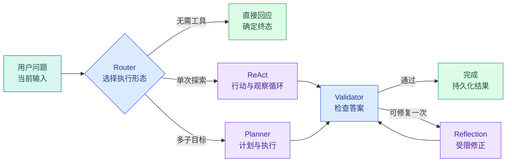
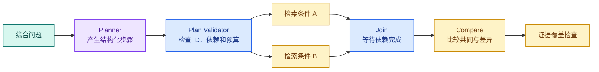

# Agent 怎样决策：Router、ReAct、Planner、Reflection 与框架选型

前一篇已经用普通 Python 跑通了有限 Agent 循环：模型提出动作，程序执行工具，再把观察送回模型。这里继续追问一个更难的问题：当任务从一次检索变成多种问题时，循环应该怎样选择执行方式？

> 收到问题后，程序怎样决定下一步做什么？

假设只读知识助手同时遇到三类输入：

1. “你好”不需要工具，直接回应即可；
2. “访问申请入口是什么”只需要一次精确检索；
3. “比较远程办公和驻场办公的访问条件，并说明共同要求”需要拆成多个子问题、收集多份证据，再验证覆盖是否完整。

把三种输入都塞进一个无限 `while` 循环，简单问题会变慢，复杂问题也未必更可靠。更合理的做法是先理解几种**控制模式**：Router 负责选路，ReAct 根据观察迭代，Planner 先规划后执行，Reflection 在生成后检查并有限修正。

模式不是框架。模式描述“状态怎样变化”，框架提供状态保存、工具封装、流式事件、Checkpoint、Trace 等运行能力。不了解模式就直接选框架，往往会把示例代码的简短误认为系统边界的完整。

这一步的结果不是框架排行榜，而是能够先画出执行轨迹，再判断普通 Python、LangChain 或 LangGraph 是否真的减少了当前复杂度。

## 先建立一张控制模式地图



这张图不是要求每个请求都走完全部模式。**Router** 的输出决定本轮执行形态：

- 寒暄直接进入终态；
- 目标清楚但可能需要尝试不同工具时进入 **ReAct**；
- 需要多个证据或存在依赖步骤时进入 **Planner**；
- Reflection 只在验证器发现可修复问题时出现，并且有次数上限。

控制模式的选择本身也应该受程序约束。用户显式选择“快速模式”、可见资料数量、问题长度、是否包含比较或综合目标，都可以参与决策；模型可以提供语义信号，但最大研究轮数、可用工具和 Deadline 由 Runtime 固定。

## Router：先选择路径，不要所有问题都启动循环

### Router 是什么

Router 接收当前输入和可信上下文，输出一个有限分支，例如：

```text
direct | react | plan | reject
```

它解决的问题是**执行形态选择**。如果没有 Router，寒暄也可能先查向量库，原本一次查询能完成的任务也可能创建计划、并行分支和 Checkpoint。

Router 不等于完整 Agent。它通常只做一次选择，不会在工具观察后反复修改目标。输入包括用户问题、显式模式、权限范围数量和资源预算；输出是受限枚举及简短原因。Runtime 再把枚举映射到确定分支。

### Router 可以由规则、模型或混合方式实现

| 实现 | 优点 | 风险 | 适合场景 |
| --- | --- | --- | --- |
| 纯规则 | 快、稳定、易测试 | 难理解复杂语言 | 明确命令、寒暄、固定编号查询 |
| 结构化模型分类 | 能理解多种表达 | 有误判和调用成本 | 意图边界依赖语义 |
| 规则优先 + 模型补充 | 常见路径稳定，模糊输入可扩展 | 需要定义冲突优先级 | 企业知识问答与混合请求 |

例如精确的“你好”“谢谢”可以由规则直接响应，显式危险操作由策略拒绝，其余问题再让模型判断是原子查询还是综合研究。这样模型不是每条路径的唯一控制者。

### Router 的失败不是“回答错了”这么简单

路由过轻会让综合问题只召回一份资料，最终答案缺项；路由过重会让简单问题进入昂贵的研究模式。评测 Router 时至少记录：预期模式、实际模式、最终证据覆盖、延迟和模型调用次数，而不只是意图分类准确率。

## ReAct：根据工具观察决定下一步

ReAct 常被概括成 Reason + Act，但一句缩写不足以指导实现。工程上更有用的定义是：

> Runtime 重复执行“生成受限动作 → 校验动作 → 调用工具 → 保存观察 → 判断停止”，直到得到最终答案或命中**停止条件**。

### ReAct 循环里有哪些状态

| 状态 | 内容 | 谁能修改 |
| --- | --- | --- |
| `question` | 原始问题 | API 创建后只读 |
| `messages` | 当前可见消息和工具观察 | 上下文装配器 |
| `step` | 已执行动作数 | Runtime |
| `action` | 模型提出的工具名和参数，或 finish | 模型提出、Schema 校验 |
| `observations` | 工具返回的受控结果 | 工具适配器 |
| `remaining_time` | 整轮剩余 Deadline | Runtime 计算 |
| `status` | running/completed/failed/expired | 状态机 |

模型不能直接执行函数。它只产生类似 `{"kind":"tool","tool":"search_notes","query":"访问申请入口"}` 的候选动作。Runtime 检查工具是否在白名单、参数是否符合 Schema、当前用户能否调用、剩余时间是否足够，然后才执行。

### 停止条件比“模型说完成”更重要

一个可靠 ReAct 循环至少有以下停止条件：

1. 模型输出合法 `finish`，且答案通过最低验证；
2. 达到 `max_steps`；
3. 整轮 Deadline 耗尽；
4. 用户取消；
5. 连续重复相同动作；
6. 工具返回不可重试错误；
7. 证据仍不足，进入安全拒答。

如果只有第一条，模型反复搜索同一个关键词时 Runtime 没有刹车。`max_steps` 也不是 Prompt 建议，而是循环外部的确定性计数器。

### 不要把隐藏思维链当成运行日志

Runtime 需要的是可审计的动作、参数、观察和决策摘要，不需要保存或展示模型的私有推理过程。可以要求模型返回 `action` 和简短 `reason_code`，例如 `missing_application_entry`，但不要把长篇隐藏思维当作可验证事实。真正能复盘的是工具输入输出、状态转换和证据覆盖。

## Planner/Executor：先拆目标，再按依赖执行

ReAct 适合“看到结果再决定下一步”。当问题天然包含多个子目标时，每一步临时决定会丢失全局覆盖，此时可以把计划单独建模。

### 计划不是自然语言 Todo

可执行计划至少要包含：

- `objective`：整轮目标；
- `steps`：有限步骤集合；
- `step_id`：稳定唯一标识；
- `depends_on`：前置依赖；
- `kind`：search、compare、synthesize 等受限类型；
- `query`：交给工具的受限输入；
- `max_results` 或证据预算；
- 全局 `max_research_rounds` 和 Deadline。

“先查资料，再分析一下”无法判断是否完成，也无法并行。结构化计划可以发现重复 ID、未知依赖和依赖环，还能把互不依赖的检索步骤并行执行。

### Planner 与 Executor 的责任不同

Planner 负责把语义目标变成候选计划；Executor 负责校验并执行。Executor 不应该因为计划里写了 `scope=all` 就扩大权限，也不应该让每个步骤重新获得完整 Deadline。



`S1` 和 `S2` 没有相互依赖，可以并行；`Compare` 必须等两边完成。任何一步失败时，状态要说明是整轮失败、允许降级还是证据不足，而不是让后续节点拿空字符串继续生成。

### 计划需要重规划，但重规划也有上限

第一次检索可能发现用户使用的是旧称，或某个子问题没有证据。系统可以基于缺失主题生成补充步骤，但要限制研究轮数、总分支数和证据预算。重规划不能修改用户身份、Scope、Release，也不能重放已经确认的副作用。

## Reflection：验证后有限修正，不是让模型无限自我讨论

Reflection 的输入不是原始问题，而是候选答案、证据、验证问题和剩余预算。它解决“已经生成，但存在可修复缺陷”的问题。

### Critique 与 Validator 要分开

模型 Critique 可以发现表达不清或潜在遗漏，确定性 Validator 则检查可计算规则：

- 引用 ID 是否存在；
- Claim 是否至少有一个可见 Evidence；
- 答案是否引用越权资料；
- 证据版本是否与本轮 Release 一致；
- 输出是否包含禁止泄露的信息；
- 修复后是否丢失原本已支持的 Claim。

同一个模型先写答案再说“我检查过了”不构成独立证据。高风险结论需要程序验证，必要时使用不同模型或人工审核补充语义评估。

### 修复输入要最小化

修复节点应拿到：原答案、允许保留的 Claim、对应 Evidence、安全裁剪后的错误列表。不要把整个运行日志、系统配置和不可见候选全部塞回模型。上下文越大，修复越可能引入新污染。

### 修复后要重新验证，并限制次数

修复不是直接覆盖最终答案。新候选重新经过同一验证器；若仍有阻断问题，系统拒答或转人工。一般把 `repair_attempted` 放入显式状态，防止条件边回到 Reflection 形成无限循环。

## 跑出四种模式

下面的实践不调用在线模型。`ScriptedPolicy` 模拟模型提出结构化动作，`KnowledgeTool` 模拟只读检索，这样可以稳定观察 Router、ReAct、Planner 和 Reflection 的状态变化。

先准备 pytest。下面三条命令的输入是本机解释器与依赖约束，输出是只属于当前目录的 `.venv`；后续脚本和测试都从这个环境执行：

```bash
# 示例只依赖标准库，用同一问题运行 Router、ReAct、Planner 和 Reflection，便于比较控制权。
python3 -m venv .venv
source .venv/bin/activate
python -m pip install "pytest>=8,<9"
```

三条命令只建立本地隔离环境和测试工具，不连接在线模型。成功后当前 shell 的 `python` 应指向 `.venv`；若安装失败，先检查解释器、代理和虚拟环境激活状态，不要继续运行后面的脚本。

把下面内容下面直接执行这段实现。代码有些长，因此先给出阅读顺序：先看 `RuntimeState` 保存什么，再看 `route` 怎样选模式，然后依次看 `run_react`、`run_plan` 和 `validate_and_reflect` 怎样改变状态。输入是三个固定问题与一个脚本化 Policy，输出是可重复的状态和事件，不依赖模型随机性。

```python
# 四个运行器共享工具与预算接口，只改变决策模式，让路径、调用次数和停止原因可以直接比较。
from __future__ import annotations

from dataclasses import dataclass, field
from time import monotonic
from typing import Literal, Protocol


Mode = Literal["direct", "react", "plan", "reject"]
# Status 记录当前状态或决策，后续分支只依据这份显式值继续。
Status = Literal["running", "completed", "failed", "expired", "insufficient"]
ActionKind = Literal["tool", "finish"]


@dataclass(frozen=True, slots=True)
class Action:
    kind: ActionKind
    tool: str | None = None
    query: str | None = None
    answer: str | None = None


@dataclass(frozen=True, slots=True)
class PlanStep:
    step_id: str
    query: str
    depends_on: tuple[str, ...] = ()


@dataclass(slots=True)
class RuntimeState:
    # question 保存原始用户输入，后续改写查询不能覆盖它。
    question: str
    mode: Mode
    status: Status = "running"
    step: int = 0
    observations: list[str] = field(default_factory=list)
    events: list[str] = field(default_factory=list)
    answer: str = ""
    repair_attempted: bool = False


class Policy(Protocol):
    def next_action(self, state: RuntimeState) -> Action: ...

    def make_plan(self, question: str) -> tuple[PlanStep, ...]: ...

    def synthesize(self, question: str, observations: list[str]) -> str: ...

    def repair(self, answer: str, issue: str) -> str: ...


class KnowledgeTool:
    """只读工具；真实系统还要注入 ACL、Release、超时和审计。"""

    def __init__(self) -> None:
        self._notes = {
            "访问申请入口": "访问申请入口位于统一服务台。",
            "远程办公条件": "远程办公需要受管设备和多因素认证。",
            "驻场办公条件": "驻场办公需要工牌，并同样要求多因素认证。",
        }

    def search(self, query: str) -> str:
        return self._notes.get(query, "NO_EVIDENCE")


class ScriptedPolicy:
    """用确定脚本代替在线模型，便于复现控制流。"""

    def next_action(self, state: RuntimeState) -> Action:
        if not state.observations:
            return Action(kind="tool", tool="search", query="访问申请入口")
        return Action(kind="finish", answer=state.observations[-1])

    # 构造函数把已验证字段组装成下游对象，不在这里引入新的权限或业务决策。
    def make_plan(self, question: str) -> tuple[PlanStep, ...]:
        del question
        return (
            PlanStep(step_id="remote", query="远程办公条件"),
            PlanStep(step_id="onsite", query="驻场办公条件"),
        )

    def synthesize(self, question: str, observations: list[str]) -> str:
        del question
        return "；".join(observations)

    def repair(self, answer: str, issue: str) -> str:
        if issue == "missing_common_requirement" and "共同要求" not in answer:
            return f"{answer}；共同要求：多因素认证。"
        return answer


def route(question: str) -> Mode:
    normalized = question.strip()
    if normalized in {"你好", "谢谢"}:
        return "direct"
    if any(word in normalized for word in ("删除", "转账", "导出全部")):
        return "reject"
    if any(word in normalized for word in ("比较", "共同", "综合")):
        return "plan"
    return "react"


def ensure_time(deadline: float) -> None:
    if monotonic() >= deadline:
        raise TimeoutError("turn deadline expired")


# 入口函数按固定顺序编排各步骤，具体校验和副作用仍由各自函数负责。
def run_react(
    state: RuntimeState,
    policy: Policy,
    tool: KnowledgeTool,
    *,
    max_steps: int,
    deadline: float,
) -> RuntimeState:
    seen_actions: set[tuple[str | None, str | None]] = set()

    while state.step < max_steps:
        ensure_time(deadline)
        action = policy.next_action(state)
        state.events.append(f"action:{action.kind}")

        if action.kind == "finish":
            state.answer = action.answer or ""
            state.status = "completed" if state.answer else "insufficient"
            return state

        if action.tool != "search" or not action.query:
            state.status = "failed"
            state.events.append("invalid_tool_action")
            return state

        action_key = (action.tool, action.query)
        if action_key in seen_actions:
            state.status = "failed"
            state.events.append("repeated_action")
            return state
        seen_actions.add(action_key)

        observation = tool.search(action.query)
        state.observations.append(observation)
        state.step += 1

        if observation == "NO_EVIDENCE":
            state.status = "insufficient"
            state.events.append("no_evidence")
            return state

    state.status = "failed"
    state.events.append("max_steps_exceeded")
    return state


# 校验函数在数据进入下一阶段前执行，失败时返回稳定错误或直接阻断。
def validate_plan(steps: tuple[PlanStep, ...], *, max_steps: int) -> None:
    if not steps or len(steps) > max_steps:
        raise ValueError("plan size is outside the allowed range")

    ids = [step.step_id for step in steps]
    if len(ids) != len(set(ids)):
        raise ValueError("plan step ids must be unique")

    known = set(ids)
    for step in steps:
        if step.step_id in step.depends_on:
            raise ValueError("a plan step cannot depend on itself")
        if not set(step.depends_on) <= known:
            raise ValueError("plan contains an unknown dependency")


def run_plan(
    state: RuntimeState,
    policy: Policy,
    tool: KnowledgeTool,
    *,
    max_steps: int,
    deadline: float,
) -> RuntimeState:
    steps = policy.make_plan(state.question)
    validate_plan(steps, max_steps=max_steps)
    completed: set[str] = set()

    while len(completed) < len(steps):
        ensure_time(deadline)
        ready = [
            step
            for step in steps
            # 先检查当前状态是否允许继续推进，避免终态被重复任务或迟到结果覆盖。
            if step.step_id not in completed and set(step.depends_on) <= completed
        ]
        if not ready:
            state.status = "failed"
            state.events.append("dependency_cycle")
            return state

        for step in ready:
            result = tool.search(step.query)
            state.events.append(f"plan_step:{step.step_id}")
            state.step += 1
            if result == "NO_EVIDENCE":
                state.status = "insufficient"
                return state
            state.observations.append(result)
            completed.add(step.step_id)

    state.answer = policy.synthesize(state.question, state.observations)
    state.status = "completed"
    return state


def validate_and_reflect(state: RuntimeState, policy: Policy) -> RuntimeState:
    if state.status != "completed":
        return state

    issue = "" if "共同要求" in state.answer else "missing_common_requirement"
    if not issue:
        return state

    if state.repair_attempted:
        state.status = "insufficient"
        state.events.append("repair_limit_reached")
        return state

    state.repair_attempted = True
    # 规则已经齐备后再生成确定性文本，并在下一行提交 completed 终态。
    state.answer = policy.repair(state.answer, issue)
    state.events.append("answer_repaired")

    if "共同要求" not in state.answer:
        state.status = "insufficient"
    return state


def run(question: str, *, timeout_seconds: float = 1.0) -> RuntimeState:
    mode = route(question)
    state = RuntimeState(question=question, mode=mode)
    policy = ScriptedPolicy()
    tool = KnowledgeTool()
    deadline = monotonic() + timeout_seconds

    if mode == "direct":
        state.answer = "你好，请告诉我想查询的知识内容。"
        state.status = "completed"
    elif mode == "reject":
        state.answer = "这个只读助手不会执行写操作。"
        state.status = "completed"
    elif mode == "react":
        run_react(state, policy, tool, max_steps=3, deadline=deadline)
    else:
        run_plan(state, policy, tool, max_steps=4, deadline=deadline)
        validate_and_reflect(state, policy)

    return state


if __name__ == "__main__":
    for sample in ("你好", "访问申请入口是什么", "比较两种办公方式的共同要求"):
        result = run(sample)
        print(result.mode, result.status, result.step)
        print(result.answer)
        print(result.events)
```

这段代码从 `run` 进入。`route` 先把输入映射为有限 `Mode`，随后由普通 `if` 选择执行函数。模式选择之后，模型模拟器没有机会修改 `mode`、Deadline 或最大步数。

`run_react` 的每轮顺序是：检查剩余时间、获取候选动作、记录事件、校验工具名和查询、检查重复动作、执行只读工具、保存 Observation、增加步数。`finish`、无证据、重复动作、非法工具和步数耗尽都有不同状态或事件。

`run_plan` 先调用 `validate_plan` 检查计划大小、ID 和依赖。循环只执行依赖已经完成的步骤；如果仍有未完成步骤却找不到 ready 集合，说明存在依赖环或不可满足依赖，Runtime 进入 failed。示例里的两个步骤可以同批执行；真实异步 Runtime 可以把 ready 集合并行派发，再在 Join 节点合并。

`validate_and_reflect` 只处理 completed 候选。它先执行确定性覆盖检查，发现缺少“共同要求”后最多修复一次，再重新检查关键短语。`repair_attempted` 位于 Runtime 状态中，所以模型即使反复要求修改也无法形成无限边。

运行程序：

```bash
# 运行后逐条查看动作轨迹和终态；同一输入不应因为模式不同而绕过工具白名单或预算。
python agent_patterns.py
```

`python agent_patterns.py` 从文件底部的三个 sample 进入 `run`，依次覆盖 direct、ReAct 和 Planner + Reflection。命令退出码非零时先读 traceback；正常退出后再对照下一块输出中的 mode、status、step 与 events，四个字段缺一都无法判断循环是否正确停止。

预期看到三种模式与各自轨迹：

```text
direct completed 0
你好，请告诉我想查询的知识内容。
[]
react completed 1
访问申请入口位于统一服务台。
['action:tool', 'action:finish']
plan completed 2
远程办公需要受管设备和多因素认证。；驻场办公需要工牌，并同样要求多因素认证。；共同要求：多因素认证。
['plan_step:remote', 'plan_step:onsite', 'answer_repaired']
```

第一条路径没有模型或工具步骤；第二条执行一次工具后结束；第三条完成两个计划步骤，并在验证后有限修复。输出的 `events` 比隐藏思维更适合作为 Trace，因为每一项都对应实际状态变化。

### 用 pytest 检查停止条件

创建对应测试文件。除了正常路由，还要构造一个永远重复搜索的 Policy，证明 Runtime 会以 `repeated_action` 停止。测试输入是固定 Policy 与 RuntimeState，输出是可断言的状态、步数和事件，因此不会被在线模型随机性影响：

```python
# 测试让 Planner 重复动作、Reflection 无改进并耗尽步数，确认每种模式都有确定停止条件。
from time import monotonic

from agent_patterns import (
    Action,
    KnowledgeTool,
    RuntimeState,
    ScriptedPolicy,
    route,
    run,
    run_react,
)


class RepeatingPolicy(ScriptedPolicy):
    def next_action(self, state: RuntimeState) -> Action:
        del state
        return Action(kind="tool", tool="search", query="访问申请入口")


def test_router_keeps_greeting_on_direct_path() -> None:
    assert route("你好") == "direct"
    assert run("你好").step == 0


def test_atomic_query_uses_one_tool_step() -> None:
    # 为这次运行创建独立状态对象；节点只通过它交换需要持久化或恢复的字段。
    state = run("访问申请入口是什么")

    assert state.mode == "react"
    assert state.status == "completed"
    assert state.step == 1
    assert state.events == ["action:tool", "action:finish"]


def test_comparison_uses_plan_and_bounded_reflection() -> None:
    # 为这次运行创建独立状态对象；节点只通过它交换需要持久化或恢复的字段。
    state = run("比较两种办公方式的共同要求")

    assert state.mode == "plan"
    assert state.step == 2
    assert state.repair_attempted is True
    assert state.events[-1] == "answer_repaired"
    assert "共同要求" in state.answer


def test_react_stops_repeated_action() -> None:
    # 为这次运行创建独立状态对象；节点只通过它交换需要持久化或恢复的字段。
    state = RuntimeState(question="访问申请入口是什么", mode="react")

    run_react(
        state,
        RepeatingPolicy(),
        KnowledgeTool(),
        max_steps=5,
        deadline=monotonic() + 1,
    )

    assert state.status == "failed"
    assert state.step == 1
    assert state.events[-1] == "repeated_action"
```

`RepeatingPolicy` 模拟模型忽略已有 Observation，不断提出相同工具动作。第一次搜索正常写入 Observation，第二次在工具执行前被 `seen_actions` 拦住，所以 `step` 仍为 1。这个测试证明停止条件位于 Runtime，而不是依赖模型自觉。

运行：

```bash
# pytest 的失败用例会暴露循环或预算重置；通过表示四种控制模式都能在边界内结束。
pytest -q
```

预期输出为 `4 passed`。如果重复动作测试一直挂起，检查 `action_key` 是否在执行工具前比较；如果计划测试没有 `answer_repaired`，检查 Validator 是否在 Planner 结果之后调用。

实践结束后执行 `deactivate` 退出虚拟环境。`.venv`、`__pycache__` 和 `.pytest_cache` 都只属于当前实践目录，确认路径后再删除。

## 四种模式怎样组合，而不是互相替代

Router、ReAct、Planner、Reflection 可以组成分层控制：

| 问题特征 | 推荐主模式 | 原因 |
| --- | --- | --- |
| 固定命令或寒暄 | 普通函数 / Router | 没有探索价值，确定分支更快 |
| 目标清楚，工具结果决定下一步 | ReAct | 每次 Observation 都可能改变动作 |
| 多子问题、依赖或覆盖要求 | Planner/Executor | 需要全局计划和完成度 |
| 已有候选答案，可计算缺陷 | Validator + 有限 Reflection | 修复目标明确，可重新验证 |
| 只有两三个固定步骤 | 普通工作流 | Agent 循环增加成本但不增加能力 |

一个综合问题可以先由 Router 进入 Planner；每个计划步骤内部若需要探索，再运行短 ReAct；合并结果后进入 Validator；只有可修复错误才进入 Reflection。外层 Runtime 统一管理 Deadline、取消、总 Token、工具权限和终态。

“多 Agent”不是第五种必选模式。只有子任务需要独立上下文、不同工具权限、不同资源池或真正并行的信息源时，才值得拆 SubAgent。把 Planner 的三个步骤改名为三个角色，并不会自动提高质量，反而增加消息、成本和冲突合并。

## 框架到底替你管理什么

一个 Agent 框架通常提供其中一部分能力：

- 模型与 Message 的统一接口；
- Tool Schema、调用与返回值封装；
- Agent 循环或图执行器；
- 状态、Reducer 和 Checkpoint；
- Streaming 与事件；
- Middleware、Guardrail 或 Hook；
- 多 Agent Handoff 或消息协作；
- Trace、评测和部署集成。

它通常不会替你定义：

- 用户身份和 ACL；
- 数据库事务与幂等键；
- 业务 Turn 的终态；
- 哪些 Evidence 足够支撑 Claim；
- 供应商成本上限和整体 Deadline；
- 发布、回滚和历史 Schema 迁移。

选择框架时要把“框架 Runtime”和“业务 Runtime”分开。前者负责执行抽象，后者拥有业务状态、权限和恢复语义。

## 常见方案分别适合什么控制层级

### 控制流很短时，函数就是最清楚的框架

如果流程只有 `classify → search → answer`，普通函数、类型模型和 pytest 已经足够。控制流直接可见，调试不需要理解额外抽象，部署也只依赖现有服务。

纯 Python 的代价是状态持久化、并行、Streaming、Checkpoint 和 Trace 需要自己实现。不要从“零依赖”推导出“零成本”；当恢复和分支逐渐复杂时，自建 Runtime 会成为长期维护对象。

### LangChain：快速组合模型、Prompt、Tool、Middleware 与 Retriever

当前 LangChain Python 提供 Message、Prompt、模型、Tool、Retriever、Runnable 等组合接口，`create_agent` 提供基于图 Runtime 的 Agent 循环，并支持 Middleware 等扩展点。它适合先建立模型调用、结构化输出、Tool 和简单 RAG 链路。

LangChain 的优势是集成面广、上手快。边界是抽象和版本变化较快，团队需要锁定依赖并为模型、工具与回调写契约测试。下一组文章会先从 Message 和 Runnable 学起，再做简单 Agent，避免一开始只会调用 `create_agent` 却不了解状态发生了什么。

### LangGraph：状态、条件边、并行合并和恢复需要显式控制

LangGraph 以 State、Node、Edge 和 Reducer 表达有状态流程，Checkpoint 支持持久执行状态，适合需要 durable execution、人机协作、记忆和恢复的长流程。本文四种模式都可以画成图：Router 是条件边，ReAct 是受限回边，Planner 是 fan-out/fan-in，Reflection 是最多一次的修复边。

代价是状态模型、Reducer、节点幂等和 Checkpoint 边界要认真设计。把所有内容扔进一个巨型字典，或在节点内直接执行不可重放副作用，使用 LangGraph 也不会自动可靠。

### OpenAI Agents SDK：围绕 Agent 循环、Tool、Handoff、Guardrail 与 Trace

OpenAI Agents SDK 为 Python 提供 Agent loop、function tools、handoffs、guardrails、sessions 和 tracing。主要使用 OpenAI 模型、希望用较少代码实现工具型 Agent 或 Agent Handoff 时，它是直接的选择。

选型时要验证会话存储、非 OpenAI 模型适配、业务状态持久化、工具权限注入和现有 Trace 系统怎样衔接。Guardrail 负责输入输出边界，数据库 ACL 和事务仍属于应用服务。

### AutoGen：从高层 AgentChat 到事件驱动 Core

AutoGen 的 AgentChat 面向常见多 Agent 协作，Core 提供更底层的事件驱动与可分布式 Agent Runtime，Extensions 承载模型客户端和执行器等集成。它适合研究多角色消息协作、需要异步事件 Agent 或已有微软生态集成的场景。

使用前要证明多个 Agent 真的需要独立上下文或能力。若任务只是一个 Planner 的几个确定步骤，多轮角色对话会增加 Token、终止判断和复现难度。

### CrewAI：用 Crew 表达角色协作，用 Flow 表达事件与状态

CrewAI 的核心概念包括 Agent、Task、Crew 与 Flow。Crew 适合角色与任务协作，Flow 用状态和事件组织更确定的应用流程，常用于研究、内容生产或业务自动化原型。

对于权限严格和恢复复杂的系统，需要继续验证状态持久化、失败重放、工具身份与现有后端的衔接。角色描述容易理解，不代表消息协作一定比单 Runtime 更合适。

### Semantic Kernel：Kernel、Plugin、Agent 与 Process 连接企业应用

Semantic Kernel 覆盖 .NET、Python 和 Java 生态，以 Kernel 连接 AI 服务和 Plugin，并提供 Agent 与 Process 等编排能力。已有微软技术栈、需要把现有企业函数作为 Plugin 接入时，它值得进入候选。

不同语言的功能成熟度和版本可能不同，选型要以目标语言的最小实验为准。Kernel 负责调用编排，业务授权、数据库一致性和发布治理仍由应用拥有。

### Dify：需要可视化配置、知识库与运营协作时

Dify 把模型供应商、Prompt、知识库、Workflow、Agent 和应用发布放进可视化平台，适合产品或运营参与流程配置、快速验证内部应用和统一查看运行日志的团队。

当系统需要复杂事务、深度自定义 Runtime、严格代码审查或嵌入既有服务时，要评估平台扩展点、数据边界、版本升级和导出能力。可视化图能降低编辑门槛，但节点多、边界不清的流程仍然难维护。

## 不要做排行榜，要做约束评分

先写需求，再为每个候选打 0–2 分：0 表示关键能力缺失，1 表示需要适配，2 表示直接满足。分数必须附验证证据。

| 维度 | 建议权重 | 验证问题 |
| --- | ---: | --- |
| 状态显式程度 | 3 | 能否构造并断言中间状态 |
| 条件与循环上限 | 3 | Router、ReAct 和 Reflection 怎样停止 |
| Checkpoint 与恢复 | 3 | 进程退出后从哪里继续，副作用会否重复 |
| 工具权限 | 3 | 服务端身份与 Scope 在哪里注入 |
| 取消与 Deadline | 3 | 取消是否传播到模型、工具和并行分支 |
| Streaming 事件 | 2 | 输出稳定事件还是只有 Token 片段 |
| 离线评测复用 | 2 | Eval 是否调用同一 Runtime |
| Trace 与观测 | 2 | 能否关联模型、工具、节点和终态 |
| 模型供应商 | 2 | 是否被单一接口锁定，切换成本是什么 |
| 团队与部署 | 3 | 语言、依赖、升级、运行平台是否匹配 |

总分只用于缩小范围。任何安全、恢复或部署硬约束不满足，都应该先淘汰，而不是靠其他高分补回来。

## 选型实验应该故意制造失败

每个候选框架都实现同一个匿名任务，至少跑这些实验：

1. 普通原子查询，一次工具后完成；
2. 综合问题，两个检索分支合并；
3. 模型提出不存在的工具名；
4. 工具超时，剩余 Deadline 不足；
5. 模型重复相同动作，命中循环上限；
6. 进程在工具完成后、状态提交前退出；
7. 用户取消并行分支；
8. Reflection 修复后仍不合格；
9. 权限在执行期间被撤销；
10. 离线 Eval 重放同一输入并获得可比较 Trace。

记录每个实验的代码量、状态可见性、错误语义、恢复行为和调试路径。正常示例通常都能跑通，故障实验才会暴露框架抽象与业务要求是否匹配。

## 这套知识 Agent 为什么逐步进入 LangGraph

当前主线需要：显式 Turn 状态、Router 条件分支、并行预处理、多路检索、Reducer 合并、有限研究轮次、答案验证、一次修复、Checkpoint 和事件流。这些要求与状态图的表达方式一致，因此后续选择 LangGraph 作为图 Runtime。

实现不会直接跳到复杂图。先用 LangChain 学 Message、Prompt、Runnable、结构化输出和 Tool，再实现简单 Agent；当分支、并行、恢复与业务状态变得明确时，才进入 LangGraph。这样读者能看出框架为哪一部分复杂度付费。

这也不是全局结论。两步固定流程继续用普通函数；快速工具 Agent 可以评估 Agents SDK 或 LangChain；多角色研究可以实验 AutoGen/CrewAI；需要业务人员编辑流程时可以评估 Dify；微软技术栈可以评估 Semantic Kernel。选择只对约束负责，不对热度负责。

## 带到工作中的产物

完成选型前，至少留下三份可复查材料：

### 控制模式表

写清每类输入进入 direct、ReAct 还是 Planner，Reflection 由哪个 Validator 触发，最大步数、研究轮数和修复次数分别是多少。

### 框架决策记录

记录候选、版本、硬约束、评分证据、淘汰原因、采用结论和重新评估条件。例如“当可视化编辑成为刚需时重新评估平台方案”，比“LangGraph 最强”更有用。

### 故障实验报告

保存输入、初始状态、事件序列、最终状态和是否满足预期。关键证据是循环停止、取消传播和恢复一致性，而不是某次界面展示是否成功。

## 常见问题

### Router 与 Agent 循环的边界在哪里？

Router 只根据当前输入选择一条预定义路径，例如寒暄、知识查询或澄清，选择后由对应流程执行；Agent 循环则会把工具观察写回状态，再决定下一步动作。Router 的状态通常是一轮分类结果，Agent 还需要步骤计数、观察历史和停止条件。若业务只是三个稳定分支，Router 更容易测试；把一次路由包装成“智能体”不会获得新的能力。

### ReAct 为什么必须由 Runtime 维护 `max_steps`？

Prompt 中写“最多三步”只是给模型的语言提示，模型可能忽略、重复或在工具错误后继续尝试。Runtime 每执行一次候选动作就原子增加计数，并在调用工具前检查 Deadline、重复动作和最大步数，才能形成确定停止条件。达到上限时应进入 `step_limit` 或证据不足终态，并保存轨迹用于评测，而不是让模型再判断自己是否应该停。

### Planner 生成了计划，Executor 为什么还要重新校验？

计划是模型提出的候选数据，可能引用不存在的工具、把依赖顺序写反、请求越权范围或产生无法收口的并行分支。Executor 要按 Schema、工具白名单、依赖 DAG、Scope、预算和幂等边界逐步校验，并只执行当前已满足依赖的步骤。Planner 负责语义拆解，Executor 负责可信执行；把两者合并会让自然语言计划直接获得系统权限。

### Reflection 是否就是让模型再想一次？

不是。可靠的 Reflection 从独立 Validator 产生结构化问题，例如某条 Claim 无证据、引用位置错误或 Schema 缺字段；修复节点只收到候选答案、允许证据和问题列表，并且次数有限。修复后必须重跑相同验证器。让同一个模型在没有外部标准时回答“我是否正确”，容易重复原偏差，也没有可观察的停止依据。

### LangChain 和 LangGraph 应该怎样选择？

LangChain 更适合组合 Message、Prompt、Model、Tool、Retriever 和 Runnable，快速建立顺序链或简单工具循环。LangGraph 把共享 State、条件边、并行 Reducer、Checkpoint 和恢复显式化，适合分支多、任务长、需要中断继续的 Runtime。可以先用 LangChain 组件完成单步能力，再在状态复杂度出现时放进 LangGraph；二者不是互斥框架，也不应为了使用图而拆出没有状态意义的节点。

### 多 Agent 是否一定比单 Agent 更强？

多 Agent 只在角色需要独立上下文、工具权限或并行所有权时有价值，例如不同研究域分别产出结构化证据。若只是把同一个 Prompt 换成三个角色名，会增加消息转述、Token、冲突合并和终止判断，却没有新信息。选用前应证明单 Runtime 的基线瓶颈来自上下文或职责隔离，并定义每个子任务的输入、结果契约、预算和失败策略。

### 框架选型为什么要故意测试故障？

正常的“调用一个工具后回答”几乎所有框架都能完成，无法说明状态和恢复是否适合业务。工具超时、重复动作、进程在副作用后退出、权限中途撤销和并行分支取消，才会暴露 Checkpoint 语义、取消传播、幂等和可观测性。选型报告应保存相同故障用例下的事件轨迹与终态；某个硬性安全或恢复要求不满足时，不能用开发体验高分抵消。

### Dify、CrewAI、AutoGen 等方案能否只看功能表决定？

不能。功能名称相同，状态持久化、语言支持、部署形态、版本稳定性和扩展边界可能完全不同。先从目标任务写硬约束，再用锁定版本完成同一最小实验，观察工具身份在哪里注入、进程退出后怎样恢复、Trace 是否可导出、现有数据库和权限怎样接入。功能表用于筛候选，带故障的运行证据才用于决策。
