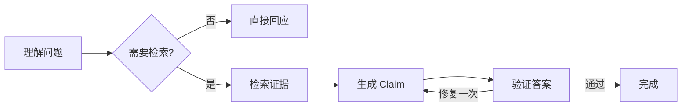

# 常见 Agent 框架及 LangGraph 选型

上一章的 Agent 只有七步，但落到工程里还要保存状态、执行工具、限制循环、流式返回、恢复任务和记录 Trace。框架可以减少样板代码，却不会替你决定权限、状态与失败语义。

本章不做“框架排行榜”。我们用同一个只读知识 Agent 比较六种常见方案，最后按控制权、运行形态和团队能力做选型。

## 先写需求，再看框架

目标系统需要：

- 根据问题决定直接回答、检索或澄清；
- 检索多个知识来源并合并证据；
- 每次工具调用都复用服务端权限；
- 长任务可以取消，必要时从检查点恢复；
- HTTP、离线评测和 MCP 复用同一 Runtime；
- 能记录节点耗时、模型调用和引用。

如果没有这张需求表，很容易根据示例代码短不短选框架。真正影响维护成本的是状态是否显式、控制权在哪里、怎样测试和怎样部署。

## 六种方案分别抽象了什么

### OpenAI Agents SDK：围绕 Agent、Tool、Handoff 与 Trace

OpenAI Agents SDK 提供 Agent 循环、函数工具、Agent 之间的 Handoff、Guardrail、Session 和 Tracing。它适合快速构建以模型和工具为中心的应用，尤其是主要使用 OpenAI 接口、希望少写循环代码时。

需要确认的边界是：应用是否接受 SDK 的运行模型，非 OpenAI 模型怎样适配，持久状态和已有服务层怎样衔接。即使使用 Guardrail，数据库 ACL 仍在业务代码中执行。

### LangGraph：围绕状态和图控制执行

LangGraph 把程序表示为 State、Node 和 Edge。节点读取状态并返回更新，边决定下一节点。并行分支通过 Reducer 合并，Checkpoint 保存图运行状态。

它适合路径复杂、需要显式状态、恢复和人机协作的流程。代价是开发者必须认真设计状态结构、Reducer 和节点边界；一张随意增长的巨型状态字典同样难维护。

### AutoGen：围绕多 Agent 消息协作

AutoGen 强调 Agent 之间通过消息交互，可以创建 Assistant、工具执行者和群聊式团队。它适合研究多 Agent 协作、代码执行或需要角色对话的场景。

如果任务本质上是一个 Runtime 的几个确定阶段，拆成多个“角色”可能只会增加消息、成本和调试难度。先证明并行角色有独立信息或能力，再引入多 Agent。

### CrewAI：围绕 Agent、Task、Crew 与 Flow

CrewAI 用角色、任务和团队表达协作，并提供 Flow 组织事件驱动流程。它的入门模型直观，适合把研究、写作、审查等职责拆给多个角色。

对权限严格、状态复杂的业务，要继续核对任务状态如何持久化、失败怎样恢复、工具权限如何统一，以及框架抽象是否能映射到现有领域模型。

### Semantic Kernel：围绕 Kernel、Plugin 与 Process

Semantic Kernel 提供模型服务、Plugin、Prompt、向量存储连接和流程编排，适合 .NET/Python/Java 生态以及需要把现有企业能力作为插件接入的团队。

它的价值通常来自与既有应用架构结合，而不是把所有业务改写成 Prompt。选型时要检查目标语言中的功能成熟度和版本差异。

### Dify：围绕可视化应用与工作流平台

Dify 提供可视化工作流、知识库、模型供应商管理、日志和应用发布。产品或运营需要快速搭建、调整 Prompt 与流程时，它能缩短反馈周期。

当系统需要深度定制事务、权限、任务恢复或已有复杂后端时，要评估平台边界、扩展方式、版本升级和数据治理。可视化节点多不等于可维护，仍需版本、测试和发布门禁。

## 把框架放到同一张决策表

| 关注点 | Agents SDK | LangGraph | AutoGen | CrewAI | Semantic Kernel | Dify |
| --- | --- | --- | --- | --- | --- | --- |
| 主要抽象 | Agent/Tool/Handoff | State/Node/Edge | Agent 消息 | Role/Task/Flow | Kernel/Plugin/Process | 可视化应用/节点 |
| 控制流可见性 | 中 | 高 | 消息驱动 | 任务与 Flow | 中至高 | 图形化可见 |
| 多 Agent | 原生 Handoff | 可组合 | 核心能力 | 核心能力 | 可组合 | 节点组合 |
| 状态恢复 | 需按 SDK 能力设计 | Checkpoint 原生 | 需按运行时设计 | Flow 持久化需核实版本 | Process/存储适配 | 平台能力 |
| 自定义后端集成 | Python 代码 | Python/JS 代码 | Python/.NET | Python | .NET/Python/Java | API/插件/节点 |
| 适合起点 | 工具型 Agent | 复杂有状态流程 | 协作研究 | 角色任务编排 | 企业应用集成 | 快速可视化交付 |

表格只说明抽象方向，不代替版本验证。框架更新很快，真正采用前要针对目标版本运行最小样例和故障测试。

## 为什么本课程选择状态图

知识 Agent 的关键要求是：权限和证据范围固定、检索可能并行、答案需要验证、长任务需要取消或恢复。用状态图可以把这些要求放在明确节点上。

这里的优势不是“图看起来高级”，而是可以逐节点回答：输入状态是什么、谁能修改哪些字段、错误转向哪里、哪个节点允许模型参与、哪个节点必须确定执行。

状态图也不适合所有问题。只有两步且永不分支的流程，用普通函数更直接；需要业务人员频繁编辑流程时，可视化平台可能更合适；以角色协商为研究目标时，多 Agent 框架更自然。

## 做一次真正的选型评审

用 0–2 分评价候选框架：0 表示不满足，1 表示需要较多适配，2 表示直接支持。不要只填功能，还要写证据。

| 维度 | 权重建议 | 需要验证的证据 |
| --- | ---: | --- |
| 状态是否显式 | 3 | 能否在测试中构造和断言中间状态 |
| 取消与恢复 | 3 | 中断后从哪里恢复，外部副作用怎样处理 |
| 工具权限 | 3 | 工具执行前能否注入服务端身份和范围 |
| 流式事件 | 2 | 是否能输出稳定事件而不是只输出 Token |
| 评测复用 | 2 | 离线评测能否调用同一 Runtime |
| 可观测性 | 2 | 是否能关联节点、模型、工具和终态 |
| 团队语言与运维 | 3 | 目标语言、部署方式、升级和社区维护 |

先用最高权重筛掉不符合边界的方案，再为剩余候选做一条正常路径、一次工具超时和一次取消实验。示例跑通不等于框架适合生产，故障路径更能暴露抽象是否合适。

## 本章结论

框架负责减少运行时样板代码，应用仍要定义领域状态、权限、事务、工具契约和发布门禁。本课程选择 LangGraph，是因为主线需要显式状态、条件边、并行合并和按需 Checkpoint，不是因为它在所有 Agent 场景中最优。

下一章开始拆 LangGraph。我们会从一个三节点图进入 State、Reducer 和 Checkpoint，先把每个概念放到执行顺序里。

## 参考资料

- [OpenAI Agents SDK](https://openai.github.io/openai-agents-python/)
- [LangGraph Overview](https://docs.langchain.com/oss/python/langgraph/overview)
- [Microsoft AutoGen](https://microsoft.github.io/autogen/stable/)
- [CrewAI Documentation](https://docs.crewai.com/)
- [Semantic Kernel Documentation](https://learn.microsoft.com/semantic-kernel/)
- [Dify Documentation](https://docs.dify.ai/)

