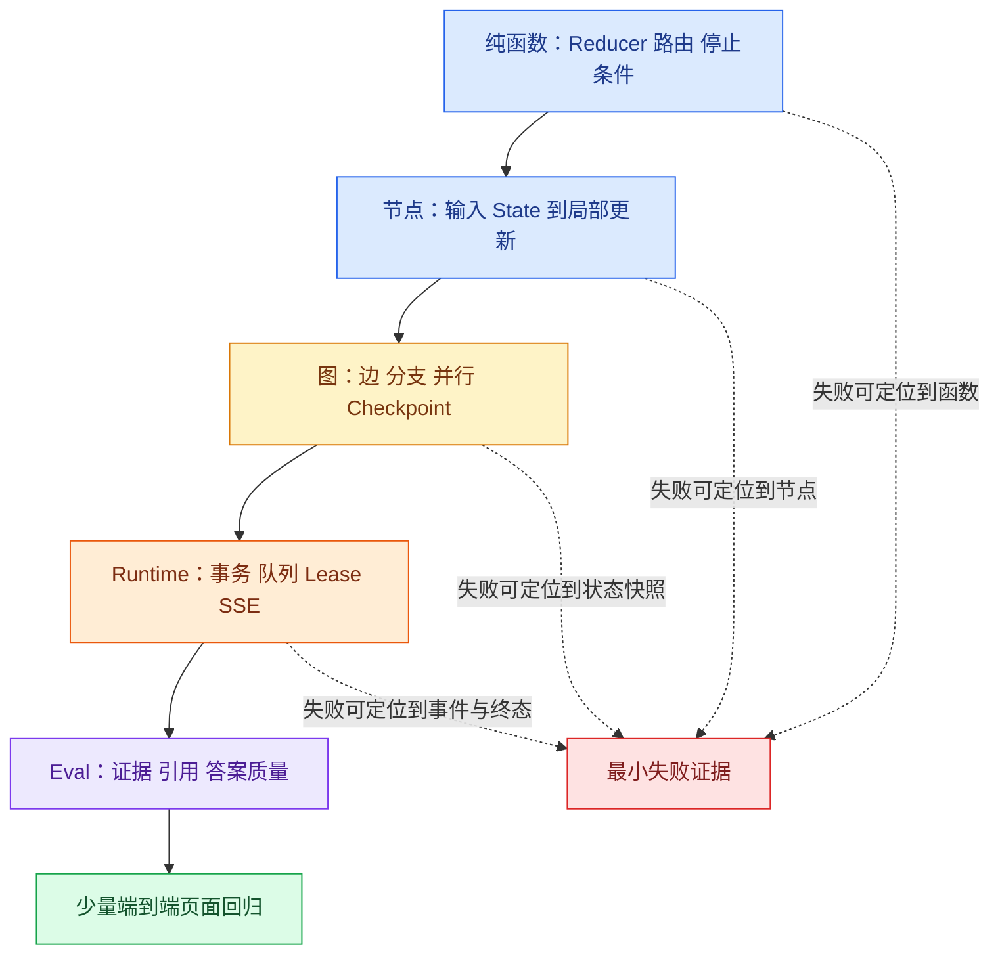

# Agent 图和 Runtime 测试：状态快照比最终文本更重要

## Agent 图和 Runtime 测试是什么

Agent 图和 Runtime 测试，是围绕状态、事件、权限和终态验证执行系统的测试方法。它位于单元测试与页面端到端测试之间：既检查节点和边的逻辑，也检查队列、数据库、Checkpoint、SSE 与取消的交互。它解决的是“答案文字偶尔变化时，怎样仍然发现路径和副作用回归”。

它的用途是把“答案文字变了”拆成可定位的状态、调用、证据和终态差异，帮助团队在模型输出不稳定时仍能发现执行回归。测试对象属于 Agent Runtime 的验证层，覆盖范围从纯函数到少量真实浏览器路径逐步扩大。

测试分成五层，每层都要明确替换对象和保留的真实行为。模型文本只作为二级质量信号，不能替代对 State、调用次数、Evidence、事件序号和终态的断言。

模型答案可能每次措辞不同，最终字符串不是稳定的唯一断言。真正要保护的是：问题是否进入正确分支，工具参数是否经过校验，证据是否绑定当前范围，取消后是否停止，恢复是否从正确 **Checkpoint** 继续。测试 Agent 需要从“文本断言”升级为“状态、事件和终态断言”。

本文会建立一套五层测试：纯函数、节点、图、Runtime 集成和 Eval。每层固定不同变量，失败时能定位到协议、状态还是模型质量。最终你会得到一个最小**回归**矩阵，而不是几个只看回答里有没有关键词的脆弱用例。

## 五层测试的责任

纯函数测试验证路由、预算、**Reducer**、Claim 覆盖和错误映射。节点测试固定输入 State 与依赖替身，验证一个节点的增量更新。图级测试使用替身模型和工具，验证节点顺序、并行合并和 Checkpoint。Runtime 集成测试验证数据库、队列、SSE、取消、租约和重试。Eval 在固定知识版本与策略下判断检索、证据、引用和答案质量。端到端浏览器测试只保留少量关键路径。



图从最稳定、最快的纯函数开始，向依赖更多的层逐步扩大。某个 Reducer 结果错了，应在第一层就失败；不要等浏览器 E2E 才看到引用顺序偶发变化。Eval 位于 Runtime 之后，不是因为它不重要，而是它需要先有可复现的知识 Release、模型/策略版本和运行链。

| 层 | 替换什么 | 保留什么真实行为 | 主要失败含义 |
| --- | --- | --- | --- |
| 纯函数 | 无外部依赖 | 算法和规则 | 代码逻辑错误 |
| 节点 | 模型、检索器、时钟 | State 输入输出契约 | 节点职责错误 |
| 图 | 外部适配器 | LangGraph **路由**与 Reducer | 编排错误 |
| Runtime | 模型可替身 | 数据库、Saver、队列协议 | 并发/恢复错误 |
| Eval | 可固定模型或真实模型 | 完整检索与答案协议 | 质量回归 |

## 状态断言比文本断言稳定

对“资料不足”的测试，断言 `status=refused`、`reason=no_evidence`、工具调用次数为 1、事件序号连续，而不是断言模型说了哪一句中文。对正常回答，断言每个 Claim 都有 Evidence ID，引用经过 ACL 复核；文本可以用规则或评测器做二级检查。

## 测试样例

下面用普通函数演示 pytest 的断言形状。把图节点替换成真实 LangGraph 后，保留相同的输入输出协议。

为了验证这组测试样例，下面的测试固定初始 State、Fake 适配器和预期事件，断言中间快照而不只比较最终回答。每个用例自己构造输入，并用断言固定返回值或失败状态；某条测试失败时，可以从用例名直接定位到被破坏的契约。

```python
# 测试样例固定初始 State、Fake 适配器和预期事件，断言中间快照而不只比较最终回答。
from __future__ import annotations

from dataclasses import dataclass

import pytest

@dataclass(frozen=True)
class RunResult:
    status: str
    tool_calls: int
    events: tuple[str, ...]

# 入口函数按固定顺序编排各步骤，具体校验和副作用仍由各自函数负责。
def run_read_only(question: str) -> RunResult:
    if not question.strip():
        return RunResult("rejected", 0, ("input.invalid",))
    if "导出全部" in question:
        return RunResult("refused", 0, ("security.blocked",))
    if "无结果" in question:
        return RunResult("refused", 1, ("tool.called", "answer.refused"))
    return RunResult("completed", 1, ("tool.called", "answer.validated", "turn.completed"))

# 参数表覆盖证据已齐、仍有缺口、轮次耗尽和 Deadline 到期四种停止条件。
@pytest.mark.parametrize(
    ("question", "status", "calls"),
    [("访问申请", "completed", 1), ("无结果", "refused", 1), ("导出全部", "refused", 0)],
)
# 这个用例同时固定事件顺序、单调序号和唯一终态，避免客户端恢复出不同状态。
def test_terminal_semantics(question: str, status: str, calls: int) -> None:
    result = run_read_only(question)
    assert result.status == status
    assert result.tool_calls == calls
    assert result.events[-1] in {"turn.completed", "answer.refused", "security.blocked"}

# 空输入或空命中属于独立业务路径；这个用例确认它不会越过校验边界触发多余调用。
def test_empty_input_never_calls_tool() -> None:
    assert run_read_only(" ").tool_calls == 0
```

测试数据把正常、空输入、越权和无结果分开。`tool_calls` 保护副作用边界，`events` 保护状态顺序，最后一个事件保护**终态**。真实集成测试还需模拟 Worker 崩溃、SSE 断线、租约失效和数据库冲突，且使用隔离依赖。

## 节点测试：用协议替身固定外部世界

测试节点时，不要连接真实模型和向量库。替身需要实现与生产适配器相同的输入输出协议，同时记录调用参数。这样可以断言 Scope、Release 和 Top-K 是否真的传入，而不是只看最终有一句答案。

```python
# Protocol 替身记录调用参数并返回可控结果，使节点测试能验证 Scope、Deadline 与状态更新。
from dataclasses import dataclass, field
from typing import Protocol

class Retriever(Protocol):
    def search(self, query: str, *, scope: str, release: str) -> list[str]: ...

@dataclass
class FakeRetriever:
    results: list[str]
    calls: list[tuple[str, str, str]] = field(default_factory=list)

    def search(self, query: str, *, scope: str, release: str) -> list[str]:
        self.calls.append((query, scope, release))
        return list(self.results)

def make_retrieve_node(retriever: Retriever):
    def retrieve(state: dict[str, object]) -> dict[str, object]:
        # 问题来自图状态，Scope 和知识版本也从同一份快照读取，
        # 这样重试节点时不会改用新的权限范围或知识版本。
        evidence = retriever.search(
            str(state["question"]),
            scope=str(state["scope"]),
            release=str(state["release"]),
        )
        # 空列表是一次成功但未命中的检索，必须与依赖异常区分开。
        return {
            "evidence": evidence,
            "status": "evidence_ready" if evidence else "no_evidence",
        }

    return retrieve
```

`Retriever` Protocol 规定节点依赖的最小接口。`FakeRetriever` 返回固定结果并记录调用三元组；`list(self.results)` 返回副本，避免节点修改测试夹具。`make_retrieve_node` 通过闭包注入依赖，节点输入是 State，输出只包含自己拥有的增量字段。

```python
# 失败替身在指定阶段抛出稳定错误，Runtime 测试据此检查事件、Checkpoint 和恢复终态。
def test_retrieve_node_passes_scope_and_release() -> None:
    fake = FakeRetriever(["evidence-1"])
    node = make_retrieve_node(fake)

    # 直接调用节点替身，既检查 State 增量，也核对 Retriever 收到的 Scope 与 Release。
    update = node(
        {"question": "访问申请", "scope": "scope-a", "release": "release-7"}
    )

    assert update == {"evidence": ["evidence-1"], "status": "evidence_ready"}
    assert fake.calls == [("访问申请", "scope-a", "release-7")]

# 这个用例固定“成功但无结果”的语义，不能把它误报为依赖异常或编造答案。
def test_retrieve_node_marks_empty_as_a_state() -> None:
    fake = FakeRetriever([])
    node = make_retrieve_node(fake)

    # 直接调用节点替身，既检查 State 增量，也核对 Retriever 收到的 Scope 与 Release。
    update = node(
        {"question": "未知问题", "scope": "scope-a", "release": "release-7"}
    )

    assert update["status"] == "no_evidence"
    assert update["evidence"] == []
```

第一个测试既检查返回更新，也检查权限范围和知识版本没有在调用链中丢失。第二个测试把空命中表达成状态，后续图才能走拒答分支。这里没有模型文本，失败会直接指向参数或状态契约。

## 图测试：断言路径和中间状态

图测试把节点组装起来，但仍使用 Fake 模型、Fake Retriever 和内存 Checkpointer。至少观察四类结果：执行过哪些节点、每个节点提交哪些字段、最终到达哪个业务状态、外部适配器调用几次。

对于条件边，不只测最终节点，还要让每个枚举值至少走一次，并构造未知值确认显式失败。对于并行图，交换分支延迟与输入顺序，最终融合顺序必须稳定。对于 Checkpoint，在已完成节点后制造中断，恢复时断言该节点调用次数没有增加。

不要 Mock `StateGraph.add_edge` 然后断言“调用过”。这种测试只证明你写了框架 API，不证明编译后的图真的按预期运行。应该编译内存图并调用 `invoke`/`ainvoke`，读取最终 State 或 `get_state` 快照。

## 回归集如何分层

每次模型、Prompt、切片、检索或 Runtime 修改，先跑固定核心集，再跑新增问题。回归结果必须包含代码版本、模型版本、知识 Release、Policy、输入 hash 和评测指标。没有这些版本字段，“这次变差了”无法定位到底改了什么。

核心集不应只有正常问题。至少包含：寒暄不调用检索、空证据安全拒答、指定范围无结果不扩大范围、工具参数非法、单分支超时降级、提示注入阻断、重复幂等键、运行中取消、Deadline 过期、Checkpoint 恢复和 SSE 断线重放。

每个用例保存预期结构而不是固定长文本，例如允许终态、必需/禁止工具、必需 Evidence 来源、最大调用次数和原因码。模型措辞可以变化，权限与状态不变量不能变化。

## 为条件边、Reducer、恢复和取消补齐故障用例

为一条条件边写一个“非法状态不可达”测试；为一个 Reducer 写顺序交换测试；为 Checkpoint 写恢复不重复工具调用测试；为取消写终态不可逆测试。完成后把失败结果贴到 Runbook 中，说明先查哪个状态和事件。

## Runtime 集成测试要制造竞争窗口

普通 happy path 不能证明异步 Runtime 可靠。使用隔离数据库、测试队列或可控 Worker，主动制造这些窗口：

| 故障注入点 | 要证明的不变量 |
| --- | --- |
| 两个请求同时提交同一幂等键 | 只创建一个 Turn，两边返回同一 ID |
| Turn 提交后队列投递失败 | 有稳定失败/待补偿状态，准入槽被释放 |
| 两个 Worker 同时 claim | 只有一个 owner token 获得写权限 |
| 工具成功后、Checkpoint 前崩溃 | 幂等键阻止重复副作用 |
| 用户取消与模型完成同时发生 | 最多一个终态，迟到写入失败 |
| SSE 在序号 N 断线 | 重连只回放 `sequence > N`，终态不丢 |
| Release 切换后恢复旧 Turn | 仍使用快照版本或明确拒绝恢复 |

这些测试依赖真实事务语义，不能只用内存字典。测试数据库必须隔离，运行结束按 `turn_id` 精确清理；不要连接生产数据。Broker 如果难以在单测中启动，可以把投递器做成接口，但至少保留一组容器化集成测试验证 ACK 与重投。

### 终态一致性可以写成不变量

对任意 Turn，始终应该满足：

- 终态集合中最多出现一个状态；
- 终态 Event 最多一条，且与 Turn 当前状态一致；
- `completed` 必须有关联的正式答案和验证摘要；
- `cancelled / expired / failed` 之后不能再追加答案 delta；
- Event sequence 从 1 开始连续递增；
- 所有 Evidence 都属于快照 Release 和当前可见 Scope；
- 失去 Lease 的 owner 不能写状态、事件或制品。

不变量比逐个函数调用更能覆盖重构。无论以后从 Celery 换成别的队列、从同步模型换成流式模型，这些业务事实仍应成立。

## 为什么图测试要拆成四层

节点单元测试只验证一个函数，不能证明状态图真的会走到它；图结构测试验证入口、条件边和终态，但不执行真实模型；Runtime 集成测试验证 Checkpoint、队列和事件；Eval 才检查证据和答案质量。把四层混在一个端到端测试里，失败时只能看到“请求失败”，修复成本很高。

| 层级 | 固定什么 | 主要断言 | 依赖 |
| --- | --- | --- | --- |
| 节点 | 输入状态 | 返回字段和错误码 | 无 |
| 图结构 | 节点与边 | 分支可达性、不可达终态 | 内存图 |
| Runtime | Turn、事件、Checkpoint | 恢复、取消、租约 | 隔离数据库 |
| Eval | 问题、Release、ACL | Claim 支持与拒答 | 固定知识集 |

## Reducer 和并行测试的陷阱

追加型 Reducer 理论上不应依赖分支完成顺序，但如果融合节点直接使用列表顺序，就会出现偶发回归。测试要把同一组候选以多种排列调用 Reducer，断言最终按 `(score desc, source_id)` 得到同一结果。条件边还要覆盖空证据、权限拒绝、预算耗尽和正常结束四种输入，不能只测 happy path。

Checkpoint 测试应模拟“节点已执行、进程在下一节点前退出”，恢复后确认已执行节点不会重复调用工具；如果节点有外部副作用，测试必须检查幂等键，而不是只看图返回值。

## Eval 与单元测试覆盖不同风险

单元测试可以证明引用 ID 不为空，却不能证明证据真的支持 Claim；Eval 可以判断支持度，却不擅长证明并发取消绝不被 completed 覆盖。两者关注不同失败面。

离线 Eval 固定问题集、知识 Release、Scope、策略和模型版本，记录 Recall@K、Claim 支持率、引用正确率、拒答准确性、延迟和成本。LLM-as-judge 只能作为一种信号，关键安全和权限规则仍使用确定性检查；评测器 Prompt 和模型版本也要入档。

一次代码提交先跑确定性测试，再跑小型核心 Eval；候选策略通过后再扩大数据集或进入影子/灰度。不要因为平均分上升就忽略某个权限用例从通过变失败。

## 测试失败时先查什么

先查输入状态和图版本，再查最后一个事件和 Checkpoint，最后才查模型响应。若状态已经是 terminal，迟到 Worker 的写入应被拒绝；若事件序号不连续，先修复事件存储，不要把 UI 断线当成模型问题。把这些检查顺序写成 Runbook，初学者才能从“测试红了”走到具体证据。

最终测试产物应包含一张矩阵：用例、层级、固定版本、输入、预期状态、预期事件、允许工具、故障注入点和清理方式。新增 Runtime 能力时先在矩阵里补不变量，再写实现；这比上线后根据一段异常回答反推系统状态可靠得多。


**Node 单元测试应该断言什么？**

给节点最小 State 和脚本化依赖，断言它读取允许字段、返回局部更新、错误分类和事件，而不是只看最终文字。模型节点使用 Fake 返回固定结构，检索节点固定候选与超时。还要证明输入 State 没被原地修改，权限与版本字段没有被模型输出覆盖。

**图级测试与 Runtime 集成测试有什么区别？**

图级测试关注节点顺序、条件边、Reducer、循环上限和最终 State，可以使用内存 Checkpointer 与假依赖；Runtime 集成测试加入数据库 Turn、队列、Lease、事件、取消和最终提交。两层分开后，路径错误不需要启动所有基础设施，所有权与事务问题又不会被纯图测试遗漏。

**怎样让模型相关测试可重复？**

核心控制测试用脚本化 Model 根据输入返回固定候选，保存 Message 和工具调用快照；真实模型只放在版本锁定的离线 Eval 中，多次运行并记录波动。断言结构化状态、证据和停止原因，不依赖完整措辞。这样框架升级或 Prompt 变化时能定位协议回归，也不会让随机输出把单元测试变成概率事件。

**Checkpoint 恢复测试应故意在哪些位置崩溃？**

至少覆盖工具成功但快照未提交、部分并行分支完成、候选答案生成但未验证、验证通过但终态事务未提交。恢复后断言幂等工具不重复副作用、Reducer 不重复候选、权限重新检查且只产生一个终态。只测试节点开始前恢复，无法暴露最危险的提交窗口。

**为什么失败测试要断言事件和状态，而不只断言异常？**

企业 Runtime 常把异常转换成 cancelled、expired、insufficient 或 failed，调用方未必看到原异常。事件序列和 State 能证明失败发生在哪个阶段、是否重试、资源是否释放、后续节点是否被阻止。测试工具超时还应断言它没有被当作空结果，ACL 拒绝没有进入模型，终态之后的迟到写入影响行数为零。
