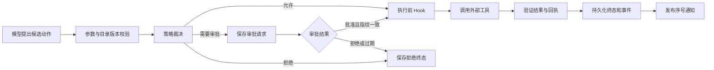
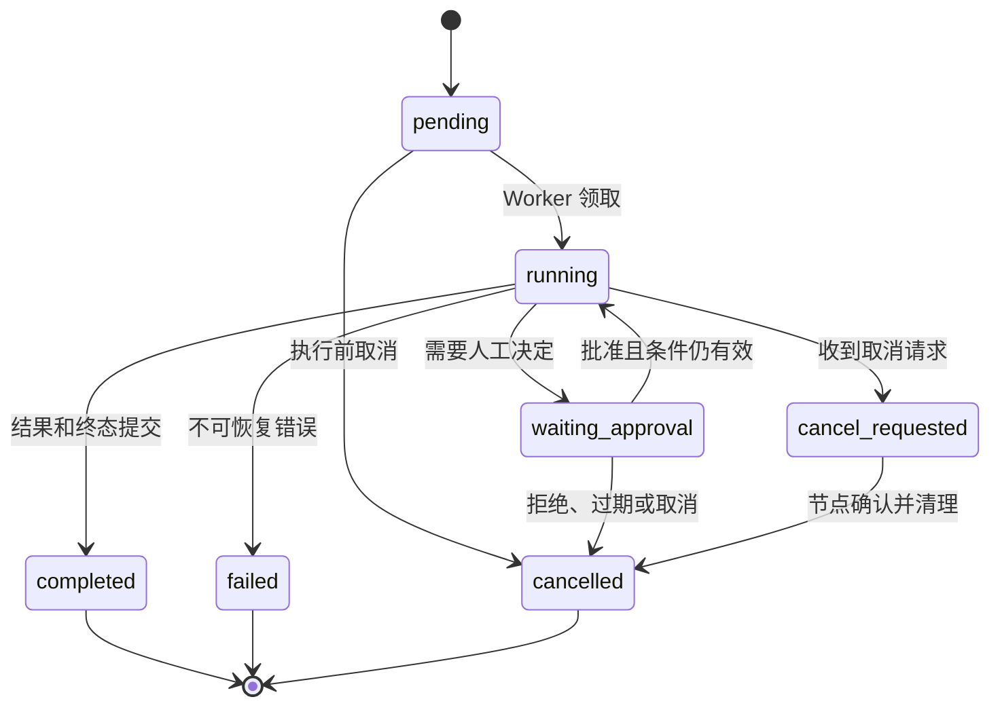
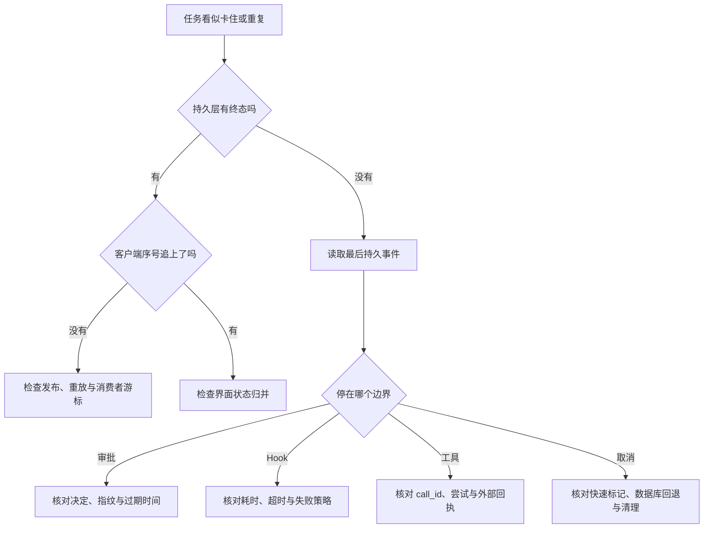

# Hook、事件与人工审批怎样约束执行

模型提出一次工具调用以后，应用不能立刻把参数交给外部系统。它还要核对身份与权限，判断动作风险，必要时等待人工决定，并把开始、结果和失败留给界面、审计与恢复逻辑读取。**Hook**、**Event** 和 **Approval** 都出现在这段路径里，但它们负责的不是同一件事。

假设 Agent 准备发布知识版本 `r-7`。模型生成了工具名和参数，这只是一项候选动作。运行时应先计算风险，固定参数摘要，再决定直接执行、拒绝还是申请审批。如果审核人批准的是 `r-7`，等待期间参数却被换成 `r-8`，原批准不能继续使用。执行完成后，即使浏览器已经断开，系统仍要能够证明究竟发布了哪个版本、由谁批准、是否真正得到下游回执。

::: info 先分清四个对象

- **Hook**：运行时在稳定边界调用的扩展点，可以观测事件，也可以在约定范围内返回阻断结果。
- **Event**：已经发生的状态事实，例如动作已提出、审批已申请、工具已完成。它用于传递和重放，不负责自行做决定。
- **Policy**：根据可信身份、动作风险和资源范围作出允许、拒绝或需要审批的确定性判断。
- **Approval**：人对某个确定动作快照作出的有期限决定，不是对一段含糊意图的永久授权。

:::

四者组合后，Agent 才能在不把控制权交给模型的前提下获得可观测、可暂停和可扩展的执行过程。本篇用一次高风险工具调用贯穿状态、事件、审批和故障测试。

## Hook、事件、策略和审批分别负责什么

**Hook** 是代码结构中的扩展点。运行时可以在模型调用前、工具执行前、工具执行后或终态形成后调用一组 Hook。记录耗时、清理敏感日志、统计 Token、发送通知，都可以通过 Hook 接入，而不必把每项横切逻辑塞进 Agent 循环。Hook 是否允许改变控制流必须写进合同；如果所有 Hook 都能任意修改状态，执行顺序一变，结果也会改变。

**Event** 是已经发生的事实。`action.proposed` 表示候选动作已经形成，`approval.requested` 表示系统进入等待审批，`action.completed` 表示工具执行得到回执。事件可以驱动进度界面、日志索引或异步消费者，但消费者不应把“收到事件”误当成“拥有核心状态”。事件丢失后可以从持久层补读，核心状态却只能由拥有该状态的运行时修改。

**Policy** 负责确定性裁决。它的输入不是模型自己填写的用户角色，而是认证系统提供的主体、当前资源范围、活动策略版本、动作名称、参数摘要和风险等级。输出可以是 `allow`、`deny` 或 `require_approval`。金额阈值、允许目录、可见知识范围和禁止操作都属于策略，不属于 Hook 里的临时判断。

**Approval** 是一项业务状态。审批记录至少要保存动作指纹、决定、审批人、审批时间、过期时间和策略版本。它可能跨越几分钟甚至几天，也可能经历服务重启，因此不能只存在某个 Python 协程的局部变量中。审批通过只是允许运行时继续检查，不表示外部动作已经成功。

| 对象 | 主要输入 | 主要输出 | 是否拥有业务状态 |
| --- | --- | --- | --- |
| Hook | 生命周期事件和只读上下文 | 观察结果或约定的阻断意见 | 通常不拥有 |
| Event | 已完成的状态变化 | 可消费、可重放的事实 | 不拥有 |
| Policy | 可信身份、动作和资源范围 | 允许、拒绝或需要审批 | 拥有策略版本，不拥有动作结果 |
| Approval | 固定动作快照和审核决定 | 可验证的批准或拒绝记录 | 拥有审批状态 |

这组区分可以避免两个常见误解。第一，事件总线不是状态机；消费者看见 `action.started`，不代表可以把 Turn 改成完成。第二，人工批准不是绕过策略的超级权限；身份已失效、资源已撤回或参数已经变化时，即使曾经批准，也要重新裁决。

## 动作执行前后有哪些稳定边界

Hook 只有挂在稳定边界上才可测试。一个最小工具执行通常有四类边界：候选形成、执行之前、执行之后和终态形成。每个边界对应的输入、允许动作与失败处理不同。

候选形成时，运行时已经有 `call_id`、工具名、模型参数和工具目录版本，但尚未决定是否执行。这里适合记录候选、做参数形状校验和计算风险。身份、租户、知识范围之类可信字段由运行时补入内部命令，不能让模型参数覆盖。

执行之前，策略已经完成裁决。只读低风险动作可以直接进入执行；写入、发送、删除或扩大权限的动作需要审批。这里的 Hook 可以执行审计前置检查，也可以因依赖不可用而阻断，但不能偷偷修改已经获批的参数。任何实质变化都应产生新的动作指纹并重新审批。

执行之后，运行时拿到了结构化结果、错误或未知状态。这里适合脱敏、指标记录和结果验证。外部服务返回 200 只证明请求被接受或传输完成，不自动证明业务动作成功。发送消息要有消息 ID，发布版本要有发布回执，删除动作要有目标状态；没有可核对回执时应标记为 `unknown`，不能盲目重试。

终态形成后，核心状态已持久化为完成、失败、取消或拒绝。后置通知和分析 Hook 即使失败，也不应把已经确认的外部动作再次执行。它们可以进入独立重试队列，使用事件序号恢复投递。



图中最重要的顺序是“先保存，后通知”。如果先把完成事件推给前端，再提交数据库失败，用户会看见一个系统无法重放的完成状态。反过来，数据库已经提交而实时通知失败，客户端仍可以携带最后序号补读缺失事件。

## 事件合同怎样保存顺序和状态

事件至少包含 `turn_id`、单调递增的 `sequence`、`event_type`、时间和受控载荷。工具相关事件再带 `call_id`，审批相关事件带审批记录 ID 与动作指纹。序号属于同一个 Turn，不使用多个进程各自的本地计数；否则并发写入会产生相同序号，客户端无法判断先后。

事件名应该描述已经发生的事实。`approval.requested`、`approval.granted` 和 `action.completed` 比 `do_approval`、`finish_action` 更清楚，因为后两者像命令。命令可能被拒绝，事件却必须对应一次已确认的状态变化。载荷只保存消费方真正需要的稳定字段，不把完整 Prompt、凭证或未经脱敏的工具参数复制到所有事件消费者。

核心状态与终态事件应处在同一事务边界。以完成为例，存储层先锁定 Turn，确认当前仍是可完成状态，然后写入最终结果和 `turn.completed`，提交成功后再向实时通道发布最新序号。如果取消已先一步形成终态，迟到的完成更新应因状态条件不满足而失败，不能把取消改回完成。

终态必须单调。`completed`、`failed`、`cancelled` 和 `expired` 之间不能随事件到达顺序互相覆盖。重试不是把原 Turn 从失败改回运行，而是依据任务合同创建新的尝试，或从尚未终止的检查点继续。这样审计记录才能解释一个请求经历过什么，而不是只留下最后一次覆盖后的状态。

并发事件写入需要由存储层分配序号。常见做法是在 Turn 行保存 `next_event_sequence`，事务内锁住该行、读取并递增，再批量插入事件。同一次阶段变化可以一次写入多条连续事件，避免其他 Worker 插到中间。客户端按序号消费，不用数据库自增主键推测某个 Turn 内的顺序。

::: warning 事件不是任意日志

日志可以包含调试上下文，事件则是客户端和恢复逻辑依赖的协议。随意改名、删字段或改变语义会破坏重放。事件合同需要版本、兼容策略和契约测试。

:::

## 哪些事件进入实时流，哪些必须持久化

事件密度差异很大。模型增量文本可能每几十毫秒产生一次，工具完成、审批决定和 Turn 终态却很少发生。把所有内容使用同一种保存策略，要么拖慢主流程，要么丢掉恢复所需事实。

必须持久化的是影响状态解释和恢复的事件，包括审批申请与决定、动作开始与完成、检查点、取消请求、终态和外部副作用回执。它们数量较少，却决定任务能否安全继续。持久层写入失败时，运行时不应对外宣称事件已经发生。

增量文本、心跳和高频进度可以分级。若产品要求断线后逐字恢复，增量也需要保留，但可以合并成较大的片段并设置保留期；若只需恢复完整答案，则实时通道可以发送增量，持久层定期保存快照。无论选择哪种方式，`answer.reset` 或等价事件都要明确告诉客户端从哪个版本重新渲染，不能把恢复后的全文继续追加到旧文本后面。

实时通道更适合传递“有新序号可读”的通知，而不是充当唯一事实存储。发布消息只需携带 Turn 与最新序号，客户端再从持久事件表读取缺口。发布失败可以重试；重复发布同一序号也不会重复执行工具。这个结构还把消息系统短暂不可用与核心执行失败分开了。

容量限制要按事件价值制定。不能简单写成“队列满就丢”，因为丢掉 `turn.completed` 会让界面永久等待。低价值心跳可以采样，增量可以合并，终态和审批必须可靠保存。监控应分别统计持久化延迟、实时发布延迟、序号缺口和客户端积压，不把它们合成一个模糊的事件成功率。

## 同步 Hook 和异步订阅怎样选择

同步 Hook 位于请求关键路径，优点是可以在外部动作发生前作出阻断。参数脱敏、风险检查和强制审计条件适合使用同步 Hook，因为晚一步执行就可能产生不可逆副作用。代价是每个 Hook 的延迟都会叠加到用户请求，故障也可能阻塞整个 Agent。

异步订阅在核心状态提交后消费事件，适合统计、通知、离线分析和非关键索引。订阅者失败不会改变已经完成的动作，可以从序号或消费游标重放。代价是它不能阻止已经发生的动作，而且消费者必须处理重复投递和延迟到达。

选择时先问两个问题：这项逻辑是否必须在副作用之前完成，失败时是否应该阻止动作。两个答案都是“是”才放在同步路径。其余逻辑优先异步化。不要因为 Hook API 使用方便，就把发送消息、写远程审计仓库和复杂模型评审全部串在执行前。

同步 Hook 还应有固定顺序、局部超时和失败策略。安全 Hook 超时通常应关闭执行，普通指标 Hook 超时可以记录并继续。运行时不能按照插件注册顺序隐式决定安全优先级，应显式分成校验、策略、审批和观测阶段。Hook 需要读取共享状态时使用不可变快照，避免前一个 Hook 的临时修改影响后一个 Hook。

回调适合单进程、短任务和无需恢复的观测。长时间等待、跨进程审批、重启恢复和可靠取消需要持久化状态机。框架提供 Callback、Graph 中断或工作流 Signal，都不改变这个判断标准。采用持久化工作流前还要接受更多状态表、迁移、清理、兼容和运行成本，这是一项明确的架构取舍。

## 高风险动作怎样进入人工审批

审批不应按工具名写死成一个布尔值。相同工具在不同参数和身份下风险不同：读取公开文档可以直接执行，导出大量内部资料需要审批；发布草稿到预览环境与发布到生产环境也不是同一级别。策略要结合动作类别、目标资源、数据敏感度、影响范围和可逆性计算结果。

运行时申请审批前先把规范化动作序列化，再计算指纹。规范化要固定字段顺序、去掉不影响语义的表现差异，并把可信 Scope 与策略版本纳入审批上下文。审批页面显示工具、目标、影响和关键参数摘要，审核人不应面对一段由模型生成的模糊说明。

审批决定绑定动作指纹。等待期间如果模型重新规划、工具目录升级、目标版本变化或管理员修改参数，旧指纹不再匹配，系统必须生成新审批。这个约束解决的是检查与使用之间的竞态：审核人批准的是当时看见的动作，不是未来任何同名调用。

审批有过期时间。过期默认拒绝比自动批准稳妥，尤其是删除、付费、外发和权限操作。低风险批量动作可以设计范围有限的临时授权，例如在十分钟内允许发布同一草稿的预览版本，但要限制工具、资源、次数和总影响，不能变成会话级无限授权。

拒绝也是正常终态。运行时保存拒绝理由类别，向模型只返回足够调整计划的信息，不泄露内部审批备注。模型可以选择不执行、换成只读方案或请用户修改目标，不能通过换工具名重复申请同一危险动作。频繁重复申请应触发循环检测。

审批通过后仍要重新检查当前身份、资源状态和 Deadline。审核期间用户权限可能被撤销，目标也可能被删除。策略二次校验失败时，记录“批准后条件变化”，而不是把责任归给工具超时。审批记录保留原决定，动作记录说明为何没有执行，两者不能相互覆盖。

## 暂停、恢复和取消怎样收敛

暂停不是冻结进程。可恢复系统会在安全检查点保存状态，停止领取新的工作，然后让 Worker 释放计算资源。恢复时读取检查点和当前策略，确认等待条件已经满足，再从明确节点继续。任意一行代码都允许暂停会制造大量无法序列化的局部状态，因此检查点应放在模型调用、工具调用和阶段提交之间。

检查点至少记录下一节点、已完成动作、观察结果引用、剩余预算和状态版本。大对象可以放受控存储，只在状态中保存稳定引用。恢复时不能把已经提交的工具动作重跑一遍；先查 `call_id` 对应的回执，只有确认未执行且动作可安全重试时才再次调用。

取消由用户发出时，入口先验证 Turn 所有权，再把 `pending` 直接改为 `cancelled`，把正在运行的状态改为 `cancel_requested`。运行节点在调用模型前、工具前后、等待队列和生成增量期间检查取消标记。只在请求入口检查一次没有意义，长任务仍会继续消耗资源。

快速取消标记可以放在 Redis 一类低延迟存储中，运行节点优先读取；快速通道不可用时必须回退数据库中的持久状态。否则消息系统故障恰好会让取消失效。取消检查抛出专门的控制异常，顶层捕获后清理 Lease、子任务和连接，再写入 `turn.cancelled`。它不应被普通 `except Exception` 包装成执行失败。

暂停、取消和超时需要明确优先级。用户取消先到达后，即使工具稍后返回成功，也不能把 Turn 改成完成；不可逆工具已经成功则要保存回执和“取消发生在副作用之后”，必要时进入补偿流程。Deadline 到达时不再开始新动作，正在进行的远程调用尽量发送取消信号，但仍需处理对方实际上已经执行的可能性。



## 一次审批工具调用的完整轨迹

下面的最小实现只使用 Python 标准库。它不包含数据库、消息系统和身份服务，因此只能验证本地控制逻辑。`EventStore` 用列表模拟有序事件，`ControlledRuntime` 保存调用回执，写动作必须带与当前参数一致的审批。

<<< ../../examples/ai-agent/hook_runtime.py

输入动作是 `publish_release(release_id="r-7")`，风险为 `write`。第一次调用没有审批，运行时写入 `action.proposed` 和 `approval.requested`，返回 `None`，执行函数调用次数仍为零。审批人确认后，应用把动作指纹、决定和审批人 ID 组成 `Approval`，再次调用运行时。

第二次调用依次产生候选、批准、开始和完成事件。执行器返回 `published:r-7`，运行时以 `call_id` 保存回执。客户端因网络问题重放相同调用时，运行时直接返回旧回执，不再次调用发布函数。这里的回执字典只是内存演示；生产实现必须把幂等键和外部回执持久化，并处理多个 Worker 同时领取的竞争。

把动作参数改成 `r-8`，却沿用 `r-7` 的 Approval，会得到 `approval_action_mismatch`。这个失败发生在执行器之前，因此外部发布次数仍为零。它证明审批绑定的是动作内容，而不只是工具名称或 `call_id`。

一次成功轨迹可以表示为：

```text
输入: call-1 / publish_release / release_id=r-7 / risk=write
状态 1: action.proposed, sequence=1
状态 2: approval.requested, sequence=2, executor_calls=0
输入: approval(granted, fingerprint_of_r-7)
状态 3: approval.granted, sequence=4
调用: executor({release_id: r-7})
输出: published:r-7
终态: action.completed, sequence=6, executor_calls=1
重放: 返回 published:r-7, executor_calls 仍为 1
```

注意序号 3 是第二次进入时的 `action.proposed`。真实系统也可以把等待审批的动作保存在数据库，批准后直接从该快照继续，避免重复产生候选事件。无论采用哪种形式，都要保证只有一个明确的动作版本得到执行。

## 阻塞、重复和事件风暴怎样定位

“Agent 一直没完成”不能直接归因于模型慢。先从 Turn 终态、最后事件序号和当前阶段定位责任层，再查看对应依赖。把大量日志从头读到尾通常比按状态边界排查更慢。

::: warning 症状一：界面停在等待审批

先检查持久层是否存在 `approval.requested`，审批记录是否已决定、过期或指纹不匹配。持久层已批准而运行时未恢复，问题在唤醒或任务领取；根本没有审批记录，则问题发生在策略裁决与事务提交之间。不要通过再次调用模型消除等待状态。

:::

::: warning 症状二：外部动作执行了两次

沿 `call_id` 查动作指纹、尝试 ID 和外部回执。如果同一 `call_id` 有两个成功回执，幂等保护或领取锁失效；如果只有一次外部回执，却出现两条完成通知，问题在事件发布或消费者去重。两种现象的修复层不同。

:::

::: warning 症状三：客户端缺少完成事件

数据库存在终态与连续序号，实时通道没有最新序号，说明发布失败，客户端应补读；数据库也缺终态，则核心事务没有完成。不能根据前端最后看到的增量文本推断任务已经成功。

:::

阻塞式 Hook 的证据是某个边界的开始事件存在，结束事件迟迟没有，Hook 耗时指标集中升高。为每个 Hook 设置名称、阶段和局部超时，但不要把用户文本或参数放进指标标签。安全 Hook 超时后拒绝动作，观测 Hook 超时则记录降级，二者要使用不同错误类型。

事件风暴表现为高频增量挤压终态、存储膨胀和消费者积压。先按事件类型统计数量与字节，再调整合并窗口、采样和保留期。终态、审批和动作回执不能随高频事件一起丢弃。消费者应按 Turn 保持游标，发现序号跳跃时主动补读，而不是继续展示不完整状态。

状态不一致通常来自先通知后提交、多个组件都能写终态，或迟到结果覆盖取消。排查时把状态行版本、事件序号、事务提交时间和发布时间放在一条时间线上。只比较服务器日志时间会受到并发与时钟偏差影响，不能替代单调序号。

父任务暂停而子任务继续运行，说明控制信号没有传播。子任务创建时保存父 Turn 与取消作用域，父任务进入暂停或取消后，运行时逐个标记未完成子任务。已经产生副作用的子任务不能简单删除，应等待回执并根据任务合同补偿或保留部分结果。



## 怎样测试事件与审批没有绕过状态机

单元测试先验证纯控制逻辑。无审批时执行函数调用数必须为零；批准后参数改变必须在执行前失败；拒绝和过期不能调用工具；相同 `call_id` 重放只能得到原回执；执行器抛错时事件要保存稳定错误类型，不能把敏感错误正文扩散到所有消费者。

本文示例的测试位于共享示例套件中。运行命令是：

```bash
PYTHONPATH=examples/ai-agent python3 -m unittest discover \
  -s examples/ai-agent/tests -p 'test_*.py'
```

测试通过后仍只能说明本地状态机符合断言。存储集成测试还要创建并发 Worker，同时为同一个 Turn 追加事件，断言序号唯一且连续；在写终态与事件之间注入事务失败，断言两者都没有半提交；在提交以后让实时发布失败，断言补读能够恢复。

取消测试覆盖两条路径。快速存储可用时，节点读取取消标记后不再打开数据库会话；快速存储不可用时，节点回退持久层并抛出取消控制异常。测试还要在模型调用前、工具返回后和增量生成中间触发取消，确认没有新的动作开始，Lease 与子任务得到释放。

恢复测试先保存检查点和部分答案，模拟进程退出，再用同一个 Turn 启动。运行时应从未完成节点继续，向客户端发送答案重置或快照事件，不重复执行已经有回执的工具。终态 Turn 再次领取必须失败，迟到完成也不能覆盖取消。

审批集成测试至少使用两个审核人角色和两份资源。没有权限的人不能决定审批，审批人不能改动作参数后自批，过期决定不能恢复任务，策略版本变化会触发重新校验。审计视图只展示脱敏参数，但底层指纹仍能确认执行内容与批准内容一致。

性质测试可以随机打乱通知到达顺序、重复投递事件和并发提交取消。需要长期保持的不变量包括：事件序号单调、终态不倒退、权限不扩大、同一动作至多产生一次已确认副作用、批准内容与执行内容一致。总测试数增加并不自动代表覆盖完整，这些不变量才是回归门禁。

## 什么时候只需要回调，什么时候需要持久化 Runtime

如果任务在单个请求内结束，Hook 只记录日志和耗时，动作没有不可逆副作用，也不要求浏览器断开后恢复，那么内存 Callback 足够。实现简单、延迟低，测试也容易。进程退出后丢失进度是这个选择已接受的边界。

一旦出现跨进程审批、分钟级工具调用、后台任务、可靠取消、断线重放或外部副作用，状态就不能只依赖回调。持久化 Runtime 负责 Turn、事件、检查点、幂等回执和终态竞争，实时流只是它的交付通道。工作流引擎可以提供 Signal、定时器和恢复能力，自建运行时也可以实现同样的不变量，但需要承担迁移、清理、兼容和监控成本。

最小可行方案不是永远选择最简单的框架，而是只为实际故障模型付出复杂度。普通通知用异步事件，执行前安全判断用同步策略，高风险动作使用绑定参数的审批，需要恢复时再引入检查点和持久化状态。这样每一层都有明确职责，失败证据也能落回真正拥有状态的组件。

完成这套边界以后，下一阶段的上下文工程才有稳定入口：历史消息、工具结果和记忆可以进入模型输入，但它们不能绕过这里固定的身份、策略、审批和事件终态。
