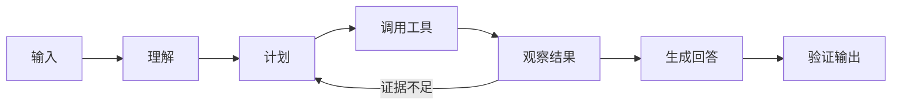

# Agent 的完整生命周期

假设用户输入“比较两份规范的不同，并告诉我引用来自哪里”。模型不能只凭训练记忆回答：它需要找到两份资料、读取内容、比较差异、组织答案，再确认每个结论都有来源。

这就是一个 Agent 任务。本篇不绑定具体框架，而是先建立一张完整地图：输入如何变成目标，目标如何变成行动，工具结果怎样影响下一步，系统又怎样判断任务已经结束。

## 阅读前只需要知道两件事

第一，模型接收文字并生成文字，它不会直接访问你的数据库。第二，**工具**是程序提供给模型的一组受控能力，例如“搜索文档”或“读取天气”。模型只能提出调用请求，真正执行工具的是应用程序。

Agent 可以理解为“模型 + 工具 + 循环 + 边界”。循环让它根据工具返回继续思考，边界则限制它能做什么、最多做多久、什么时候停止。

## 从输入到输出的七个阶段



1. **输入**：接收问题、用户身份和可选范围。
2. **理解**：识别目标、对象、限制条件和可能歧义。
3. **计划**：决定先做哪些可验证的小步骤。
4. **调用工具**：用结构化参数请求搜索或读取能力。
5. **观察结果**：判断结果是否足够，是否需要改变计划。
6. **生成回答**：只用允许的上下文组织答案。
7. **验证输出**：检查格式、引用、权限和安全规则。

真正体现 Agent 的位置是“观察结果后可以回到计划”。如果路径永远固定，普通工作流通常更简单、更便宜。

## 步骤一：先把目标说清楚

用户输入常常不是可直接执行的命令。“帮我看看这两份文档”至少缺少比较维度和输出形式。理解阶段会提取四类信息：用户要完成什么、处理哪些对象、有哪些约束、还缺少什么。

模型适合识别语义和歧义，程序负责合并权限和固定规则。例如模型可以识别“这两份文档”，但用户最终能否读取文档，要由服务端权限判断。

| 信息 | 示例 | 谁负责最终决定 |
| --- | --- | --- |
| 目标 | 比较差异 | 模型提出，程序校验结构 |
| 对象 | 文档 A、文档 B | 模型解析，程序验证存在性 |
| 范围 | 仅当前工作区 | 程序 |
| 输出 | 表格并带引用 | 模型执行，程序验证 |

## 步骤二：把大目标拆成小动作

一个可靠计划不需要写成长篇推理，只需列出可执行步骤及停止条件：找到文档、读取相关章节、提取差异、检查引用。如果第一步找不到文档，后面不应继续生成比较结论。

计划可以由模型生成，也可以来自固定模板。登录、计费、删除等稳定业务流程更适合模板；开放式资料研究才需要模型参与规划。

## 步骤三：工具调用不是执行本身

模型返回的工具名和参数都属于不可信输入。应用程序会检查工具是否在白名单、参数是否满足 Schema、当前用户是否有权限、调用是否超时。

下面的最小循环用于说明控制权在哪里：

```ts
async function runAgent(input: string) {
  let messages = [{ role: 'user', content: input }]

  for (let step = 0; step < 6; step += 1) {
    const response = await model.respond(messages, allowedTools)
    if (response.finalText) return verify(response.finalText)

    const call = validateToolCall(response.toolCall)
    const result = await executeTool(call)
    messages = messages.concat(response.message, toolMessage(result))
  }

  throw new Error('step_limit_reached')
}
```

输入是一段用户文字，输出是通过验证的最终文本。循环上限防止 Agent 无休止调用工具；`validateToolCall` 阻止模型调用不存在或越权的能力；工具结果重新进入上下文，下一轮才有依据调整计划。

## 步骤四：观察决定下一步

工具返回 200 不代表任务成功。搜索可能返回空结果，数据库可能返回过期数据，网页内容还可能包含提示注入。观察阶段要把“工具执行成功”和“结果可用于当前目标”分开。

正常路径可能是：搜索命中两份文档，读取成功，证据覆盖比较维度，于是进入生成。失败路径可能是：只找到一份文档，Agent 应请求用户补充或明确说明无法比较，不能编造第二份资料。

## 步骤五：结束前再验证一次

生成文本仍然只是模型输出。系统可以确定性检查引用是否存在、引用是否属于本轮证据、格式是否满足协议、内容是否包含禁止字段。事实覆盖或表达质量可再使用模型评估，但最终权限裁决不能交给评估模型。

一次运行最终应进入唯一终态：完成、拒绝、取消、失败或超时。客户端断线只是传输问题，不应改变后台任务事实。

## 常见失败是怎样发生的

| 现象 | 根因 | 系统应怎样处理 |
| --- | --- | --- |
| 重复执行 | 客户端重试创建了新任务 | 使用幂等键复用原任务 |
| 一直处理中 | Worker 中断后无人接管 | 租约、截止时间和停滞扫描 |
| 引用打不开 | 生成时没有绑定证据身份 | 用稳定证据 ID 验证 |
| 回答越权 | 检索后才做权限过滤 | 在查询阶段先过滤 |
| 成本失控 | 没有步骤、时间和 Token 上限 | 每轮检查预算并降级 |

这些能力不是第一天全部加入。开发顺序应该先跑通单工具循环，再加入状态、权限、恢复、评测和观测。

## 什么时候不需要 Agent

如果输入和输出固定、步骤不会根据结果变化、普通代码可以精确完成，就使用普通函数或工作流。Agent 不是更高级的默认方案，它只是应对开放目标和动态路径的一种架构选择。

下一篇会比较常见框架，并解释状态图为什么适合需要分支、并行和恢复的任务。

## 参考资料

- [OpenAI：Agents SDK](https://developers.openai.com/api/docs/guides/agents)
- [OpenAI：Using tools](https://developers.openai.com/api/docs/guides/tools)
- [LangGraph：Thinking in LangGraph](https://docs.langchain.com/oss/python/langgraph/thinking-in-langgraph)
