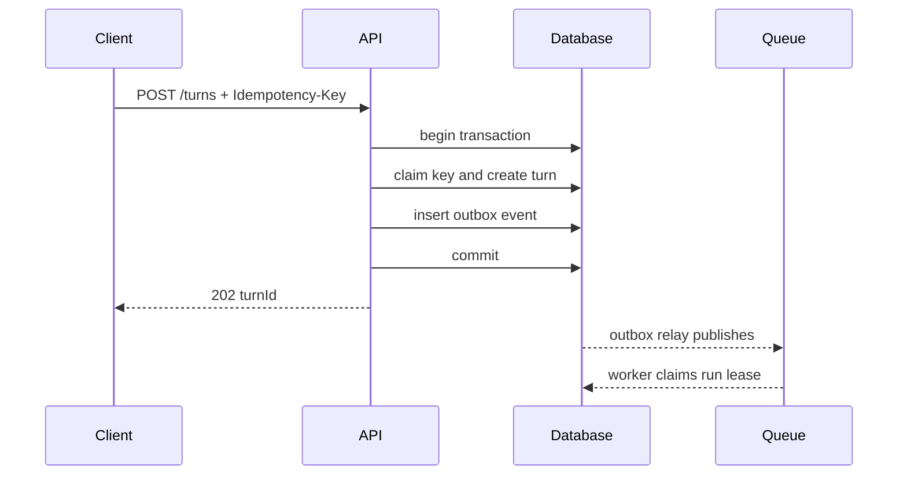
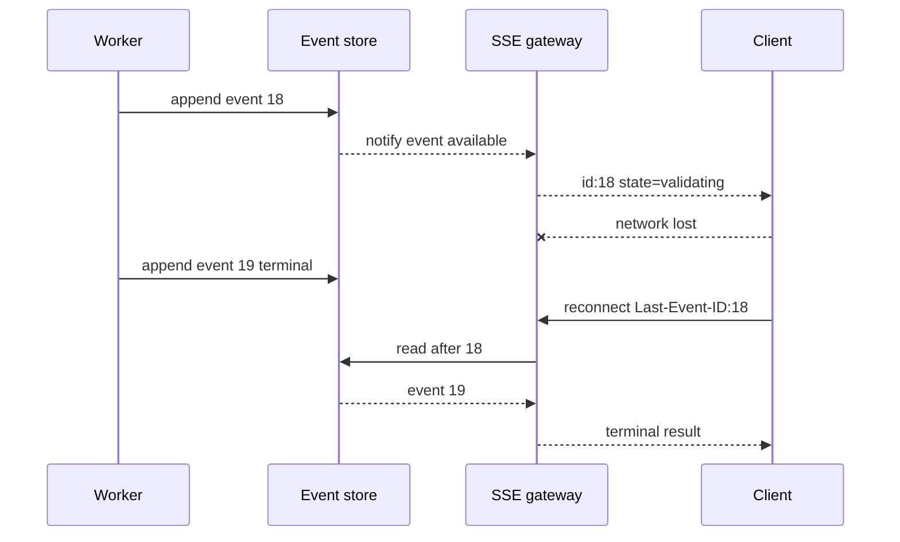

# Agent 的完整生命周期

Agent 不是“模型循环调用工具”，而是一条有身份、范围、预算、状态和终态的业务流程。客户端重试、Worker 崩溃、工具响应丢失、权限撤销和用户取消都会改变它的状态；如果这些变化只存在于进程内存，系统就没有真正的生命周期。

本文从一个异步证据问答请求开始，推导接受、理解、计划、执行、事件、验证、取消和恢复所需的数据协议。示例使用中性命名重新编写，重点不是某个 Agent 框架的 API，而是无论使用 LangGraph、队列任务还是自建编排器都必须守住的不变量。

## 四层身份：不要用一个 requestId 表达所有事情

在线 Agent 至少需要区分四种标识，否则重试、恢复和审计会互相污染：

| 标识 | 生命周期 | 作用 |
| --- | --- | --- |
| `turnId` | 一次用户意图 | 幂等接受、查询最终结果 |
| `runId` | 一次执行尝试 | 区分重试、恢复和模型版本 |
| `callId` | 一次工具调用 | 关联参数、幂等键与工具结果 |
| `eventId` | 一条持久事件 | SSE 重放、顺序和去重 |

客户端重发同一个幂等请求，应得到原 `turnId`；Worker 崩溃后重新接管可以创建新 `runId`；恢复时已成功的 `callId` 不应再次产生副作用；客户端重连则从最后确认的 `eventId` 继续读取。把这四层都压成 HTTP 请求 ID，会导致网络重试创建新任务，或者执行重试覆盖原始审计轨迹。

```ts
type TurnRecord = {
  turnId: string
  actorId: string
  idempotencyKey: string
  requestDigest: string
  state: TurnState
  activeRunId: string | null
  version: number
  createdAt: string
}

type RunRecord = {
  runId: string
  turnId: string
  attempt: number
  workerLeaseUntil: string | null
  graphVersion: string
  modelPolicyVersion: string
}
```

`requestDigest` 用规范化请求计算。相同幂等键携带不同请求摘要时必须返回冲突，而不是悄悄复用旧结果。`version` 用于乐观并发，防止取消请求与完成请求同时写入时互相覆盖。

## 接受阶段：先建立业务事实，再排队

入口的关键不是尽快把消息丢进队列，而是在一个事务内完成：验证身份与输入、计算幂等键、固定安全范围、创建 Turn、写入 Outbox。事务提交后由转发器把 Outbox 发布到队列。这样即使 API 在提交后崩溃，也不会出现“数据库里有任务但永远没有消息”，或者“消息已消费但任务记录不存在”。



数据库唯一约束至少覆盖 `(actor_id, idempotency_key)`。只在 API 进程里用锁，无法抵抗多实例并发。队列通常提供至少一次投递，因此消费者也必须按 `turnId` 和状态幂等领取；消息“只投一次”的假设不应成为正确性的基础。

固定范围不是把所有可见资源 ID 塞入任务。可以保存策略版本、知识 Release、租户、用户和已选择集合等稳定边界，并在每次数据访问时重新下推 ACL。这样既能复现当时使用的知识版本，又能处理执行过程中权限被紧急撤销：安全撤权应优先于复现便利。

## 结构化理解：一次完成，多处消费

意图、实体、指代、目标范围和风险若由不同节点分别猜测，状态很容易自相矛盾。理解阶段输出一个版本化结构，并区分模型判断与确定性安全上下文：

```ts
type Understanding = {
  schemaVersion: 2
  intent: 'answer' | 'compare' | 'execute' | 'clarify'
  rewrittenQuery: string
  entities: Array<{ type: string; value: string; confidence: number }>
  references: Array<{ expression: string; resolvedId: string | null }>
  requestedScopes: string[]
  ambiguities: string[]
}

type SecurityContext = {
  actorId: string
  tenantId: string
  allowedScopeIds: ReadonlySet<string>
  permissions: ReadonlySet<string>
}
```

模型可以提出 `requestedScopes`，但交集计算由程序执行。若指定范围不可见或不存在，应拒绝或澄清，不能回退到全局知识库“帮用户找一个差不多的答案”。指代无法可靠解析时进入 `clarification_required`，比带着错误对象继续调用工具更便宜。

理解输出使用运行时 Schema 校验。解析失败只允许有限次数的格式修复，并把修复提示限制为 Schema 错误，不把整段历史重复传入。模型连续无法满足结构时，应以稳定错误结束，而不是无限重试。

## 计划是受限 DAG，不是模型写的散文

生产计划应能由程序验证。每一步声明依赖、工具、参数来源、风险、预算和停止条件：

```ts
type PlanStep = {
  stepId: string
  dependsOn: string[]
  capability: 'keyword_search' | 'vector_search' | 'table_query' | 'compose'
  inputRefs: string[]
  risk: 'read' | 'write' | 'irreversible'
  timeoutMs: number
  optional: boolean
}

type ExecutionPlan = {
  steps: PlanStep[]
  maxParallelism: number
  stopWhen: { minimumEvidence: number; coverage: number }
}
```

计划进入执行前做静态检查：DAG 无环、依赖存在、工具属于候选白名单、预算总和不越界、写操作带批准、参数来源可追溯。模型不能通过生成工具名绕过候选过滤，也不能把一个只读请求升级成删除任务。

计划不是每次都必须由大模型生成。固定业务流程直接使用确定性模板；只有检索路径、工具组合确实依赖语义时才让模型提供候选计划。简单问答可以直接走检索与生成，避免“为了 Agent 而 Agent”。

## 执行：租约、心跳与至多一个活跃拥有者

队列消费者领取任务后写入短期租约，并定期续约。Worker 进程消失后，租约过期允许其他实例接管。租约只能避免两个健康 Worker 长期同时执行，不能代替工具幂等，因为网络分区可能让旧 Worker 不知道自己已经失去租约。

```python
async def renew_lease(turn_id: str, run_id: str, expected_version: int) -> bool:
    result = await repository.update_lease(
        turn_id=turn_id,
        run_id=run_id,
        expected_version=expected_version,
        lease_until=utcnow() + timedelta(seconds=30),
    )
    return result.updated_rows == 1
```

每个节点开始前检查租约、取消标记和剩余截止时间。长步骤内部也要传播取消令牌，并在安全点续报进度。模型流式生成期间不持有数据库事务；事件以短事务批量写入，避免慢客户端占用连接。

工具调用记录在执行前进入 `running`，成功后保存受控结果引用。恢复时按记录分类：

- `succeeded`：复用结果，不重新调用；
- `failed_retryable`：在次数和截止时间内重试；
- `running` 且租约未过期：等待原执行者；
- `running` 且租约过期：查询外部操作状态，再决定接管；
- `failed_terminal`：结束或触发受限修复。

## 事件流：进度是持久事实的投影

SSE/WebSocket 只是传输层，不能成为唯一状态源。节点先把事件写入追加日志，再由推送层发送。客户端重连携带最后事件序号，服务端补发其后的事件；重复事件由 `eventId` 去重。

```ts
type TurnEvent = {
  eventId: number
  turnId: string
  runId: string
  type: 'state_changed' | 'progress' | 'token_batch' | 'evidence_added' | 'terminal'
  payload: unknown
  createdAt: string
}
```

Token 流可以批量持久化或仅作为瞬时体验事件，但最终答案和终态必须可靠保存。若系统选择不持久化每个 Token，重连后应返回当前草稿快照与之后的新事件，而不是假装能够逐字恢复。

事件序号按 Turn 单调递增，可通过数据库序列、原子计数或单写者保证。不同并行节点的时间戳不能提供可靠全序，因为时钟偏差和并发提交会导致错乱。



## 证据与生成：冻结输入，避免移动目标

一次回答应绑定固定的知识 Release 和证据集合。检索候选经过权限过滤、去重、重排和内容安全处理后，形成稳定 `evidenceId`。生成阶段引用证据 ID，而不是依赖模型从混合文本中猜来源。

```ts
type Evidence = {
  evidenceId: string
  sourceRef: string
  releaseId: string
  visibleTo: string
  excerpt: string
  contentDigest: string
  retrieval: { channel: string; rank: number; score?: number }
}
```

外部文档可能含提示注入，因此证据只作为引用数据进入模型。系统指令明确禁止证据改变工具、权限和输出策略；真正的防线仍是工具候选和数据范围已经由服务端锁定。

生成前还应判断证据是否足够。指定范围无结果、关键事实相互冲突或引用覆盖不足时，返回有依据的拒答或澄清。让模型凭参数知识补齐，会破坏知识库的权限与时效保证。

## 验证：确定性约束优先

验证阶段不要只再问模型“这个答案好吗”。先执行可确定判断：

1. 每个引用是否存在于本轮证据集合；
2. 引用资源在当前安全上下文是否仍可见；
3. 关键断言是否至少绑定一个证据；
4. 回答是否包含被禁止字段或敏感模式；
5. 工具写操作是否都有确定终态；
6. Token、工具和截止时间是否超预算。

随后再用模型评估覆盖、矛盾和可读性。评估模型输出同样需要结构化校验，并避免与生成模型使用完全相同的错误来源。高风险事实可以采用规则、第二模型或人工审核组合，但必须明确最终责任主体。

```ts
type ClaimCheck = {
  claim: string
  evidenceIds: string[]
  verdict: 'supported' | 'conflicted' | 'unsupported'
  reasonCode: string
}
```

修复只针对 `unsupported` 或 `conflicted` 片段，携带原证据和失败原因，最多一到两轮。每轮都消耗预算并生成新版本。达到上限后安全失败，而不是进入无限“反思”。

## 取消是业务状态，不是关闭 socket

客户端点击停止时，API 使用条件更新把 `cancel_requested_at` 写入 Turn。编排器在节点边界和长调用内部检查，停止启动新工具，并尽量取消进行中读取。已经提交的写操作需要查询结果或补偿，不能因为 UI 不再显示就当作不存在。

取消与完成可能竞争。状态转移必须通过 compare-and-set 保证只有合法的一方获胜：

```sql
UPDATE turns
SET state = 'cancelled', version = version + 1
WHERE turn_id = :turn_id
  AND version = :expected_version
  AND state IN ('accepted', 'understanding', 'planning', 'executing', 'validating');
```

若完成事务先提交，取消返回“任务已经完成”；若取消先提交，完成方不得覆盖终态。`failed` 表示系统试图执行但无法完成，`rejected` 表示在权限、策略或证据门禁阶段有意不执行，`cancelled` 表示接收到终止意图并完成了清理语义，三者在重试、告警和产品展示上都不同。

## Checkpoint 与事件日志的分工

Checkpoint 是恢复执行所需的状态快照，事件日志是解释状态如何演进并向客户端重放的事实序列。只存 Checkpoint 难以审计每次工具调用；只存事件则恢复时需要重放大量记录。常见做法是每个关键节点写 Checkpoint，同时追加领域事件。

状态包含 Schema 版本。部署新图时，旧 Checkpoint 需要迁移器或固定旧执行版本。若无法安全迁移，应让旧 Worker 完成旧 Run，新版本只领取新任务；不能直接用新代码解释旧状态并期待字段碰巧兼容。

保存内容包括结构化输入、范围与策略版本、计划、工具调用摘要、证据引用、验证结果、答案版本和终态。隐藏推理与完整敏感原文不属于审计需要；记录决策结果和证据即可。

## 恢复路径必须按故障点设计

| 故障点 | 可恢复依据 | 正确动作 |
| --- | --- | --- |
| 排队前 API 崩溃 | Turn + Outbox 事务 | 转发未发布事件 |
| Worker 节点前崩溃 | Checkpoint + 租约 | 新 Run 从节点边界接管 |
| 只读工具超时 | 调用记录 + 截止时间 | 有限重试 |
| 写工具响应丢失 | 业务幂等键 + 操作查询 | 查询状态，不盲目重放 |
| SSE 断线 | 持久事件序号 | 从最后事件补发 |
| 验证过程崩溃 | 答案草稿 + 证据集合 | 重新执行确定性验证 |
| 部署图版本变化 | graphVersion + 迁移策略 | 固定旧版本或迁移 |

恢复测试必须真实终止 Worker，而不是在函数内抛一个可控异常。进程被杀后检查租约过期、任务被接管、成功工具没有重复、副作用只有一次、事件序号连续，才能证明设计成立。

## 多租户资源和背压

Agent 的成本分布通常长尾明显。单个深度研究任务可能占用大量模型调用和工具连接，因此入口要按租户、用户和工作类型做 admission control。在线对话、批量导入和离线评测使用不同队列与并发池，避免批处理挤占交互请求。

预算对象随状态传递：

```python
@dataclass(frozen=True)
class Budget:
    deadline_at: datetime
    remaining_model_calls: int
    remaining_tool_calls: int
    remaining_input_tokens: int
    remaining_output_tokens: int

    def allocate_timeout(self, desired_ms: int) -> int:
        remaining = int((self.deadline_at - utcnow()).total_seconds() * 1000)
        return max(0, min(desired_ms, remaining))
```

并行分支共享总预算，不能每个分支复制一份“剩余 10 次调用”。使用原子预算预留或在 Planner 阶段静态分配。证据覆盖达到门槛后取消慢分支，减少尾延迟和无价值成本。

## 验证：生命周期测试矩阵

| 测试 | 注入故障 | 必须成立的不变量 |
| --- | --- | --- |
| 幂等接受 | 同键并发提交 | 只有一个 `turnId` |
| Outbox | API 提交后进程退出 | 任务最终仍被投递 |
| Worker 接管 | 执行中 kill -9 | 租约过期后继续 |
| 工具幂等 | 写成功后丢响应 | 副作用只有一次 |
| 事件重放 | SSE 中途断开 | 从最后 ID 补齐且不重复展示 |
| 取消竞争 | 完成与取消并发 | 只有一个合法终态 |
| 权限撤销 | 检索后、生成前撤权 | 引用被复核并拒绝泄露 |
| 版本迁移 | 新代码读取旧 Checkpoint | 明确迁移或由旧版本完成 |
| 预算耗尽 | 工具持续返回低价值结果 | 图在上限内停止 |

```ts
it('keeps one terminal state when cancellation races completion', async () => {
  const turn = await fixtures.executingTurn()
  await Promise.allSettled([
    service.complete(turn.id, turn.version, { answerRef: 'answer-1' }),
    service.cancel(turn.id, turn.version, 'user_request')
  ])

  const current = await repository.get(turn.id)
  expect(['completed', 'cancelled']).toContain(current.state)
  expect(await eventStore.countTerminalEvents(turn.id)).toBe(1)
})
```

还要验证降级：重排不可用时是否保留可解释的融合结果，生成不可用时是否能返回证据列表，观测系统不可用时是否不阻塞主链路。权限、范围和敏感信息检查不可降级绕过。

## 运行指标和告警

指标按阶段分解，而不是只看总耗时：排队时间、理解/检索/工具/生成/验证耗时，模型与工具调用数，取消率，恢复率，引用覆盖，终态缺失和单位请求成本。Trace 关联 `turnId` 的哈希、`runId` 和 `callId`，不记录完整用户文本或隐藏推理。

最危险的不是显式失败，而是任务长期没有终态。定时扫描超过最大生命周期且租约已失效的 Turn，尝试恢复或标记失败并告警。事件流显示完成而数据库仍在执行、工具成功但调用记录仍 running，也属于一致性告警。

## 常见误区

- 把连接断开视为任务取消，导致刷新页面就丢失执行。
- 用队列消息 ID 代替业务幂等键，重复投递产生重复副作用。
- 在不同节点反复让模型猜意图和范围，结构状态相互冲突。
- 只保存最终回答，不保存证据、调用状态和版本，问题无法复现。
- 认为 Checkpoint 会自动保证外部工具幂等。
- 并行分支各自复制完整预算，瞬时成本倍增。
- 用无限反思修复低质量答案，没有确定停止条件。
- 把原始 Chain-of-Thought 当审计日志，增加隐私与安全风险。

## 参考资料

- [LangGraph Persistence](https://docs.langchain.com/oss/python/langgraph/persistence)：线程、Checkpoint、恢复与持久状态的现行模型。
- [LangGraph Interrupts](https://docs.langchain.com/oss/python/langgraph/interrupts)：暂停、人工介入和恢复输入的边界。
- [OpenTelemetry Trace 规范](https://opentelemetry.io/docs/specs/otel/trace/)：API、队列、模型、检索和工具之间的 Trace/Span 关系。
- [Transactional Outbox Pattern](https://microservices.io/patterns/data/transactional-outbox.html)：业务事实与消息投递的一致性问题及 relay 模型。
- [OWASP Agentic AI Threats and Mitigations](https://genai.owasp.org/resource/agentic-ai-threats-and-mitigations/)：Agent 身份、工具、委派和多步攻击风险。
- [一文入门 LangChain.js，从 0-1 实现智能客服系统](https://juejin.cn/post/7504926961628364819)：我的早期完整实现；本篇补充其在线运行所需的生命周期与恢复设计。
