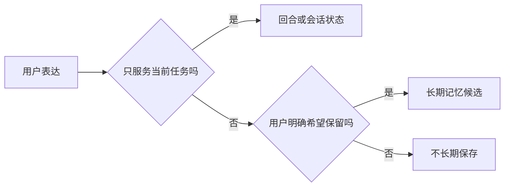

# 短期记忆与长期记忆

用户说“以后代码示例优先用 TypeScript”，这条偏好可能跨会话有用；用户粘贴一次性验证码，只在当前操作中短暂出现。两者都在聊天里出现，却不应该采用同一种保存策略。

本篇把记忆分成会话状态、滚动摘要和显式长期记忆，并说明用户如何查看、修改和删除。

## 先区分三层记忆

| 层级 | 保存什么 | 生命周期 |
| --- | --- | --- |
| 当前回合状态 | 计划、工具结果、中间证据 | 一次执行 |
| 会话记忆 | 近期消息、焦点、滚动摘要 | 一段对话 |
| 长期记忆 | 用户明确希望保留的偏好或事实 | 跨会话，可撤销 |

## 第一步：短期状态服务当前任务

当前焦点帮助理解“它”“刚才那个方案”等指代，摘要保存早期决定。它们仍然只是对话信息，涉及企业事实时要重新检索授权来源。

任务完成后，图中间状态可以按保留策略清理；原始聊天记录和用户可见历史按产品规则管理。

## 第二步：长期记忆需要明确来源

长期记忆记录内容、来源时间、类型和用户控制状态。偏好、目标和用户自己确认的稳定事实可以成为候选；模型推断的人格、第三方隐私和敏感凭证不自动保存。

“我更喜欢简短回答”可以确认保存；“用户大概不懂后端”是模型推断，不应变成永久标签。

## 第三步：读取也要有范围

不是每次调用都读取全部记忆。根据当前问题选择少量相关条目，并受 Token 预算限制。外部 MCP 调用或团队共享场景不应默认带入个人记忆。

记忆内容仍是不可信输入，不能覆盖系统权限和安全规则。

## 第四步：用户能控制生命周期

产品应提供查看、删除、关闭和纠正入口。删除后，后续上下文不再使用该条记忆；备份与审计的保留行为要在隐私政策中说明。

敏感信息检测不是完美分类器。高风险类别采用拒绝保存和最短保留策略，比先全量收集再清理更稳妥。

## 正常结果和失败结果

正常系统在用户明确说“请记住”后保存语言偏好，并允许其删除。一次性验证码只用于当前请求，日志和长期记忆都不保留原文。

失败系统自动总结每轮对话并永久存储，把模型推断当成事实，又没有用户查看与删除入口。

## 参考资料

- [LangGraph：Long-term memory](https://docs.langchain.com/oss/python/concepts/memory)
- [OWASP：LLM Prompt Injection Prevention](https://cheatsheetseries.owasp.org/cheatsheets/LLM_Prompt_Injection_Prevention_Cheat_Sheet.html)
- [NIST Privacy Framework](https://www.nist.gov/privacy-framework)
