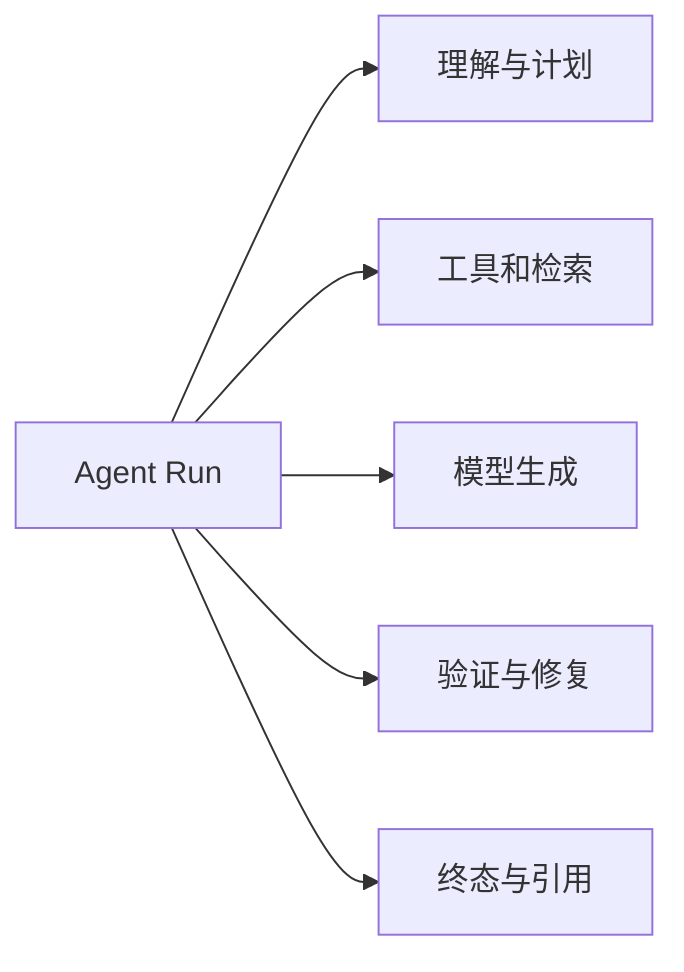

# Agent Trace 与质量闭环

一次回答错误，开发者只看到最终文本。是问题理解错了、检索漏了、工具超时、证据被截断，还是生成没有遵守引用？没有执行轨迹，很难把“回答不好”变成可修复问题。

Trace 把一次运行中的模型、工具、检索、图节点和验证连接起来。它服务调试和评测，不应该成为保存全部私密内容的仓库。

## 一条 Trace 包含哪些 Span

每个 Span 记录阶段、耗时、状态、版本和精简计数。并行分支作为子 Span，便于查看慢分支与降级。

## 第一步：先确定可关联 ID

request ID 关联 HTTP，turn ID 关联业务回合，trace ID 关联可观测路径，task ID 关联队列执行。不要使用用户问题或邮箱作为关联键。

版本字段包括模型、策略、知识和检索配置，这样同一问题在版本变化后才可比较。

## 第二步：记录决策所需信息

检索记录通道、候选数、是否降级和最终证据数；模型记录用途、Token、首 Token 与总耗时；验证记录失败类型和修复次数；终态记录完成、拒绝、取消、失败或超时。

这些结构化信息足以定位大部分问题。完整 Prompt、工具正文和用户私密内容默认不进入常规观测。

## 第三步：从 Trace 生成 Eval 样本

真实坏案例先经权限与匿名化处理，再转成固定问题、知识版本和预期门禁。修复后离线重放，防止同类问题回归。

并非所有线上轨迹都适合保存。抽样、保留周期和用户隐私要按风险设计。

## 正常结果和失败结果

正常 Trace 显示向量分支超时、全文通道降级成功、答案最终证据不足。团队可以针对向量服务和不足表达处理。

失败 Trace 保存完整认证头、系统 Prompt 和私密文档，只为了方便调试；或者只有总耗时，没有任何节点与版本。

## 告警怎样避免噪声

告警对应可执行异常：终态缺失、ACL 门禁失败、某通道超时率变化、停滞任务积压。每条包含影响范围、Runbook 和恢复标准。低样本波动先观察。

实践第 17 篇展示了从 HTTP 到最终引用的关联方式。

## 参考资料

- [OpenTelemetry：Traces](https://opentelemetry.io/docs/concepts/signals/traces/)
- [OpenAI Agents SDK：Tracing](https://openai.github.io/openai-agents-python/tracing/)
- [OWASP：Logging Cheat Sheet](https://cheatsheetseries.owasp.org/cheatsheets/Logging_Cheat_Sheet.html)
