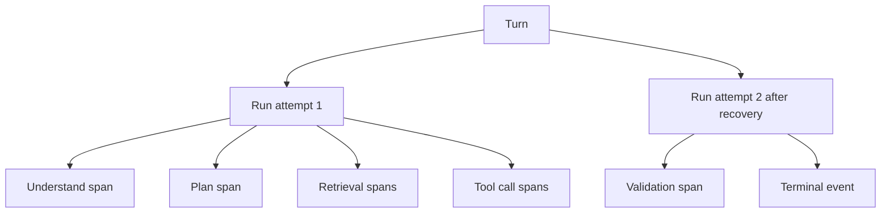
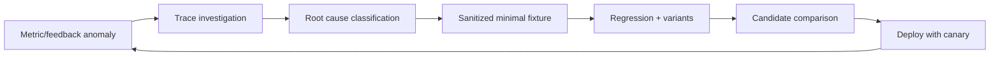

# Agent Trace 与质量闭环

普通 API 的成功与延迟常能描述主要状态，Agent 则可能 HTTP 200、文本流畅，却使用了错误证据、重复调用工具、丢失终态或成本异常。可观测性必须覆盖“系统发生了什么”和“结果为何可信”，并与 Eval、版本和反馈闭环。

Trace 不是把所有 Prompt、文档和隐藏推理上传到平台。它应保存结构化决策、版本、计数、状态和受控引用，使工程师能复现路径，同时遵守隐私和成本边界。

## 统一关联模型

一次用户意图用 `turnId`，执行尝试用 `runId`，工具用 `callId`，分布式链路用 trace/span ID：



`turnId` 关联业务状态和用户可见结果；Trace 描述一次执行尝试。Worker 崩溃恢复后可能产生新 Trace/Run，但仍属于同一 Turn。不要用 Trace ID 作为业务幂等键，它的生命周期和存储目的不同。

跨 API、队列和 Worker 传播 W3C Trace Context，同时在队列消息中携带 `turnId/runId`。消息重复投递时，新消费 Span 可以 link 到原生产 Span，而不是伪造一个无限长父子链。

## Span 层级按决策边界划分

推荐 Span：入口、排队/领取、理解、计划、每个检索通道、融合、每次模型调用、每次工具调用、生成、验证、持久化和事件推送。不要为每个 Token 建 Span。

```ts
type AgentSpanAttributes = {
  'agent.turn.id_hash': string
  'agent.run.id': string
  'agent.graph.version': string
  'agent.node.name': string
  'agent.node.attempt': number
  'agent.outcome': 'ok' | 'degraded' | 'rejected' | 'failed' | 'cancelled'
  'agent.budget.remaining_ms': number
  'agent.scope.count': number
}
```

模型 Span 记录供应商/模型快照、Prompt 版本、输入输出 Token、首 Token/总耗时、缓存、结束原因、结构校验和错误类别。检索 Span 记录 Release、通道、候选数、过滤后数量、融合贡献和重排版本。工具 Span 记录工具与 Schema 版本、风险、重试、结果大小、幂等状态和错误码。

## 不记录 Chain-of-Thought

审计需要知道“使用了哪些证据、调用了什么工具、哪个校验失败”，不需要保存隐藏推理。原始 Prompt、用户全文、工具结果和文档片段可能包含个人信息、凭证与内部数据，也会产生巨量遥测成本。

默认记录：

- 模板/模型/工具/策略/知识版本；
- 输入与输出大小、Token、消息数；
- 脱敏实体类型和安全范围数量；
- Evidence/结果的受控引用与摘要；
- 状态转换、错误码、重试和终态；
- 质量判定的结构化结果。

需要调试原文时使用受控采样、显式授权、加密存储、短保留期和访问审计。生产默认不把完整内容发送给第三方观测平台。

## Trace 与持久事件不同

Trace 可采样且主要服务诊断；业务事件必须可靠保存并驱动恢复/SSE 重放。若 Trace 丢失，任务仍应正确完成；若终态事件丢失，用户和恢复器会看到不一致。

| 数据 | 可靠性 | 保留内容 | 用途 |
| --- | --- | --- | --- |
| Turn/Run 状态 | 强 | 当前状态、版本、引用 | 正确性与恢复 |
| Event log | 追加、可重放 | 状态变化和用户事件 | SSE、审计 |
| Trace | 可采样 | Span、版本、诊断属性 | 性能与根因 |
| Metrics | 聚合 | 计数/分布 | 趋势与告警 |
| Eval artifact | 版本化 | 测试输入、轨迹、判定 | 质量比较 |

不要依赖 Trace 重建业务状态，也不要把所有事件重复成高基数 Metrics。

## 从 Trace 生成可复现运行包

线上失败进入调查时，提取最小复现描述：配置 Bundle、知识 Release、工具模拟结果引用、安全上下文 fixture、状态快照和错误位置。敏感数据用结构等价的中性 fixture 替换。

```ts
type ReplayManifest = {
  graphVersion: string
  promptBundle: string
  modelPolicy: string
  toolRegistryVersion: string
  knowledgeRelease: string
  securityFixture: string
  checkpointRef: string
  recordedToolFixtures: string[]
}
```

回放默认禁止真实写工具和外部副作用。工具适配器读取录制的脱敏 fixture，或在隔离环境运行。模型输出无法完全重现时，仍可复现状态、输入集合和失败门禁。

## Metrics 从用户结果反推

四类信号：

| 类别 | 指标示例 |
| --- | --- |
| 流量与状态 | accepted、completed、rejected、failed、cancelled、无终态 |
| 延迟 | 排队、理解、检索、首 Token、工具、验证、端到端 P95 |
| 质量 | 零证据、Claim 支撑、引用错误、修复轮数、用户纠正 |
| 成本 | Token、工具调用、重试、缓存、取消前消耗、单位成功成本 |

所有指标按低基数维度切分：环境、逻辑模型策略、图版本、功能和结果类型。不要把 userId、turnId、query 或完整工具名参数放进 Metric label，避免基数爆炸；个体定位由 Trace 完成。

成功率分母要明确。用户主动取消不一定是系统失败，但取消前耗时高可能表明体验问题；安全拒答是正确终态，不能算错误。HTTP 200 不能代表完成，终态来自业务状态。

## 质量信号绑定 Evidence 与 Claim

生成后保存 Claim 检查：支持、冲突、无支持；引用检查：存在、可见、定位有效。线上只聚合数量与比例，具体 Claim 文本留在受控结果存储。

```ts
type ValidationTelemetry = {
  claimCount: number
  supportedClaims: number
  conflictedClaims: number
  unsupportedClaims: number
  citationCount: number
  invalidCitationCount: number
  repairAttempts: number
  finalDecision: 'publish' | 'refuse' | 'fail'
}
```

这使“回答质量下降”能定位为检索零结果、引用失效、无支持 Claim 增加还是修复失败。仍需离线抽样人工核验判定器准确性，不能把自动验证当绝对真值。

## 采样策略

错误、越权拒绝、终态缺失、高成本、恢复和关键业务 Trace 高优先保留；普通成功按比例采样。Tail sampling 能在完成后根据状态决定，但需要 collector 缓冲并评估资源。无论 Trace 是否采样，安全审计和业务事件按独立策略可靠保存。

内容采样比 Trace 采样更严格：即使保留 Span，也可以不保留正文。开发环境与生产使用不同策略，生产敏感字段默认 denylist 不够，应采用 allowlist 属性。

## 告警必须可行动

告警对应用户影响和 Runbook：

- `terminal_missing`：超过最大生命周期、无有效租约，扫描并接管/失败；
- 队列 P95 突增：检查消费者容量和长任务隔离；
- 权限拒绝异常下降：运行跨范围安全探针，确认 ACL 未旁路；
- 引用失效率上升：检查 Release、缓存和引用定位；
- 单成功请求成本突增：按节点定位重试/工具循环；
- Checkpoint 反序列化失败：按 graph/schema 版本阻止继续领取；
- SSE 重连率上升：检查代理超时和事件网关。

告警不直接包含用户问题和证据正文。Runbook 提供查询相关 ID 的受控路径。

## 从线上问题进入 Eval



不能把差评原文直接放进测试。先明确失败层：理解、检索、工具、生成、状态或产品，然后创建中性最小 fixture，加同义表达、不同实体和反例。修复必须在这一组上泛化。

## 验证：遥测也要测试

```ts
it('propagates correlation without recording content', async () => {
  const run = await fixtures.executeAgentTurn()
  const spans = exporter.finishedSpans()

  expect(spans.every((span) => span.attributes['agent.turn.id_hash'])).toBe(true)
  expect(JSON.stringify(spans)).not.toContain(run.secretFixture)
  expect(spans.some((span) => span.name === 'agent.tool.call')).toBe(true)
})
```

| 场景 | 验证 |
| --- | --- |
| API -> Queue -> Worker | Trace Context 与 turn/run 关联 |
| Worker 恢复 | 新 Run 可 link 原执行，业务仍同 Turn |
| 模型/工具失败 | 错误类别稳定，不含堆栈敏感值 |
| 未采样成功 Trace | 业务终态与事件仍完整 |
| 高成本 Trace | tail sampling 保留且能定位节点 |
| 内容含 Token/密码模式 | exporter 脱敏或拒绝字段 |
| Metric 高并发 | label 基数保持上限 |
| 观测后端不可用 | 主流程不被阻塞，缓冲有界 |

故障注入观测 exporter 503/超时，Agent 仍需完成。遥测缓冲设置容量和丢弃策略，不能因平台不可用耗尽业务内存。审计通道若属于硬要求，应使用独立可靠存储，而不是复用可丢 Trace。

## 常见误区

- 只看 HTTP 200 和总延迟，不检查业务终态与证据质量。
- 把完整 Prompt、工具结果和 Chain-of-Thought 当作可观测性。
- 用 Trace 作为业务事件源，采样后无法恢复。
- Metric 标签包含用户、问题或请求 ID，造成高基数。
- 线上反馈直接进入训练/Eval，没有脱敏和根因分类。
- 观测平台失败阻塞 Agent 主链路。
- 只有 Dashboard，没有阈值、Runbook 和恢复动作。

## 参考资料

- [OpenTelemetry Trace 规范](https://opentelemetry.io/docs/specs/otel/trace/)：Trace、Span、事件、状态和采样的标准语义。
- [OpenTelemetry GenAI Semantic Conventions](https://opentelemetry.io/docs/specs/semconv/gen-ai/)：模型调用与 Agent Span 属性；采用前确认稳定级别和版本。
- [W3C Trace Context](https://www.w3.org/TR/trace-context/)：跨 HTTP 和服务边界传播 Trace 标识的格式。
- [LangSmith Observability](https://docs.langchain.com/langsmith/observability)：Run/Trace、反馈与数据集关联的实现参考。
- [OWASP Logging Cheat Sheet](https://cheatsheetseries.owasp.org/cheatsheets/Logging_Cheat_Sheet.html)：日志最小化、注入、敏感数据与访问控制。
