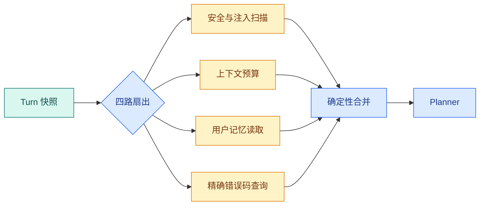

# Agent 并行预处理：安全、上下文、记忆与快速检索怎样合并

一次请求进入 Runtime 后，安全扫描、历史裁剪、用户记忆读取和错误码快速匹配往往互不依赖。串行执行会让每个步骤等待前一步；无边界地**并行**又会争抢连接、Token 和 CPU。本篇设计一个有限预处理阶段，重点是共享输入只读、结果如何合并、单个分支失败是否影响主流程。

“预处理”不是一个含糊的 `prepare()` 函数，而是 Planner 之前建立可信输入的阶段。它的输入是已完成准入的 Turn 快照，输出是安全结论、可用上下文、授权记忆和快速命中。Planner 只能读取这个输出，不能绕过安全结论重新访问原始全量数据。

## 哪些工作真的可以并行

能并行的条件是：读取相同快照，不写同一业务事实，不依赖对方的输出，资源预算可计算。安全分支和记忆分支都只读输入，因此可以并行；Planner 依赖它们的结果，就必须在扇入后执行。知识版本快照必须先建立，不能和快照建立并行。



**合并**节点只接受分支结果，不接受分支直接修改共享字典。每个结果带 `status`、`duration` 和 `error_code`，所以 Planner 能知道“没有记忆”与“记忆服务超时”是两种不同情况。

逐节点解释这张图：`Turn 快照` 已经固定用户范围、知识版本和 Deadline；扇出节点只把同一份只读输入交给四个分支。安全分支查提示注入和禁用能力，上下文分支裁剪历史并计算预算，记忆分支只读取当前用户授权的记忆，精确分支尝试用标识符或错误码快速命中。四个结果到达合并屏障后，程序先处理安全阻断，再构造 Planner 输入。

## 先画依赖表，再决定并行

两个任务能同时运行，需要同时满足：没有数据依赖、没有冲突写入、共享资源有容量、取消与 Deadline 能传播。

| 任务 | 必须先有 | 读取 | 写入 | 能否与其他分支并行 |
| --- | --- | --- | --- | --- |
| 安全扫描 | 原问题、策略版本 | 纯文本与规则 | `security_result` | 可以 |
| 上下文编译 | 历史消息、Token 上限 | 固定会话快照 | `context_result` | 可以 |
| 用户记忆 | 用户 ID、Scope | 授权记忆存储 | `memory_result` | 可以，但受数据库槽限制 |
| 精确查询 | Release、Scope | 只读检索器 | `exact_result` | 可以，但受连接池限制 |
| Planner | 四路合并结果 | `PreprocessContext` | `SearchPlan` | 不可以提前 |

版本快照、权限计算和准入不能放进这四路，因为其他分支依赖它们。模型 Router 如果需要安全结论，也不能与安全扫描并行。并行不是看到四个函数就 `gather`，而是先证明依赖关系。

### 四个分支分别解决什么

安全扫描的输出不只是 `safe/unsafe`，还应有规则 ID、命中位置、严重级别和是否允许继续。它不能授予权限，只能收窄能力或阻断。

上下文编译把系统指令、对话历史、当前问题和保留预算装配成有上限的输入。它输出实际 Token 估算、被裁剪范围和摘要版本；不能只返回一大段字符串。

记忆读取必须带用户与租户范围，并区分“没有授权记忆”和“记忆存储不可用”。超时允许降级时，要在 Trace 和回答元数据中保留降级事实。

精确查询用于错误码、编号、标题等高精度信号。命中可以缩短后续计划，但不能仅凭一个字符串命中绕过 Release 和 ACL 过滤。

## 并行实现

使用 `asyncio.TaskGroup` 演示结构，异常分支被包装成结果而不是被静默吞掉。真实 LangGraph 节点可以把同样的函数放入 `Send` 扇出，事件和预算字段由图状态保存。

下面把“并行实现”落成最小实现。代码关注“每个分支使用父 Deadline 内更短的局部超时”；输入从函数参数或上文定义的状态对象进入，关键分支负责校验或修改状态，返回值再交给后续调用。

```python
from __future__ import annotations

import asyncio
from collections.abc import Awaitable, Callable
from dataclasses import dataclass
from time import monotonic
from typing import Literal

@dataclass(frozen=True)
class BranchResult:
    name: str
    # status 区分继续执行、答案就绪和需要追问，调用方无需解析回答文本判断终态。
    status: Literal["ok", "degraded", "failed"]
    value: str = ""
    error_code: str | None = None
    elapsed_ms: int = 0

# 入口函数按固定顺序编排各步骤，具体校验和副作用仍由各自函数负责。
async def run_branch(
    name: str,
    operation: Callable[[], Awaitable[str]],
    *,
    timeout_seconds: float,
) -> BranchResult:
    started = monotonic()
    try:
        # 每个分支使用父 Deadline 内更短的局部超时。
        value = await asyncio.wait_for(operation(), timeout_seconds)
        status, error = "ok", None
    # 超时表示依赖没有在预算内返回；保留超时语义，不能伪装成空结果。
    except TimeoutError:
        value, status, error = "", "degraded", "timeout"
    # 未知异常标记当前分支失败；生产代码还应记录异常类型和 Trace，不能静默吞掉。
    except Exception:
        value, status, error = "", "failed", "unexpected"
    elapsed = int((monotonic() - started) * 1000)
    return BranchResult(name, status, value, error, elapsed)

async def preprocess(question: str) -> list[BranchResult]:
    async def security() -> str:
        return "safe" if "忽略规则" not in question else "injection"

    async def context() -> str:
        return f"budget_for:{len(question) + 200}"

    async def memory() -> str:
        return "no_authorized_memory"

    async def exact() -> str:
        await asyncio.sleep(0)
        return "no_exact_match"

    async with asyncio.TaskGroup() as group:
        # 三个只读子任务共享输入，但工具权限和 Token 上限分别写入各自契约。
        tasks = [
            group.create_task(run_branch("security", security, timeout_seconds=0.1)),
            group.create_task(run_branch("context", context, timeout_seconds=0.1)),
            group.create_task(run_branch("memory", memory, timeout_seconds=0.2)),
            group.create_task(run_branch("exact", exact, timeout_seconds=0.2)),
        ]
    return [task.result() for task in tasks]

print(asyncio.run(preprocess("访问申请怎么办")))
```

`run_branch` 接收一个返回 awaitable 的函数，而不是已经创建的协程，这样局部超时从真正开始执行时计算。`asyncio.wait_for` 到时会取消分支；`TimeoutError` 被转换成 `degraded`，并保留稳定错误码。它没有捕获 `CancelledError`，因此父任务取消仍然能传播。未知异常被标成 `failed`，生产实现应同时记录内部 Trace，不能把错误详情直接返回用户。

`TaskGroup` 保证四个任务结束后才离开上下文，返回列表按创建顺序读取，而不是依赖网络完成顺序。`preprocess` 只传入不可变问题字符串，分支不共享可变列表。示例里的 0.1/0.2 秒是方便本地实验的教学值，生产值要由父请求剩余 Deadline、依赖 SLO 和资源槽动态裁剪。

## 合并不是把四个字符串拼起来

扇入节点先校验结果集合，再按优先级处理。安全阻断拥有最高优先级；上下文失败通常不能继续，因为 Planner 缺少可信输入；记忆超时可以按策略降级；精确查询无结果只是提示 Planner 继续普通检索。

```python
# 合并器按字段类型汇总安全、上下文、记忆和快速检索结果，并保留每个分支状态与错误。
from dataclasses import dataclass

@dataclass(frozen=True)
class PreprocessContext:
    context: str
    memory: str
    exact_match: str
    degraded_features: tuple[str, ...]

def merge_preprocess(results: list[BranchResult]) -> PreprocessContext:
    # 建立校验集合或名称索引，用于发现缺失、重复和不属于本批次的结果。
    by_name = {result.name: result for result in results}
    required = {"security", "context", "memory", "exact"}
    if set(by_name) != required:
        raise ValueError("preprocess result set is incomplete or duplicated")

    security = by_name["security"]
    if security.status != "ok" or security.value != "safe":
        # 这一错误会由上层映射为超时或拒绝终态，不会继续执行后续副作用。
        raise PermissionError("security precheck blocked the request")

    # 上下文预算属于必需结果；失败后继续规划会让后续节点在错误预算下运行。
    context = by_name["context"]
    if context.status != "ok":
        raise RuntimeError("trusted context could not be compiled")

    # 记忆和精确命中属于可选增强：失败时记录降级项，但不阻断主流程。
    degraded = tuple(
        sorted(
            result.name
            for result in results
            # 先检查当前状态是否允许继续推进，避免终态被重复任务或迟到结果覆盖。
            if result.name in {"memory", "exact"} and result.status != "ok"
        )
    )
    return PreprocessContext(
        context=context.value,
        memory=by_name["memory"].value,
        exact_match=by_name["exact"].value,
        degraded_features=degraded,
    )
```

`by_name` 让合并不依赖列表顺序；集合比较同时发现缺少分支和重复分支。安全结果不是 `ok + safe` 就抛出 `PermissionError`，调用方把它映射为安全拒绝。上下文编译失败抛出 Runtime 错误，因为继续规划会使用不完整输入。记忆和精确查询失败只进入 `degraded_features`，Planner 可以继续，但 Trace 必须保留降级原因。

这里没有把安全扫描结果直接放进 Prompt 让模型决定。阻断是确定性控制流；模型不能通过“我认为这不是攻击”覆盖服务端策略。

真实系统需要给每个分支设置剩余 Deadline、并发槽和最大结果大小。安全分支返回 injection 时，合并节点应阻断后续工具；记忆服务超时可以标记降级，Planner 决定是否继续，但不能把超时当作“没有记忆”。

## `TaskGroup` 与 LangGraph 并行怎样选择

把四个操作放在一个异步节点里，优点是局部代码简单、共享同一进程取消；缺点是 Checkpoint 和图事件只看见一个 `preprocess` 节点，单分支状态需要你自己记录。

把四个操作做成 LangGraph 并行节点，优点是每个分支有独立 Trace、**Reducer** 和 Checkpoint 语义；缺点是 State 和图结构更复杂。分支需要独立观测、恢复或动态数量时使用图并行；仅是几个毫秒级纯函数且永不单独恢复时，一个节点内的 `TaskGroup` 更合适。

两种实现都必须遵守相同契约：只读输入、结构化结果、局部超时、父取消传播、确定性合并。不要为了“用了 LangGraph”而把每个字符串处理函数都拆成节点。

## 测试和边界

测试四路都成功、memory 超时、security 命中注入、用户取消和预算不足。断言结果集合按名称排序后可复现，不能依赖网络完成顺序。练习是增加一个“版本别名”分支，并说明它为什么必须读取同一个 Release 快照。

下面先测试合并规则。输入顺序故意变化，结果必须一致；安全命中时必须在 Planner 之前停止。

```python
# 测试让一个预处理分支失败，确认必要分支阻断、可选分支降级且其他结果不被丢弃。
import pytest

def result(name: str, value: str, status: str = "ok") -> BranchResult:
    return BranchResult(name=name, status=status, value=value)

# 这个用例改变完成顺序或调用方式，确认结果仍遵守同一份确定性契约。
def test_merge_is_independent_of_completion_order() -> None:
    values = [
        result("exact", "no_exact_match"),
        result("memory", "", "degraded"),
        result("security", "safe"),
        result("context", "budget_for:220"),
    ]

    merged = merge_preprocess(values)
    assert merged.context == "budget_for:220"
    assert merged.degraded_features == ("memory",)

# 这个用例输入不可信指令，确认安全门禁在规划和工具执行之前生效。
def test_security_block_never_reaches_planner() -> None:
    values = [
        result("security", "injection"),
        result("context", "budget_for:220"),
        result("memory", "no_authorized_memory"),
        result("exact", "no_exact_match"),
    ]

    with pytest.raises(PermissionError):
        merge_preprocess(values)
```

第一个测试把 exact 放在最前、安全放在第三，验证合并器按名称而非完成顺序处理；记忆降级进入显式元组。第二个测试证明即使其他三路成功，安全阻断也不能被多数结果覆盖。异步测试还应创建一个长时间分支，在父任务取消后断言它收到取消且没有继续占用连接。

## 并行前先判断共享资源

并行分支只适合互不依赖、读操作为主的任务。安全扫描、预算计算、记忆读取和精确检索可以同时开始，但它们可能共享数据库连接池、模型 API 配额和 CPU。调度器要为每类分支声明 `cost_class`，在全局槽位不足时优先保留安全检查和准入计算，延迟或跳过低优先级记忆读取。

`TaskGroup` 的取消语义很重要：用户取消父任务时，所有子任务都会收到取消；某个任务抛出未处理异常时，兄弟任务也会停止。若业务允许“部分成功”，`run_branch` 必须把可恢复错误转换成结构化结果，而不是让异常穿透 **TaskGroup**；安全阻断和权限错误则要被标记为全局终态信号。

## 合并节点的输入契约

合并器收到的是 `BranchResult[]`，每项必须包含分支名、状态、值、耗时和错误码。它应先按名称去重，再把 `ok` 候选交给后续 Planner；`degraded` 只能说明“这条通道没拿到结果”，不能被当成空证据；`failed` 需要决定是否触发一次补偿。合并器还要检查所有分支的 Release 和 Scope 一致，发现快照不一致就拒绝融合。

练习时将 exact 分支延迟到 deadline 之后，观察其他结果仍可用于诊断，但最终回答只能在证据覆盖达到阈值时完成。这样能区分“并行提高可用性”和“并行掩盖关键通道失败”。

迁移到你的系统时，先填写依赖表，不要先改代码。每个候选并行任务都写出前置输入、共享资源、失败是否可降级、最大输出大小和局部超时；只有五项都明确，才进入扇出。

## 常见问题

### 预处理为什么要并行，而不是顺序执行？

安全扫描、历史装配、记忆读取、别名解析和快速精确检索通常只依赖同一 Turn 快照，顺序等待会把各自延迟相加。有限并行可以降低准备阶段耗时，但前提是分支不互相修改状态，并且输出能在 Join 中合并。需要依赖别名结果的查询扩展应留在扇入之后，不能为了并行提前执行错误输入。

### 所有分支应该读取同一个什么快照？

它们应读取固定 question、用户与 Scope、Release、Policy、Deadline 和历史版本，不从正在变化的全局对象取值。每支只获得职责所需字段，例如记忆读取不需要模型密钥。快照让结果可复现，也避免一支看到新 Release、另一支仍在旧版本；最终 ACL 仍需在输出前复核当前状态。

### 哪些预处理错误可以降级，哪些必须终止？

可选记忆或别名扩展超时通常可以降级为空并记录 degraded，安全扫描、ACL、版本和上下文必需规则失败则应阻断。错误契约要包含 branch、kind、retryable、severity 和 elapsed，Join 按确定策略处理。若分支直接返回异常字符串，模型既不知道可靠性，也可能把错误内容当证据。

### 并行分支结果怎样避免相互覆盖？

每支返回带 branch ID 的局部对象，Reducer 按字段职责合并：候选按稳定 ID 去重，错误聚合，最大轮次取 max，单值可信快照不允许并发写。Join 产生新的 PreprocessContext，而不是修改输入对象。测试时交换完成顺序并断言合并结果一致，才能证明没有时序竞争。

### 取消发生时怎样停止预处理？

Runtime 设置共享取消信号并记录 cancel_requested，每支在外部调用前后检查；Join 收到取消后取消未完成 Task，不再进入 Planner。阻塞库要放入可取消的线程或进程边界，并设置局部 timeout。已经完成的只读结果可以丢弃或留作 Trace，但不能在取消终态后继续写正式上下文和答案。
