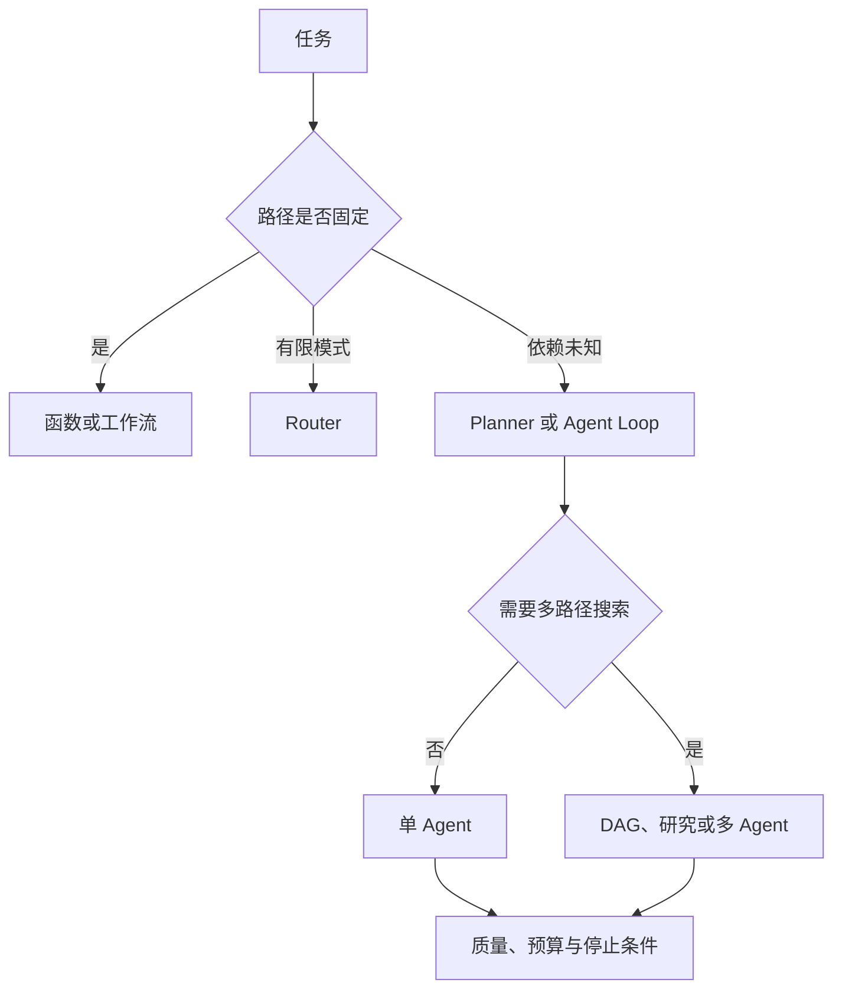

# Agent 模式选择手册

根据任务不确定性、依赖、质量、延迟、成本和风险选择最小可行模式。**Pattern Selection**、**Decision**、**Agent** 分别指向同一条执行链上的不同对象：任务目标、分支可预测性、外部动作、依赖关系、质量阈值、Deadline、预算和失败代价进入系统，decision_id、candidate_pattern、required_state、tool_scope、cost_envelope、stop_rule、fallback 和 rejection_reason 保存处理中间状态，最终得到模式选择、拒绝其他模式的具体原因、状态需求、停止条件、验证方式和降级方案。

这份手册先排除固定函数和普通工作流已经能完成的任务，再根据运行时不确定性、依赖关系、多路径搜索需求和失败成本选择模式。模式升级必须有可测条件，不能从流行框架反推需求。

常见误选包括：单步任务使用多 Agent，把“可以并行”误判成“没有依赖”，没有客观评分却使用 Reflection，无法评估搜索空间仍使用 ToT，以及高风险动作缺少人工确认。它们会让执行链停在不同位置，所以错误记录必须保存发生阶段、当时状态和终止原因。

::: info 贯穿示例

模式选择场景：团队准备自动生成一份需要查资料、核对冲突并交付报告的结果，需要决定单 Agent、DAG 还是研究循环。模式选择需要的身份、权限、版本和业务事实由应用提供，模型与外部内容只产生候选。

:::

## 先判断任务需要多少运行时决策

从流行框架反推需求会破坏 decision_id 与模式选择之间的对应关系，排查时先保留原始输入摘要和发生阶段，再判断是否允许重试。

单步任务使用多 Agent 影响 candidate_pattern 或下游解释，不能和从流行框架反推需求共用“重新调用一次模型”的处理方式。

## 固定函数、工作流与 Agent 的分界

Pattern Selection 的术语页只负责定义和链接，完整机制与验证仍放在对应主文章。因此 decision_id 与 candidate_pattern 要有唯一写入方，其他组件只能通过版本化命令申请修改。

确定性工作流与 模式选择解决的问题相邻，但控制权不同，比较时要看谁选择比较相邻概念、谁保存 decision_id、谁确认模式选择。

ReAct 可以参与同一请求，却不能替代 模式选择；组合后仍要单独检查分支可预测性的可信来源和从流行框架反推需求的终止规则。

模式选择使用的身份、范围和版本来自可信运行时，任务目标可以表达意图，但不能提升权限或改写活动 Release。

单步任务使用多 Agent 发生时，错误回到 candidate_pattern 的所有者处理，上游缺输入、当前组件违反不变量和下游不可用分别形成不同终态。

模式选择的确定性边界位于 decision_id 写入之前。模型在 Pattern Selection 中只提交候选值，程序仍要从认证、版本和策略快照补入可信字段。

模式选择内部可以使用更细的临时对象，跨边界只暴露稳定协议。替换确定性工作流时，调用方不需要理解内部缓存和 SDK 响应。

## Router 适合有限模式选择

模式选择的输入合同至少列出任务目标、分支可预测性和外部动作，每项都注明来源、是否必需、允许的缺省值，以及缺失后是在入口拒绝还是进入降级路径。

模式选择要记录 `decision_id`、候选模式、所需状态和选择依据。候选模式是比较对象，所需状态说明能否安全运行，选择依据则保存任务约束和风险；缺少其中一项，事后只能看到“选了 Agent”，却不知道为什么。

并发分支按稳定身份合并 required_state，完成顺序只反映耗时，不能决定结果属于哪个请求，更不能让迟到的旧状态覆盖新修订。

输出合同同时描述模式选择和拒绝其他模式的具体原因，并为拒绝、取消、部分完成和未知状态提供固定形状，调用方据此分支，无需解析错误文案猜测结果。

candidate_pattern 参与乐观并发检查；处理开始后若版本变化，旧候选只保留作审计，不能继续写入 decision_id。

任务目标里若包含模型填写的同名字段，应用会丢弃它，再从认证、配置或活动版本中补入可信值，因为结构校验通过不等于授权或业务校验通过。

定义、输入、状态所有者、决策者、输出和适用限制组成 模式选择的最小追踪材料，日志只保存稳定 ID、版本和错误类，完整 Prompt、文档正文与凭证不进入指标标签。

撤回或删除分支可预测性时，相关缓存、候选和未完成任务按版本失效；稳定 ID 可以保留审计关系，已撤回内容不能继续进入模式选择。

契约还需要描述新鲜度。candidate_pattern 对应的数据发生变化后，旧缓存、旧候选和未完成任务怎样失效，应由版本或时间规则直接判断，不能依赖模型注意到矛盾。

删除和撤回也属于数据生命周期。模式选择引用的原始对象被移除时，稳定 ID 可以保留审计关系，正文与派生结果则按策略失效，避免继续向用户展示过期内容。

::: warning 模式选择的可信边界

模式选择通过结构校验后仍是候选。模式选择使用的身份、权限、知识版本与业务事实由应用从可信服务读取，核对完成后才能执行或交付。

:::

## Planning 适合未知步骤的任务

模式选择的自测至少包含两个反例：固定条件任务必须停在函数或 Workflow，只有路径和证据会随运行变化时才允许升级到 Agent。每次选择保存任务特征、风险、预算和后续升级指标，回放时才能解释为什么没有使用更复杂的模式。

定位问题层次接收任务目标并建立 decision_id，入口校验未通过就地结束，后续模型、检索器或工具调用次数保持为零。

比较相邻概念读取 candidate_pattern 并执行主题逻辑，参数由应用组装，外部返回先保存为拒绝其他模式的具体原因，尚未获得修改领域状态的资格。

选择主文章检查结构、范围、版本和主题不变量；模式选择缺少来源、落在旧版本或越过权限时，decision_id 停在 rejected 或 failed。

用反例复核先保存模式选择与终止原因，再产生事件或通知，交付失败可以重放，核心状态写入失败则不能对外宣称完成。

比较相邻概念出现部分结果时，由任务合同决定保留、补偿还是整体丢弃；模式选择若可重建就重新生成，外部副作用则查询回执或执行补偿。

实现可以使用函数、Graph、Middleware 或 Workflow，decision_id 的所有权和从流行框架反推需求的停止规则不会随框架改变。

部分成功需要在步骤边界处理。比较相邻概念已经产生一部分模式选择时，程序按任务合同决定保留、补偿或整体丢弃，并记录未完成项，不能默认为全部成功。

比较相邻概念和选择主文章都要写明逆向动作或不可逆原因，模式选择若可重建就删除后重算，已发送的外部命令只能查询回执或补偿。

## Reflection 只修复可观察问题

沿“模式选择场景：团队准备自动生成一份需要查资料、核对冲突并交付报告的结果，需要决定单 Agent、DAG 还是研究循环”推演 模式选择：入口创建 request_id，读取可信身份，把任务目标和当前版本写入初始状态。

定位问题层次生成 decision_id 与输入摘要；若分支可预测性缺失，请求返回 rejected，并指出缺少哪项材料，不继续消耗模型或外部服务配额。

比较相邻概念按“先排除固定函数和普通工作流已经能完成的任务，再根据运行时不确定性、依赖图、是否需要多路径搜索及失败成本选择最小模式，并为升级条件设置可测指标”推进，每次依赖调用保存 call_id、参数摘要、开始时间与状态版本，以便判断超时前是否已经产生结果。

候选结果对应模式选择、拒绝其他模式的具体原因、状态需求、停止条件、验证方式和降级方案，选择主文章逐项检查权限、版本与领域约束，问题列表为空才允许形成下一状态。

用反例复核写入终态；客户端断开只影响交付通道，重新连接时读取已经保存的 decision_id 或事件游标，不重跑核心逻辑。

故障注入选择把并行误当无依赖，程序保留原候选和错误位置，只重做失败边界，不能从入口复制整个任务并产生第二份状态。

推演结束后用 request_id 关联 decision_id、模式选择与终止原因，测试据此排除并发请求串线，并确认失败路径没有遗留未关闭资源。

模式选择在输入拒绝时不调用依赖，正常路径按 5 个阶段推进，有限修复只重做失败边界。调用次数是控制流断言，不是性能宣传。

模式选择的最终记录用 request_id 关联 decision_id、模式选择和失败问题，测试据此证明结果来自本次执行，没有混入并发请求。

## DAG、多 Agent 与 Handoff 怎样选择

模式选择正常完成时，decision_id、candidate_pattern 和模式选择指向同一次执行，重复读取返回同一终态，未完成分支已经取消或有明确所有者。

定义、输入、状态所有者、决策者、输出和适用限制用于还原 模式选择的处理过程，可以按阶段和版本聚合；敏感正文留在受控存储中，不复制到日志与指标。

拒绝其他模式的具体原因可能是合法的空结果，但必须带范围、版本和原因；任务明确要求找到材料时，同一个空结果进入拒答而非成功。

依赖返回成功状态只证明传输完成。模式选择还要检查模式选择是否满足业务范围、质量阈值和当前版本，明确拒绝也可能是正确终态。

decision_id 的状态迁移必须单调：完成不能退回运行中，取消不能被迟到结果覆盖，失败重试也不能绕过入口已经固定的权限。

模式选择的成功证据最终要同时回答输入是什么、执行了哪些步骤、交付了什么以及为什么停止；任一项缺失都应留在未确认状态。

模式选择把业务验收与服务健康分开。依赖返回 200 只说明传输成功，模式选择仍要满足当前范围和质量要求；明确拒答也可能是正确终态。

模式选择的观测指标按阶段和版本聚合。评估 Pattern Selection 时，把错误、空结果、拒绝、恢复和资源消耗分开统计，避免一个成功率掩盖不同故障。

## 研究任务何时需要搜索式推理

模式选择错误要看是哪条假设失效：任务其实是固定流程时退回 Workflow，依赖关系稳定却被误判为动态时改用 DAG，预算不够时降低分支，不可逆动作缺少批准时直接拒绝。重新选择模式之前先保留原决策和证据，避免每次重试都换一条不可解释的路径。

遇到从流行框架反推需求时，先记录发生阶段、错误类别和责任对象。模式选择保留输入摘要和状态版本，由对应组件决定重试、降级或终止。

遇到单步任务使用多 Agent 时，先记录发生阶段、错误类别和责任对象。模式选择保留输入摘要和状态版本，由对应组件决定重试、降级或终止。

遇到把并行误当无依赖时，先记录发生阶段、错误类别和责任对象。模式选择保留输入摘要和状态版本，由对应组件决定重试、降级或终止。

遇到没有客观评分却使用 Reflection 时，先记录发生阶段、错误类别和责任对象。模式选择保留输入摘要和状态版本，由对应组件决定重试、降级或终止。

遇到搜索空间无法评估仍用 ToT 时，先记录发生阶段、错误类别和责任对象。模式选择保留输入摘要和状态版本，由对应组件决定重试、降级或终止。

遇到高风险动作缺人工确认时，先记录发生阶段、错误类别和责任对象。模式选择保留输入摘要和状态版本，由对应组件决定重试、降级或终止。

模式选择将终态、可重试性和资源清理结果写入记录；后台扫描器根据 decision_id 判断任务是在运行、等待恢复还是已失败。

模式选择执行前固定 Deadline、动作上限、重复签名、无进展阈值、预算和取消信号；任一条件触发，比较相邻概念停止创建新工作。

模式选择把重试时间和次数计入总预算。Pattern Selection 每次重试先扣减剩余额度，达到上限就保留原始错误。

模式选择的清理动作设计成幂等操作；仍被活动任务或 Lease 引用的资源拒绝删除。

## 风险、预算与可恢复性怎样限制模式

用同一任务分别画固定流程、ReAct、Planning、DAG、Handoff 和研究循环的控制图，比较状态数、调用数、失败面与可撤销性；测试显式给出任务目标、初始 decision_id、预期模式选择和终止原因，不能只断言返回值非空。

模式选择的单元测试用 Fake Adapter 固定模式选择与错误，断言参数、调用顺序、状态修订和清理动作，这些结果只证明本地控制逻辑。

契约测试围绕任务目标、decision_id 和拒绝其他模式的具体原因构造合法与非法样本，Schema 解析成功后继续检查权限、版本与领域不变量。

故障测试注入从流行框架反推需求和单步任务使用多 Agent，记录比较相邻概念是否被调用、decision_id 是否改变、资源是否释放，以及同一身份重试会不会重复执行。

模式选择的集成测试连接真实协议与隔离存储，检查序列化、约束、并发和超时；需要在线服务时另行记录服务版本、时间、配置与凭证条件。

模式选择的回归报告要保留失败类型分布。在 Pattern Selection 的回归中，拒绝、超时、权限错误和空结果必须保持各自类型，状态变化本身就是行为契约。

模式选择的性质测试随机改变 decision_id 顺序、重复提交、完成顺序或状态版本，断言权限不扩大、终态不倒退、同一身份不产生两次副作用。

Pattern Selection 的离线评测关注质量变化，运行时测试关注控制和恢复，两类证据都齐全才可交付。模式选择只有两类证据都存在，才能同时回答“结果是否合格”和“系统是否安全完成”。

## 用同一任务比较不同控制图

模式选择记录问题约束、候选模式、选择理由和评测版本。规则升级后，旧 `decision_id` 仍能回放原来的判断，新任务才使用新的边界条件。

模式选择的容量主要受概念覆盖、交叉链接、术语一致性和版本维护影响，并发可能缩短单次等待，也会占用连接、配额、内存和下游吞吐，必须沿定位问题层次、确认控制者、比较相邻概念、选择主文章、用反例复核逐层核算。

模式选择的候选版本在固定样本上比较正确性、错误类型、延迟和资源消耗，从流行框架反推需求等安全红线回归时直接停止发布，不能用平均质量抵消。

从流行框架反推需求的降级路径在发布前写好，可以减少非关键增强、返回已经确认的模式选择，或明确暂时无法确认，缺失事实不能交给模型补写。

出现模式选错时，先用 `request_id` 找输入约束、候选清单、选择理由、实际控制流和停止条件，再判断是任务本身适合工作流，还是 Agent 的不确定性被低估。

模式选择的数据按证据用途分级保留，聚合字段可以留得更久，任务目标和大体积模式选择设置短期限、访问控制与删除通道。

模式选择先在单进程实现 decision_id、超时、错误和测试，只有恢复与容量证据提出要求时，再增加队列、Lease、分布式缓存或工作流引擎。

模式选择的监控阈值要对应可执行动作。

回滚要覆盖代码之外的状态。模式选择若改变 Schema、缓存键或持久化记录，旧版本是否还能读取新写入数据必须提前验证；无法双向兼容时采用候选版本隔离。

## 模式升级和退回的触发条件

采用 模式选择前先画出任务目标到模式选择的最小控制图；固定函数已经能完成任务时，新增模型决策和跨进程 decision_id 只会扩大测试与运维范围。

确定性工作流把下一步写在程序里，Agent 模式允许模型在受限动作集合中提出下一步。选择记录必须说明谁拥有控制权、状态放在哪里，以及什么证据会让系统退回固定流程。

ReAct 可以与 模式选择组合，但外部知识仍需授权，工具调用仍需校验，模型产生的模式选择仍停留在候选状态。

模式选择适合价值足够、从流行框架反推需求可观察且预算可接受的任务，高风险、不可逆的决定需要确定性规则或人工批准。

格式正确但事实错误的模式选择是必要反例；若它直接进入成功，说明选择主文章缺少业务验证，应保留候选并给出证据问题。

执行期间修改 candidate_pattern 可以检验并发设计，旧动作若仍能覆盖 decision_id，说明版本或 Lease 有缺口，增加 Prompt 规则无法修复这类竞态。

模式选择增加了 decision_id、依赖调用、恢复责任和故障面，设计记录既要说明获得的能力，也要列出新增的退出、降级与回滚路径。

评审记录还要写明没有选择的模式和放弃理由。例如分支固定时不使用 Agent，工具副作用不可逆时不使用自动 Handoff，证据无法覆盖时不使用开放式研究。被拒方案能防止团队下次重复讨论同一个误区。

## 模式选择的回退测试

用“一项需要读取资料并可能执行动作的任务”做自测时，入口先记录输入摘要、身份和执行版本。控制图、状态所有权和模式升级信号由唯一组件写入，其他组件只能提交带修订号的候选。在“一项需要读取资料并可能执行动作的任务”里，读者可以从任务 ID 找到它经过的节点，不必靠最终文案猜过程。

针对“一项需要读取资料并可能执行动作的任务”，正常路径从准入开始，先检查范围和资源，再创建一次调用。调用结果带稳定 ID、来源和终止原因，固定步骤被错误升级为 Agent 或循环没有停止分别记录。针对“控制图、状态所有权和模式升级信号”，输出进入下一节点前还要确认版本和权限，空结果也要说明范围。

在“一项需要读取资料并可能执行动作的任务”的故障测试中，依赖调用前和结果已经产生但状态尚未提交时各切断一次。前者应没有外部调用，后者要留下可重放的未知状态。恢复使用同一幂等键，先查询外部回执，再决定补偿。

“一项需要读取资料并可能执行动作的任务”的验证命令检查输入、状态变化、调用顺序、输出摘要、失败证据和资源清理。高风险动作由确定性程序和人工审批接管。

“一项需要读取资料并可能执行动作的任务”的取舍需要写在结果里：扩大缓存、并行或自动修复可能缩短等待，也会增加状态、成本和失败组合；保持较小能力面则更容易做权限隔离和人工接管。

回放“一项需要读取资料并可能执行动作的任务”时改变输入顺序、重复提交、缩短 Deadline 或撤回权限，确认状态单调、范围不扩大、资源按时释放。指标用于定位变化，不替代事实核验。

## 一项需要读取资料并可能执行动作的任务的边界案例

在“一项需要读取资料并可能执行动作的任务”中，入口收到的资料可能不完整，程序先保存缺口和当前版本，不能让模型用常识填入 控制图、状态所有权和模式升级信号。“一项需要读取资料并可能执行动作的任务”的输入后来补齐时，新的执行沿同一个任务 ID 继续；已经结束的失败记录不被覆盖。

固定步骤被升级为 Agent 时，保留对照流程的调用次数和失败率；循环没有停止时记录重复动作、剩余预算和最后状态。未进入模式选择、评估失败、结果为空、停止原因未知分别处理，不能用平均成功率掩盖失控循环。

“一项需要读取资料并可能执行动作的任务”的正常输出先经过范围、版本和权限检查，再进入交付或下一个节点。高风险动作由确定性程序和人工审批接管。“一项需要读取资料并可能执行动作的任务”的输出只满足结构而没有可验证来源时，状态保持为候选，前端应显示缺口而不是成功标记。

用重复提交、并发完成、取消和进程退出四个样本回归。回归“一项需要读取资料并可能执行动作的任务”时，检查同一幂等键是否只产生一个有效终态，迟到事件是否被拒绝，临时资源是否释放，重新连接是否能读到同一份事件。

“一项需要读取资料并可能执行动作的任务”这组检查的结果应带命令、解释器或服务版本、输入摘要和退出码。“一项需要读取资料并可能执行动作的任务”没有运行证据时，只能写“待验证”；离线替身通过也不能推导真实模型、网络服务或生产权限已经通过。

agent-pattern-selection-handbook的修改要优先改变责任边界和可观察证据，不能靠增加一个关键词特判来让样本通过。
